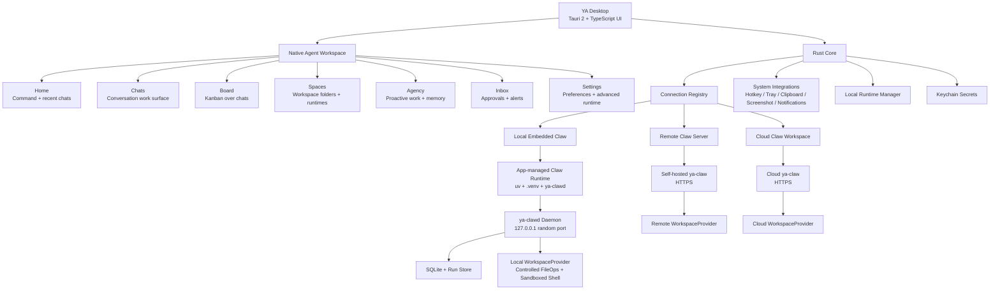
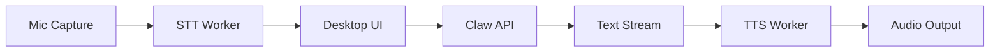

# 00. Desktop Overview

## Goal

YA Desktop is a native agent workspace for Claw-based runtimes. It gives users a direct desktop product for starting conversations, organizing agent work on a board, managing workspace folders, reviewing results, approving risky actions, and controlling local or remote runtime connections.

The core product shape combines:

- Home for command-first invocation and recent conversation overview
- Chats as the primary work management model
- Board as the kanban view over chats and runs
- Spaces for workspace folders, cloud workspaces, runtime connections, trust, execution location, and mount-set presets
- Agency for proactive work visibility, singleton Agency runs, recent fires, and memory-session activity
- Inbox for HITL decisions, alerts, failed background work, and user actions
- Settings for preferences, hotkeys, secrets, advanced runtime, logs, and diagnostics
- tray or menu bar presence
- local workspace execution through embedded Claw
- remote Claw and cloud workspace access
- multiple saved connection profiles
- future voice interactions through desktop STT/TTS workers

## High-Level Architecture



## Product Boundary

Desktop owns the user-facing product experience, OS-native context capture, notifications, local runtime lifecycle, connection registry, and HITL interaction surfaces.

Claw owns agent execution and durable runtime state: sessions, runs, profiles, workspace providers, memory, schedules, bridges, event replay, shell execution, and storage.

The Desktop product model is conversation-first:

- A chat is the main user-facing work object.
- A chat is backed by one or more Claw sessions and runs.
- A run is the runtime execution record for a chat turn or background continuation.
- Board columns group chats by status, priority, or workspace.
- Spaces bind chats to workspace folders, runtime connection, trust level, execution location, and workspace mount sets.

The boundary is the Claw HTTP/SSE API surface for the desktop MVP, with WebSocket reserved for future remote RPC workspace transport and richer bidirectional control. Desktop should use this same boundary for local embedded Claw, self-hosted Claw, and cloud Claw.

Desktop should keep a long-lived SSE notification connection per active Claw connection. Lifecycle notifications move chats between queued, running, HITL-pending, and terminal UI states through `status` plus `status_reason`, including runs created by bridges, schedules, heartbeat, and other clients. Detailed AGUI run streams still power chat rendering and replay.

Desktop is the preferred HITL surface for approvals because it can show native notifications, focused approval cards, workspace context, command previews, file diffs, and secure local identity details.

## Product Surfaces

The main application shell uses a calm, ChatGPT-like focus layout. The left navigation is quiet and collapsible, the main content area stays visually dominant, and the optional Details panel opens only when the user wants runtime context. The top bar keeps global actions lightweight: details and new chat.

### Home

Home is the command-first default surface and should feel like a focused starting point for one request.

Current implementation:

- Uses a centered hero prompt and large composer as the primary action.
- Keeps workspace, profile, and runtime as compact chips inside the composer.
- Shows Local Claw runtime health through compact status copy when an active local connection exists.
- Reads recent chats from `GET /api/v1/sessions` through the Desktop Claw client.
- Creates a new chat from the command input through `POST /api/v1/sessions:stream`.
- Lets users choose the active Claw profile and Desktop Space before session creation.
- Sends the selected Space as a Claw workspace binding when the Space has a local folder path.
- Streams AGUI run events into an inline Home preview, including assistant text chunks, stream lifecycle status, and stream errors.
- Refreshes recent chats after the streamed run settles and through global notification SSE cache updates.
- Shows offline, loading, empty, and error states when Local Claw is stopped or unreachable.

Capabilities:

- Central command input for new conversations.
- Recent chats and active runs.
- Current space summary.
- Pending approval summary.
- Quick actions for new chat, resume chat, open Board, switch Space, and run diagnostics.
- Prompt input can include typed text, selected text, clipboard text, screenshots, and active app context when available.

### Chats

Chats are the primary work management surface.

Current implementation:

- Lists real Claw sessions from the active local connection in a quiet conversation rail.
- Selects a session and reads `GET /api/v1/sessions/{session_id}` with recent runs.
- Reads completed turns from `GET /api/v1/sessions/{session_id}/turns`.
- Reads compact run traces from `GET /api/v1/runs/{run_id}/trace` for recent runs.
- Continues the selected chat through `POST /api/v1/sessions/{session_id}/runs:stream`.
- Shows messages and live streaming output in the conversation transcript.
- Keeps run traces and timeline under a `Run details` disclosure so the chat remains readable.
- Cancels an active selected-session run through `POST /api/v1/sessions/{session_id}/cancel`.
- Continues chats with the session's existing Claw profile and optional workspace context.

Capabilities:

- Conversation list grouped by space and status.
- Selected chat detail with messages and AGUI replay as the default view; run timeline, tool calls, shell output, diffs, and artifacts live in progressive details.
- Profile and model display at chat level, with selection handled before new chat creation.
- Run cancellation, retry, rerun, and continuation flows.
- Inline approval cards with command, diff, and workspace context.

### Board

Board is the kanban organization surface over chats.

Current implementation:

- Reads live Claw sessions from the active local connection.
- Groups chats into Active, Waiting, Done, and Failed lanes using session/run status and HITL status reasons.
- Shows offline, loading, empty, and error states.

Capabilities:

- Columns such as Active, Waiting, Done, Failed, Scheduled, or custom views.
- Drag-and-drop organization for user-facing workflow state.
- Filters by Space, profile, status, trigger type, and runtime location.
- Cards show chat title, current run state, latest output summary, pending approvals, and linked artifacts.

### Spaces

Spaces represent workspace folders or cloud workspaces plus runtime details.

Current implementation:

- Stores a browser-local Space registry with names, folder paths, runtime labels, trust labels, and active selection.
- Allows users to add a local folder Space and select it for Home and Chats execution.
- Maps the selected Space into a Claw workspace binding for session and run creation when the Space has a local path.

Capabilities:

- Local workspace folder cards.
- Remote and cloud workspace cards.
- Folder registry with recent, trusted, and pinned folders.
- Mount-set presets with one default folder and optional extra folders.
- Active connection and runtime location.
- Workspace trust level.
- Default profile and model.
- Local sidecar status, logs, and diagnostics.
- File browsing entry points and memory summary.

### Workspace Mount Sets

Desktop maintains a folder registry and uses Claw workspace bindings for execution. New chats start from the global default workspace directory and can add extra mounted folders before or during setup.

A chat carries one mount set:

- one default folder used as cwd and primary guidance root
- optional extra folders for references, docs, generated output, or adjacent repositories
- per-folder access mode such as read/write or read-only
- virtual paths exposed to Claw, such as `/workspace/main` and `/workspace/docs`

Desktop sends this mount set through Claw session and run creation APIs as the `workspace` field. Claw stores the session binding in session metadata and resolves it into the runtime `WorkspaceBinding`.

### Agency

Agency is the proactive work and memory visibility surface.

Current implementation:

- Adds Agency to the main Desktop navigation.
- Reads `GET /api/v1/agency/config`, `GET /api/v1/agency/status`, and `GET /api/v1/agency/fires` from the active Local Claw connection.
- Shows the singleton Agency session, profile, timer interval, risk policy, pending fire count, durable Agency files, active/latest Agency runs, and recent fires.
- Lists memory sessions from `GET /api/v1/sessions` so users can see background extract and summary jobs alongside Agency activity.
- Opens Agency or memory sessions in Chats for full session history.
- Updates through notification SSE events for Agency config, fires, and clear operations.

Desktop launch defaults enable both Agency and Memory for Local Claw. Settings exposes a launch preset editor so users can import preset JSON or dotenv-style variables and control startup environment variables passed to `ya-clawd`.

Capabilities:

- Singleton Agency status and run inspection.
- Recent copied message and memory completion fire list.
- Memory session list with open-in-chat navigation.
- Durable Agency file index and action log links when file browsing lands.
- Agency clear and maintenance actions behind explicit user controls.
- Runtime launch preset import for Agency, Memory, profiles, bridge, and advanced Claw env settings.

### Inbox

Inbox is the primary user-decision surface.

Current implementation:

- Reads live Claw sessions and surfaces failed, interrupted, and HITL-pending work.
- Shows approval and recovery entries derived from session status, status reason, latest run error, and active interaction metadata.
- Opens the related chat when a live Inbox item is selected.

Capabilities:

- Pending command approvals.
- File diff approvals.
- Workspace trust approvals.
- Bridge and schedule initiated approval requests.
- Failed background runs that need attention.
- Native notification deep links.
- Approve, reject, and respond-with-input actions.
- Audit metadata for who decided, from which device, and with which local context.

### Settings

Settings owns preferences and lower-level runtime controls.

Capabilities:

- Desktop preferences.
- Hotkeys.
- Notifications.
- Voice.
- Tokens and keychain.
- Autostart and always-on behavior.
- Advanced Runtime: profiles, schedules, bridges, heartbeat, runtime instances, logs, storage, and diagnostics.
- Local Claw launch presets with Agency and Memory enabled by default plus editable startup environment variables.

### Tray / Menu Bar

The tray keeps background status visible.

Capabilities:

- Local daemon status.
- Active connection and space.
- Recently active chats.
- Background run notifications.
- Start, stop, and restart local Claw.
- Open Home, Chats, Board, Inbox, Spaces, logs, and diagnostics.
- Toggle autostart and always-on behavior.

## Voice Layer

Voice belongs to the desktop interaction layer.



STT turns speech into `input_parts`. TTS consumes assistant text deltas or completed text. Desktop sends interruption events or run cancellation when the user interrupts voice playback.

## Trust and Workspace Safety Principles

Desktop should make execution location explicit for workspace actions. Local execution should use controlled file operations plus a sandboxed shell by default.

Local embedded run:

```text
Run location: This Mac
Tool execution: This Mac
Space: ya-mono
Workspace folder: ~/code/oss/ya-mono
Command: make test
```

Cloud workspace run:

```text
Run location: Team Cloud
Tool execution: Cloud Workspace
Space: team-cloud
Workspace: cloud://org/repo
Command: make test
```

Remote runtime with local RPC tools:

```text
Run location: Team Cloud
Tool execution: This Mac
Space: ya-mono
Workspace folder: ~/code/oss/ya-mono
Command: make test
```

Recommended safety layers:

- Space trust: `read_only`, `trusted`, `restricted`, `ephemeral`.
- Workspace provider: `local`, `docker`, `cloud`, or `remote_rpc`.
- File operations: path-bounded `LocalFileOperator` over the selected workspace.
- Shell runtime: `linux_bubblewrap` on Linux and `macos_seatbelt` on macOS.
- Filesystem exposure: bind mount or path allowlist for the selected workspace.
- Timeout, process cleanup, and output limits.
- Audit log: persist input, tool calls, shell commands, file diffs, outputs, and interruptions.
