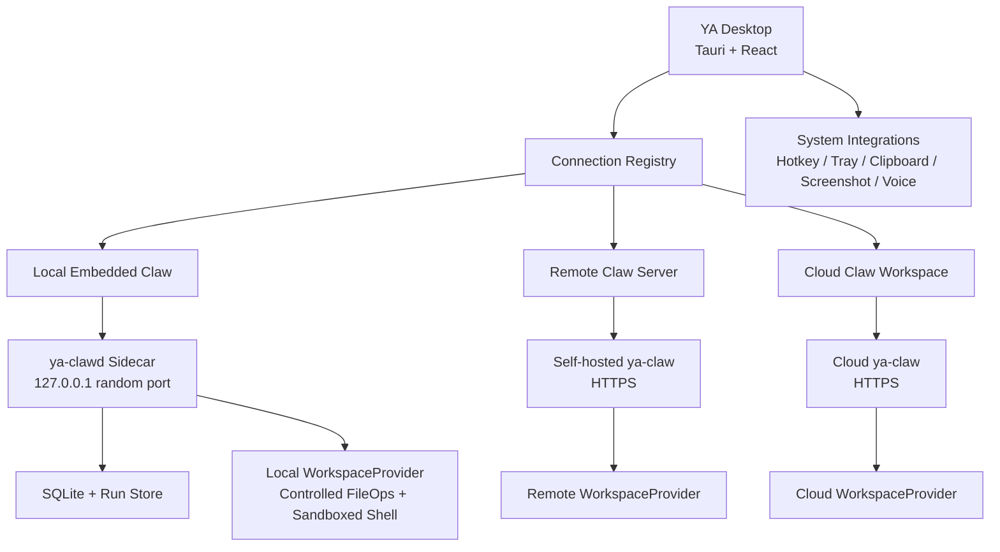
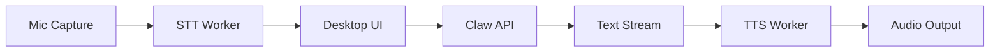

# 00. Desktop Overview

## Goal

YA Desktop is a desktop entry point for Claw-based agent runtimes. It gives users a direct local app for agent conversations, a global quick launcher, and an always-available bridge into local and remote workspaces.

The core product shape combines:

- Raycast-style quick invocation
- full chat and run inspection
- tray or menu bar presence
- local workspace execution through embedded Claw
- remote Claw and cloud workspace access
- multiple saved connection profiles
- future voice interactions through desktop STT/TTS workers

## High-Level Architecture



## Runtime Boundary

Desktop owns user interaction and OS integration.

Claw owns agent execution and durable runtime state.

The boundary is the Claw HTTP/SSE API surface for the desktop MVP, with WebSocket reserved for future remote RPC workspace transport and richer bidirectional control. Desktop should use this same boundary for local embedded Claw, self-hosted Claw, and cloud Claw.

Desktop should keep a long-lived SSE notification connection per active Claw connection. Lifecycle notifications move sessions between queued, running, HITL-pending, and terminal UI states through `status` plus `status_reason`, including runs created by bridges, schedules, heartbeat, and other clients. Detailed AGUI run streams still power chat rendering and replay.

Desktop is the preferred HITL surface for approvals because it can show native notifications, focused approval cards, workspace context, command previews, and secure local identity details.

## Product Surfaces

### Quick Launcher

The quick launcher is the always-available entry point.

Capabilities:

- Global hotkey opens a compact prompt.
- Prompt input can include typed text and simple selected text or clipboard text when available.
- The launcher can create a new session, continue an existing session, or send a short instruction to the active workspace through normal run `input_parts`.
- Launcher actions can target local Claw, remote Claw, or cloud Claw based on the selected connection and workspace.

### Full Chat Window

The full chat window is the main workspace UI.

Capabilities:

- Session list and run history.
- Streaming assistant output.
- Tool-call timeline.
- Live shell output.
- File diffs and artifacts.
- Shell execution status.
- Workspace file tree.
- Profile and model selection.
- Run cancellation, retry, and rerun flows.

### Tray / Menu Bar

The tray keeps background status visible.

Capabilities:

- Local daemon status.
- Active connection and workspace.
- Recently active sessions.
- Background run notifications.
- Start, stop, and restart local Claw.
- Open logs and diagnostics.
- Toggle autostart and always-on behavior.

## Voice Layer

Voice belongs to the desktop interaction layer.



STT turns speech into `input_parts`. TTS consumes assistant text deltas or completed text. Desktop sends interruption events or run cancellation when the user interrupts voice playback.

## Trust and Workspace Safety Principles

Desktop should make execution location explicit for workspace actions. Local execution should use controlled file operations plus a sandboxed shell by default.

Local embedded run:

```text
Run location: This Mac
Tool execution: This Mac
Workspace: ~/code/oss/ya-mono
Command: make test
```

Cloud workspace run:

```text
Run location: Team Cloud
Tool execution: Cloud Workspace
Workspace: cloud://org/repo
Command: make test
```

Remote runtime with local RPC tools:

```text
Run location: Team Cloud
Tool execution: This Mac
Workspace: ~/code/oss/ya-mono
Command: make test
```

Recommended safety layers:

- Workspace trust: `read_only`, `trusted`, `restricted`, `ephemeral`.
- Workspace provider: `local`, `docker`, `cloud`, or `remote_rpc`.
- File operations: path-bounded `LocalFileOperator` over the selected workspace.
- Shell runtime: `linux_bubblewrap` on Linux and `macos_seatbelt` on macOS.
- Filesystem exposure: bind mount or path allowlist for the selected workspace.
- Timeout, process cleanup, and output limits.
- Audit log: persist input, tool calls, shell commands, file diffs, outputs, and interruptions.
