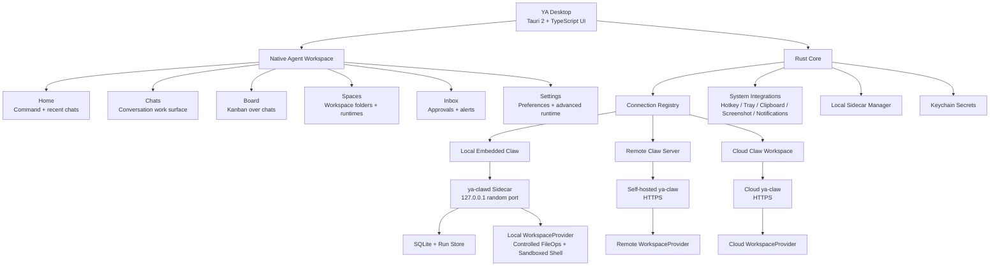
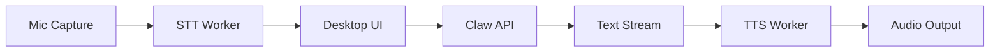

# 00. Desktop Overview

## Goal

YA Desktop is a native agent workspace for Claw-based runtimes. It gives users a direct desktop product for starting conversations, organizing agent work on a board, managing workspace folders, reviewing results, approving risky actions, and controlling local or remote runtime connections.

The core product shape combines:

- Home for command-first invocation and recent conversation overview
- Chats as the primary work management model
- Board as the kanban view over chats and runs
- Spaces for workspace folders, cloud workspaces, runtime connections, trust, and execution location
- Inbox for HITL decisions, alerts, failed background work, and user actions
- Settings for preferences, hotkeys, secrets, advanced runtime, logs, and diagnostics
- tray or menu bar presence
- local workspace execution through embedded Claw
- remote Claw and cloud workspace access
- multiple saved connection profiles
- future voice interactions through desktop STT/TTS workers

## High-Level Architecture



## Product Boundary

Desktop owns the user-facing product experience, OS-native context capture, notifications, sidecar lifecycle, connection registry, and HITL interaction surfaces.

Claw owns agent execution and durable runtime state: sessions, runs, profiles, workspace providers, memory, schedules, bridges, event replay, shell execution, and storage.

The Desktop product model is conversation-first:

- A chat is the main user-facing work object.
- A chat is backed by one or more Claw sessions and runs.
- A run is the runtime execution record for a chat turn or background continuation.
- Board columns group chats by status, priority, or workspace.
- Spaces bind chats to workspace folders, runtime connection, trust level, and execution location.

The boundary is the Claw HTTP/SSE API surface for the desktop MVP, with WebSocket reserved for future remote RPC workspace transport and richer bidirectional control. Desktop should use this same boundary for local embedded Claw, self-hosted Claw, and cloud Claw.

Desktop should keep a long-lived SSE notification connection per active Claw connection. Lifecycle notifications move chats between queued, running, HITL-pending, and terminal UI states through `status` plus `status_reason`, including runs created by bridges, schedules, heartbeat, and other clients. Detailed AGUI run streams still power chat rendering and replay.

Desktop is the preferred HITL surface for approvals because it can show native notifications, focused approval cards, workspace context, command previews, file diffs, and secure local identity details.

## Product Surfaces

### Home

Home is the command-first default surface.

Capabilities:

- Central command input for new conversations.
- Recent chats and active runs.
- Current space summary.
- Pending approval summary.
- Quick actions for new chat, resume chat, open Board, switch Space, and run diagnostics.
- Prompt input can include typed text, selected text, clipboard text, screenshots, and active app context when available.

### Chats

Chats are the primary work management surface.

Capabilities:

- Conversation list grouped by space and status.
- Selected chat detail with messages, AGUI replay, run timeline, tool calls, shell output, diffs, and artifacts.
- Profile and model selection at chat or space level.
- Run cancellation, retry, rerun, and continuation flows.
- Inline approval cards with command, diff, and workspace context.

### Board

Board is the kanban organization surface over chats.

Capabilities:

- Columns such as Active, Waiting, Done, Failed, Scheduled, or custom views.
- Drag-and-drop organization for user-facing workflow state.
- Filters by Space, profile, status, trigger type, and runtime location.
- Cards show chat title, current run state, latest output summary, pending approvals, and linked artifacts.

### Spaces

Spaces represent workspace folders or cloud workspaces plus runtime details.

Capabilities:

- Local workspace folder cards.
- Remote and cloud workspace cards.
- Active connection and runtime location.
- Workspace trust level.
- Default profile and model.
- Local sidecar status, logs, and diagnostics.
- File browsing entry points and memory summary.

### Inbox

Inbox is the primary user-decision surface.

Capabilities:

- Pending command approvals.
- File diff approvals.
- Workspace trust approvals.
- Bridge and schedule initiated approval requests.
- Failed background runs that need attention.
- Native notification deep links.
- Approve, reject, and respond-with-input actions.
- Audit metadata for who decided, from which device, and with which local context.

### Settings

Settings owns preferences and lower-level runtime controls.

Capabilities:

- Desktop preferences.
- Hotkeys.
- Notifications.
- Voice.
- Tokens and keychain.
- Autostart and always-on behavior.
- Advanced Runtime: profiles, schedules, bridges, heartbeat, runtime instances, logs, storage, and diagnostics.

### Tray / Menu Bar

The tray keeps background status visible.

Capabilities:

- Local daemon status.
- Active connection and space.
- Recently active chats.
- Background run notifications.
- Start, stop, and restart local Claw.
- Open Home, Chats, Board, Inbox, Spaces, logs, and diagnostics.
- Toggle autostart and always-on behavior.

## Voice Layer

Voice belongs to the desktop interaction layer.



STT turns speech into `input_parts`. TTS consumes assistant text deltas or completed text. Desktop sends interruption events or run cancellation when the user interrupts voice playback.

## Trust and Workspace Safety Principles

Desktop should make execution location explicit for workspace actions. Local execution should use controlled file operations plus a sandboxed shell by default.

Local embedded run:

```text
Run location: This Mac
Tool execution: This Mac
Space: ya-mono
Workspace folder: ~/code/oss/ya-mono
Command: make test
```

Cloud workspace run:

```text
Run location: Team Cloud
Tool execution: Cloud Workspace
Space: team-cloud
Workspace: cloud://org/repo
Command: make test
```

Remote runtime with local RPC tools:

```text
Run location: Team Cloud
Tool execution: This Mac
Space: ya-mono
Workspace folder: ~/code/oss/ya-mono
Command: make test
```

Recommended safety layers:

- Space trust: `read_only`, `trusted`, `restricted`, `ephemeral`.
- Workspace provider: `local`, `docker`, `cloud`, or `remote_rpc`.
- File operations: path-bounded `LocalFileOperator` over the selected workspace.
- Shell runtime: `linux_bubblewrap` on Linux and `macos_seatbelt` on macOS.
- Filesystem exposure: bind mount or path allowlist for the selected workspace.
- Timeout, process cleanup, and output limits.
- Audit log: persist input, tool calls, shell commands, file diffs, outputs, and interruptions.
