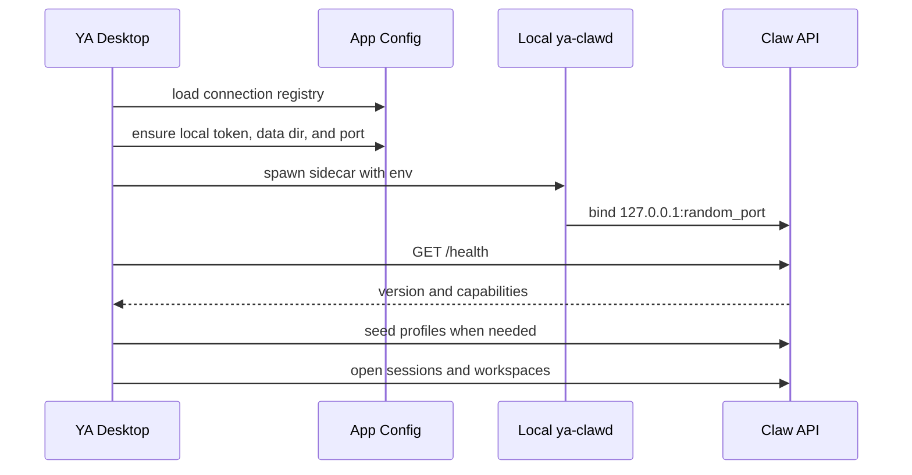
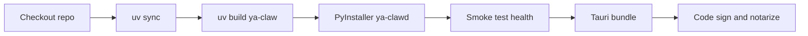

# 01. Local Sidecar Packaging

## Direction

YA Desktop should bundle a `ya-clawd` executable as a sidecar daemon. Tauri manages daemon lifecycle and the React UI talks to it through HTTP/SSE for the desktop MVP.

Local embedded Claw gives users an out-of-the-box agent runtime with local workspaces, local SQLite storage, session memory, and local tool execution.

## Local Runtime Layout

macOS application layout:

```text
YA Desktop.app/
  Contents/
    MacOS/
      ya-desktop
    Resources/
      sidecars/
        ya-clawd-aarch64-apple-darwin
        ya-clawd-x86_64-apple-darwin
```

macOS user data layout:

```text
~/Library/Application Support/YA Desktop/
  config.json
  local-claw/
    .env
    ya_claw.sqlite3
    data/
      run-store/
      workspaces/
    logs/
      ya-clawd.log
```

Linux user data layout:

```text
~/.config/ya-desktop/config.json
~/.local/share/ya-desktop/local-claw/
```

Windows user data layout:

```text
%APPDATA%\YA Desktop\config.json
%LOCALAPPDATA%\YA Desktop\local-claw\
```

## Local Daemon Startup



Local daemon rules:

- Bind to `127.0.0.1`.
- Generate `YA_CLAW_API_TOKEN` on first launch and store it in the OS keychain.
- Use a random available port and persist current runtime state in a lock file.
- Write logs to the app data directory.
- Restart automatically after crashes when always-on mode is enabled.
- Run local desktop mode with bridge dispatch set to `manual` by default.

Example environment:

```bash
YA_CLAW_API_TOKEN=local_random_secret
YA_CLAW_HOST=127.0.0.1
YA_CLAW_PORT=49321
YA_CLAW_SQLITE_PATH="$APP_DATA/local-claw/ya_claw.sqlite3"
YA_CLAW_DATA_DIR="$APP_DATA/local-claw/data"
YA_CLAW_WORKSPACE_ROOT="$APP_DATA/local-claw/workspaces"
YA_CLAW_BRIDGE_DISPATCH_MODE=manual
ya-clawd serve
```

## `ya-clawd` Command Surface

Add a stable command entrypoint to `packages/ya-claw/pyproject.toml`:

```toml
[project.scripts]
ya-clawd = "ya_claw.cli:main"
```

Recommended commands:

```bash
ya-clawd serve
ya-clawd migrate
ya-clawd seed-profiles
ya-clawd doctor
ya-clawd version
```

`ya-clawd serve` should support:

- `--host`
- `--port`
- `--port 0` for random port allocation
- `--data-dir`
- `--sqlite-path`
- `--workspace-root`
- `--runtime-lock-file`
- JSON ready line on stdout after bind and initialization
- graceful shutdown on process signal

Example ready line:

```json
{
  "type": "ya_clawd.ready",
  "pid": 12345,
  "base_url": "http://127.0.0.1:49321",
  "version": "0.4.0",
  "instance_id": "rt_abc"
}
```

## Development Mode

During desktop development, Tauri can start Claw from the monorepo through `uv`:

```bash
uv run --package ya-claw ya-clawd serve
```

This keeps iteration fast and lets developers debug directly against source code.

## MVP Packaging

For the first packaged desktop build, use PyInstaller in one-folder mode.



Suggested packaging files:

```text
packages/ya-claw/packaging/
  pyinstaller/
    ya-clawd.spec
    hooks/
      hook-ya_agent_sdk.py
      hook-pydantic_ai.py
      hook-litellm.py
      hook-openai.py
      hook-anthropic.py
```

The PyInstaller spec should include:

- `profiles.yaml`
- skill and prompt resources
- migration files
- package metadata
- Pydantic AI provider dynamic imports
- model provider SDK dynamic imports
- SQLite dependencies
- optional toolset resources used by Claw profiles

## Release Packaging

Long term, publish `ya-clawd` as a standalone release artifact and bundle compatible artifacts into YA Desktop.

```text
ya-clawd v0.4.0
  ya-clawd-aarch64-apple-darwin.tar.gz
  ya-clawd-x86_64-apple-darwin.tar.gz
  ya-clawd-x86_64-unknown-linux-gnu.tar.gz
  ya-clawd-x86_64-pc-windows-msvc.zip

ya-desktop v0.1.0
  YA Desktop.dmg
  YA Desktop.AppImage
  YA Desktop Setup.exe
```

The desktop updater should support:

- Desktop app upgrade.
- Sidecar binary upgrade.
- Local DB migration.
- Profile migration.
- Capability compatibility checks.
- Rollback metadata for failed migrations.

## Smoke Tests

Minimum packaged sidecar smoke tests:

```bash
dist/ya-clawd/ya-clawd version
dist/ya-clawd/ya-clawd serve --host 127.0.0.1 --port 0
curl http://127.0.0.1:$PORT/health
```
