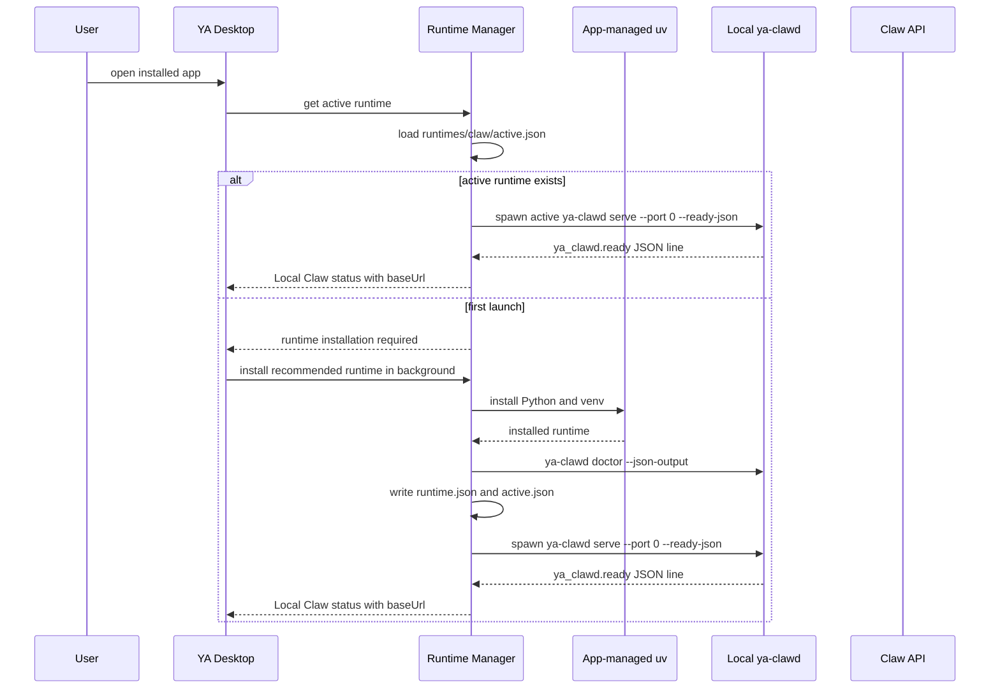
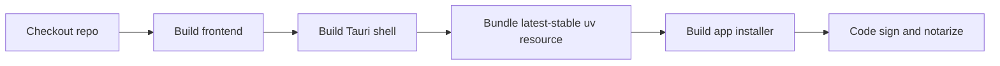
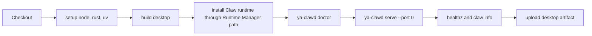

# 01. Local Runtime Packaging

## Direction

YA Desktop uses an app-managed `uv` runtime manager to install and launch local Claw. The desktop app ships as a small native shell, then installs the selected Claw runtime into app data in the background.

Local Claw still runs as a child daemon process named `ya-clawd`. Tauri owns lifecycle, logs, health checks, and runtime selection. The React UI talks to Claw through HTTP/SSE after the daemon reports readiness.

This gives YA Desktop a small installer, independent Desktop and Claw release cadence, latest-first Claw updates, version rollback, and repair workflows.

## Product Model

YA Desktop has two update domains:

- Desktop app: Tauri shell, UI, native integrations, runtime manager, notifications, tray, updater, and OS keychain integration.
- Claw runtime: Python packages, API server, execution engine, profiles, migrations, workspace providers, memory jobs, and agent capabilities.

A local runtime is a versioned Claw installation managed by Desktop:

```text
Claw Runtime
  id: claw
  version: 0.73.1
  updatePolicy: latest-compatible
  python: 3.13
  package: ya-claw[rs]
  entrypoint: .venv/bin/ya-clawd
  status: installing | installed | active | failed | stale
```

## Runtime Layout

macOS user data layout:

```text
~/Library/Application Support/YA Desktop/
  config.json
  uv/
    bin/
      uv
    cache/
  runtimes/
    claw/
      0.73.1/
        runtime.json
        install.log
        verify.log
        .venv/
      0.74.0/
        runtime.json
        install.log
        verify.log
        .venv/
      active.json
  local-claw/
    .env
    runtime.json
    ya_claw.sqlite3
    data/
      run-store/
    workspaces/
    logs/
      ya-clawd.log
```

Linux user data layout:

```text
~/.config/ya-desktop/config.json
~/.local/share/ya-desktop/
  uv/
  runtimes/
  local-claw/
```

Windows user data layout:

```text
%APPDATA%\YA Desktop\config.json
%LOCALAPPDATA%\YA Desktop\uv\
%LOCALAPPDATA%\YA Desktop\runtimes\
%LOCALAPPDATA%\YA Desktop\local-claw\
```

Runtime metadata example:

```json
{
  "schemaVersion": 1,
  "runtimeId": "claw",
  "version": "0.73.1",
  "updatePolicy": "latest-compatible",
  "python": "3.13",
  "package": "ya-claw[rs]",
  "venvPath": "/Users/me/Library/Application Support/YA Desktop/runtimes/claw/0.73.1/.venv",
  "entrypoint": "/Users/me/Library/Application Support/YA Desktop/runtimes/claw/0.73.1/.venv/bin/ya-clawd",
  "installedAt": "2026-05-13T01:00:00Z",
  "verifiedAt": "2026-05-13T01:00:12Z"
}
```

`active.json` example:

```json
{
  "schemaVersion": 1,
  "runtimeId": "claw",
  "version": "0.73.1",
  "entrypoint": "/Users/me/Library/Application Support/YA Desktop/runtimes/claw/0.73.1/.venv/bin/ya-clawd",
  "selectedAt": "2026-05-13T01:00:12Z"
}
```

## Bundled `uv`

YA Desktop bundles the latest stable `uv` binary available at Desktop release time and copies it into the app data runtime directory on first launch.

Desktop uses app-managed `uv` by default. Advanced settings can allow developers to choose a system `uv` path for local development and diagnostics.

Runtime Manager sets these environment variables for all `uv` operations:

```bash
UV_CACHE_DIR="$APP_DATA/uv/cache"
UV_PYTHON_INSTALL_DIR="$APP_DATA/uv/python"
UV_LINK_MODE=copy
```

The app-managed runtime path gives Desktop deterministic install, update, repair, and cache-prune behavior.

## Startup Flow



## Managed Daemon Command

Runtime Manager launches the active runtime entrypoint:

```bash
YA_CLAW_API_TOKEN=local_random_secret \
YA_CLAW_ENVIRONMENT=desktop-local \
YA_CLAW_BRIDGE_DISPATCH_MODE=manual \
YA_CLAW_WORKSPACE_PROVIDER_BACKEND=local \
"$ACTIVE_RUNTIME/.venv/bin/ya-clawd" serve \
  --host 127.0.0.1 \
  --port 0 \
  --data-dir "$APP_DATA/local-claw/data" \
  --sqlite-path "$APP_DATA/local-claw/ya_claw.sqlite3" \
  --workspace-root "$APP_DATA/local-claw/workspaces" \
  --runtime-lock-file "$APP_DATA/local-claw/runtime.json" \
  --ready-json
```

Local daemon rules:

- Bind to `127.0.0.1`.
- Generate `YA_CLAW_API_TOKEN` on first launch and store it through Desktop's secret storage abstraction.
- Use `--port 0` for a random available port and persist current runtime state in `runtime.json`.
- Write stdout and stderr lines to `local-claw/logs/ya-clawd.log`.
- Run local desktop mode with bridge dispatch set to `manual`.
- Run local desktop mode with `YA_CLAW_WORKSPACE_PROVIDER_BACKEND=local` for direct local folder execution.
- Start automatically from the Tauri setup hook after an active runtime is available.
- Expose manual status/start/stop/restart controls through Tauri commands.

## `ya-clawd` Command Surface

`packages/ya-claw/pyproject.toml` exposes both the deployment CLI and desktop daemon alias:

```toml
[project.scripts]
ya-claw = "ya_claw.cli:cli"
ya-clawd = "ya_claw.cli:cli"
```

Supported commands:

```bash
ya-clawd serve
ya-clawd migrate
ya-clawd seed-profiles
ya-clawd doctor
ya-clawd version
```

`ya-clawd serve` supports:

- `--host`
- `--port`
- `--port 0` for random port allocation
- `--data-dir`
- `--sqlite-path`
- `--workspace-root`
- `--runtime-lock-file`
- `--ready-json` for a ready JSON line on stdout after bind and initialization
- graceful shutdown through the child process lifecycle

Example ready line:

```json
{
  "type": "ya_clawd.ready",
  "pid": 12345,
  "base_url": "http://127.0.0.1:49321",
  "version": "0.73.1",
  "service_revision": "0.73.1+abc123",
  "instance_id": "rt_abc",
  "data_dir": "/Users/me/Library/Application Support/YA Desktop/local-claw/data",
  "workspace_dir": "/Users/me/Library/Application Support/YA Desktop/local-claw/workspaces",
  "database_url": "sqlite+aiosqlite:////.../ya_claw.sqlite3"
}
```

## Runtime Installation

Initial full runtime install uses the current Claw dependency surface and installs the latest compatible runtime:

```bash
"$APP_UV" python install 3.13
"$APP_UV" venv "$APP_DATA/runtimes/claw/pending/.venv" --python 3.13
"$APP_UV" pip install \
  --python "$APP_DATA/runtimes/claw/pending/.venv/bin/python" \
  "ya-claw[rs]"
```

Runtime Manager installs `ya-claw[rs]` first so local search uses the native Rust binding by default. If the native wheel or local build fails, Runtime Manager retries `ya-claw`, records the fallback package spec in `runtime.json`, and keeps the install log for diagnostics.

Release builds can install from PyPI, a private package index, or GitHub Release wheel URLs. Runtime Manager verifies the installed runtime with `ya-clawd version --json-output`, `doctor`, and a serve smoke before activation.

Verification commands:

```bash
"$RUNTIME/.venv/bin/ya-clawd" version --json-output
YA_CLAW_API_TOKEN=test "$RUNTIME/.venv/bin/ya-clawd" doctor --json-output
YA_CLAW_API_TOKEN=test "$RUNTIME/.venv/bin/ya-clawd" serve --host 127.0.0.1 --port 0 --ready-json
curl http://127.0.0.1:$PORT/healthz
```

## Development Flow

Development command:

```bash
make desktop-dev
```

In dev mode, Tauri resolves the daemon command in this order:

1. `YA_DESKTOP_CLAWD_COMMAND` environment variable.
2. Active app-managed runtime from `runtimes/claw/active.json`.
3. Monorepo fallback command:

```bash
uv run --package ya-claw ya-clawd
```

The fallback lets developers run Desktop before installing a managed runtime.

## Build Flow

Desktop package builds include the Tauri app, frontend assets, and app-managed `uv` resource. Development and pull request artifacts are unsigned by default. Release workflows sign platform artifacts when the matching macOS, Windows, Linux, or Tauri updater credentials are configured.



Build commands:

```bash
make desktop-tauri-build
```

Runtime installation is a first-launch and background update concern. Release artifacts stay small while the runtime manager owns Claw installation and repair.

## CI Flow

Desktop CI validates the runtime manager with app-managed `uv` on each target platform.



Runtime CI should publish Python packages or wheels for `ya-agent-environment`, `ya-environment-relay`, `ya-agent-sdk`, and `ya-claw`, then verify that latest `ya-claw[rs]` and fallback `ya-claw` install through the same `uv` path used by Desktop.

## Release Compatibility

Desktop compares the active Claw runtime metadata with the compatibility payload reported by `ya-clawd version --json-output` before automatic activation.

Compatibility payload:

```json
{
  "desktop_compatibility": {
    "contract": "claw-desktop.v1"
  }
}
```

`contract` is the activation decision field in the first version. Claw keeps compatibility within a contract version. Runtime Manager keeps the previous runtime active when the installed runtime reports an unsupported contract or fails verification.

Runtime migrations run inside the selected Claw version before a runtime becomes active. Runtime Manager stores previous active runtime metadata so Desktop can switch back after a failed verification step.

## Smoke Tests

Minimum managed runtime smoke tests:

```bash
uv python install 3.13
uv venv "$RUNTIME/.venv" --python 3.13
uv pip install --python "$RUNTIME/.venv/bin/python" "ya-claw[rs]"
"$RUNTIME/.venv/bin/ya-clawd" version --json-output
YA_CLAW_API_TOKEN=test "$RUNTIME/.venv/bin/ya-clawd" doctor --json-output
YA_CLAW_API_TOKEN=test "$RUNTIME/.venv/bin/ya-clawd" serve --host 127.0.0.1 --port 0 --ready-json
curl http://127.0.0.1:$PORT/healthz
curl http://127.0.0.1:$PORT/api/v1/claw/info -H "Authorization: Bearer test"
```
