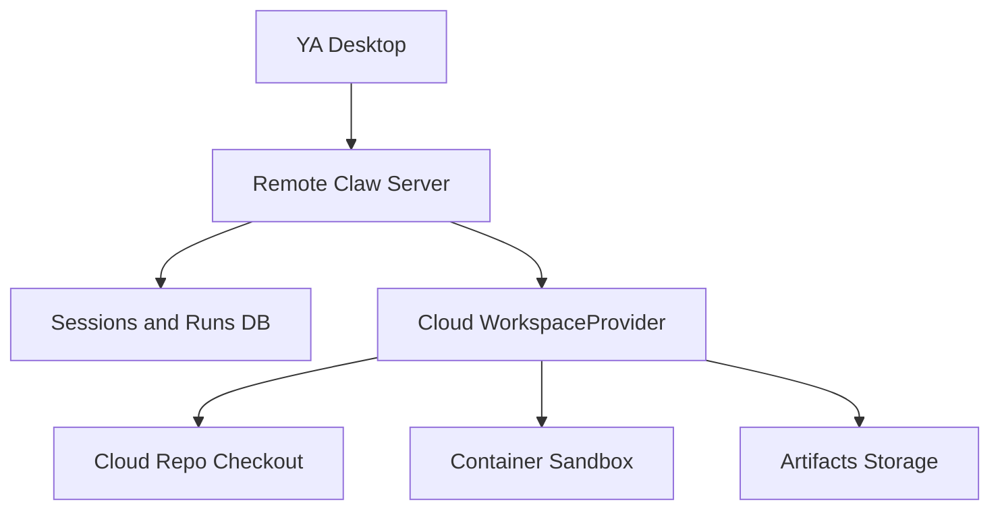
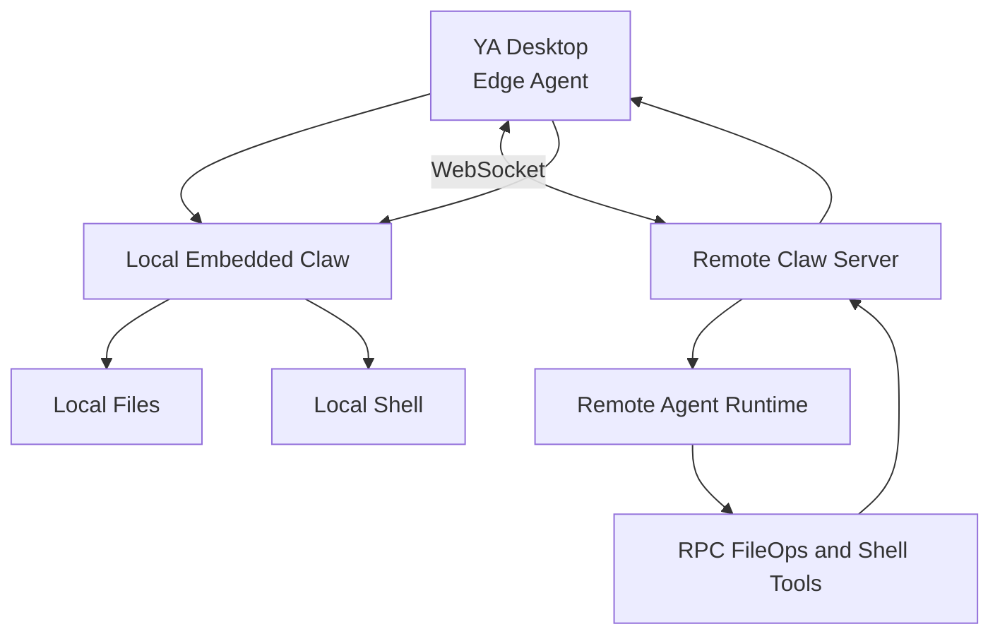

# 03. Cloud and RPC Workspaces

## Cloud Workspace Mode

In cloud workspace mode, Desktop is a pure client and remote Claw owns execution.



Remote Claw responsibilities:

- Workspace checkout.
- Container shell.
- File operations.
- Credentials injection.
- Model provider keys.
- Run scheduling.
- Audit log.
- Artifacts.

Desktop responsibilities:

- Input composition.
- Streaming UI.
- File tree and diff display.
- Session navigation.
- Artifact download.

## Cloud Workspace Product Shape

A cloud workspace is selected through the same connection and workspace controls as local workspaces.

Example display:

```text
Connection: Team Cloud
Workspace: cloud://org/project/repo
Profile: coding-prod
```

Cloud workspace metadata should include:

```ts
type CloudWorkspace = {
  id: string;
  name: string;
  uri: string;
  orgId: string;
  projectId?: string;
  repoUrl?: string;
  branch?: string;
  provider: "cloud";
  trustLevel: "read_only" | "trusted" | "restricted" | "ephemeral";
  capabilities: string[];
};
```

## Remote Agent with Local RPC Workspace

Remote agent plus local fileops and shell RPC should be modeled as another workspace execution mode.



Product presentation:

```text
Connection: Team Cloud
Workspace: This Mac / ya-mono
Runtime: Remote Agent
Tools: Local FileOps + Local Shell via Desktop RPC
```

This gives a remote Claw runtime access to local workspace capabilities through an audited, Desktop-controlled edge channel.

## Edge Registration

Desktop connects to remote Claw through an outbound WebSocket and registers local workspaces.

Registration message:

```json
{
  "type": "edge_register",
  "device_id": "dev_123",
  "workspaces": [
    {
      "id": "local:ya-mono",
      "name": "ya-mono",
      "root_label": "~/code/oss/ya-mono",
      "capabilities": ["filesystem.read", "filesystem.write", "shell.run"]
    }
  ]
}
```

The remote server should use stable device IDs and workspace IDs for routing. Local absolute paths should stay on the device. Remote Claw should receive user-facing labels and capability declarations.

## RPC Tool Protocol

Tool request:

```json
{
  "type": "tool_request",
  "request_id": "req_123",
  "run_id": "run_abc",
  "workspace_id": "local:ya-mono",
  "tool": "shell.run",
  "args": {
    "command": "make test",
    "cwd": "/workspace",
    "timeout_seconds": 120
  }
}
```

Tool delta:

```json
{
  "type": "tool_delta",
  "request_id": "req_123",
  "stream": "stdout",
  "text": "running tests...\n"
}
```

Tool response:

```json
{
  "type": "tool_response",
  "request_id": "req_123",
  "status": "completed",
  "output": {
    "exit_code": 0,
    "stdout": "...",
    "stderr": "..."
  }
}
```

Cancellation:

```json
{
  "type": "tool_cancel",
  "request_id": "req_123",
  "reason": "user_cancelled"
}
```

## Remote RPC Workspace Components

Initial components:

- `RemoteRpcWorkspaceProvider`
- `RpcFileOperator`
- `RpcShell`
- WebSocket edge gateway
- Device registration
- Workspace registration
- Tool request queue
- Heartbeat and reconnect
- Cancellation propagation
- Binary artifact transfer

## Execution Location Display

Desktop should show runtime and tool execution location separately.

Local embedded run:

```text
Run location: This Mac
Tool execution: This Mac
Workspace: ~/code/oss/ya-mono
Command: make test
```

Cloud workspace run:

```text
Run location: Team Cloud
Tool execution: Cloud Workspace
Workspace: cloud://org/repo
Command: make test
```

Remote runtime with local RPC tools:

```text
Run location: Team Cloud
Tool execution: This Mac
Workspace: ~/code/oss/ya-mono
Command: make test
```

## Audit Model

Remote RPC mode should write audit data on both sides.

Remote Claw audit log:

- run ID
- remote user and org
- device ID
- workspace label
- tool name
- requested args
- response status
- response summary

Local Desktop or local Claw audit log:

- device user
- local workspace root
- resolved cwd
- shell command or file operation
- stdout/stderr summary
- file diffs when available
- cancellation or failure details

## Transport

Initial transport should be WebSocket over HTTPS.

Properties:

- Desktop initiates outbound connection.
- Remote Claw routes tool requests over the active device connection.
- Heartbeat keeps device availability fresh.
- Reconnect resumes device registration and pending run state where possible.

Future transports can include QUIC, private-network tunnels, and SSH reverse tunnels.
