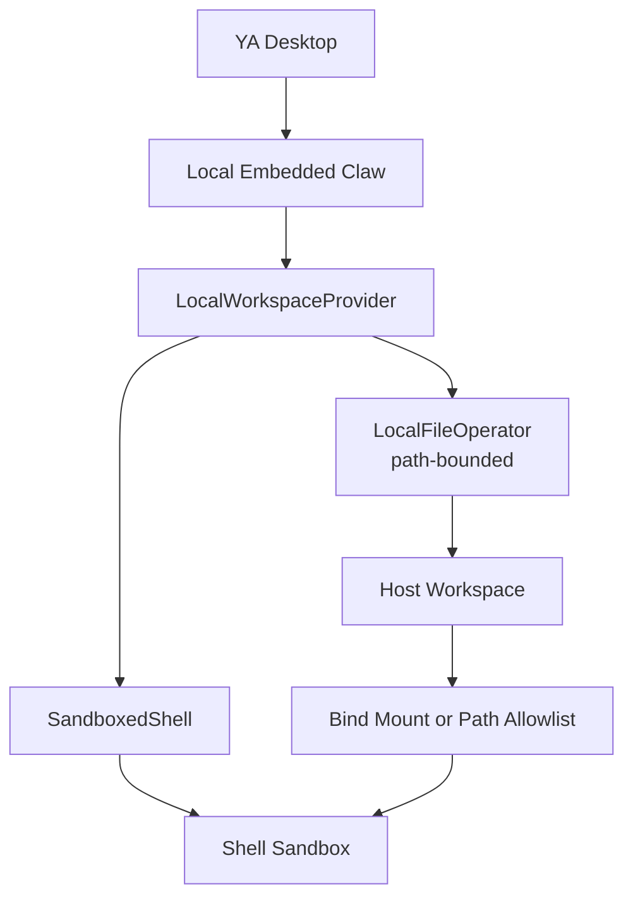

# 06. Sandboxed Shell Workspace Provider

## Direction

YA Desktop local execution should use a workspace provider that combines controlled file operations with a sandboxed shell. The host workspace remains the source of truth. File operations use Claw's existing path-bounded `FileOperator`; shell execution runs in a sandbox that exposes the workspace as the only project filesystem scope.

The default local provider should be `LocalWorkspaceProvider` with `SandboxedShell`.



## Threat Model

The main desktop local threat is shell overreach:

- reading files outside the selected workspace
- writing files outside the selected workspace
- reading secrets from home directories or common credential paths
- spawning long-running or orphaned processes
- using broad network access when a workspace policy disables it
- exhausting CPU, memory, disk, or output buffers

File operations already go through the runtime file operator and can enforce path allowlists, read/write policy, ignored paths, and audit logging. Shell execution needs an OS-level sandbox because a normal shell can escape application-level path checks.

## Provider Model

```ts
type WorkspaceProviderKind =
  | "local"
  | "docker"
  | "cloud"
  | "remote_rpc";

type LocalWorkspaceProvider = {
  kind: "local";
  hostWorkspaceRoot: string;
  fileOperator: "local_file_operator";
  shell: SandboxedShell;
};

type SandboxedShell = {
  kind: "sandboxed_shell";
  runtime: SandboxRuntime;
  workspaceMount: WorkspaceMount;
  policy: ShellSandboxPolicy;
};

type SandboxRuntime =
  | "linux_bubblewrap"
  | "macos_seatbelt";

type WorkspaceMount = {
  hostPath: string;
  sandboxPath: "/workspace";
  writable: boolean;
};

type ShellSandboxPolicy = {
  network: "allow" | "deny";
  home: "tmpfs" | "deny";
  timeoutSeconds: number;
  outputLimitBytes: number;
  envAllowlist: string[];
};
```

## Filesystem Strategy

The provider should use the real local workspace for file operations and shell execution.

- FileOps operate on `hostWorkspaceRoot` through path-bounded APIs.
- Shell commands see the workspace at `/workspace`.
- Linux uses bind mounts to map `hostWorkspaceRoot` to `/workspace`.
- macOS uses a sandbox profile that allowlists `hostWorkspaceRoot` and sets the command cwd to that path or a normalized workspace path.
- Host paths outside the workspace stay outside the shell sandbox policy.

This keeps runtime behavior simple: changes made by fileops and shell commands are visible to each other immediately.

## Linux Runtime: `linux_bubblewrap`

Linux should use `bubblewrap` as the default local shell sandbox runtime.

Capabilities:

- user namespace isolation
- mount namespace isolation
- workspace bind-mounted at `/workspace`
- tmpfs home and temp directories
- minimal `/proc` and `/dev`
- configurable network access
- process cleanup through `--die-with-parent`
- timeout and output limits enforced by Claw

Default shape:

```bash
bwrap \
  --unshare-all \
  --share-net \
  --die-with-parent \
  --proc /proc \
  --dev /dev \
  --tmpfs /tmp \
  --tmpfs /home/agent \
  --bind "$WORKSPACE" /workspace \
  --chdir /workspace \
  /bin/bash -lc "$COMMAND"
```

Network-disabled shape:

```bash
bwrap \
  --unshare-all \
  --die-with-parent \
  --proc /proc \
  --dev /dev \
  --tmpfs /tmp \
  --tmpfs /home/agent \
  --bind "$WORKSPACE" /workspace \
  --chdir /workspace \
  /bin/bash -lc "$COMMAND"
```

The workspace bind can be writable by default for trusted local workspaces. Read-only mode can use a read-only bind when the workspace policy requires it.

## macOS Runtime: `macos_seatbelt`

macOS should use a seatbelt profile as the local shell sandbox runtime. YA Desktop can require a recent macOS version that supports the selected profile behavior.

Capabilities:

- path allowlist for the selected workspace
- path allowlist for runtime temp directories
- deny access to common home, SSH, cloud, and credential paths through default-deny profile shape
- sanitized environment
- timeout and process group cleanup enforced by Claw
- optional network profile switch

Example shape:

```bash
sandbox-exec -f "$PROFILE" /bin/bash -lc "$COMMAND"
```

The profile should allow read/write access to the selected workspace and runtime temp directories. The command should run with cwd set to the workspace. Claw should generate the profile per workspace so the allowlist is explicit.

YA Desktop should declare a minimum macOS version and run a startup self-check for the generated seatbelt profile. The app can show setup diagnostics when the required profile execution is unavailable.

## Default Policy

Desktop local execution should use this default policy:

```yaml
workspace_provider: local
file_operator: local_file_operator
shell: sandboxed_shell
linux:
  sandbox_runtime: linux_bubblewrap
  workspace_mount:
    host_path: selected_workspace
    sandbox_path: /workspace
    writable: true
macos:
  sandbox_runtime: macos_seatbelt
  workspace_allowlist:
    - selected_workspace
network: allow
home: tmpfs
timeout_seconds: 120
output_limit_bytes: 1048576
```

## Workspace Changes

Changes are written to the real workspace. Desktop can use normal Git diff, file status, and run trace views to show what changed.

For Git workspaces, Desktop should prefer Git-backed change display:

```http
GET /api/v1/workspaces/{workspace_id}/status
GET /api/v1/workspaces/{workspace_id}/diff
```

For non-Git workspaces, Claw can expose a best-effort changed-file list from file operation logs and shell command metadata.

## Runtime Capabilities

Capability discovery should expose sandboxed shell support:

```json
{
  "workspace_providers": ["local", "docker", "cloud"],
  "local_shell_runtimes": ["linux_bubblewrap"],
  "local_file_operator": true,
  "workspace_mount_modes": ["bind_mount"],
  "workspace_change_views": ["git_status", "git_diff"]
}
```

macOS example:

```json
{
  "workspace_providers": ["local", "docker", "cloud"],
  "local_shell_runtimes": ["macos_seatbelt"],
  "local_file_operator": true,
  "workspace_mount_modes": ["path_allowlist"],
  "workspace_change_views": ["git_status", "git_diff"]
}
```

## Failure and Setup UX

When the required sandbox runtime is unavailable, Desktop should show setup guidance for the platform runtime.

Linux setup examples:

- install `bubblewrap`
- enable user namespaces when the distribution requires it

macOS setup examples:

- require a recent supported macOS version
- run a startup self-check for generated profiles
- use packaged helper scripts and generated profiles

Local shell execution should start after the required sandbox runtime is ready. Remote and cloud connections continue to work through their own runtime providers.
