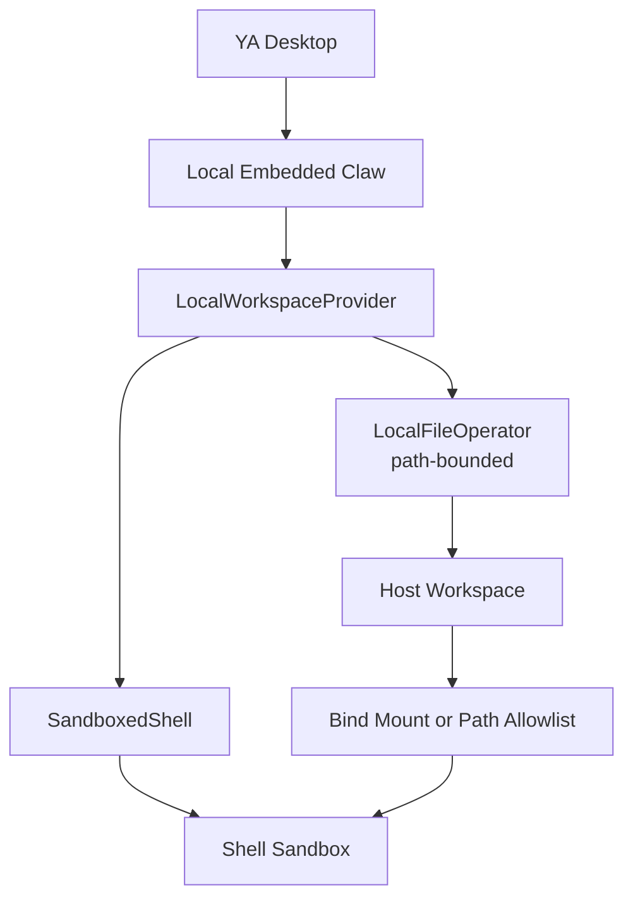

# 06. Sandboxed Shell Workspace Provider

## Direction

YA Desktop local execution should use a workspace provider that combines controlled file operations with a sandboxed shell. The host workspace remains the source of truth. File operations use Claw's existing path-bounded `FileOperator`; shell execution runs in a sandbox that exposes the selected workspace mount set as the project filesystem scope.

The default local provider should be `LocalWorkspaceProvider` with `SandboxedShell`. Claw owns the canonical policy model in [packages/ya-claw/spec/12-shell-sandbox.md](../../../packages/ya-claw/spec/12-shell-sandbox.md); Desktop owns folder trust, user-facing controls, local diagnostics, approval UX, and relay-local enforcement.



## Threat Model

The main desktop local threat is shell overreach:

- reading files outside the selected workspace
- writing files outside the selected workspace
- reading secrets from home directories or common credential paths
- spawning long-running or orphaned processes
- using broad network access when a workspace policy disables it
- exhausting CPU, memory, disk, or output buffers

File operations already go through the runtime file operator and can enforce path allowlists, read/write policy, ignored paths, and audit logging. Shell execution needs an OS-level sandbox because a normal shell can escape application-level path checks.

## Provider Model

```ts
type WorkspaceProviderKind = 'local' | 'docker' | 'cloud' | 'remote_rpc'

type LocalWorkspaceProvider = {
  kind: 'local'
  hostWorkspaceRoot: string
  fileOperator: 'local_file_operator'
  shell: SandboxedShell
}

type SandboxedShell = {
  kind: 'sandboxed_shell'
  runtime: SandboxRuntime
  workspaceMounts: WorkspaceMount[]
  cwd: string
  policy: ShellSandboxPolicy
}

type SandboxRuntime =
  | 'linux_bwrap_seccomp'
  | 'macos_seatbelt'
  | 'windows_restricted_token'
  | 'docker'
  | 'podman'
  | 'nsjail'

type WorkspaceMount = {
  id: string
  hostPath: string
  sandboxPath: string
  mode: 'rw' | 'ro'
}

type ShellSandboxPolicy = {
  profile:
    | 'read_only'
    | 'workspace_write'
    | 'relay_workspace_write'
    | 'network_proxy'
    | 'danger_full_access'
  backendPreference:
    | 'auto'
    | 'linux_bwrap_seccomp'
    | 'macos_seatbelt'
    | 'windows_restricted_token'
    | 'docker'
    | 'podman'
    | 'nsjail'
    | 'raw_host'
  network: 'blocked' | 'restricted' | 'proxy' | 'full'
  home: 'tmpfs' | 'deny'
  timeoutSeconds: number
  outputLimitBytes: number
  envAllowlist: string[]
}
```

## Platform Runtime Summary

| Platform                 | Default runtime            | Primary primitives                                                      | Desktop priority                    |
| ------------------------ | -------------------------- | ----------------------------------------------------------------------- | ----------------------------------- |
| Linux                    | `linux_bwrap_seccomp`      | bubblewrap, seccomp, optional Landlock                                  | first release                       |
| macOS                    | `macos_seatbelt`           | generated Seatbelt profile through `/usr/bin/sandbox-exec`              | first release                       |
| Windows                  | `windows_restricted_token` | restricted token, AppContainer, Job Object, private desktop, ACL grants | follow-up release                   |
| Containerized workspaces | `docker` / `podman`        | OCI image, mounts, cgroups, runtime network policy                      | advanced local and self-hosted mode |

## Filesystem Strategy

The provider should use the real local workspace for file operations and shell execution.

- FileOps operate on declared host workspace roots through path-bounded APIs.
- Shell commands see declared virtual paths such as `/workspace/main` and `/workspace/docs`.
- Linux uses bind mounts to map each selected host folder to its virtual path.
- macOS uses a sandbox profile that allowlists each selected host folder and sets command cwd from the default mount.
- Host paths are exposed through the declared mount set and per-mount mode.

This keeps runtime behavior simple: changes made by fileops and shell commands are visible to each other immediately.

## Linux Runtime: `linux_bwrap_seccomp`

Linux should use `bubblewrap` plus seccomp as the default local shell sandbox runtime.

Capabilities:

- user namespace isolation
- mount namespace isolation
- workspace folders bind-mounted under `/workspace`
- tmpfs home and temp directories
- minimal `/proc` and `/dev`
- configurable network access
- process cleanup through `--die-with-parent`
- syscall filtering for process inspection, privileged kernel controls, and network policy
- timeout and output limits enforced by Claw

Default shape:

```bash
bwrap \
  --unshare-all \
  --share-net \
  --die-with-parent \
  --proc /proc \
  --dev /dev \
  --tmpfs /tmp \
  --tmpfs /home/agent \
  --bind "$WORKSPACE_MAIN" /workspace/main \
  --ro-bind "$WORKSPACE_DOCS" /workspace/docs \
  --chdir /workspace/main \
  /bin/bash -lc "$COMMAND"
```

Network-disabled shape:

```bash
bwrap \
  --unshare-all \
  --die-with-parent \
  --proc /proc \
  --dev /dev \
  --tmpfs /tmp \
  --tmpfs /home/agent \
  --bind "$WORKSPACE_MAIN" /workspace/main \
  --ro-bind "$WORKSPACE_DOCS" /workspace/docs \
  --chdir /workspace/main \
  /bin/bash -lc "$COMMAND"
```

The default mount can be writable for trusted local workspaces. Reference mounts can use read-only binds when the workspace policy marks them `ro`.

## macOS Runtime: `macos_seatbelt`

macOS should use a seatbelt profile as the local shell sandbox runtime. YA Desktop can require a recent macOS version that supports the selected profile behavior.

Capabilities:

- path allowlist for selected workspace mounts
- path allowlist for runtime temp directories
- deny access to common home, SSH, cloud, and credential paths through default-deny profile shape
- sanitized environment
- timeout and process group cleanup enforced by Claw
- optional network profile switch

Example shape:

```bash
sandbox-exec -f "$PROFILE" /bin/bash -lc "$COMMAND"
```

The profile should allow access to selected workspace mounts and runtime temp directories. The command should run with cwd set to the selected default mount. Claw should generate the profile per mount set so the allowlist is explicit.

YA Desktop should declare a minimum macOS version and run a startup self-check for the generated seatbelt profile. The app can show setup diagnostics when the required profile execution is unavailable.

## Default Policy

Desktop local execution should use this default policy:

```yaml
workspace_provider: local
file_operator: local_file_operator
shell: sandboxed_shell
linux:
  sandbox_runtime: linux_bwrap_seccomp
  workspace_mounts:
    - id: main
      host_path: selected_workspace
      sandbox_path: /workspace/main
      mode: rw
macos:
  sandbox_runtime: macos_seatbelt
  workspace_allowlist:
    - selected_workspace
  cwd: /workspace/main
network: full
env_allowlist:
  - "*"
home: tmpfs
timeout_seconds: 120
output_limit_bytes: 1048576
```

## Desktop Folder Selection

Desktop owns the user-facing folder registry:

- global default workspace directory
- recent and pinned folders
- per-folder trust state
- mount-set presets for chats
- per-chat selected folders and default mount

Desktop sends the selected mount set to Claw as `workspace` on session creation. Claw validates and resolves the binding into local or Docker environment mounts.

## Workspace Changes

Changes are written to the real workspace. Desktop can use normal Git diff, file status, and run trace views to show what changed.

For Git workspaces, Desktop should prefer Git-backed change display:

```http
GET /api/v1/workspaces/{workspace_id}/status
GET /api/v1/workspaces/{workspace_id}/diff
```

For non-Git workspaces, Claw can expose a best-effort changed-file list from file operation logs and shell command metadata.

## Runtime Capabilities

Capability discovery should expose sandboxed shell support:

```json
{
  "workspace_providers": ["local", "docker", "cloud"],
  "local_shell_runtimes": ["linux_bwrap_seccomp"],
  "local_file_operator": true,
  "workspace_mount_modes": ["rw", "ro"],
  "multi_mount_workspaces": true,
  "workspace_change_views": ["git_status", "git_diff"]
}
```

Windows example:

```json
{
  "workspace_providers": ["local", "docker", "cloud"],
  "local_shell_runtimes": ["windows_restricted_token"],
  "local_file_operator": true,
  "workspace_mount_modes": ["rw", "ro"],
  "multi_mount_workspaces": true,
  "workspace_change_views": ["git_status", "git_diff"]
}
```

macOS example:

```json
{
  "workspace_providers": ["local", "docker", "cloud"],
  "local_shell_runtimes": ["macos_seatbelt"],
  "local_file_operator": true,
  "workspace_mount_modes": ["rw", "ro"],
  "multi_mount_workspaces": true,
  "workspace_change_views": ["git_status", "git_diff"]
}
```

## Failure and Setup UX

Desktop should show setup guidance when the selected sandbox runtime fails diagnostics.

Linux setup examples:

- install `bubblewrap`
- enable user namespaces when the distribution requires it
- verify seccomp support through the Claw startup self-test
- display Landlock ABI status as an additional hardening or fallback signal

macOS setup examples:

- require a recent supported macOS version
- run a startup self-check for generated Seatbelt profiles
- use packaged helper scripts and generated profiles
- show Apple Containerization as a future high-isolation backend on supported systems

Windows setup examples:

- verify restricted-token process launch
- verify Job Object kill-on-close and resource limit behavior
- verify AppContainer availability for high-isolation profiles
- verify workspace ACL grants for selected roots and scratch roots

Local shell execution should start after the required sandbox runtime is ready. Remote and cloud connections continue to work through their own runtime providers.
