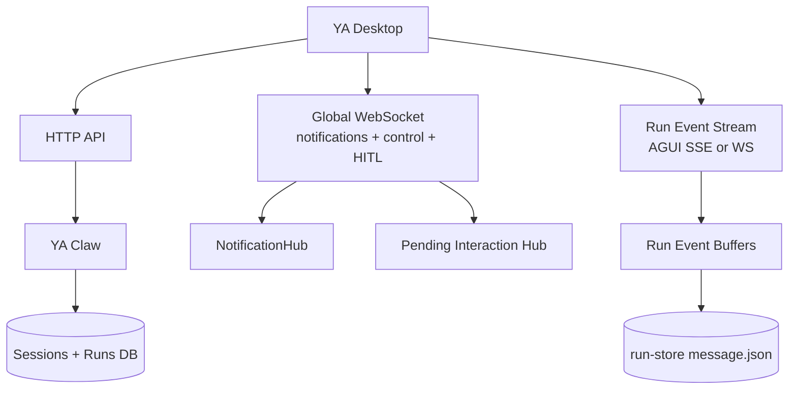
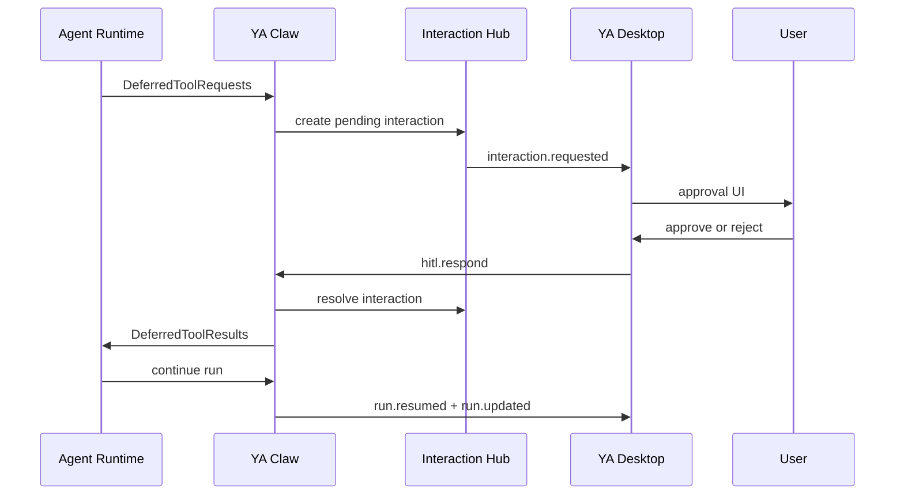

# 07. WebSocket Notifications and Desktop HITL

## Goal

YA Desktop should receive session and run lifecycle changes immediately, including background runs created by bridges, schedules, heartbeat, memory jobs, and other clients. Desktop should also become the primary interactive surface for human-in-the-loop decisions when a Claw runtime needs user approval.

Claw already has the right foundation:

- an in-process `NotificationHub` with replayable notification IDs
- a global SSE endpoint at `GET /api/v1/claw/notifications`
- per-run and per-session AGUI event streams
- durable session and run records
- SDK-level `DeferredToolRequests` and `UserInteraction` models for tool approval
- profile fields for `need_user_approve_tools` and `need_user_approve_mcps`

The desktop direction is to keep the existing SSE surfaces and add a WebSocket control surface that can carry lifecycle notifications, subscription commands, heartbeats, and HITL decisions over one long-lived connection.

## Transport Layers

Desktop should use three complementary runtime channels.



| Channel          | Direction        | Primary use                                                                                                  |
| ---------------- | ---------------- | ------------------------------------------------------------------------------------------------------------ |
| HTTP             | request/response | create sessions, create runs, inspect state, list resources, cancel, rerun                                   |
| Global WebSocket | bidirectional    | session state notifications, desktop tray updates, reconnect replay, HITL decisions, future RPC registration |
| Run event stream | server to client | detailed AGUI replay, assistant deltas, tool timeline, shell output, committed run replay                    |

The global WebSocket is the desktop app's always-on runtime connection. Per-run AGUI streams remain the focused chat rendering channel.

## WebSocket Endpoint

Recommended endpoint:

```http
GET /api/v1/claw/ws
```

Authentication should match the active Claw connection:

- local embedded Claw: bearer token generated during setup and stored in the OS keychain
- self-hosted Claw: bearer token or future scoped token
- cloud Claw: OAuth-derived runtime token

Desktop can send `Authorization: Bearer <token>` from the Tauri backend. Browser-oriented clients can use a short-lived WebSocket ticket minted by HTTP when header support is limited.

```http
POST /api/v1/claw/ws-ticket
GET /api/v1/claw/ws?ticket=...
```

The ticket should be single-use, short-lived, scoped to the authenticated principal, and logged as a derived credential.

## Protocol Envelope

Every WebSocket message should use a typed JSON envelope.

```ts
type ClawWsMessage =
  | ClientHello
  | ServerHello
  | SubscribeMessage
  | SubscribeAckMessage
  | NotificationMessage
  | RunEventMessage
  | HitlRespondMessage
  | ControlMessage
  | PingMessage
  | PongMessage
  | ErrorMessage;
```

Shared fields:

```json
{
  "type": "notification",
  "id": "42",
  "created_at": "2026-05-09T15:00:00Z",
  "payload": {}
}
```

The outer `id` is transport-level and monotonic within the WebSocket notification log. Domain IDs such as `session_id`, `run_id`, `interaction_id`, and `tool_call_id` live in `payload`.

## Handshake

Client hello:

```json
{
  "type": "hello",
  "client": {
    "name": "ya-desktop",
    "version": "0.1.0",
    "device_id": "dev_123",
    "connection_id": "local"
  },
  "resume": {
    "last_notification_id": "41"
  },
  "capabilities": {
    "hitl": true,
    "run_event_stream": true,
    "desktop_notifications": true
  }
}
```

Server hello:

```json
{
  "type": "hello.ack",
  "server": {
    "name": "ya-claw",
    "version": "0.4.0",
    "instance_id": "rt_abc"
  },
  "features": {
    "notifications": true,
    "notification_replay": true,
    "hitl": true,
    "run_event_stream": true
  },
  "replay": {
    "from_notification_id": "42",
    "gap": false
  }
}
```

If replay data has fallen out of the in-memory buffer, Claw should send `gap=true`. Desktop then refreshes `GET /api/v1/sessions`, active session details, and active run streams.

## Subscriptions

Desktop starts with a global subscription and can add scoped subscriptions as the UI focuses a session or run.

Subscribe request:

```json
{
  "type": "subscribe",
  "request_id": "sub_1",
  "scopes": [
    {"kind": "global"},
    {"kind": "session", "session_id": "session_123"},
    {"kind": "run", "run_id": "run_456"}
  ],
  "last_notification_id": "41",
  "last_run_event_ids": {
    "run_456": "9"
  }
}
```

Subscribe response:

```json
{
  "type": "subscribe.ack",
  "request_id": "sub_1",
  "accepted_scopes": [
    {"kind": "global"},
    {"kind": "session", "session_id": "session_123"},
    {"kind": "run", "run_id": "run_456"}
  ]
}
```

Scope filtering should happen server-side so Desktop can keep one socket open while avoiding unrelated high-volume run events.

## Notification Events

The existing `NotificationEvent` shape should become the canonical lifecycle event payload for SSE and WebSocket.

```json
{
  "id": "42",
  "type": "run.updated",
  "created_at": "2026-05-09T15:00:00Z",
  "payload": {
    "session_id": "session_123",
    "run_id": "run_456",
    "status": "running",
    "sequence_no": 4,
    "profile_name": "default",
    "termination_reason": null,
    "error_message": null
  }
}
```

Recommended desktop-facing lifecycle event set:

- `session.created`
- `session.updated`
- `session.deleted`
- `run.created`
- `run.updated`
- `run.waiting_for_user`
- `run.resumed`
- `run.cancelled`
- `run.interrupted`
- `interaction.requested`
- `interaction.updated`
- `interaction.resolved`
- `interaction.expired`
- `profile.created`
- `profile.updated`
- `profile.deleted`
- `schedule.fire.created`
- `schedule.fire.updated`
- `heartbeat.fire.created`
- `heartbeat.fire.updated`
- `bridge.event.accepted`
- `bridge.event.deduped`

`session.updated` should be published whenever the derived session status or pointers change: active run, head run, head success run, run count, memory state, or latest run summary.

## Session State Transfer

Desktop should maintain a local read model keyed by connection ID.

```ts
type DesktopSessionReadModel = {
  connectionId: string;
  sessionId: string;
  status: "idle" | "queued" | "running" | "waiting_for_user" | "completed" | "failed" | "cancelled";
  activeRunId?: string | null;
  headRunId?: string | null;
  headSuccessRunId?: string | null;
  latestRun?: RunSummary | null;
  pendingInteractions: PendingInteractionSummary[];
  lastNotificationId?: string;
};
```

Update rules:

1. `session.created` inserts the session row and selects it when the user created it from this desktop window.
2. `run.created` attaches the run to its session and sets queued status.
3. `run.updated` updates the latest run status and derived session status.
4. `run.waiting_for_user` shows an interaction prompt and marks the session as waiting.
5. `interaction.resolved` removes the prompt and marks the run as resumable.
6. terminal `run.updated` refreshes the run detail and committed message replay when the chat window is open.

Reconnect rules:

1. Reconnect the WebSocket with `last_notification_id`.
2. Apply replayed notifications in order.
3. When Claw reports a replay gap, refresh `GET /api/v1/sessions` and the currently selected `GET /api/v1/sessions/{session_id}?include_message=true&include_input_parts=true`.
4. Reattach active run event streams with `Last-Event-ID` or the WebSocket run-event cursor.

This gives Desktop immediate state movement between queued, running, waiting, and terminal UI states while preserving a simple HTTP refresh fallback.

## HITL Runtime Model

Desktop is the preferred HITL surface because it has native notifications, foreground windows, secure local keychain access, and OS-level affordances. Bridge surfaces can create or steer work, while Desktop owns approval prompts.



A pending interaction groups one or more deferred tool calls from the same agent turn.

```ts
type PendingInteraction = {
  id: string;
  kind: "tool_approval" | "external_tool_result";
  status: "pending" | "responded" | "expired" | "cancelled";
  session_id: string;
  run_id: string;
  sequence_no: number;
  profile_name?: string | null;
  requests: PendingToolRequest[];
  created_at: string;
  expires_at?: string | null;
};

type PendingToolRequest = {
  tool_call_id: string;
  tool_name: string;
  arguments: Record<string, unknown>;
  metadata?: Record<string, unknown> | null;
  presentation?: {
    title?: string;
    summary?: string;
    risk?: "low" | "medium" | "high";
    diff_preview?: string;
    command_preview?: string;
  };
};
```

Interaction requested notification:

```json
{
  "type": "interaction.requested",
  "payload": {
    "interaction_id": "int_123",
    "kind": "tool_approval",
    "session_id": "session_123",
    "run_id": "run_456",
    "status": "pending",
    "requests": [
      {
        "tool_call_id": "call_abc",
        "tool_name": "shell",
        "arguments": {"command": "make test"},
        "metadata": {"cwd": "/workspace"},
        "presentation": {
          "title": "Run shell command",
          "summary": "make test",
          "risk": "medium",
          "command_preview": "make test"
        }
      }
    ]
  }
}
```

Desktop response over WebSocket:

```json
{
  "type": "hitl.respond",
  "request_id": "resp_1",
  "interaction_id": "int_123",
  "run_id": "run_456",
  "responses": [
    {
      "tool_call_id": "call_abc",
      "approved": true,
      "reason": null,
      "user_input": null
    }
  ]
}
```

HTTP fallback:

```http
POST /api/v1/runs/{run_id}/interactions/{interaction_id}:respond
```

```json
{
  "responses": [
    {
      "tool_call_id": "call_abc",
      "approved": true,
      "reason": null,
      "user_input": null
    }
  ]
}
```

The response shape should map directly to the SDK `UserInteraction` model so Claw can construct `DeferredToolResults` through the shared runtime approval model.

## Run Status Semantics

Desktop needs a visible interactive state. The runtime can represent this in one of two compatible ways:

1. add `waiting_for_user` to `RunStatus` and `SessionStatus`
2. keep run status as `running` and expose `active_interactions` as an overlay field

The recommended long-term API shape is an explicit `waiting_for_user` status because tray notifications, session filters, and bridge status messages can use it directly.

```ts
type RunStatus =
  | "queued"
  | "running"
  | "waiting_for_user"
  | "completed"
  | "failed"
  | "cancelled";
```

`waiting_for_user` still has an active run task or resumable execution handle. The run returns to `running` after all pending interactions are resolved.

## Bridge-Triggered Runs

Bridge-triggered runs should publish the same notifications as API-triggered runs. When a Lark event creates a run and that run reaches HITL, Desktop receives `interaction.requested` and can present a native approval prompt.

Recommended behavior:

- Lark bridge posts a short status message when a run reaches `waiting_for_user`.
- Desktop shows a native notification and opens the relevant session on click.
- The user's decision is recorded in Claw with the desktop device ID and principal.
- Claw resumes the run and the bridge can post the final outcome through the agent's normal Lark tools.

This keeps bridge adapters lightweight and lets Desktop provide a richer approval experience.

## Persistence and Audit

Pending interactions should be durable enough to survive process restarts and client reconnects.

Recommended storage:

- `run_interactions` table for interaction headers
- `run_interaction_requests` JSON column or child table for deferred tool call details
- `run_interaction_responses` JSON column or child table for user decisions
- audit fields: `created_at`, `resolved_at`, `expires_at`, `resolved_by`, `resolved_via`, `device_id`

Run store checkpoints should include the AGUI replay up to the deferred point so Desktop can render context before asking the user.

## Security and Policy

HITL decisions should be explicit, scoped, and auditable.

- The decision payload includes the addressed `interaction_id` and `tool_call_id` values.
- Claw validates that the interaction belongs to the addressed active run.
- Responses are idempotent by `interaction_id` plus `tool_call_id`.
- A resolved or expired interaction rejects duplicate responses with a stable conflict response.
- Remote and cloud runtimes should record the authenticated principal.
- Local embedded runtimes should record the desktop device ID and OS user label.
- Approval UI should show workspace, execution location, tool name, command or diff preview, and profile.
- Future policy can add approve-once, approve-for-session, and trust-rule creation.

## Capability Discovery

`GET /api/v1/claw/info` or the future `GET /api/v1/capabilities` should expose the WebSocket and HITL surface.

```json
{
  "features": {
    "notifications": true,
    "notification_websocket": true,
    "notification_replay": true,
    "hitl": true,
    "hitl_websocket": true,
    "hitl_http_fallback": true,
    "waiting_for_user_status": true
  },
  "limits": {
    "notification_buffer_size": 1000,
    "interaction_timeout_seconds": 3600
  }
}
```

Desktop can use these flags to choose WebSocket, SSE fallback, or polling.

## Implementation Plan

### Claw

1. Keep `NotificationHub` as the event source for both SSE and WebSocket.
2. Add `GET /api/v1/claw/ws` with explicit WebSocket bearer or ticket authentication.
3. Add subscription filtering and replay cursors on top of `NotificationHub`.
4. Publish `session.updated` after run lifecycle transitions and memory state changes.
5. Add interaction state to runtime state and durable storage.
6. Teach `RunCoordinator` to catch SDK deferred tool requests, publish `interaction.requested`, wait for response, then resume with `DeferredToolResults`.
7. Add HTTP fallback for interaction responses.
8. Add tests for replay, reconnect gap handling, HITL approval, rejection, timeout, duplicate response, and bridge-triggered waiting state.

### Desktop

1. Add `ClawRealtimeClient` under `src/claw/`.
2. Connect the WebSocket after connection health and capability discovery.
3. Store `last_notification_id` per connection profile.
4. Maintain a session read model from notifications and refresh HTTP details on replay gaps.
5. Add tray notifications for terminal runs and pending interactions.
6. Add HITL approval cards in the chat window and compact launcher window.
7. Route notification clicks to the relevant session and run.
8. Reattach active run streams after reconnect.

### Compatibility

Existing clients can continue using SSE:

```http
GET /api/v1/claw/notifications
GET /api/v1/sessions/{session_id}/events
GET /api/v1/runs/{run_id}/events
```

Desktop should prefer WebSocket when `notification_websocket=true` and fall back to SSE plus HTTP response endpoints when needed.
