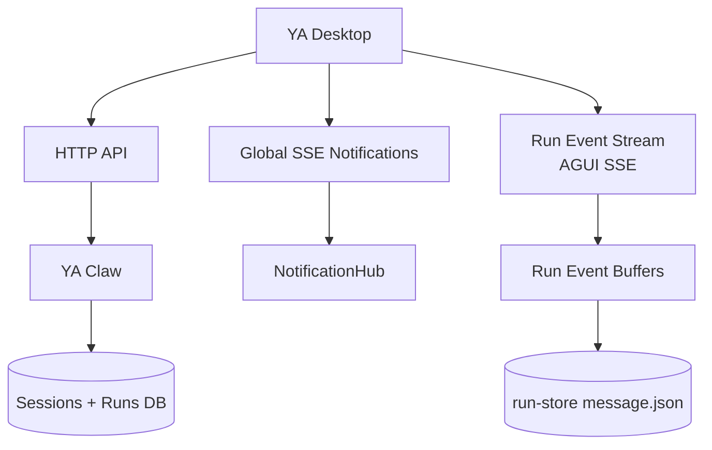
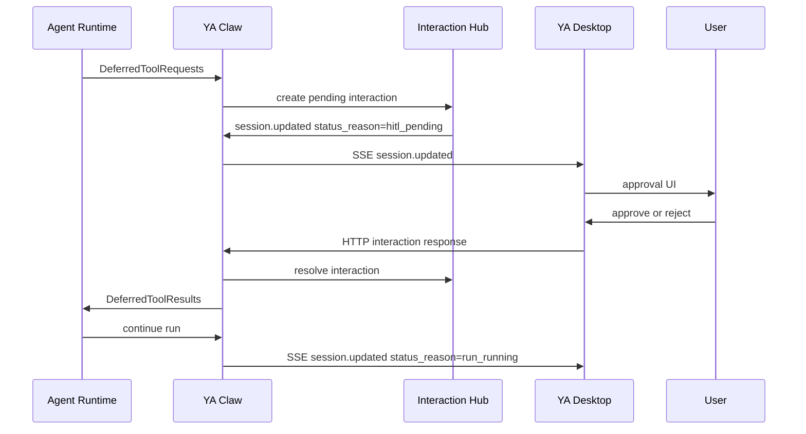

# 07. SSE Notifications and Desktop HITL

## Goal

YA Desktop should receive session and run lifecycle changes immediately, including background runs created by bridges, schedules, heartbeat, memory jobs, and other clients. Desktop should also become the primary interactive surface for human-in-the-loop decisions when a Claw runtime needs user approval.

Claw already has the right foundation:

- an in-process `NotificationHub` with replayable notification IDs
- a global SSE endpoint at `GET /api/v1/claw/notifications`
- per-run and per-session AGUI event streams
- durable session and run records
- SDK-level `DeferredToolRequests` and `UserInteraction` models for tool approval
- profile fields for `need_user_approve_tools` and `need_user_approve_mcps`

The desktop direction is to use SSE plus HTTP as the primary runtime contract. WebSocket remains a future control-plane expansion for device registration, RPC workspace transport, or high-volume bidirectional control.

## Transport Layers

Desktop should use three runtime channels.



| Channel          | Direction        | Primary use                                                                               |
| ---------------- | ---------------- | ----------------------------------------------------------------------------------------- |
| HTTP             | request/response | create sessions, create runs, inspect state, cancel, rerun, respond to HITL interactions  |
| Global SSE       | server to client | session state notifications, tray updates, reconnect replay, pending HITL indicators      |
| Run event stream | server to client | detailed AGUI replay, assistant deltas, tool timeline, shell output, committed run replay |

The global SSE stream is the desktop app's always-on runtime connection. Per-run AGUI streams remain the focused chat rendering channel.

## Capability Discovery

`GET /api/v1/claw/info` exposes the realtime and HITL surface.

```json
{
  "features": {
    "notifications": true,
    "notification_replay": true,
    "session_status_reasons": true,
    "hitl_status_reason": true,
    "session_events": true,
    "run_events": true
  }
}
```

Desktop uses these flags to choose the notification strategy and status rendering rules.

## Global Notifications

Desktop connects to the global notification stream after connection health and capability discovery.

```http
GET /api/v1/claw/notifications
Last-Event-ID: 41
Authorization: Bearer <token>
```

Each SSE event carries the canonical `NotificationEvent` shape.

```json
{
  "id": "42",
  "type": "session.updated",
  "created_at": "2026-05-09T15:00:00Z",
  "payload": {
    "session_id": "session_123",
    "status": "running",
    "status_reason": "hitl_pending",
    "status_detail": {
      "run_id": "run_456",
      "sequence_no": 4,
      "trigger_type": "bridge",
      "active_interaction_count": 1,
      "active_interactions": [
        {
          "interaction_id": "int_123",
          "kind": "tool_approval"
        }
      ]
    },
    "active_run_id": "run_456",
    "latest_run_id": "run_456"
  }
}
```

The outer `id` is the notification replay cursor. Domain IDs such as `session_id`, `run_id`, `interaction_id`, and `tool_call_id` live in `payload`.

## Session Status and Reasons

Desktop should render stable session states with explicit transition reasons.

```ts
type SessionStatus =
  | 'idle'
  | 'queued'
  | 'running'
  | 'completed'
  | 'failed'
  | 'cancelled'

type SessionStatusReason =
  | 'idle'
  | 'run_queued'
  | 'run_running'
  | 'hitl_pending'
  | 'run_completed'
  | 'run_failed'
  | 'run_cancelled'

type SessionStatusDetail = {
  run_id?: string
  sequence_no?: number
  trigger_type?: 'api' | 'bridge' | 'schedule' | 'heartbeat' | 'memory'
  termination_reason?: 'completed' | 'error' | 'cancel' | 'interrupt'
  error_message?: string
  active_interaction_count?: number
  active_interactions?: PendingInteractionSummary[]
}
```

HITL uses `status="running"` with `status_reason="hitl_pending"`. The run remains active while Claw waits for the user's decision, and Desktop uses `status_reason` to show approval UI, tray badges, and native notifications.

This keeps API status enums stable while giving Desktop enough context to distinguish normal execution from user-waiting execution.

## Recommended Notification Events

The lifecycle stream should include these desktop-facing events:

- `session.created`
- `session.updated`
- `session.deleted`
- `run.created`
- `run.updated`
- `interaction.requested`
- `interaction.updated`
- `interaction.resolved`
- `interaction.expired`
- `profile.created`
- `profile.updated`
- `profile.deleted`
- `schedule.fire.created`
- `schedule.fire.updated`
- `heartbeat.fire.created`
- `heartbeat.fire.updated`
- `bridge.event.accepted`
- `bridge.event.deduped`

`session.updated` should be published whenever the derived session state changes: active run, head run, head success run, run count, memory state, latest run summary, or `status_reason`.

Run events should also carry session status context for clients that process run notifications directly.

```json
{
  "type": "run.updated",
  "payload": {
    "session_id": "session_123",
    "run_id": "run_456",
    "status": "running",
    "sequence_no": 4,
    "profile_name": "default",
    "session_status": "running",
    "session_status_reason": "hitl_pending",
    "session_status_detail": {
      "run_id": "run_456",
      "sequence_no": 4,
      "trigger_type": "api",
      "active_interaction_count": 1
    }
  }
}
```

## Session Read Model

Desktop should maintain a local read model keyed by connection ID.

```ts
type DesktopSessionReadModel = {
  connectionId: string
  sessionId: string
  status: SessionStatus
  statusReason: SessionStatusReason
  statusDetail: SessionStatusDetail
  activeRunId?: string | null
  headRunId?: string | null
  headSuccessRunId?: string | null
  latestRun?: RunSummary | null
  pendingInteractions: PendingInteractionSummary[]
  lastNotificationId?: string
}
```

Update rules:

1. `session.created` inserts the session row and selects it when the user created it from this desktop window.
2. `run.created` attaches the run to its session and sets queued status.
3. `run.updated` updates the latest run status and session status context.
4. `session.updated` is the authoritative list-row update for status, status reason, pointers, and pending interaction indicators.
5. `status_reason="hitl_pending"` shows an approval prompt and marks the session as waiting for the user in UI copy.
6. `interaction.resolved` removes the prompt and refreshes the session row.
7. Terminal `run.updated` refreshes the run detail and committed message replay when the chat window is open.

Reconnect rules:

1. Reconnect SSE with `Last-Event-ID`.
2. Apply replayed notifications in order.
3. When Desktop detects a replay gap, refresh `GET /api/v1/sessions` and the selected `GET /api/v1/sessions/{session_id}?include_message=true&include_input_parts=true`.
4. Reattach active run event streams with `Last-Event-ID`.

This gives Desktop immediate movement between queued, running, HITL, and terminal UI states while preserving a simple HTTP refresh path.

## HITL Runtime Model

Desktop is the preferred HITL surface because it has native notifications, foreground windows, secure local keychain access, and OS-level affordances. Bridge surfaces can create or steer work, while Desktop owns approval prompts.



A pending interaction groups one or more deferred tool calls from the same agent turn.

```ts
type PendingInteraction = {
  id: string
  kind: 'tool_approval' | 'external_tool_result'
  status: 'pending' | 'responded' | 'expired' | 'cancelled'
  session_id: string
  run_id: string
  sequence_no: number
  profile_name?: string | null
  requests: PendingToolRequest[]
  created_at: string
  expires_at?: string | null
}

type PendingToolRequest = {
  tool_call_id: string
  tool_name: string
  arguments: Record<string, unknown>
  metadata?: Record<string, unknown> | null
  presentation?: {
    title?: string
    summary?: string
    risk?: 'low' | 'medium' | 'high'
    diff_preview?: string
    command_preview?: string
  }
}
```

Interaction requested notification:

```json
{
  "type": "interaction.requested",
  "payload": {
    "interaction_id": "int_123",
    "kind": "tool_approval",
    "session_id": "session_123",
    "run_id": "run_456",
    "status": "pending",
    "requests": [
      {
        "tool_call_id": "call_abc",
        "tool_name": "shell",
        "arguments": { "command": "make test" },
        "metadata": { "cwd": "/workspace" },
        "presentation": {
          "title": "Run shell command",
          "summary": "make test",
          "risk": "medium",
          "command_preview": "make test"
        }
      }
    ]
  }
}
```

HTTP response endpoint:

```http
POST /api/v1/runs/{run_id}/interactions/{interaction_id}:respond
```

```json
{
  "responses": [
    {
      "tool_call_id": "call_abc",
      "approved": true,
      "reason": null,
      "user_input": null
    }
  ]
}
```

The response shape should map directly to the SDK `UserInteraction` model so Claw can construct `DeferredToolResults` through the shared runtime approval model.

## Bridge-Triggered Runs

Bridge-triggered runs should publish the same session and run notifications as API-triggered runs. When a Lark event creates a run and that run reaches HITL, Desktop receives `session.updated` with `status_reason="hitl_pending"` and presents a native approval prompt.

Recommended behavior:

- Lark bridge posts a short status message when a run reaches HITL.
- Desktop shows a native notification and opens the relevant session on click.
- The user's decision is recorded in Claw with the desktop device ID and principal.
- Claw resumes the run and publishes `session.updated` with `status_reason="run_running"`.
- The agent posts the final outcome through its normal Lark tools.

This keeps bridge adapters lightweight and lets Desktop provide a richer approval experience.

## Persistence and Audit

Pending interactions should be durable enough to survive process restarts and client reconnects.

Recommended storage:

- `run_interactions` table for interaction headers
- `run_interaction_requests` JSON column or child table for deferred tool call details
- `run_interaction_responses` JSON column or child table for user decisions
- audit fields: `created_at`, `resolved_at`, `expires_at`, `resolved_by`, `resolved_via`, `device_id`

Run store checkpoints should include the AGUI replay up to the deferred point so Desktop can render context before asking the user.

## Security and Policy

HITL decisions should be explicit, scoped, and auditable.

- The decision payload includes the addressed `interaction_id` and `tool_call_id` values.
- Claw validates that the interaction belongs to the addressed active run.
- Responses are idempotent by `interaction_id` plus `tool_call_id`.
- A resolved or expired interaction returns a stable conflict response for duplicate responses.
- Remote and cloud runtimes record the authenticated principal.
- Local embedded runtimes record the desktop device ID and OS user label.
- Approval UI shows workspace, execution location, tool name, command or diff preview, and profile.
- Future policy can add approve-once, approve-for-session, and trust-rule creation.

## Implementation Plan

### Claw

1. Keep `NotificationHub` as the event source for SSE.
2. Publish `session.updated` after run lifecycle transitions, memory state changes, and HITL interaction state changes.
3. Add `status_reason` and `status_detail` to session summaries and notification payloads.
4. Use `status="running"` plus `status_reason="hitl_pending"` for pending HITL interactions.
5. Add durable interaction state and response records.
6. Teach `RunCoordinator` to catch SDK deferred tool requests, publish `interaction.requested`, wait for response, then resume with `DeferredToolResults`.
7. Add HTTP response endpoint for interaction decisions.
8. Add tests for replay, reconnect refresh, HITL approval, rejection, timeout, duplicate response, and bridge-triggered HITL status reason.

### Desktop

1. Add `ClawRealtimeClient` under `src/claw/` for global SSE notifications.
2. Connect SSE after connection health and capability discovery.
3. Store `last_notification_id` per connection profile.
4. Maintain a session read model from `session.updated` notifications and refresh HTTP details on replay gaps.
5. Add tray notifications for terminal runs and pending HITL interactions.
6. Add HITL approval cards in the chat window and compact launcher window.
7. Route notification clicks to the relevant session and run.
8. Reattach active run streams after reconnect.

### Future WebSocket Control Plane

WebSocket becomes useful when Desktop needs bidirectional runtime control beyond approval POSTs, including:

- remote RPC workspace registration
- local device presence and capability registration
- multiplexed high-volume run streams
- cloud edge gateway transport
- long-lived control messages that need client-to-server push

The future WebSocket surface should carry the same notification payloads and reuse `status_reason` semantics from the SSE contract.
