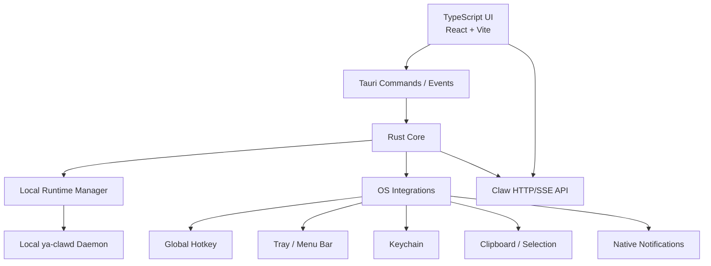

# 08. UI Technology Decision

## Decision

YA Desktop should use Tauri 2 + TypeScript UI + Rust Core.

This keeps the native desktop advantages that matter for YA Desktop: small packaging footprint compared with Electron-style apps, fast startup, OS-native process ownership, tray/menu bar control, global hotkeys, keychain access, filesystem and process management, local sidecar lifecycle, and future local RPC workspace tools.

The TypeScript UI layer should be a new Desktop product experience. It should reuse Claw APIs and runtime concepts, while defining its own IA around Home, Chats, Board, Spaces, Inbox, and Settings.

## Product Requirements Driving the Choice

YA Desktop needs rich interactive UI:

- streaming chat and AGUI replay
- markdown and code blocks
- shell output
- file diffs
- artifact previews
- tool-call timeline
- approval cards
- workspace file tree
- settings forms
- notification inbox
- screenshots and future voice controls

YA Desktop also needs strong native system integration:

- sidecar lifecycle
- tray/menu bar
- global hotkeys
- keychain secrets
- clipboard and selected text context
- screenshots and active window context
- native notifications
- local diagnostics and logs
- future local RPC workspace tools

Tauri 2 + TypeScript UI + Rust Core gives the best balance between product iteration speed and native desktop capability.

## Options Considered

| Option                              | Assessment                                                                                                                                              |
| ----------------------------------- | ------------------------------------------------------------------------------------------------------------------------------------------------------- |
| Tauri 2 + TypeScript UI + Rust Core | Recommended. Strong native shell, strong UI ecosystem, practical packaging and performance advantages.                                                  |
| Tauri 2 + Rust/WASM UI              | Viable for language unification. Still uses WebView rendering, with higher UI ecosystem cost for markdown, diff, and rich chat surfaces.                |
| Slint                               | Strong native UI option for compact command center, settings, and status surfaces. Rich chat, markdown, diff, and timeline UI require more custom work. |
| Iced                                | Strong pure Rust app architecture. Good long-term control. Higher product UI implementation cost.                                                       |
| egui / eframe                       | Excellent for developer tools and diagnostics. Higher cost for a polished consumer-grade workspace UI.                                                  |
| Dioxus                              | Promising Rust UI option. Desktop ecosystem and integration maturity need product-specific validation before adoption.                                  |

## Architecture Split

## Rust Core Responsibilities

- app-managed `uv` runtime installation
- local `ya-clawd` process lifecycle
- local runtime data directory initialization
- local token generation and keychain storage
- tray/menu bar integration
- global hotkey registration
- clipboard, selected text, screenshot, and active app context capture
- native notifications
- log collection and diagnostics export
- future local RPC workspace file and shell tools

## TypeScript UI Responsibilities

- Home command input and recent chat overview
- Chats conversation list and chat work surface
- Board kanban organization over chats
- Spaces workspace folder and runtime location management
- Inbox approvals and alerts
- Settings preferences and advanced runtime controls
- markdown, code, diff, timeline, artifact, and settings UI
- state management over Claw HTTP/SSE streams

## Advanced Runtime Positioning

Advanced Runtime exists as an operational surface for users who need runtime control. It should include profiles, schedules, bridges, heartbeat, logs, diagnostics, runtime instances, storage, and workspace provider metadata.

Advanced Runtime should support the Desktop product experience from Settings while the primary navigation stays centered on conversations, boards, spaces, and user decisions.

## Current Implementation Decision

Keep the current Tauri 2 project skeleton and the white ChatGPT-like TypeScript UI direction. The Desktop product model is conversation-first: Chats are primary, Board organizes chats, Spaces represent workspace folders and runtime location, Inbox handles decisions, and Settings contains advanced runtime controls.
