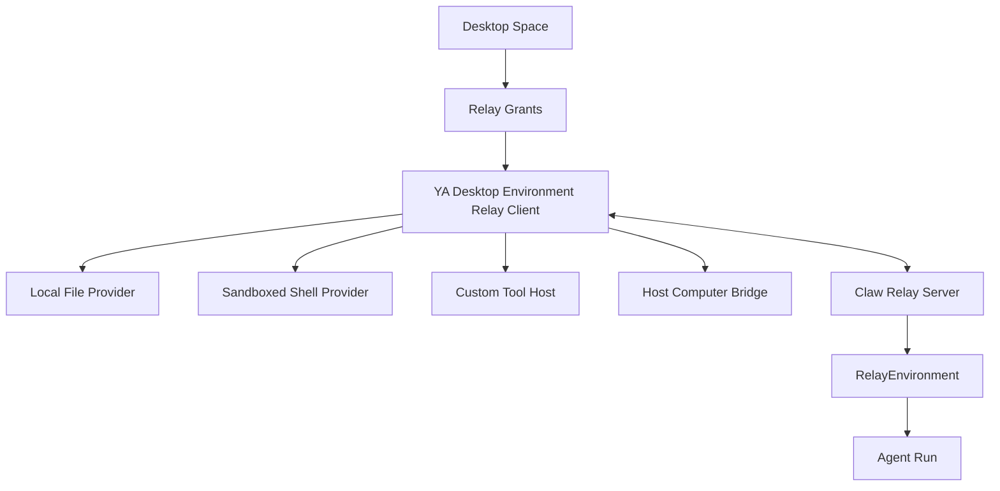
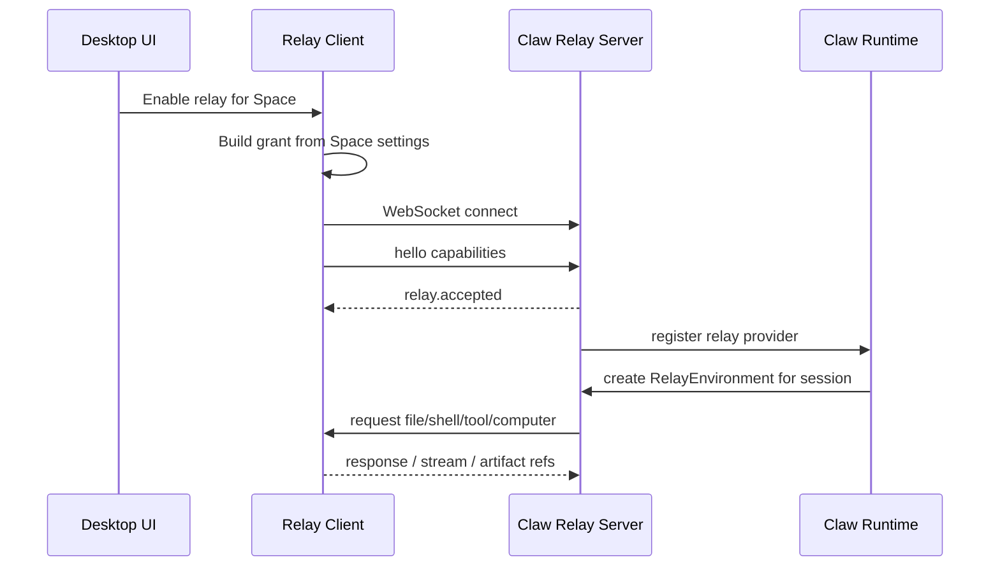

# 09. Desktop Environment Relay Integration

## Goal

YA Desktop should implement a YA Environment Relay client that exposes local desktop capabilities to Claw runtimes. The generic protocol is defined in `packages/ya-environment-relay/spec/`. This document covers the Desktop product integration: Spaces, local grants, provider lifecycle, diagnostics, and UX.

## Protocol Dependency

Desktop Environment Relay uses `ya-environment-relay.v1`:

- [YA Environment Relay Overview](../../../packages/ya-environment-relay/spec/01-overview.md)
- [Protocol](../../../packages/ya-environment-relay/spec/02-protocol.md)
- [Relay Environment](../../../packages/ya-environment-relay/spec/03-environment.md)
- [Security and Policy](../../../packages/ya-environment-relay/spec/04-security-and-policy.md)
- [Implementation Plan](../../../packages/ya-environment-relay/spec/05-implementation-plan.md)

Desktop acts as a relay client. Claw acts as a relay server and maps accepted capabilities into a relay-backed Environment.

## Desktop Capability Families

YA Desktop should expose these capabilities through relay:

- `fileops`: selected local folders represented as Space roots.
- `shell`: sandboxed local shell bound to approved roots.
- `tools`: Desktop-managed custom tools and local extension tools.
- `computer`: Host Computer Bridge for screen capture, accessibility, and input.
- `artifacts`: upload support for screenshots, file outputs, and tool artifacts.

## Product Model



A Space owns the local trust decision. The user chooses folders, shell enablement, custom tools, computer use, and artifact upload policy for that Space.

## Space Configuration

```ts
type DesktopRelaySpaceSettings = {
  enabled: boolean
  connection_id: string
  client_id: string
  roots: RelayRootSetting[]
  shell_enabled: boolean
  custom_tools_enabled: boolean
  computer_use_enabled: boolean
  approval_policy_id: string
  artifact_upload_policy: 'ask' | 'allow_for_run' | 'allow_for_space'
}

type RelayRootSetting = {
  root_id: string
  label: string
  local_path: string
  virtual_path: string
  mode: 'ro' | 'rw'
}
```

## Connection Flow



## Local Providers

Desktop should implement local providers behind the relay client:

```text
apps/ya-desktop/src-tauri/src/relay/
  client.rs
  grants.rs
  providers.rs
  artifacts.rs

apps/ya-desktop/src-tauri/src/local_providers/
  file_provider.rs
  shell_provider.rs
  tool_provider.rs
  computer_provider.rs
```

The frontend should implement settings and diagnostics:

```text
apps/ya-desktop/src/features/relay/
  RelaySettingsPanel.tsx
  RelayConnectionStatus.tsx
  RelayDiagnostics.tsx
  relayModels.ts
```

## Custom Tools

Desktop custom tools are configured locally and advertised through YA Environment Relay `tool.register` / `tool.list`. Examples:

- open file in local editor.
- copy text to clipboard.
- read selected text from active app.
- create a calendar draft.
- run a trusted local script.

Each custom tool should show source, risk level, and approval policy in Settings.

## Remote Claw Mode

For remote Claw connections, Desktop initiates the WebSocket connection. The user's machine does not need inbound networking.

Remote connection UX should show:

- runtime identity.
- active Space.
- granted folders.
- enabled capabilities.
- artifact upload policy.
- active run using relay.

The user can revoke a remote relay connection from Spaces, Chats, tray, or Settings.

## Local Claw Mode

Local embedded Claw can use the same relay protocol. This keeps fileops, shell, custom tools, and computer use on one execution path across local and remote runtimes.

```text
YA Desktop -> local ya-clawd relay WebSocket -> YA Desktop providers
```

A loopback HTTP provider can exist for early prototypes, but the product model should converge on `ya-environment-relay.v1`.

## Desktop UX

Desktop should render relay state in:

- Spaces: root grants, capability toggles, connection status.
- Chats: active relay usage, shell streams, computer monitor, artifact cards.
- Inbox: approval cards for shell, custom tools, and computer actions.
- Settings: relay tokens, diagnostics, logs, default policies.
- Tray: active relay, paused relay, approval waiting, remote runtime active.

## Implementation Order

1. Add Desktop relay settings model and mock connection state.
2. Implement YA Environment Relay WebSocket client against a mock server.
3. Connect to Claw relay endpoint.
4. Add file provider for read/list/stat.
5. Add shell provider with streaming and cancel.
6. Add custom tool provider.
7. Add artifact upload support.
8. Add computer provider through Host Computer Bridge.
