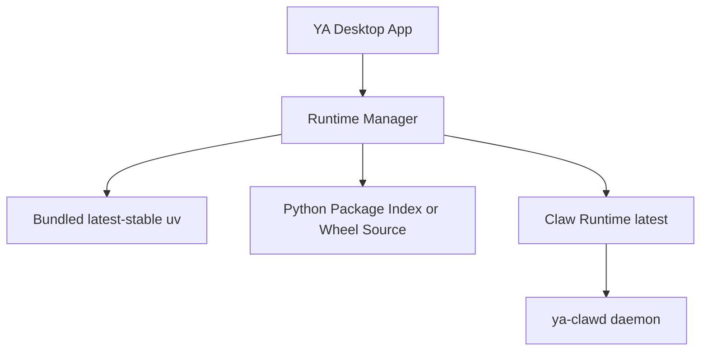
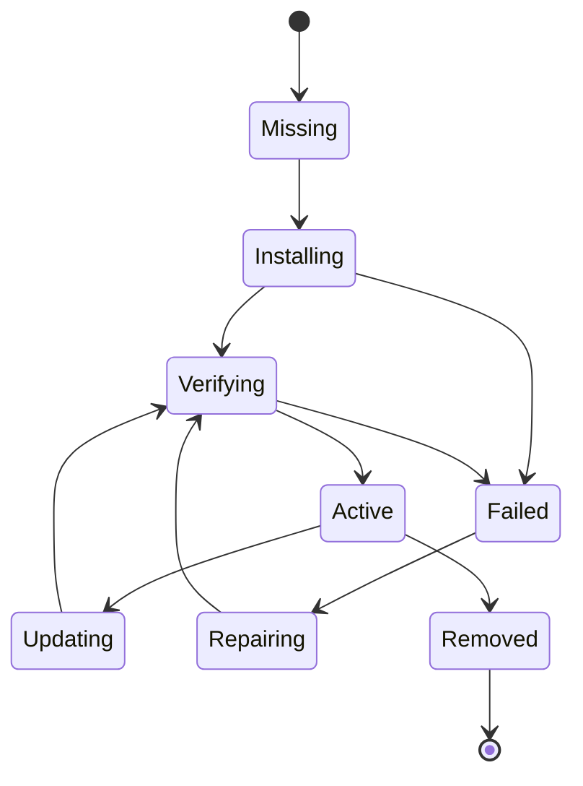
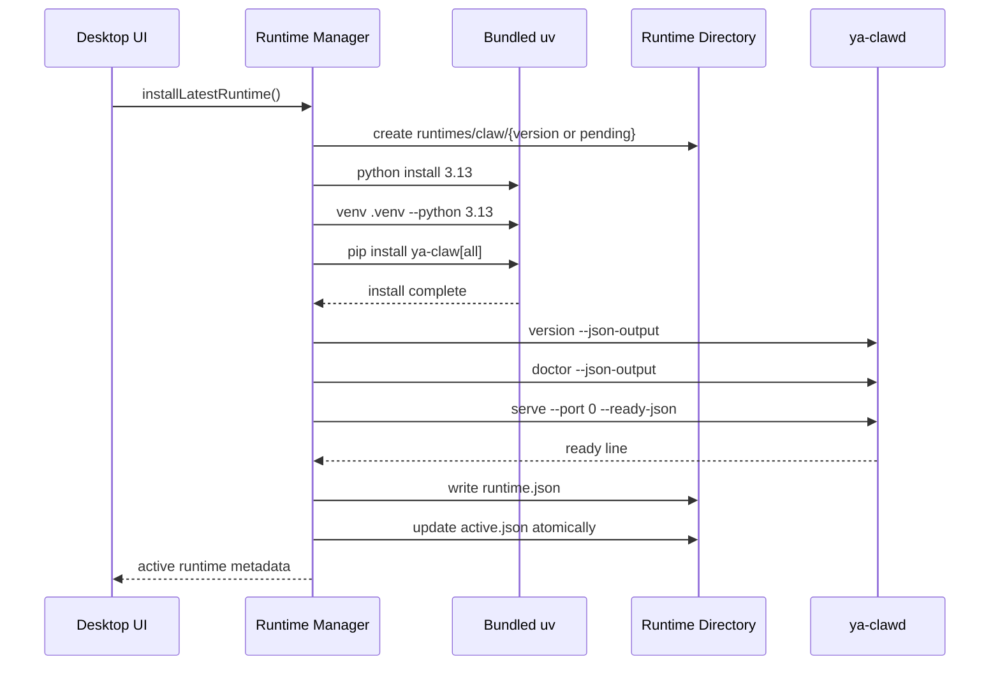

# 10. Runtime Manager and Updates

## Goal

YA Desktop separates Desktop app updates from Claw runtime updates while keeping the runtime update policy simple.

Desktop owns the native shell, UI, bundled latest-stable `uv`, runtime installation, diagnostics, and update controls. Claw owns the Python service, API compatibility, execution engine, workspace providers, database migrations, memory jobs, and agent capabilities.

The default product behavior is to keep the local Claw runtime on the latest compatible release and rely on runtime verification plus rollback for safety.

## Update Domains



Desktop app update:

- Delivered by Tauri updater in the release-channel phase together with signing.
- Updates UI, native capabilities, Runtime Manager, bundled `uv`, keychain integrations, tray, notifications, and desktop-level settings.
- Uses Desktop version numbers such as `0.1.0`.
- Before Desktop app auto-update ships, users can build and install unsigned local Desktop artifacts from a cloned repository with `make desktop-install-local`.

Claw runtime update:

- Delivered by Runtime Manager through bundled `uv`.
- Installs Python, virtualenv, Claw packages, and dependencies into app data.
- Defaults to the latest compatible `ya-claw[all]` release.
- Keeps previous active runtime metadata and files for rollback.

## Bundled `uv`

YA Desktop bundles the latest stable `uv` binary available at Desktop release time. CI uses the same uv version by default.

Runtime Manager copies bundled `uv` into app data on first launch and uses that copy for all runtime operations.

Advanced settings can allow developers to select a system or custom `uv` path for diagnostics and local development. Product installs use bundled `uv` by default.

Runtime Manager sets these environment variables for every `uv` command:

```bash
UV_CACHE_DIR="$APP_DATA/uv/cache"
UV_PYTHON_INSTALL_DIR="$APP_DATA/uv/python"
UV_LINK_MODE=copy
```

## Default Runtime Update Policy

Runtime Manager follows a latest-first policy:

1. Install latest `ya-claw[all]` on first launch.
2. Check for a newer Claw runtime after Desktop startup and then at most once every 24 hours.
3. Install the newer runtime into a candidate directory.
4. Run compatibility and health verification.
5. Mark the verified candidate as `updateReady`.
6. Switch `active.json` when the user restarts local Claw to apply the update.
7. Keep the previous active runtime metadata and files for rollback.

The first implementation can use PyPI package resolution directly:

```bash
"$APP_UV" pip install \
  --python "$RUNTIME/.venv/bin/python" \
  --upgrade \
  "ya-claw[all]"
```

A package index, GitHub Release wheel URL, or enterprise mirror can be added as a configuration value later.

Auto-update state is stored in `runtimes/claw/update-state.json`:

```json
{
  "lastCheckedAt": 1778644000,
  "nextCheckAfter": 1778730400,
  "checkInProgress": false,
  "updateReady": true,
  "candidate": {
    "version": "0.74.0",
    "entrypoint": "/.../runtimes/claw/candidate-1778644000/.venv/bin/ya-clawd",
    "contract": "claw-desktop.v1"
  },
  "lastError": null,
  "lastLogFile": "/.../runtimes/claw/logs/candidate-1778644000.log",
  "autoUpdateEnabled": true
}
```

## Runtime Compatibility Contract

Claw reports Desktop compatibility through `ya-clawd version --json-output`.

Example payload:

```json
{
  "name": "ya-clawd",
  "version": "0.73.1",
  "service_revision": "0.73.1+abc123",
  "desktop_compatibility": {
    "contract": "claw-desktop.v1"
  }
}
```

Desktop checks:

- `contract` matches a supported Desktop client contract.
- `doctor`, serve readiness, `/healthz`, and `/api/v1/claw/info` pass.

This keeps compatibility close to Claw. Runtime Manager only needs the installed runtime to self-describe and pass verification. Python compatibility is handled by package metadata and uv resolution before the runtime is installed.

## Runtime States



State definitions:

- `missing`: no runtime is installed.
- `installing`: Runtime Manager is creating Python, venv, and package installation.
- `verifying`: compatibility, doctor, and serve smoke are running.
- `active`: selected runtime used by Local Claw lifecycle.
- `updating`: Runtime Manager is installing the latest Claw into a new directory.
- `failed`: install or verification failed; install logs are available.
- `repairing`: Runtime Manager is reinstalling a failed or corrupted runtime.
- `removed`: runtime directory is deleted after it is inactive.

## Install Flow



Install command shape:

```bash
UV_CACHE_DIR="$APP_DATA/uv/cache" \
UV_PYTHON_INSTALL_DIR="$APP_DATA/uv/python" \
"$APP_DATA/uv/bin/uv" python install 3.13

UV_CACHE_DIR="$APP_DATA/uv/cache" \
UV_PYTHON_INSTALL_DIR="$APP_DATA/uv/python" \
"$APP_DATA/uv/bin/uv" venv "$APP_DATA/runtimes/claw/pending/.venv" --python 3.13

UV_CACHE_DIR="$APP_DATA/uv/cache" \
"$APP_DATA/uv/bin/uv" pip install \
  --python "$APP_DATA/runtimes/claw/pending/.venv/bin/python" \
  "ya-claw[all]"
```

After `ya-clawd version --json-output` returns the resolved Claw version, Runtime Manager can rename or record the pending directory as that version.

## Activation and Rollback

Runtime activation is an atomic metadata update.

Activation steps:

1. Verify target runtime.
2. Stop current local `ya-clawd` process.
3. Save previous `active.json` as `previous-active.json`.
4. Write new `active.json` through a temporary file and rename.
5. Start new runtime.
6. Keep previous runtime installed for rollback.

Rollback steps:

1. Stop current local `ya-clawd` process.
2. Restore `previous-active.json` to `active.json`.
3. Start previous runtime.
4. Mark failed runtime as `failed` with verification logs.

Database migrations run under the selected Claw runtime. Runtime Manager records migration outcome before switching the runtime into normal service.

## Tauri Command Surface

Runtime Manager commands:

```rust
get_runtime_manager_status()
install_latest_claw_runtime()
update_claw_runtime()
check_claw_runtime_update()
apply_ready_claw_runtime_update()
select_claw_runtime(version: String)
remove_claw_runtime(version: String)
repair_claw_runtime(version: String)
get_runtime_install_log(version: String)
```

Local daemon commands:

```rust
get_local_claw_status()
start_local_claw()
stop_local_claw()
restart_local_claw()
get_local_claw_launch_config()
update_local_claw_launch_config(config: LocalClawLaunchConfig)
reset_local_claw_launch_config()
import_local_claw_launch_preset(raw: String)
```

`start_local_claw()` reads `runtimes/claw/active.json`, reads `local-claw/launch-config.json`, and launches the active `entrypoint` with Desktop-managed startup environment variables.

Launch config shape:

```json
{
  "presetName": "Desktop default",
  "agencyEnabled": true,
  "memoryEnabled": true,
  "env": [
    {
      "key": "YA_CLAW_AGENCY_TIMER_INTERVAL_SECONDS",
      "value": "3600"
    }
  ]
}
```

Desktop always manages `YA_CLAW_API_TOKEN` itself. Presets can provide JSON or dotenv-style environment variables. `YA_CLAW_AGENCY_ENABLED` and `YA_CLAW_MEMORY_ENABLED` map to first-class toggle fields so the Settings UI can keep Agency and Memory visible.

## UI Surfaces

Settings > Runtime:

- Desktop version.
- Active Claw version.
- Latest check status.
- Runtime install/update progress.
- Runtime path.
- Python version.
- uv version and path.
- Auto-update status, last check time, candidate version, update-ready state, and failure logs.
- Launch preset import, Agency and Memory startup toggles, and editable Local Claw startup environment variables.
- Update, repair, restart-to-apply, rollback, and remove actions.

Spaces:

- Local runtime connection state.
- Local workspace execution location.
- Sandbox provider and capabilities.
- Trust status for each workspace.

Inbox:

- Runtime install failures.
- Migration prompts.
- Update approvals.
- Repair suggestions.

## Offline Behavior

Desktop can start offline when an active runtime exists.

Offline rules:

- Start active runtime from `active.json`.
- Defer update checks.
- Surface runtime status and logs normally.
- Queue runtime update attempts for the next online check.

First launch requires network access when the installer ships without a preinstalled Claw runtime.

## CI Requirements

Runtime CI:

- Build and publish Python packages or wheels for the workspace packages used by Claw.
- Verify latest `ya-claw[all]` installs through bundled/current CI `uv`.
- Smoke `ya-clawd version`, `doctor`, `serve --port 0`, `/healthz`, and `/api/v1/claw/info`.
- Validate `desktop_compatibility.contract` in `ya-clawd version --json-output`.

Desktop CI:

- Build Tauri shell with bundled latest-stable `uv` resource.
- Run Runtime Manager tests with a temporary app data directory.
- Install latest Claw through the same command path used by the app.
- Verify runtime activation, auto-update candidate metadata, restart-to-apply flow, and rollback metadata.
- Produce unsigned artifacts by default.
- Sign platform release artifacts in the same release-channel phase as Desktop app auto-update.

## Initial Implementation Plan

Phase 1: Runtime Manager foundation

- Bundle latest stable `uv` binary into YA Desktop resources.
- Copy bundled `uv` into app data on first launch.
- Create runtime directory layout and metadata structs.
- Implement install latest, status, select, and log commands.
- Launch active runtime with existing Local Claw lifecycle.

Phase 2: latest update flow

- Add latest runtime check through package source resolution.
- Add background update checks.
- Add compatibility verification from `ya-clawd version --json-output`.
- Add rollback after failed verification.

Phase 3: UI and diagnostics

- Add Settings > Runtime page.
- Add launch preset import and startup environment variable UI.
- Add install/update progress UI.
- Add repair and rollback actions.
- Add first-launch onboarding for runtime installation.

Phase 4: hardening

- Add OS keychain token storage.
- Add optional package source configuration.
- Add cache pruning.
- Add migration safety and rollback tests.
- Add native sandbox provider capability metadata.
