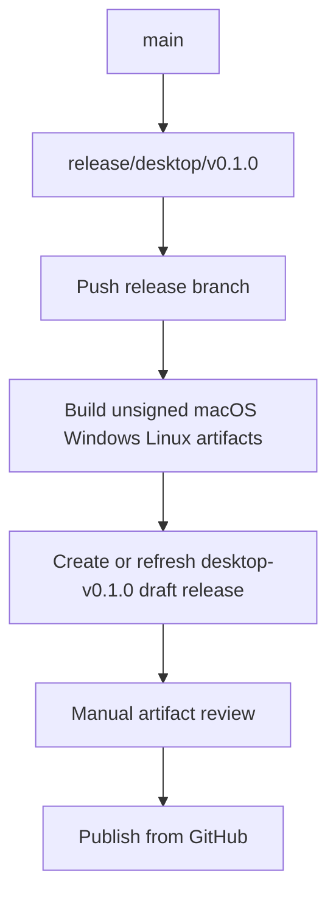
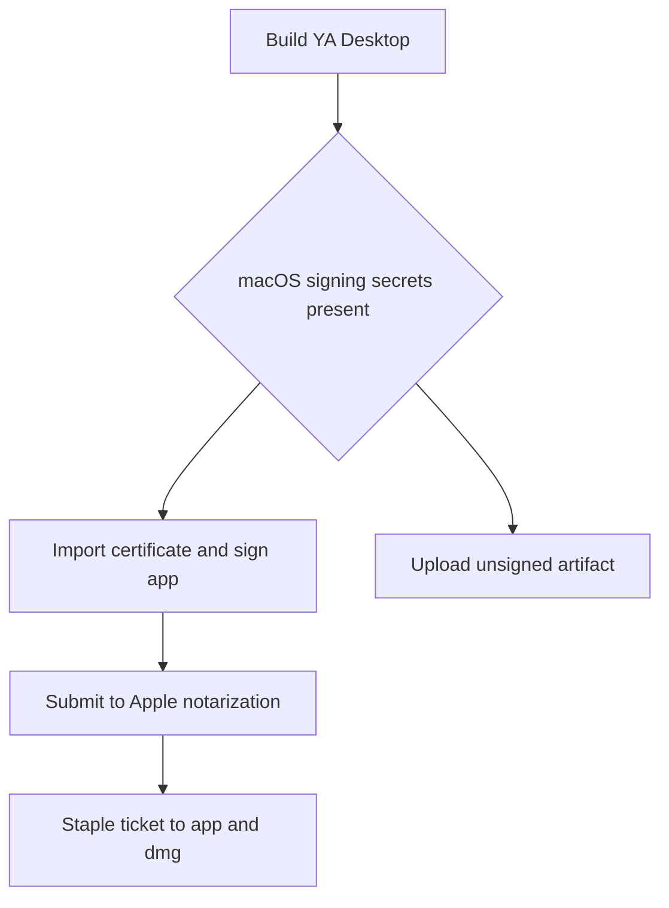

# 11. Signing and Release

## Goal

YA Desktop release builds support unsigned development artifacts by default and signed distribution artifacts when platform credentials are configured.

Signing is platform-specific. CI builds the same app on all targets, checks whether signing secrets are present, and enables signing only for the matching platform release job.

## Default Policy

- Local development builds are unsigned.
- Pull request CI builds are unsigned.
- Main branch CI builds can produce unsigned artifacts for internal testing.
- Pushes to `release/desktop/**` create or refresh unsigned GitHub draft releases tagged as `desktop-v*`.
- Humans review draft artifacts and publish from GitHub when ready.
- Signing and Desktop app auto-update ship together in the release-channel phase.
- Tauri updater signing uses a separate keypair from OS code signing.

Unsigned local builds are the default install path before release channels are ready. Users can clone the repository, build/install YA Desktop locally, and receive ongoing Claw runtime updates through Runtime Manager.

## Unsigned Draft Release Flow



Release branch naming:

```text
release/desktop/v0.1.0
release/desktop/v0.1.0-alpha.1
release/desktop/v0.1.0-beta.1
```

Every push to the same release branch refreshes the same draft release and overwrites release assets. Published releases use a new version branch and tag.

Current draft artifacts are unsigned. Draft release notes record remaining release-channel work:

- macOS Developer ID signing, notarization, and stapling.
- Windows Authenticode signing.
- Tauri updater plugin and updater artifact signatures.
- `desktop-release-index` latest.json generation after publish.

Python package releases use tags such as `v0.73.1`. Desktop app releases use tags such as `desktop-v0.1.0`, and the package release workflow ignores `desktop-v*` tags.

## Platform Requirements

| Platform      | Development default                   | Release signing                                                           | CI secret shape                                                    |
| ------------- | ------------------------------------- | ------------------------------------------------------------------------- | ------------------------------------------------------------------ |
| macOS         | unsigned `.app`/`.dmg`                | Developer ID Application signing plus notarization                        | base64 `.p12`, certificate password, Apple ID credentials, Team ID |
| Windows       | unsigned `.msi`/`.exe`                | Authenticode signing with PFX/certificate store or cloud signing provider | base64 `.pfx`, PFX password, optional timestamp URL                |
| Linux         | unsigned AppImage/deb/rpm             | optional GPG signing for packages or repository metadata                  | GPG private key, passphrase, key ID                                |
| Tauri updater | disabled until release channel exists | Ed25519 updater signature                                                 | `TAURI_SIGNING_PRIVATE_KEY`, optional password                     |

## macOS Signing

Local release signing requires an Apple Developer account and a Developer ID Application certificate installed in the login keychain.

Recommended local environment:

```bash
export APPLE_SIGNING_IDENTITY="Developer ID Application: Your Name (TEAMID)"
export APPLE_TEAM_ID="TEAMID"
export APPLE_ID="release@example.com"
export APPLE_PASSWORD="app-specific-password"
```

CI secrets:

```text
APPLE_CERTIFICATE              # base64 encoded .p12
APPLE_CERTIFICATE_PASSWORD     # .p12 import password
APPLE_SIGNING_IDENTITY         # Developer ID Application identity
APPLE_ID                       # Apple account email
APPLE_PASSWORD                 # app-specific password
APPLE_TEAM_ID                  # Apple team identifier
```

CI flow:



Tauri can read signing identity and notarization values from environment variables in the release workflow. The workflow imports the `.p12` into a temporary keychain and deletes the keychain after packaging.

## Windows Signing

Windows release signing uses Authenticode. The practical first path is a PFX certificate imported into the CI signing step, with SHA-256 digest and trusted timestamp.

Recommended CI secrets:

```text
WINDOWS_CERTIFICATE            # base64 encoded .pfx
WINDOWS_CERTIFICATE_PASSWORD   # PFX password
WINDOWS_SIGNING_TIMESTAMP_URL  # e.g. http://timestamp.digicert.com
```

Local signing can use a certificate in the Windows certificate store or a local PFX path. Release CI signs `.exe`, `.msi`, and updater artifacts after Tauri packaging.

## Linux Signing

Linux desktop artifacts can be distributed unsigned for direct downloads during early releases. For package repositories, sign repository metadata and packages with GPG.

Recommended CI secrets for repository signing:

```text
LINUX_GPG_PRIVATE_KEY
LINUX_GPG_PASSPHRASE
LINUX_GPG_KEY_ID
```

AppImage direct downloads can ship with checksums. Debian or rpm repositories should publish signed metadata for production channels.

## Tauri Updater Signing

Tauri updater signing is separate from OS code signing. It uses an Ed25519 keypair that signs update manifests and artifacts.

CI secrets when updater is enabled:

```text
TAURI_SIGNING_PRIVATE_KEY
TAURI_SIGNING_PRIVATE_KEY_PASSWORD
```

The public updater key is stored in Tauri config for the relevant release channel. The private key stays only in CI secrets or a secured release machine.

## CI Behavior

Release workflows should use conditional signing steps:

```yaml
- name: Build unsigned desktop artifact
  run: make desktop-tauri-build

- name: Sign macOS artifact
  if: runner.os == 'macOS' && secrets.APPLE_CERTIFICATE != ''
  run: ./scripts/sign-macos-desktop.sh

- name: Sign Windows artifact
  if: runner.os == 'Windows' && secrets.WINDOWS_CERTIFICATE != ''
  run: ./scripts/sign-windows-desktop.ps1

- name: Sign Linux package metadata
  if: runner.os == 'Linux' && secrets.LINUX_GPG_PRIVATE_KEY != ''
  run: ./scripts/sign-linux-desktop.sh
```

The unsigned build remains the baseline path. The `release/desktop/**` draft workflow creates unsigned draft releases automatically. Release-channel workflows enable signing together with Desktop app auto-update.

## Local Developer Setup

Local developers can build and test unsigned artifacts with:

```bash
make desktop-tauri-build
```

Local users can build and install the desktop app with:

```bash
make desktop-install-local
```

The local install path copies the unsigned app bundle or launches the platform installer. Runtime Manager then keeps Claw updated independently through app-managed `uv`.

Developers who maintain release credentials can opt into local signing by exporting the platform-specific variables above. Day-to-day Runtime Manager work uses unsigned builds.

## Release Checklist

01. Run repository validation: `make lint`, `make check`, `make test`.
02. Run desktop validation: `make desktop-lint`, `make desktop-build`, `make desktop-test`, `make desktop-rust-fmt`, `make desktop-rust-check`, `make desktop-rust-clippy`.
03. Create or update `release/desktop/vX.Y.Z`.
04. Let CI create or refresh the unsigned `desktop-vX.Y.Z` draft release.
05. Review macOS, Windows, Linux artifacts and `SHA256SUMS`.
06. Publish the GitHub draft release when ready.
07. Enable Desktop app auto-update for the target release channel.
08. Sign platform artifacts when credentials are present.
09. Notarize and staple macOS artifacts.
10. Sign updater artifacts when the updater channel is enabled.
11. Generate and publish updater metadata.
