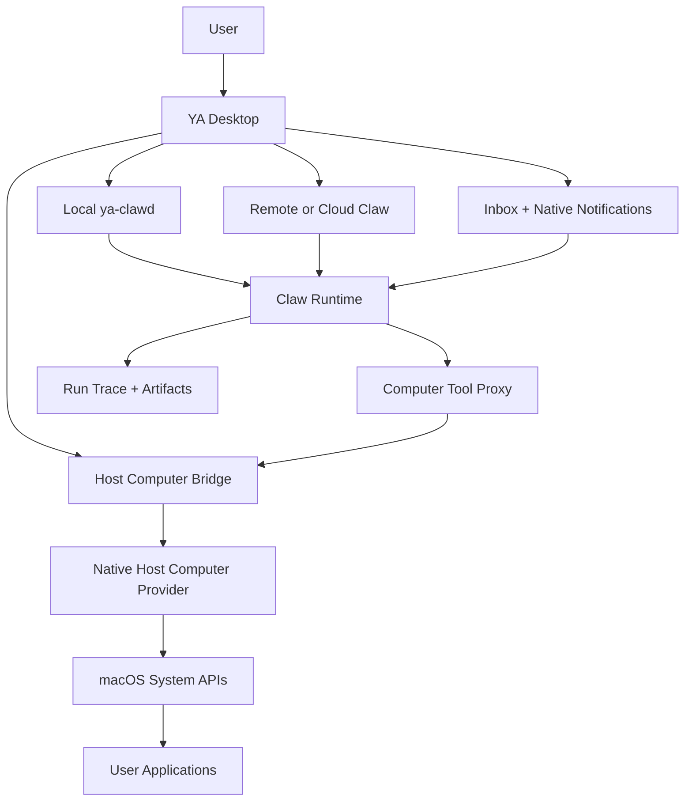

# 01. Product and Runtime Boundary

## Goal

Host Computer Use gives YA Desktop agents a controlled way to inspect and operate the user's local desktop. The system should support real desktop applications, system dialogs, browser sessions, IDEs, terminals, file managers, and productivity tools.

The first product target is macOS host control. The architecture should keep the provider boundary portable so later providers can target Windows UI Automation, Linux AT-SPI, and sandboxed virtual desktops.

## Product Surfaces

Host Computer Use appears across existing YA Desktop surfaces:

- Home starts tasks that may request desktop access.
- Chats shows live computer status, screenshots, action timeline, and takeover controls.
- Board displays blocked chats that wait for computer approvals.
- Spaces owns execution location, trusted folders, runtime connection, and host computer capability.
- Inbox owns approval cards for sensitive actions.
- Settings owns permission status, provider diagnostics, retention policy, and default safety rules.

## Boundary



Desktop owns:

- OS permission checks and permission education.
- Host Computer Bridge process lifecycle.
- Native provider implementation and OS API access.
- Device-level pause, takeover, release, and emergency stop.
- Local policy defaults, visible status, and user-facing safety UX.

Claw owns:

- sessions, runs, profiles, and model execution.
- tool call routing and approval state.
- durable run trace and replay.
- artifact indexing and retention metadata.
- connection capability discovery.
- remote RPC requests into a Desktop-controlled bridge.

The provider owns:

- screen capture.
- UI element discovery.
- accessibility actions.
- coordinate input fallback.
- application/window/menu/dialog primitives.

## Supported Modes

### Local Embedded Mode

YA Desktop starts local `ya-clawd` and a local Host Computer Bridge. This is the default product mode for host computer automation.

```text
YA Desktop -> local ya-clawd -> computer tool proxy -> Host Computer Bridge -> macOS provider
```

### Remote Claw Mode

YA Desktop connects to a remote Claw runtime and exposes a local computer provider over an authenticated RPC channel. Desktop remains the permission host and can pause or revoke access.

```text
Remote Claw -> secure computer RPC -> YA Desktop Host Computer Bridge -> macOS provider
```

### Sandboxed Desktop Mode

A future Docker or VM provider exposes a virtual desktop to Claw. This mode serves test automation, browser-like tasks, and high-isolation workflows.

```text
Claw -> sandbox computer provider -> Xvfb / noVNC / virtual display
```

## Capability Model

Claw capability discovery should expose computer use as provider and policy data:

```json
{
  "features": {
    "computer_use": true,
    "host_computer_use": true,
    "computer_use_artifacts": true,
    "computer_use_hitl": true,
    "remote_computer_rpc": true
  },
  "computer_providers": [
    {
      "id": "host-macos",
      "kind": "host",
      "platform": "macos",
      "backend": "native",
      "permission_host": "ya_desktop",
      "supports_accessibility_tree": true,
      "supports_coordinate_input": true,
      "supports_live_monitor": true,
      "status": "ready"
    }
  ]
}
```

Desktop should merge Claw capabilities with local provider diagnostics before rendering user choices.

## User Control States

```ts
type ComputerControlState =
  | "disabled"
  | "permission_required"
  | "ready"
  | "agent_active"
  | "approval_required"
  | "paused"
  | "user_takeover"
  | "errored";
```

State transitions should be visible in Chats, Inbox, and tray status. `paused` prevents new computer actions while preserving the run. `user_takeover` gives the user direct control over the desktop and makes the agent wait. `disabled` removes the computer tool surface from future runs.

## Product Requirements

- A user must explicitly enable host computer access for each Space or connection.
- Desktop must show which app or window the agent is targeting when known.
- The user must have one-click pause and stop controls during active computer use.
- Sensitive action classes must route through Inbox approvals.
- Every screenshot and action result must be traceable from the chat timeline.
- The feature should work with local Claw first and remote Claw through the same provider-neutral protocol.
