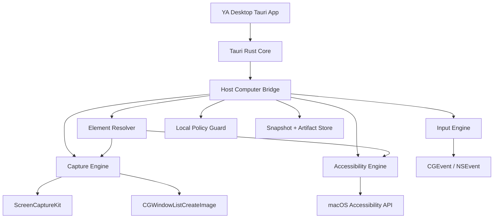
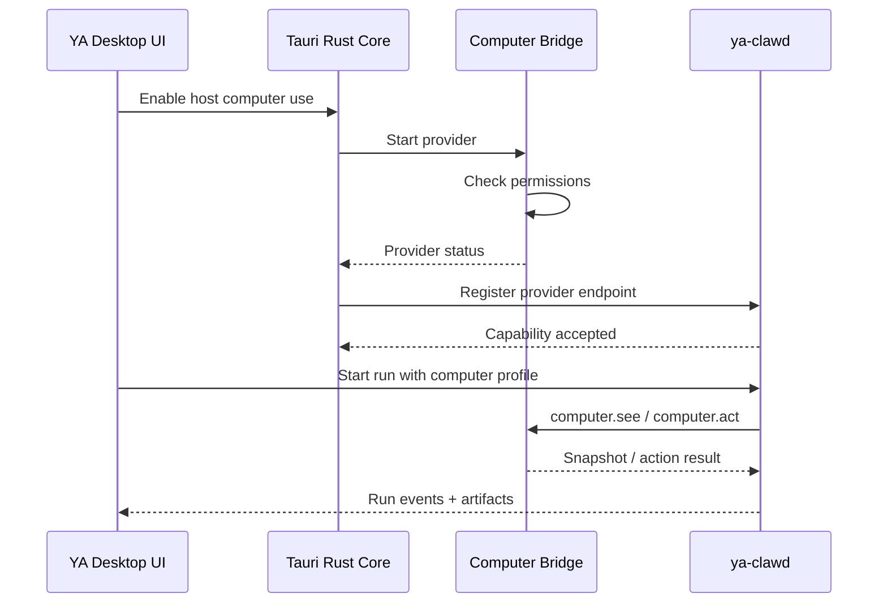

# 02. Native Provider Architecture

## Direction

The first Host Computer Use provider should be a YA-owned macOS native provider managed by YA Desktop. It should use the strongest semantic OS APIs available, then fall back to coordinate-based control when semantic automation is unavailable.

The provider runs behind a Host Computer Bridge. The bridge exposes a small local RPC surface to Claw and keeps native OS access inside the desktop trust boundary.

## Components



## Process Model

The MVP can run the bridge inside the Tauri Rust process. The product version should support a separate helper process for crash isolation, logging, and future code signing entitlements.

Recommended process stages:

1. In-process provider for fast prototype.
2. Bundled `ya-desktop-computer-bridge` helper for isolation.
3. Signed helper with hardened runtime and explicit entitlement review.

## Provider API

The bridge should expose a provider-neutral API. The Claw side should call this API through a computer tool proxy.

```ts
type HostComputerProvider = {
  getStatus(): Promise<ComputerProviderStatus>;
  see(request: ComputerSeeRequest): Promise<ComputerSnapshot>;
  act(action: ComputerAction): Promise<ComputerActionResult>;
  pause(reason?: string): Promise<void>;
  resume(): Promise<void>;
  takeover(): Promise<void>;
  release(): Promise<void>;
};
```

## Capture Engine

Capture responsibilities:

- Capture full display screenshots.
- Capture specific windows by window ID.
- Capture application-scoped screenshots.
- Produce thumbnail and full-resolution variants.
- Normalize Retina scale metadata.
- Redact protected regions when policy requires it.

Preferred macOS APIs:

- ScreenCaptureKit for modern display/window capture.
- CGWindow APIs for compatibility and window metadata.
- CoreGraphics image encoding for PNG artifacts.

Capture output should include coordinate metadata:

```ts
type ScreenshotArtifact = {
  artifact_id: string;
  mime_type: "image/png" | "image/jpeg";
  width: number;
  height: number;
  scale_factor: number;
  display_id?: string;
  window_id?: string;
  app_bundle_id?: string;
  created_at: string;
};
```

## Accessibility Engine

Accessibility responsibilities:

- Enumerate applications, windows, menus, dialogs, controls, text fields, tables, and web views when exposed by macOS accessibility.
- Produce stable element references for a snapshot.
- Read role, title, value, enabled/focused state, bounds, and actions.
- Execute semantic actions such as press, focus, set value, select menu item, and close window.

Recommended element model:

```ts
type UIElementNode = {
  id: string;
  role: string;
  title?: string;
  label?: string;
  value?: string;
  description?: string;
  bounds?: Rect;
  enabled?: boolean;
  focused?: boolean;
  selected?: boolean;
  actions: string[];
  children?: UIElementNode[];
};
```

Snapshot-scoped element IDs are enough for MVP. A later provider can add cross-snapshot tracking by accessibility path and fuzzy bounds matching.

## Resolver

The resolver maps agent-facing references to native targets. It should support:

- `element_id` from the latest snapshot.
- app bundle ID and app name.
- window ID and title.
- text query with role constraints.
- coordinate fallback.

Resolution order:

1. Snapshot element ID.
2. Current accessibility tree path.
3. Text/role query inside the selected app or window.
4. Coordinate fallback using screenshot bounds.

## Input Engine

Input responsibilities:

- Click, double click, right click.
- Drag with optional human-like movement.
- Scroll.
- Type text.
- Press keys and hotkeys.
- Focus app/window.

Preferred action order:

1. Accessibility semantic action.
2. Focus plus accessibility value/action.
3. Coordinate input through CGEvent.

The engine should emit action execution metadata for trace:

```ts
type NativeActionExecution = {
  strategy: "accessibility" | "coordinate" | "hybrid";
  resolved_target?: ResolvedTarget;
  duration_ms: number;
  warnings: string[];
};
```

## Local Transport

For local embedded Claw, the bridge can use one of two transports:

- Unix domain socket with JSON-RPC.
- Loopback HTTP bound to `127.0.0.1` with a random token.

JSON-RPC over Unix socket is preferred for the provider helper. Loopback HTTP is easier for early integration with Python Claw.

## Lifecycle



## Diagnostics

The provider should expose diagnostics for Settings:

- permission status.
- capture backend status.
- accessibility backend status.
- input backend status.
- current display list.
- active application.
- latest snapshot metadata.
- bridge logs.
- policy blocks.

Diagnostics should avoid exposing screenshot pixels unless the user opens an explicit preview.
