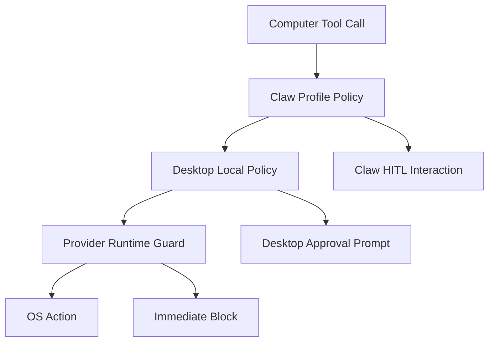

# 04. Permissions and Safety

## Goal

Host Computer Use operates on the user's real desktop, so the product must make access explicit, observable, revocable, and traceable. Desktop owns the local safety layer because it has native UI, notifications, tray presence, and direct OS permission context.

## macOS Permissions

The macOS provider should track these permissions:

| Permission        | Purpose                                            | Required for                               |
| ----------------- | -------------------------------------------------- | ------------------------------------------ |
| Screen Recording  | read screenshots and window pixels                 | `computer_see` with screenshot             |
| Accessibility     | inspect UI tree and perform semantic actions       | element discovery, press, set value, focus |
| Input Monitoring  | detect some user input state when needed           | takeover and conflict detection            |
| Automation        | drive selected apps through Apple Events when used | app-specific automation                    |
| Files and Folders | access user-selected workspace folders             | workspace provider, file dialogs           |

Desktop should show permission status in Settings and Space setup. The bridge should return typed permission errors so Chats and Inbox can explain blocked actions.

## Permission UX

Permission setup should include:

- a single Host Computer Use setup screen.
- per-permission status checks.
- buttons that open the correct macOS Settings pane.
- a test capture action.
- a test accessibility action against YA Desktop's own window.
- a clear indication that the user can pause or disable the provider at any time.

## Trust Scope

Computer use enablement should be scoped by Space and connection:

```ts
type ComputerUseTrustScope = {
  space_id: string;
  connection_id: string;
  provider_id: string;
  enabled: boolean;
  allowed_apps?: string[];
  denied_apps?: string[];
  approval_policy_id: string;
  created_at: string;
  updated_at: string;
};
```

A global provider permission can exist, but a Space must explicitly enable computer use before Claw receives the computer tool surface.

## Policy Layers



Claw profile policy handles run-level approval. Desktop local policy handles device trust and user preferences. Provider runtime guard prevents unsafe execution if state changes between approval and action.

## Default Approval Rules

Recommended defaults:

```yaml
computer_use_policy:
  require_user_enable: true
  max_actions_per_run: 80
  max_continuous_active_seconds: 300
  require_approval_for:
    - credential_field
    - file_dialog
    - app_launch
    - system_settings
    - destructive_action
    - external_communication
  always_block_apps:
    - Keychain Access
    - Passwords
  screenshot_retention_days: 7
```

Low-risk actions such as reading the current app screenshot can proceed after the Space enables host computer use. Medium and high-risk actions should create Inbox approvals.

## Sensitive Surface Detection

The provider should classify sensitive surfaces using multiple signals:

- active app bundle ID.
- window title and role.
- accessibility role and field metadata.
- known secure text fields.
- menu item labels such as delete, erase, purchase, send, submit, authorize, install.
- URL or domain metadata when the active app exposes it.

Detection result:

```ts
type SensitiveSurface = {
  category:
    | "credential_field"
    | "payment"
    | "system_settings"
    | "file_dialog"
    | "private_app"
    | "destructive_action"
    | "external_communication";
  confidence: "low" | "medium" | "high";
  reason: string;
};
```

## Pause, Takeover, and Stop

Computer use requires three visible controls:

- Pause: prevents new computer actions while keeping the run active.
- Takeover: pauses the agent and marks the user as controlling the desktop.
- Stop: cancels the active run and disables provider actions for that run.

```ts
type ComputerControlCommand =
  | { kind: "pause"; reason?: string }
  | { kind: "resume" }
  | { kind: "takeover"; reason?: string }
  | { kind: "release" }
  | { kind: "stop_run"; run_id: string };
```

The provider must check control state before each action and after any approval wait.

## User Input Conflict

When the user moves the mouse or types during an active agent action loop, Desktop should enter `user_takeover` or prompt the user depending on policy.

Recommended MVP rule:

- user keyboard input pauses the agent.
- user mouse click outside YA Desktop pauses the agent.
- user mouse movement alone does not pause the agent.

## Redaction

Screenshot redaction should support:

- app-level redaction.
- region-level redaction.
- secure field redaction.
- notification redaction.
- optional OCR-based sensitive text redaction.

Redaction metadata should be stored separately from the screenshot artifact:

```ts
type RedactionReport = {
  artifact_id: string;
  redacted_regions: Rect[];
  policy_id: string;
  reasons: string[];
};
```

## Retention

Desktop and Claw should coordinate retention:

- Claw stores run artifacts and retention metadata.
- Desktop can keep local bridge temporary files for a short TTL.
- Users can clear computer artifacts per chat, per Space, or globally.
- Remote Claw mode should make artifact upload policy explicit.

## Audit Trail

Every computer action should generate an audit entry:

```ts
type ComputerAuditEntry = {
  id: string;
  run_id?: string;
  session_id?: string;
  provider_id: string;
  action_kind: string;
  target_summary?: string;
  app_name?: string;
  window_title?: string;
  policy_decision: "allowed" | "approved" | "blocked";
  approved_by?: "user" | "policy";
  created_at: string;
};
```

Audit entries should be visible in Settings diagnostics and linked from run trace entries.
