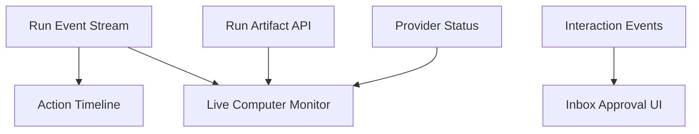

# 06. Desktop UX

## Goal

Desktop should make Host Computer Use feel controlled, observable, and easy to stop. The user should always know when an agent can see the screen, which app it is targeting, and what action it wants to take.

## Entry Points

### Home

Home can expose computer-capable commands with clear capability badges:

- `Use this Mac`
- `Needs screen access`
- `Can control apps`

When permissions are missing, Home routes the user to the Host Computer Use setup flow.

### Spaces

Spaces owns computer use enablement because a Space represents workspace identity, trust, and execution location.

Space settings should include:

```ts
type SpaceComputerSettings = {
  enabled: boolean
  provider_id: string
  allowed_apps: string[]
  denied_apps: string[]
  approval_policy_id: string
  artifact_retention_days: number
}
```

The Space detail page should show:

- provider status.
- permission readiness.
- allowed apps.
- active connection.
- recent computer-use runs.

### Chats

Chats is the main live surface. A chat with active computer use should show:

- active app and window.
- latest screenshot thumbnail.
- action timeline.
- pending approval state.
- pause, takeover, release, stop controls.

Suggested header status:

```text
Computer: Active on Safari · Last action: Clicked "Sign in" · Pause
```

The live monitor should support collapsed and expanded modes. Collapsed mode shows a thumbnail and status. Expanded mode shows the screenshot with highlighted target and recent actions.

### Inbox

Inbox renders computer approval cards. A card should include:

- model-requested action.
- target app/window.
- screenshot preview with highlighted target when available.
- risk category and reason.
- approve once, approve similar for this run, deny, pause run.

Approval response shape:

```ts
type ComputerApprovalResponse = {
  interaction_id: string
  decision: 'approve_once' | 'approve_similar_for_run' | 'deny' | 'pause'
  user_note?: string
}
```

### Settings

Settings owns global provider configuration:

- permission checks.
- provider diagnostics.
- default approval rules.
- screenshot retention.
- blocked apps.
- bridge logs.
- reset provider registration.

## Live Monitor



Monitor display requirements:

- latest screenshot.
- app and window label.
- target highlight overlay.
- action status.
- policy decision status.
- paused/takeover state.

## Timeline Cards

Computer actions should appear as dedicated timeline cards:

```ts
type ComputerTimelineCard = {
  id: string
  run_id: string
  kind: 'snapshot' | 'action' | 'approval' | 'policy_block'
  title: string
  subtitle?: string
  screenshot_artifact_id?: string
  app_name?: string
  window_title?: string
  action_kind?: string
  status: 'running' | 'succeeded' | 'failed' | 'blocked' | 'waiting'
  created_at: string
}
```

Examples:

- `Captured Safari window "GitHub"`
- `Clicked "Sign in" using accessibility`
- `Waiting for approval to type into password field`
- `Blocked action in Keychain Access`

## Setup Flow

Recommended setup flow:

1. Explain host computer access.
2. Choose Space and provider.
3. Grant Screen Recording permission.
4. Grant Accessibility permission.
5. Run test capture.
6. Run test accessibility action inside YA Desktop window.
7. Configure approval defaults.
8. Enable provider for the Space.

The setup flow should save progress so users can return after macOS Settings changes.

## Provider Status UI

```ts
type ComputerProviderStatusView = {
  provider_id: string
  label: string
  platform: 'macos' | 'windows' | 'linux' | 'sandbox'
  state:
    | 'disabled'
    | 'permission_required'
    | 'starting'
    | 'ready'
    | 'active'
    | 'paused'
    | 'errored'
  permissions: PermissionStatus[]
  active_session_id?: string
  active_run_id?: string
  active_app?: string
  active_window?: string
  error?: string
}
```

## Remote Connection UX

When a remote Claw requests local host computer use, Desktop should show a stronger trust prompt:

```text
Remote runtime "prod-claw" wants to use this Mac for session "Release testing".
Provider: Host macOS
Artifacts: screenshots will be uploaded to remote Claw
Approvals: required for all actions by default
```

The user can approve for one session, approve for the Space, or deny.

## Tray and Native Notifications

Tray status should reflect active host control:

- idle.
- computer use active.
- approval waiting.
- paused.
- provider error.

Native notifications should fire for:

- approval required.
- computer use started by a background run.
- provider paused due to user input.
- remote runtime requested host access.

## Accessibility of UX

The Desktop UI should provide non-visual controls for computer use status and stop actions. Keyboard shortcuts should include:

- global pause computer use.
- stop active computer-use run.
- open active computer-use chat.

These shortcuts should be configurable in Settings.
