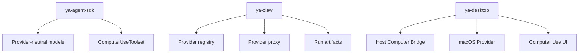

# 07. Implementation Plan

## Milestone 1: Protocol and Spec Foundation

Deliverables:

- Computer use spec folder.
- Provider-neutral TypeScript model definitions in Desktop.
- Provider-neutral Python/Pydantic models in SDK or Claw.
- `computer_see`, `computer_act`, `computer_status`, `computer_wait` tool contracts.
- Claw profile shape for `builtin_toolsets: [computer]`.

Validation:

- Unit tests for request/response schemas.
- Snapshot/action fixtures.
- Trace projection fixtures.

## Milestone 2: Local Mock Provider

Create a mock provider to exercise Claw and Desktop integration before OS automation.

Capabilities:

- returns static screenshot artifacts.
- returns static accessibility tree.
- accepts safe actions and produces action records.
- simulates permission missing, target stale, policy block, approval required.

Suggested package layout:

```text
apps/ya-desktop/src/features/computer-use/
  models.ts
  mockProvider.ts
  ComputerStatusPanel.tsx
  ComputerTimelineCard.tsx

packages/ya-claw/ya_claw/computer/
  models.py
  registry.py
  proxy.py
```

Validation:

- Claw can register a mock provider.
- A run can call `computer_see` and `computer_act`.
- Chats can render computer timeline cards.
- Inbox can approve a simulated risky action.

## Milestone 3: macOS Capture MVP

Implement screenshot capture through the native provider.

Capabilities:

- full display capture.
- active window capture.
- artifact creation.
- permission status detection.
- Settings diagnostics.

Suggested Rust modules:

```text
apps/ya-desktop/src-tauri/src/computer/
  mod.rs
  bridge.rs
  models.rs
  permissions.rs
  capture_macos.rs
  artifacts.rs
```

Validation:

- capture works after Screen Recording permission.
- missing permission produces typed error.
- screenshot artifact renders in Chats.
- run trace links to artifact.

## Milestone 4: macOS Accessibility MVP

Implement UI tree inspection and semantic click/type.

Capabilities:

- active app/window metadata.
- accessibility tree snapshot.
- element IDs.
- click button by element ID.
- focus and set value for text fields.
- target stale handling.

Suggested Rust modules:

```text
apps/ya-desktop/src-tauri/src/computer/
  accessibility_macos.rs
  resolver.rs
  input_macos.rs
```

Validation:

- test against YA Desktop's own window.
- test against Finder and Safari.
- semantic action metadata appears in trace.
- coordinate fallback stays available for unsupported elements.

## Milestone 5: Safety and HITL

Implement policy classification and approval flow.

Capabilities:

- sensitive action classification.
- Desktop local policy.
- Claw HITL integration.
- pause/takeover/release/stop controls.
- user input conflict detection MVP.

Validation:

- password-like field requests approval.
- blocked app prevents action.
- user pause prevents provider execution.
- approval state recovers after app restart.

## Milestone 6: Remote Computer RPC

Allow remote Claw runtimes to request local host computer actions through Desktop.

Capabilities:

- provider registration for remote connections.
- authenticated RPC session.
- explicit remote trust prompt.
- artifact upload policy.
- revoke access.

Validation:

- remote runtime can call mock provider.
- remote runtime can call macOS capture after user enablement.
- Desktop can revoke active provider access.

## Milestone 7: Product Polish

Capabilities:

- live monitor overlay with target highlight.
- timeline grouping.
- global hotkeys.
- tray status.
- retention controls.
- diagnostics export.

Validation:

- end-to-end task demos.
- accessibility review of stop controls.
- stress test long runs.
- run-store cleanup test.

## Package Ownership



Recommended ownership:

- SDK: reusable protocol models and toolset interface.
- Claw: provider registry, profile resolution, tool proxy, HITL, trace, artifacts.
- Desktop: native provider, permission UX, bridge lifecycle, live monitor, local policy.

## Test Strategy

### Unit Tests

- schema validation.
- policy classification.
- element reference resolution.
- artifact metadata.
- trace projection.

### Integration Tests

- Claw toolset with mock provider.
- Desktop provider registration.
- HITL approval flow.
- run artifact storage and retrieval.

### Manual macOS Tests

- permission grant and revoke.
- capture active window.
- click YA Desktop button by accessibility element.
- type into a test text field.
- pause during active run.
- remote connection trust prompt.

## Open Decisions

- Whether provider-neutral models live entirely in SDK or are duplicated as generated TypeScript/Python models.
- Whether the bridge starts in-process or as a helper from the first implementation.
- Whether local transport should be Unix socket JSON-RPC or loopback HTTP for MVP.
- Whether screenshot artifacts upload automatically in remote Claw mode or require a per-connection policy.
- Whether OCR should be built into the provider or added as a separate post-processing tool.

## Recommended First PRs

1. Add provider-neutral schema files and mock provider fixtures.
2. Add Claw provider registry and `computer_status` tool.
3. Add `computer_see` with mock screenshot artifact support.
4. Add Desktop setup/status panel backed by mock provider state.
5. Add macOS capture MVP behind the same provider interface.
