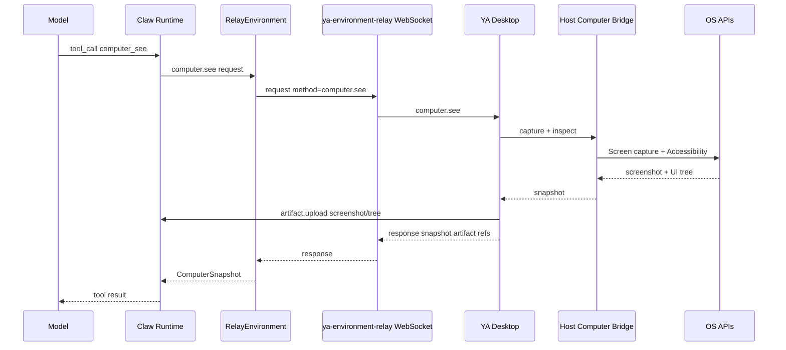
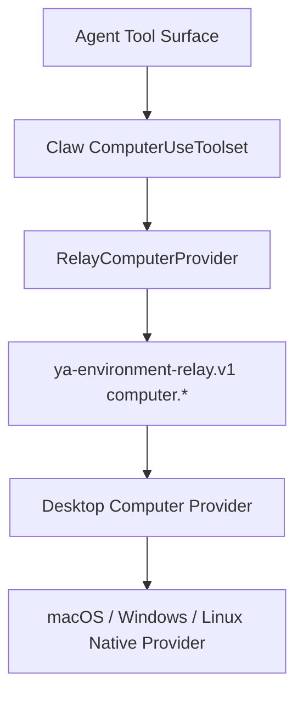
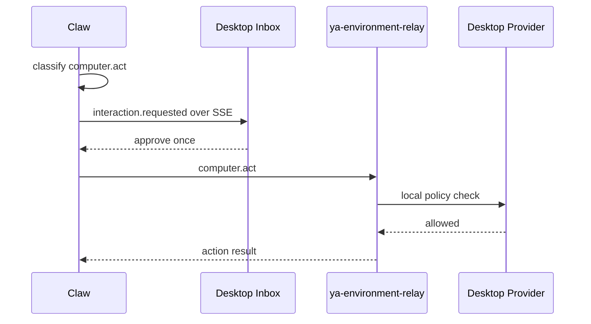

# 08. Relay-Based Computer Use

## Goal

Host Computer Use should run on top of YA Environment Relay. Claw exposes `computer_*` tools to the agent, and the tool implementation dispatches `computer.*` relay methods to YA Desktop. Desktop executes screen capture, accessibility inspection, input injection, pause, takeover, and local safety policy.

This makes Computer Use one capability inside a broader relay-backed Environment, alongside local file operations, shell execution, resources, and custom tools. The generic protocol is defined in `packages/ya-environment-relay/spec/`.

## Runtime Path



## Layering



Layer responsibilities:

- `ComputerUseToolset`: model-facing tool names, descriptions, tool result text.
- `RelayComputerProvider`: converts tool calls into relay requests and handles artifacts.
- `ya-environment-relay.v1`: transport envelope, request IDs, streaming, cancellation, errors.
- `Desktop Computer Provider`: local policy, permission state, provider lifecycle, action execution.
- `Native Provider`: OS-specific capture, accessibility, input, app/window metadata.

## Relay Capability Advertisement

Desktop advertises computer capability in the relay hello frame:

```json
{
  "type": "hello",
  "protocol": "ya-environment-relay.v1",
  "device_id": "dev_macbook_123",
  "capabilities": {
    "computer": {
      "enabled": true,
      "provider_id": "host-macos",
      "platform": "macos",
      "screenshots": true,
      "window_capture": true,
      "accessibility_tree": true,
      "semantic_actions": true,
      "coordinate_input": true,
      "pause_takeover": true,
      "artifact_upload": true
    }
  }
}
```

Claw accepts the capability and binds it to a relay provider registry entry:

```json
{
  "provider_id": "relay:dev_macbook_123:host-macos",
  "kind": "relay_computer",
  "device_id": "dev_macbook_123",
  "connection_id": "relay_conn_123",
  "capabilities": ["screenshots", "accessibility_tree", "semantic_actions", "coordinate_input"]
}
```

## Claw Profile

Computer use remains opt-in at profile level:

```yaml
- name: local-desktop-computer
  model: openai:gpt-4.1
  builtin_toolsets:
    - core
    - computer
  workspace_backend_hint: relay
  model_config_override:
    capabilities:
      - vision
    computer_use:
      enabled: true
      provider: relay
      require_approval: true
      max_actions_per_run: 80
```

The session Space binding selects the relay device and trust scope:

```json
{
  "metadata": {
    "relay": {
      "device_id": "dev_macbook_123",
      "space_id": "space_ya_mono"
    },
    "computer_use": {
      "enabled": true,
      "provider_id": "relay:dev_macbook_123:host-macos",
      "permission_host": "ya_desktop"
    }
  }
}
```

## Relay Methods

Computer use method namespace:

```text
computer.status
computer.see
computer.act
computer.pause
computer.resume
computer.takeover
computer.release
```

### computer.status

Request:

```json
{
  "type": "request",
  "id": "req_status_1",
  "method": "computer.status",
  "params": {
    "provider_id": "host-macos"
  }
}
```

Response:

```json
{
  "type": "response",
  "id": "req_status_1",
  "result": {
    "state": "ready",
    "platform": "macos",
    "permissions": [
      { "name": "screen_recording", "state": "granted" },
      { "name": "accessibility", "state": "granted" }
    ],
    "active_app": "Safari",
    "active_window": "GitHub"
  }
}
```

### computer.see

Request:

```json
{
  "type": "request",
  "id": "req_see_1",
  "method": "computer.see",
  "params": {
    "target": { "kind": "app", "app_name": "Safari" },
    "include_screenshot": true,
    "include_accessibility_tree": true,
    "max_nodes": 200
  },
  "context": {
    "session_id": "session_123",
    "run_id": "run_456",
    "tool_call_id": "call_789"
  }
}
```

Response:

```json
{
  "type": "response",
  "id": "req_see_1",
  "result": {
    "snapshot_id": "snap_123",
    "provider_id": "host-macos",
    "target": { "kind": "app", "app_name": "Safari" },
    "screenshot": {
      "artifact_id": "art_png_123",
      "mime_type": "image/png",
      "width": 1512,
      "height": 982,
      "scale_factor": 2
    },
    "accessibility_tree_artifact_id": "art_tree_123",
    "summary": "Safari window \"GitHub\" with 83 accessible elements. B1 is Sign in button. T1 is search field."
  }
}
```

### computer.act

Request:

```json
{
  "type": "request",
  "id": "req_act_1",
  "method": "computer.act",
  "params": {
    "action": {
      "kind": "click",
      "target": {
        "kind": "element",
        "ref": {
          "snapshot_id": "snap_123",
          "element_id": "B1"
        }
      },
      "options": {
        "preferred_strategy": "semantic",
        "wait_after_ms": 300
      }
    }
  },
  "context": {
    "session_id": "session_123",
    "run_id": "run_456",
    "tool_call_id": "call_790"
  }
}
```

Response:

```json
{
  "type": "response",
  "id": "req_act_1",
  "result": {
    "action_id": "act_123",
    "status": "succeeded",
    "execution": {
      "strategy": "accessibility",
      "duration_ms": 118,
      "warnings": []
    },
    "after_snapshot": {
      "snapshot_id": "snap_124",
      "screenshot_artifact_id": "art_png_124"
    },
    "summary": "Clicked B1 \"Sign in\" using accessibility press."
  }
}
```

## Approval Flow

Claw and Desktop both participate in policy checks.



Claw policy decides model/run approvals. Desktop policy protects the physical device and can block an action after approval when local state changes.

## Artifact Flow

Desktop uploads screenshots and tree artifacts to Claw through relay artifact methods or HTTP artifact endpoints.

Recommended flow:

1. Claw sends `computer.see` with `run_id` and `tool_call_id`.
2. Desktop captures screenshot and UI tree.
3. Desktop calls `artifact.reserve` or HTTP artifact create.
4. Desktop uploads bytes.
5. Desktop returns artifact IDs inside the `computer.see` response.
6. Claw stores compact trace entries in `message.json`.

Run-store layout:

```text
run-store/{run_id}/artifacts/computer/
  snap_0001.png
  snap_0001.tree.json
  action_0001.json
  redaction_0001.json
```

## Local and Remote Modes

### Local Embedded Claw

YA Desktop can still use relay even when Claw is local:

```text
YA Desktop -> local ya-clawd WebSocket relay -> Desktop providers
```

This keeps one transport and one provider model. A loopback HTTP bridge remains useful for early prototypes.

### Remote Claw

Remote Claw uses the same relay protocol. Desktop initiates the connection and advertises local computer capability.

```text
Remote Claw <- ya-environment-relay WebSocket <- YA Desktop -> Host Computer Bridge -> OS APIs
```

Remote mode requires explicit Space trust, artifact upload policy, and visible active connection state.

## Tool Result Text

Claw should convert relay responses into concise model-facing tool results:

```text
Captured Safari window "GitHub". Screenshot artifact art_png_123 is 1512x982 at scale 2. Accessibility summary: B1 "Sign in" button, T1 search field, L1 repository link.
```

Action result:

```text
Clicked B1 "Sign in" using accessibility press. The page changed to a login form. New screenshot artifact: art_png_124.
```

## Desktop UX

Relay-based computer use appears in Desktop as:

- relay connection status in Spaces.
- computer provider status in Settings.
- active run monitor in Chats.
- approval cards in Inbox.
- pause/takeover/release controls backed by relay `computer.pause`, `computer.takeover`, and `computer.release`.

## Implementation Notes

Claw modules:

```text
packages/ya-claw/ya_claw/relay/computer.py
packages/ya-claw/ya_claw/toolsets/computer.py
packages/ya-claw/ya_claw/api/relay.py
```

Desktop modules:

```text
apps/ya-desktop/src/features/computer-use/
apps/ya-desktop/src/features/relay/
apps/ya-desktop/src-tauri/src/computer/
apps/ya-desktop/src-tauri/src/relay/
```

MVP order:

1. Relay mock `computer.status`.
2. Relay mock `computer.see` with static artifact.
3. Relay mock `computer.act` with action result trace.
4. macOS screenshot capture for `computer.see`.
5. macOS Accessibility tree.
6. semantic click and text entry.
7. pause/takeover controls.
