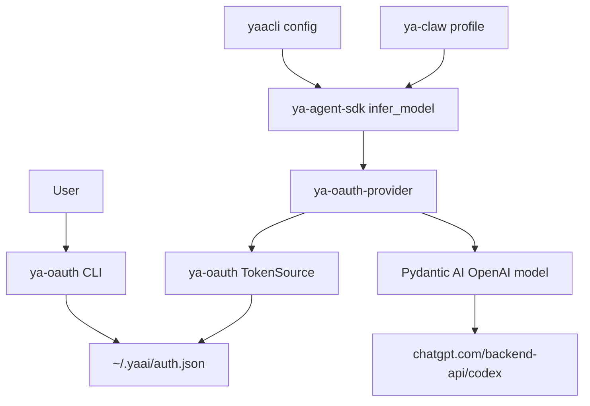

# OAuth-backed Codex Provider

## Goal

YA provides a reusable OAuth path for users who want to run agents with their own ChatGPT/Codex subscription. The implementation is split into three packages:

- `ya-oauth`: OAuth login, refresh, logout, token storage, and CLI.
- `ya-oauth-provider`: Pydantic AI model/provider helpers that consume `ya-oauth` token sources.
- `ya-agent-sdk`: model string integration, runtime session headers, and SDK-level assembly.

YAACLI and YA Claw expose this through configuration and documentation.

## User Flow

```bash
ya-oauth login codex
```

The CLI uses the Codex device-code login flow, stores credentials in `~/.yaai/auth.json`, and can refresh them later.

SDK users can run:

```python
from ya_agent_sdk.agents import create_agent

async with create_agent("oauth@codex:gpt-5.5") as runtime:
    result = await runtime.agent.run("Hello", deps=runtime.ctx)
    print(result.output)
```

YAACLI config:

```toml
[general]
model = "oauth@codex:gpt-5.5"
model_settings = "openai_responses_high"
model_cfg = "gpt5_270k"
```

YA Claw profile:

```yaml
- name: codex-oauth
  model: oauth@codex:gpt-5.5
  model_settings_preset: openai_responses_high
  model_config_preset: gpt5_270k
  builtin_toolsets:
    - core
```

## Package Responsibilities



### `ya-oauth`

- Owns `~/.yaai/auth.json`.
- Implements file locking and atomic writes.
- Provides `OAuthStore`, `OAuthTokenRecord`, and store-backed token sources.
- Provides Codex login, refresh, revoke/logout, status, and doctor commands.

### `ya-oauth-provider`

- Owns OAuth-to-Pydantic-AI model assembly.
- Consumes any `OAuthTokenSource` that can provide and refresh access tokens.
- Adds provider-specific headers such as `ChatGPT-Account-ID`.
- Adds SDK-provided session headers.
- Refreshes on 401 and retries once.

### `ya-agent-sdk`

- Parses `oauth@provider:model` strings.
- Lazy imports `ya-oauth-provider` for OAuth-backed models.
- Passes model extra headers from `AgentContext` into `infer_model()`.
- Keeps package dependency optional through an `oauth` extra.

## Codex Reference Details

The implementation should stay aligned with OpenAI Codex. The checked reference source is under the local research checkout:

- `/tmp/ya_agent_yfdq7chm/codex/codex-rs/login/src/device_code_auth.rs`
- `/tmp/ya_agent_yfdq7chm/codex/codex-rs/login/src/server.rs`
- `/tmp/ya_agent_yfdq7chm/codex/codex-rs/login/src/auth/manager.rs`
- `/tmp/ya_agent_yfdq7chm/codex/codex-rs/model-provider/src/bearer_auth_provider.rs`
- `/tmp/ya_agent_yfdq7chm/codex/codex-rs/codex-api/src/requests/headers.rs`

Codex constants and endpoints:

```text
issuer = https://auth.openai.com
client_id = app_EMoamEEZ73f0CkXaXp7hrann
device_user_code_endpoint = https://auth.openai.com/api/accounts/deviceauth/usercode
device_token_endpoint = https://auth.openai.com/api/accounts/deviceauth/token
token_endpoint = https://auth.openai.com/oauth/token
revoke_endpoint = https://auth.openai.com/oauth/revoke
codex_base_url = https://chatgpt.com/backend-api/codex
```

Device code request:

```http
POST /api/accounts/deviceauth/usercode
Content-Type: application/json

{"client_id":"app_EMoamEEZ73f0CkXaXp7hrann"}
```

Device token poll:

```http
POST /api/accounts/deviceauth/token
Content-Type: application/json

{"device_auth_id":"...","user_code":"..."}
```

Token exchange after device authorization:

```http
POST /oauth/token
Content-Type: application/x-www-form-urlencoded

grant_type=authorization_code&code=...&redirect_uri=https%3A%2F%2Fauth.openai.com%2Fdeviceauth%2Fcallback&client_id=...&code_verifier=...
```

The polling response supplies `authorization_code`, `code_challenge`, and `code_verifier`. The redirect URI for device code exchange is:

```text
https://auth.openai.com/deviceauth/callback
```

Refresh request:

```http
POST /oauth/token
Content-Type: application/json

{
  "client_id": "app_EMoamEEZ73f0CkXaXp7hrann",
  "grant_type": "refresh_token",
  "refresh_token": "..."
}
```

Codex auth file shape uses `tokens.id_token`, `tokens.access_token`, `tokens.refresh_token`, `tokens.account_id`, and `last_refresh`.

## Token Store Schema

`~/.yaai/auth.json` stores providers by name:

```json
{
  "version": 1,
  "providers": {
    "codex": {
      "type": "oauth2",
      "issuer": "https://auth.openai.com",
      "client_id": "app_EMoamEEZ73f0CkXaXp7hrann",
      "token_endpoint": "https://auth.openai.com/oauth/token",
      "revoke_endpoint": "https://auth.openai.com/oauth/revoke",
      "base_url": "https://chatgpt.com/backend-api/codex",
      "scopes": ["openid", "profile", "email", "offline_access", "api.connectors.read", "api.connectors.invoke"],
      "tokens": {
        "id_token": "...",
        "access_token": "...",
        "refresh_token": "..."
      },
      "account": {
        "email": "user@example.com",
        "chatgpt_user_id": "user_...",
        "chatgpt_account_id": "acct_...",
        "chatgpt_plan_type": "plus",
        "chatgpt_account_is_fedramp": false
      },
      "last_refresh_at": "2026-05-13T03:00:00Z"
    }
  }
}
```

## Request Headers

`ya-oauth-provider` attaches:

```http
Authorization: Bearer <access_token>
ChatGPT-Account-ID: <chatgpt_account_id>
X-OpenAI-Fedramp: true
originator: ya_agent_sdk
version: <ya-agent-sdk-version>
session_id: <session_id>
session-id: <session_id>
thread_id: <thread_id>
thread-id: <thread_id>
```

`X-OpenAI-Fedramp` is attached only when the account metadata carries `chatgpt_account_is_fedramp = true`.

## SDK Session Headers

`AgentContext.get_model_extra_headers()` returns a stable header set. YA Claw passes `provider_session_id` and `provider_thread_id` through `extra_context_kwargs`; YAACLI uses the context `run_id` fallback.

## Implementation Order

1. Add workspace members `packages/ya-oauth` and `packages/ya-oauth-provider`.
2. Implement store, Codex login, refresh, logout, status, and doctor in `ya-oauth`.
3. Implement OAuth Pydantic AI provider assembly in `ya-oauth-provider`.
4. Add `oauth@` parsing in `ya-agent-sdk` and pass context model headers.
5. Add README/config/profile docs for SDK, YAACLI, and YA Claw.
6. Add tests for auth schema, Codex refresh, header injection, and model parsing.
7. Run account-backed verification after implementation.
