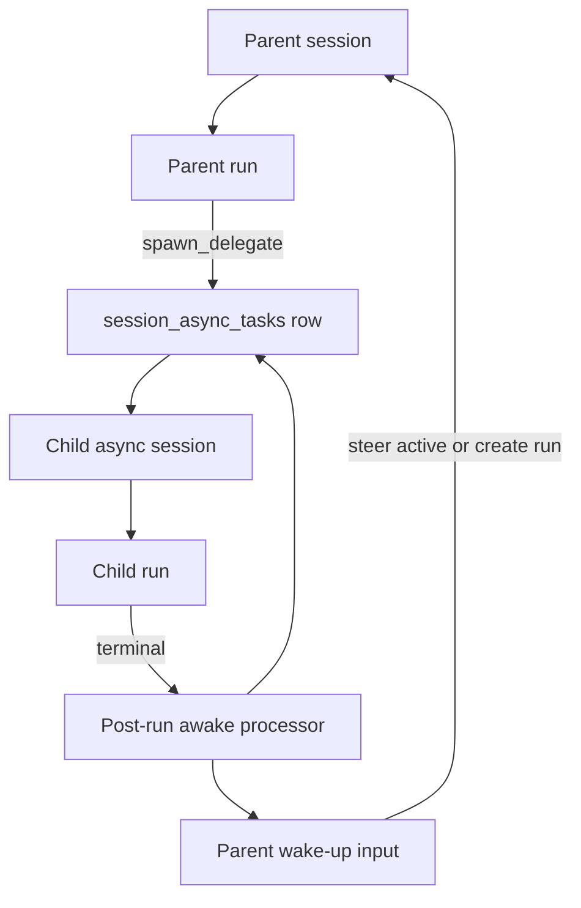
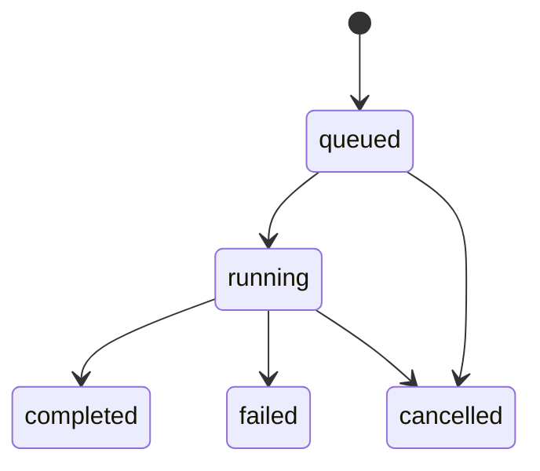
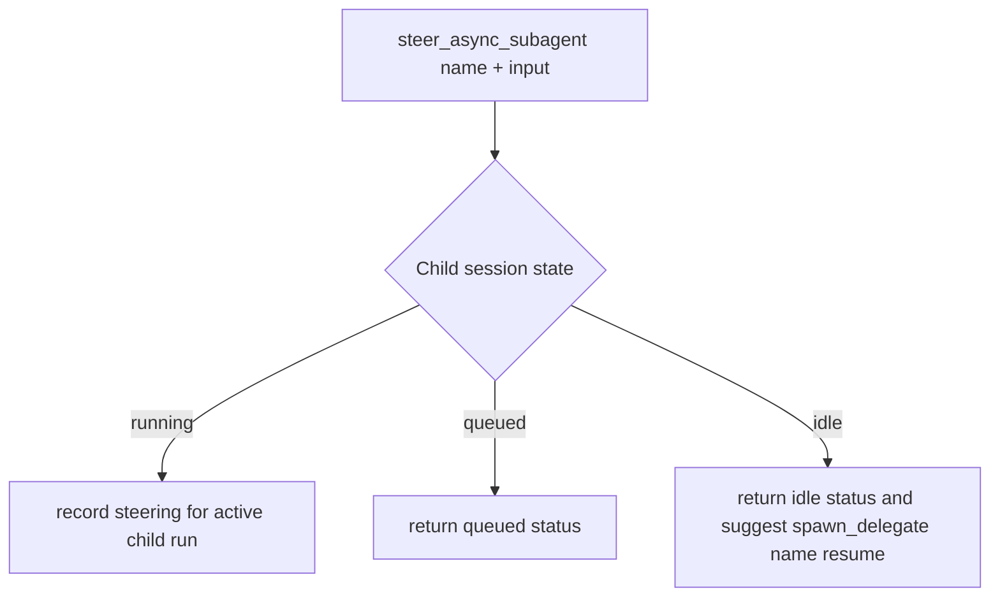
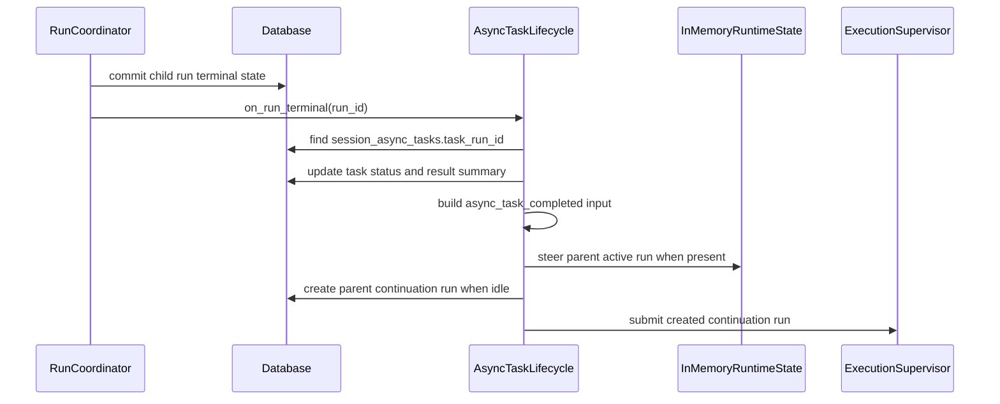

# 07 - Session-backed Async Subagents

YA Claw supports durable asynchronous subagent work by mapping child subagent work to normal Claw sessions and runs. A parent agent can start a named child subagent session, continue its own work, observe child progress through tools and injected context, steer the child session while it is active, and receive an automatic wake-up when the child session reaches a terminal state.

The runtime can still offer short-lived in-process helpers as an optimization, while the product contract is durable and session-based.

## Design Goals

- Make async subagents durable across parent run completion, service restarts, and UI refreshes.
- Use the existing Claw session/run execution path for async subagent work.
- Let any session spawn, resume, query, steer, and manage named child subagent sessions.
- Deliver async completion back to the parent session through the same steer-or-run wake-up path used by agency fires.
- Expose current-session async subagent state to the agent through tools and injected context.
- Preserve subagent semantics: subagent type, stable name, prompt, history, model inheritance, tool filtering, and resume.
- Keep parent and child continuity separate while preserving auditable linkage.

## Core Model

An async subagent is a durable relationship between a parent session/run and a child session/run.



A child async session represents a configured subagent from the parent profile. Generic session continuations use the existing session/run API surface.

## Session Type

Add `session_type="async_task"` for child async subagent sessions.

| Session type   | Purpose                                      | Default listing behavior |
| -------------- | -------------------------------------------- | ------------------------ |
| `conversation` | user-visible work sessions                   | visible                  |
| `memory`       | internal memory extract and summary sessions | hidden                   |
| `agency`       | singleton agency coordinator session         | hidden from normal lists |
| `async_task`   | durable child subagent work                  | hidden from normal lists |

Rules:

- Async task sessions use `parent_session_id` to point to the parent session.
- Async task sessions store `metadata["async_task"]` with task identity and parent linkage.
- Default session list APIs hide `async_task` sessions. Debug/admin views and parent-session task tools can reveal them.
- Session detail and run detail APIs continue to work for async task sessions.

## Orchestration Table

Add a `session_async_tasks` table. It stores relationship and scheduling state. The child session and child run remain the source of execution truth.

Fields:

| Column              | Type              | Description                                             |
| ------------------- | ----------------- | ------------------------------------------------------- |
| `id`                | string32 PK       | async task id                                           |
| `parent_session_id` | string32 FK       | session that spawned the work                           |
| `parent_run_id`     | string32 nullable | run that spawned the work                               |
| `parent_agent_id`   | string255         | parent SDK agent id, usually `main`                     |
| `task_session_id`   | string32 FK       | child async session                                     |
| `task_run_id`       | string32 nullable | latest child run                                        |
| `subagent_name`     | string255         | configured subagent type from the parent profile        |
| `name`              | string255         | stable parent-session-local child name                  |
| `status`            | string32          | `queued`, `running`, `completed`, `failed`, `cancelled` |
| `wake_policy`       | string32          | `steer_or_run`, `record_only`                           |
| `input_parts`       | JSON              | initial task input                                      |
| `result_run_id`     | string32 nullable | completed child run that produced the wake result       |
| `result_summary`    | text nullable     | compact child output summary                            |
| `error_message`     | text nullable     | terminal error summary                                  |
| `metadata`          | JSON              | source context, profile info, UI hints                  |
| `created_at`        | datetime          | creation time                                           |
| `updated_at`        | datetime          | update time                                             |
| `completed_at`      | datetime nullable | terminal time                                           |

Indexes:

```python
Index("ix_session_async_tasks_parent_status", "parent_session_id", "status")
Index("ix_session_async_tasks_task_session", "task_session_id")
Index("ix_session_async_tasks_task_run", "task_run_id")
Index("ix_session_async_tasks_name", "parent_session_id", "name")
```

Status values:



## Async Subagent Spawn and Resume

The primary tool is `spawn_delegate`. Its service-backed behavior creates or resumes a named child session/run and returns immediately.

Signature:

```python
spawn_delegate(
    subagent_name: str,
    prompt: str,
    name: str | None = None,
    context: dict[str, Any] | None = None,
) -> str
```

Behavior:

1. Resolve the parent session, parent run, profile, and workspace binding from `ClawAgentContext`.
2. Resolve `subagent_name` as the subagent type from the parent profile's `SubagentConfig` registry.
3. Choose a stable parent-session-local `name`, or use the provided `name` to find an existing async task in the current parent session.
4. For a new name, create an `async_task` child session with `parent_session_id` set to the current session.
5. For an existing terminal child session, create a child continuation run using that child session's `head_success_run_id`.
6. For an existing running child session, return its current task detail and instruct the agent to use `steer_async_subagent` for additional input.
7. Insert or update `session_async_tasks` with `wake_policy="steer_or_run"`.
8. Submit any newly created child run through `ExecutionSupervisor` with `dispatch_mode="async"`.
9. Return the task id, child session id, child run id, stable name, and delivery mode.

Tool response shape:

```xml
<async-subagent task-id="task-..." name="repo-map" session-id="session-..." run-id="run-..." subagent-name="explorer" status="queued">
Result will wake the parent session when the child run completes.
</async-subagent>
```

## Child Profile Resolution

A child async subagent run uses a profile derived from the parent profile and selected `SubagentConfig`.

Resolution rules:

- `model`, `model_settings`, and `model_config` inherit from the parent profile unless the subagent config overrides them.
- `system_prompt` comes from the subagent config body.
- Required and optional tool lists filter the parent tool surface.
- Auto-inherited management tools remain available when the parent profile exposes them.
- `ClawAgentContext` carries `async_task_id`, `async_parent_session_id`, `async_parent_run_id`, `async_subagent_name`, and `async_name` for child runs.
- Child run restore uses the child session's `head_success_run_id`, preserving child continuity separately from the parent session.

The child session metadata stores the resolved derivation inputs for auditability:

```json
{
  "async_task": {
    "task_id": "task-...",
    "kind": "subagent",
    "parent_session_id": "session-...",
    "parent_run_id": "run-...",
    "subagent_name": "explorer",
    "name": "repo-map",
    "profile_source": "parent-profile-name"
  }
}
```

## Query and Management Tools

Agents need current-session async subagent visibility. These tools operate on tasks whose `parent_session_id` matches `ClawAgentContext.session_id`.

| Tool                    | Purpose                                                                |
| ----------------------- | ---------------------------------------------------------------------- |
| `spawn_delegate`        | spawn or resume a named async subagent                                 |
| `list_async_subagents`  | list async subagent tasks for the current parent session               |
| `get_async_subagent`    | fetch task metadata, child session, latest run, output, and trace refs |
| `steer_async_subagent`  | send input to an active child subagent run                             |
| `cancel_async_subagent` | request cancellation for queued or running child work                  |

`list_async_subagents` response example:

```json
{
  "parent_session_id": "session-...",
  "subagents": [
    {
      "task_id": "task-...",
      "name": "repo-map",
      "subagent_name": "explorer",
      "task_session_id": "session-child-...",
      "task_run_id": "run-child-...",
      "status": "running",
      "created_at": "2026-05-18T10:00:00Z"
    }
  ]
}
```

`steer_async_subagent` sends additional input to an active named child session:



## Injected Context

`ClawAgentContext` injects a compact current-session async subagent block into user prompt turns when the parent session has active or recently completed tasks. This block also provides the current name-to-session mapping.

Example:

```xml
<async-subagents session-id="session-...">
  <subagent id="task-..." name="repo-map" subagent-name="explorer" status="running" session-id="session-child-..." run-id="run-child-..." />
  <subagent id="task-..." name="patch-review" subagent-name="code-reviewer" status="completed" session-id="session-child-2" run-id="run-child-2" result="available" />
</async-subagents>
```

`async-subagents` is registered in `injected_context_tags` so SDK trim-mode handoff strips historical task snapshots from prompt history.

## Post-run Awake Processor

Run terminal post-processing handles async task completion for every session type.



Completion wake input:

```json
{
  "type": "command",
  "name": "async_task_completed",
  "params": {
    "task_id": "task-...",
    "task_session_id": "session-child-...",
    "task_run_id": "run-child-...",
    "subagent_name": "explorer",
    "name": "repo-map",
    "status": "completed",
    "output_summary": "...",
    "result_available": true
  }
}
```

Wake behavior:

- Parent running state receives a steering batch.
- Parent idle state receives a new queued continuation run with `restore_from_run_id=head_success_run_id`.
- `wake_policy="record_only"` records terminal state and skips parent wake-up.

## Relationship to SDK Delegate and Self-call

SDK `delegate` remains the blocking in-process primitive. YA Claw's service-backed `spawn_delegate` uses Claw sessions and runs as the async execution substrate.

Async subagent tools use a Claw self-call client stored in the runtime environment resources. The model sees task ids, names, session ids, run ids, statuses, and summaries. The API token, base URL, and parent-session authorization stay inside the client resource.

The runtime can keep an internal helper for same-run parallel tool execution, but the exposed Claw tool contract should prefer session-backed async subagents. Session-backed subagents give durable history, restart recovery, UI visibility, cancellation, and post-run wake-up.

## API Surface

HTTP APIs can mirror the tool surface for UI and external controllers:

| Method | Path                                                         | Purpose                                 |
| ------ | ------------------------------------------------------------ | --------------------------------------- |
| `GET`  | `/api/v1/sessions/{session_id}/async-tasks`                  | list parent session async subagents     |
| `GET`  | `/api/v1/sessions/{session_id}/async-tasks/{task_id}`        | get task detail, output, and trace refs |
| `POST` | `/api/v1/sessions/{session_id}/async-tasks/{task_id}:steer`  | steer child subagent session            |
| `POST` | `/api/v1/sessions/{session_id}/async-tasks/{task_id}:cancel` | cancel child subagent work              |

These routes enforce parent-session ownership. Tool calls use names, while HTTP routes use task ids.

## Implementation Plan

01. Add `async_task` to the session type enum and database check constraint.
02. Add `session_async_tasks` ORM table and migration.
03. Add `AsyncTaskLifecycle` with create_or_resume, list, detail, steer, cancel, and `on_run_terminal` methods.
04. Add service-backed async tools: `spawn_delegate`, `list_async_subagents`, `get_async_subagent`, `steer_async_subagent`, and `cancel_async_subagent`.
05. Add self-call client methods for async task create_or_resume, list, detail, steer, and cancel.
06. Add `ClawAgentContext` async task fields and `async-subagents` injected context.
07. Modify `RunCoordinator` terminal post-processing to call `AsyncTaskLifecycle.on_run_terminal()` after successful, failed, and cancelled child runs.
08. Add child profile derivation for configured subagents.
09. Add UI/API endpoints for session async subagent inspection and management.
10. Keep the legacy run-scoped background monitor behind an internal name during migration, then point `spawn_delegate` to the session-backed implementation.
11. Add tests for spawn, query, get output, steer active child, resume completed child through `spawn_delegate(name=...)`, cancel child, parent wake on child completion, and restart recovery.
