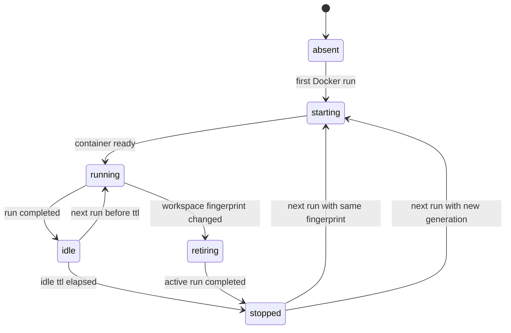
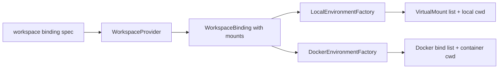

# 10 - Workspace Mount Sets

YA Claw supports session-scoped workspace mount sets so desktop clients and API clients can run one session across multiple folders while keeping one default working directory.

## Goal

A workspace mount set gives each session a typed execution boundary:

- one or more mounted workspace folders
- one default mount
- one default cwd inside the virtual workspace namespace
- read/write mode per mount
- provider-specific host and Docker path mapping
- a stable metadata shape that survives session continuation and run replay
- a deterministic Docker sandbox generation derived from the active binding

The configured service workspace remains the bootstrap workspace for deployments that omit request-level workspace configuration.

## API Model

```python
from typing import Literal
from pydantic import BaseModel, Field

class WorkspaceMountSpec(BaseModel):
    id: str | None = None
    name: str | None = None
    host_path: str
    virtual_path: str
    mode: Literal["rw", "ro"] = "rw"
    docker_host_path: str | None = None
    metadata: dict[str, object] = Field(default_factory=dict)

class WorkspaceBindingSpec(BaseModel):
    mounts: list[WorkspaceMountSpec]
    default_mount_id: str | None = None
    cwd: str | None = None
    metadata: dict[str, object] = Field(default_factory=dict)
```

Request models use the same optional field:

```python
workspace: WorkspaceBindingSpec | None = None
```

The field is accepted by:

- `SessionCreateRequest`
- `SessionRunCreateRequest`
- `RunCreateRequest`
- foreground stream variants for the same creation routes

## JSON Shape

```json
{
  "workspace": {
    "mounts": [
      {
        "id": "main",
        "name": "ya-mono",
        "host_path": "/Users/jizhongsheng/code/yet-another-agents/ya-mono",
        "virtual_path": "/workspace/main",
        "mode": "rw"
      },
      {
        "id": "docs",
        "name": "product-docs",
        "host_path": "/Users/jizhongsheng/docs/product",
        "virtual_path": "/workspace/docs",
        "mode": "ro"
      }
    ],
    "default_mount_id": "main",
    "cwd": "/workspace/main"
  }
}
```

## Durable State

Session metadata stores the current workspace binding:

```json
{
  "workspace": {
    "mounts": [],
    "default_mount_id": "main",
    "cwd": "/workspace/main"
  }
}
```

Run metadata can carry a workspace override with the same shape. Session metadata stays the durable default for the chat or conversation. Run metadata records special execution overrides for one run.

Run artifacts store a workspace snapshot after binding resolution so replay, trace, and diagnostics can explain the exact execution boundary used by that run.

```json
{
  "workspace_snapshot": {
    "fingerprint": "sha256:...",
    "generation": 3,
    "mounts": [],
    "default_mount_id": "main",
    "cwd": "/workspace/main",
    "backend": "docker"
  }
}
```

Future schema normalization can move workspace bindings into relational tables while preserving the API and metadata shapes.

## Inheritance

Workspace resolution follows this order:

1. load the session workspace from `session.metadata["workspace"]`
2. apply `run.metadata["workspace"]` when present
3. use the configured service workspace when session and run metadata omit workspace

A run-level workspace binding is a whole-binding replacement. Patch-style editing belongs to client-side session update flows.

Session continuation inherits the session workspace. Forked sessions copy the source session workspace into the child session by default. A fork request can supply a new workspace binding for the child session. Bridge-triggered runs and memory sessions inherit the source session workspace when they execute in session context. Schedule, workflow, and heartbeat runs inherit workspace binding for file access and use run-scoped Docker sandboxes for container lifecycle.

## Validation

The controller and provider validate workspace input before creating executable environments:

- `mounts` contains at least one entry
- each mount has a stable `id`; the provider can derive one from `virtual_path` when clients omit it
- `virtual_path` is absolute and unique within the binding
- `virtual_path` stays under `/workspace` for Docker environments
- exactly one default mount is selected when more than one mount exists
- `cwd` is absolute and falls under one declared virtual mount
- `mode` is `rw` or `ro`
- `host_path` resolves to an existing directory for local and Docker providers
- path policy exposes writable access only for mounts with `mode="rw"`

Provider-specific policies can add host allowlists, trust prompts, or deployment-level root restrictions.

## WorkspaceBinding Runtime Shape

`WorkspaceBinding` keeps default-root fields and adds mount details.

```python
@dataclass(slots=True)
class WorkspaceMountBinding:
    id: str
    host_path: Path
    virtual_path: Path
    mode: Literal["rw", "ro"] = "rw"
    docker_host_path: Path | None = None
    name: str | None = None
    metadata: dict[str, Any] = field(default_factory=dict)

@dataclass(slots=True)
class WorkspaceBinding:
    host_path: Path
    virtual_path: Path
    cwd: Path
    readable_paths: list[Path]
    writable_paths: list[Path]
    mounts: list[WorkspaceMountBinding] = field(default_factory=list)
    fingerprint: str
    generation: int | None = None
    environment_overrides: dict[str, str] = field(default_factory=dict)
    metadata: dict[str, Any] = field(default_factory=dict)
    backend_hint: str | None = None
```

The `host_path`, `virtual_path`, and `cwd` fields describe the default mount for compatibility with current runtime assembly and prompt code.

## Mount Sources and Merge Rules

YA Claw assembles environment mounts from three source layers:

1. **Request workspace mounts** come from `workspace.mounts` on session or run creation. These are user-visible project folders and define the default cwd, workspace guidance root, memory root, filetree root, and Desktop chat association.
2. **Configured default workspace mount** comes from `YA_CLAW_WORKSPACE_DIR`. This layer is used when the request and session metadata omit `workspace`.
3. **Provider extra mounts** come from `YA_CLAW_WORKSPACE_PROVIDER_DOCKER_EXTRA_MOUNTS`. These are runtime support mounts for Docker-backed environments, such as home, cache, credentials, or shared tool directories.

The request workspace binding owns the logical workspace. Provider extra mounts extend the concrete Docker environment and stay outside the logical workspace binding.

Merge output has two views:

- `WorkspaceBinding.mounts`: logical workspace mounts visible to runtime prompts, memory, guidance, file browsing, and session metadata
- `Environment mounts`: logical workspace mounts plus provider extra mounts used to construct the concrete SDK environment

Merge order:

1. resolve logical workspace binding from session/run metadata or service default
2. validate logical workspace virtual paths and cwd
3. append provider extra mounts to the environment mount list
4. validate cross-layer virtual path conflicts
5. compute fingerprint from both logical workspace mounts and provider extra mounts

Conflict rules:

- logical workspace mount IDs must be unique within `workspace.mounts`
- logical workspace virtual paths must be unique
- provider extra mount virtual paths must be absolute
- provider extra mount virtual paths must be unique among provider extra mounts
- provider extra mount virtual paths cannot equal or sit inside a logical workspace mount path
- logical workspace mount virtual paths cannot sit inside a provider extra mount path
- provider extra mounts do not define `default_mount_id`, `cwd`, guidance root, memory root, or Desktop Space association

Access rules:

- logical workspace mount mode controls both file-operator writes and Docker bind mode
- provider extra mount mode controls Docker bind mode and file-operator write policy for that mounted path
- read-only mounts can still be read by file and shell tools
- write attempts through Claw file operations fail before host I/O when the target path is under a read-only mount

Prompt visibility:

- runtime prompt lists logical workspace mounts
- runtime prompt can include a short provider support mount note for diagnostics
- memory, guidance, and skill discovery use only the default logical workspace mount

State visibility:

- session metadata stores only the logical workspace binding and current session sandbox state
- run metadata can store a logical workspace override
- run state artifacts store the resolved logical workspace snapshot and the provider extra mount snapshot used for fingerprint diagnostics

## Fingerprint

The workspace fingerprint is deterministic and changes when execution boundaries change.

Fingerprint inputs:

- provider backend
- Docker image
- workspace UID and GID
- logical workspace mount `id`, `host_path`, `docker_host_path`, `virtual_path`, and `mode`
- `default_mount_id`
- `cwd`
- provider extra mount `host_path`, `container_path`, and `mode`

The fingerprint excludes volatile fields such as container ID, last start time, and run ID.

## Docker Sandbox Lifecycle

Docker has two sandbox scopes:

- `session`: conversation/API/bridge/memory runs reuse one session-owned sandbox generation
- `run`: schedule, workflow, and heartbeat runs use a run-owned sandbox and close it when the run finishes

Session-scoped Docker uses one active generation state. The generation state is a single durable JSON object and is replaced when the workspace fingerprint changes.

Session-scoped state shape in session metadata:

```json
{
  "sandbox": {
    "provider": "docker",
    "generation": 3,
    "workspace_fingerprint": "sha256:...",
    "container_ref": "ya-claw-session-abc123-g3",
    "container_id": "container-123",
    "image": "ghcr.io/wh1isper/ya-claw-workspace:latest",
    "status": "running",
    "retention_policy": "stop_on_idle",
    "idle_ttl_seconds": 3600,
    "last_started_at": "2026-05-12T00:00:00Z",
    "last_used_at": "2026-05-12T00:10:00Z"
  }
}
```

Only the current session generation is stored in session metadata and the session sandbox cache file. Historical generations are captured by run workspace snapshots and run state artifacts.

Generation rules:

- a new session starts with generation `1` when the first Docker-backed run starts
- matching fingerprint reuses the current generation
- changed fingerprint increments generation and creates a new container ref
- active runs keep their resolved generation through completion
- the next run uses the latest session workspace binding and generation
- failed container verification triggers restart with the same generation and container ref when the fingerprint matches

Container ref format:

```text
ya-claw-session-{session_id_short}-g{generation}
```

The Docker workspace container cache root remains the existing `docker-workspace-containers` directory. The session sandbox cache path is stable for the session and stores the current generation only:

```text
docker-workspace-containers/sessions/{session_id}/workspace.json
```

The cache file is overwritten when generation changes. This gives restart recovery a single authoritative target for each session.

Run-scoped sandbox state is recorded in run metadata, run state artifacts, and a run-scoped cache file:

```text
docker-workspace-containers/runs/{run_id}/workspace.json
```

It uses the same fingerprint model with a run-specific container ref:

```text
ya-claw-run-{run_id_short}
```

Schedule, workflow, and heartbeat containers close when the run reaches a terminal state. Their durable value lives in workspace files and run artifacts. The run-scoped cache file supports diagnostics and can be removed during run-store pruning.

## Retention Policy

Docker supports two session-level retention policies:

```python
SandboxRetentionPolicy = Literal["stop_on_idle", "keep_warm"]
```

Run-scoped schedule, workflow, and heartbeat sandboxes always use terminal cleanup.

Default policy:

```text
stop_on_idle
```

Default idle TTL:

```text
3600 seconds
```

Policy behavior:

- `stop_on_idle`: keep the session container available while the session is active, then stop it after the idle TTL
- `keep_warm`: keep the session container running across runs and service restarts until explicit session, retention, or operator cleanup

A stopped session sandbox keeps its generation state. The next run starts the same generation again when the fingerprint still matches. A changed fingerprint creates the next generation.

Local backend uses resolved workspace bindings for file and shell boundaries. Docker-specific lifecycle, generation state, container cache, retention policy, and terminal cleanup apply to Docker-backed environments.

## Lifecycle Flow



Workspace changes take effect on the next run. The active run keeps its resolved workspace snapshot and sandbox generation. Schedule, workflow, and heartbeat runs always receive a fresh run-scoped generation and close it at terminal state.

## Docker Switching Algorithm

Desktop mode and API clients pass `workspace.mounts` on session or run creation. The runtime uses that logical workspace binding. Deployments that rely on one shared workspace can use `YA_CLAW_WORKSPACE_DIR` plus `YA_CLAW_WORKSPACE_PROVIDER_DOCKER_HOST_WORKSPACE_DIR`; that configured workspace becomes the fallback logical binding.

For session-scoped Docker runs, the coordinator uses this sequence at run start:

01. resolve logical workspace binding from run metadata, session metadata, or configured workspace fallback
02. merge provider extra mounts into the concrete environment mount list
03. compute the workspace fingerprint from logical mounts, provider extra mounts, Docker image, UID, GID, cwd, and backend
04. load current session sandbox state from `docker-workspace-containers/sessions/{session_id}/workspace.json` and session metadata
05. reuse the current generation when the fingerprint matches
06. increment generation and create a new container ref when the fingerprint changes
07. verify the cached container id or container ref with Docker
08. start the container when the selected generation has no running container
09. write the refreshed sandbox state to session metadata and `workspace.json` after successful verification or start
10. write the run workspace snapshot into run artifacts

Server startup restores queued execution and starts supervisors. Docker container verification and start happen at run start, so the server can recover lazily and keep startup predictable.

The active run refreshes `last_used_at` for session-scoped Docker sandboxes while the runtime is using the container. The coordinator performs one final `last_used_at` refresh when the run exits the sandbox, after background tasks and agent cleanup finish. TTL therefore starts from the real idle moment after the session run stops using the container.

The idle TTL cleaner is owned by the Claw server. It scans session-scoped Docker sandbox states, stops containers whose `last_used_at + idle_ttl_seconds` has passed, deletes the session `workspace.json` cache file, and writes the refreshed `status`, `container_id`, and `last_used_at` fields back to the session sandbox state. The next run starts the same generation again when the fingerprint still matches. TTL cleanup and run startup share the same cache-path lock so stop/delete and start/write operations cannot race inside one service process.

Run-scoped schedule, workflow, and heartbeat runs use this sequence:

1. resolve the logical workspace binding for the fire
2. merge provider extra mounts into the concrete environment mount list
3. compute fingerprint for diagnostics
4. create a run-specific container ref `ya-claw-run-{run_id_short}`
5. write cache state to `docker-workspace-containers/runs/{run_id}/workspace.json`
6. stop the container when the run reaches a terminal state
7. keep the run workspace snapshot in run artifacts for trace and replay

## Environment Factory Mapping

Local environments map each virtual mount to a host path. Docker environments bind each daemon-visible host path into its declared virtual path.



`EnvironmentFactory` computes the concrete host cwd from the virtual `cwd` by finding the owning mount and joining the relative path onto that mount's host path. Docker uses the virtual `cwd` directly.

## Prompt and Guidance

The runtime system prompt lists every mount and the default cwd:

```text
Workspace mounts:
- main: /workspace/main, writable
- docs: /workspace/docs, read-only
Default working directory: /workspace/main
```

Workspace guidance and memory default to the selected default mount:

- guidance: `<default_mount>/AGENTS.md`
- heartbeat guidance: `<default_mount>/HEARTBEAT.md`
- workspace MCP config: `<default_mount>/.ya-claw/mcp.json`
- session memory files: `<default_mount>/memory/`
- skill discovery: `<default_mount>/.agents/skills/`

Clients can use additional mounts for references, generated artifacts, or read-only source material.

## Capability Discovery

`/api/v1/claw/info` and desktop capability discovery expose mount-set and lifecycle support:

```json
{
  "features": {
    "session_workspace_binding": true,
    "run_workspace_override": true,
    "multi_mount_workspaces": true,
    "session_docker_sandbox": true,
    "run_scoped_auto_task_sandbox": true,
    "sandbox_idle_ttl": true
  },
  "workspace_mount_modes": ["rw", "ro"],
  "sandbox_retention_policies": ["stop_on_idle", "keep_warm"],
  "limits": {
    "max_workspace_mounts_per_session": 8,
    "default_sandbox_idle_ttl_seconds": 3600
  }
}
```

## Implementation Plan

01. add `WorkspaceMountSpec` and `WorkspaceBindingSpec` workspace domain models
02. add optional `workspace` fields to session and run creation request models
03. store session workspace binding in `session.metadata["workspace"]`
04. store run workspace override in `run.metadata["workspace"]`
05. merge session and run workspace metadata in coordinator workspace resolution
06. extend `WorkspaceBinding` with `mounts`, `fingerprint`, and `generation`
07. update local and Docker providers to parse mount sets and build multi-mount bindings
08. add Docker session sandbox lifecycle helpers for generation, container ref, cache path, verification, and restart
09. update local and Docker environment factories to compute mounts and cwd from the binding
10. update runtime prompt, guidance loading, MCP resolution, and memory store defaults
11. add idle TTL cleanup for Docker session sandboxes
12. add API, provider, lifecycle, and runtime tests for single mount, multi mount, read-only mount, cwd validation, generation reuse, generation bump, restart recovery, idle stop, and run override
