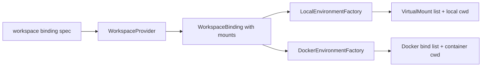

# 10 - Workspace Mount Sets

YA Claw supports session-scoped workspace mount sets so desktop clients and API clients can run one session across multiple folders while keeping one default working directory.

## Goal

A workspace mount set gives each session a typed execution boundary:

- one or more mounted workspace folders
- one default mount
- one default cwd inside the virtual workspace namespace
- read/write mode per mount
- provider-specific host and Docker path mapping
- a stable metadata shape that survives session continuation and run replay

The default service workspace remains the bootstrap workspace for deployments that omit request-level workspace configuration.

## API Model

```python
from typing import Literal
from pydantic import BaseModel, Field

class WorkspaceMountSpec(BaseModel):
    id: str | None = None
    name: str | None = None
    host_path: str
    virtual_path: str
    mode: Literal["rw", "ro"] = "rw"
    docker_host_path: str | None = None
    metadata: dict[str, object] = Field(default_factory=dict)

class WorkspaceBindingSpec(BaseModel):
    mounts: list[WorkspaceMountSpec]
    default_mount_id: str | None = None
    cwd: str | None = None
    metadata: dict[str, object] = Field(default_factory=dict)
```

Request models use the same optional field:

```python
workspace: WorkspaceBindingSpec | None = None
```

The field is accepted by:

- `SessionCreateRequest`
- `SessionRunCreateRequest`
- `RunCreateRequest`
- foreground stream variants for the same creation routes

## JSON Shape

```json
{
  "workspace": {
    "mounts": [
      {
        "id": "main",
        "name": "ya-mono",
        "host_path": "/Users/jizhongsheng/code/yet-another-agents/ya-mono",
        "virtual_path": "/workspace/main",
        "mode": "rw"
      },
      {
        "id": "docs",
        "name": "product-docs",
        "host_path": "/Users/jizhongsheng/docs/product",
        "virtual_path": "/workspace/docs",
        "mode": "ro"
      }
    ],
    "default_mount_id": "main",
    "cwd": "/workspace/main"
  }
}
```

## Persistence

The MVP stores the request workspace binding in session metadata:

```json
{
  "workspace": {
    "mounts": [],
    "default_mount_id": "main",
    "cwd": "/workspace/main"
  }
}
```

Run metadata can carry a workspace override with the same shape. Session metadata stays the durable default for the chat or conversation. Run metadata records special execution overrides for one run.

Future schema normalization can move this data into `workspace_bindings` and `workspace_mounts` tables while preserving the API shape.

## Inheritance

Workspace resolution follows this order:

1. load the session workspace from `session.metadata["workspace"]`
2. merge `run.metadata["workspace"]` when present
3. use the configured service workspace when session and run metadata omit workspace

The merge is whole-binding replacement for the MVP. A later patch-style merge can add or remove mounts by `id`.

Session continuation inherits the session workspace. Forked sessions copy the source session workspace into the child session by default. A fork request can supply a new workspace binding for the child session. Schedules, heartbeat runs, bridge-triggered runs, and memory sessions inherit the source session workspace when they execute in session context.

## Validation

The controller and provider validate workspace input before creating executable environments:

- `mounts` contains at least one entry
- each mount has a stable `id`; the provider can derive one from `virtual_path` for legacy clients
- `virtual_path` is absolute and unique within the binding
- `virtual_path` stays under `/workspace` for Docker and sandboxed local environments
- exactly one default mount is selected when more than one mount exists
- `cwd` is absolute and falls under one declared virtual mount
- `mode` is `rw` or `ro`
- `host_path` resolves to an existing directory for local and Docker providers
- path policy exposes writable access only for mounts with `mode="rw"`

Provider-specific policies can add host allowlists, trust prompts, or deployment-level root restrictions.

## WorkspaceBinding Runtime Shape

`WorkspaceBinding` keeps legacy default-root fields and adds mount details.

```python
@dataclass(slots=True)
class WorkspaceMountBinding:
    id: str
    host_path: Path
    virtual_path: Path
    mode: Literal["rw", "ro"] = "rw"
    docker_host_path: Path | None = None
    name: str | None = None
    metadata: dict[str, Any] = field(default_factory=dict)

@dataclass(slots=True)
class WorkspaceBinding:
    host_path: Path
    virtual_path: Path
    cwd: Path
    readable_paths: list[Path]
    writable_paths: list[Path]
    mounts: list[WorkspaceMountBinding] = field(default_factory=list)
    environment_overrides: dict[str, str] = field(default_factory=dict)
    metadata: dict[str, Any] = field(default_factory=dict)
    backend_hint: str | None = None
```

The `host_path`, `virtual_path`, and `cwd` fields describe the default mount for compatibility with current runtime assembly and prompt code.

## Environment Factory Mapping

Local environments map each virtual mount to a host path. Docker environments bind each daemon-visible host path into its declared virtual path.



`EnvironmentFactory` computes the concrete host cwd from the virtual `cwd` by finding the owning mount and joining the relative path onto that mount's host path. Docker uses the virtual `cwd` directly.

## Prompt and Guidance

The runtime system prompt lists every mount and the default cwd:

```text
Workspace mounts:
- main: /workspace/main, writable
- docs: /workspace/docs, read-only
Default working directory: /workspace/main
```

Workspace guidance and memory default to the selected default mount:

- guidance: `<default_mount>/AGENTS.md`
- heartbeat guidance: `<default_mount>/HEARTBEAT.md`
- workspace MCP config: `<default_mount>/.ya-claw/mcp.json`
- session memory files: `<default_mount>/memory/`
- skill discovery: `<default_mount>/.agents/skills/`

Clients can use additional mounts for references, generated artifacts, or read-only source material.

## Capability Discovery

`/api/v1/claw/info` and desktop capability discovery expose mount-set support:

```json
{
  "features": {
    "session_workspace_binding": true,
    "run_workspace_override": true,
    "multi_mount_workspaces": true
  },
  "workspace_mount_modes": ["rw", "ro"],
  "limits": {
    "max_workspace_mounts_per_session": 8
  }
}
```

## Implementation Plan

01. add `WorkspaceMountSpec` and `WorkspaceBindingSpec` controller models
02. add optional `workspace` fields to session and run creation request models
03. store session workspace binding in `session.metadata["workspace"]`
04. store run workspace override in `run.metadata["workspace"]`
05. merge session and run workspace metadata in coordinator workspace resolution
06. extend `WorkspaceBinding` with `mounts`
07. update local and Docker providers to parse mount sets and build multi-mount bindings
08. update local and Docker environment factories to compute mounts and cwd from the binding
09. update runtime prompt, guidance loading, MCP resolution, and memory store defaults
10. add API and provider tests for single mount, multi mount, read-only mount, cwd validation, and run override
