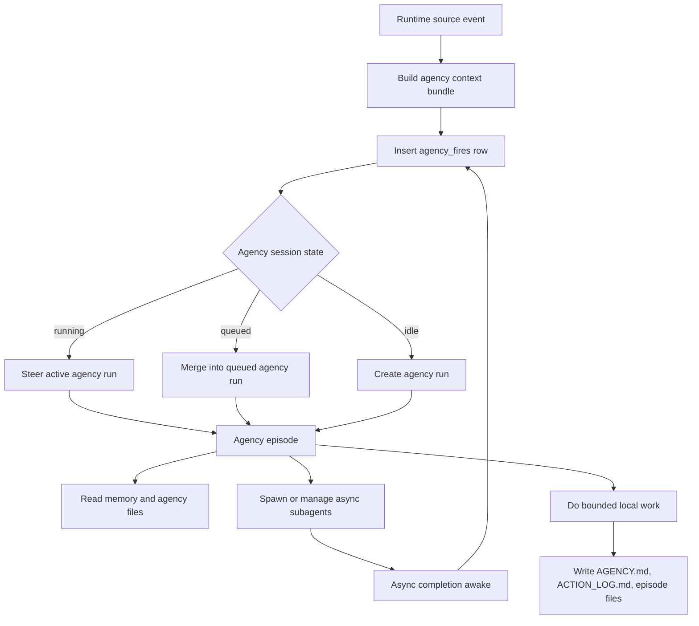
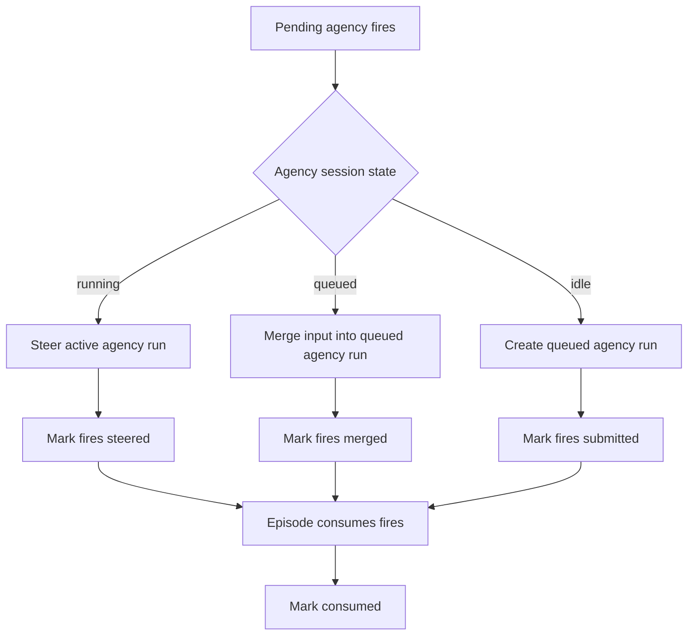
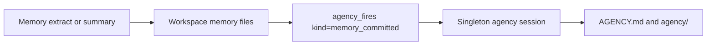

# 11 - Singleton Agency

YA Claw supports Agency as a singleton runtime coordinator. One Claw instance owns one internal `session_type="agency"` session. Conversation messages, bridge events, memory commits, async task completions, manual triggers, and idle timers become durable agency fires. Each fire carries enough context for the agency session to act without relying on low-density summary or compact events.

Agency is an event-driven session. It receives normal context-bearing input when idle, and context-bearing steering while running.

## Design Goals

- Make proactive agency a first-class runtime feature built on sessions, runs, steering, restore state, workspace files, and async task completion wake-ups.
- Maintain exactly one internal `session_type="agency"` session per Claw instance.
- Bridge all meaningful runtime messages and session events into the agency session as durable fires.
- Route new fires to the active agency run through steer, merge fires into a queued agency run, and create a new run when idle.
- Include compact high-density context bundles in every agency fire payload.
- Wake the agency session after a configurable idle window from the last completed agency episode.
- Let the agency session use session-backed async subagents and query/manage current-session child tasks.
- Use a fixed agency system prompt. The configured agency profile supplies model, model settings, model config, tools, MCPs, approval policy, and subagent definitions.
- Keep agency state auditable through run metadata, fire records, traces, workspace action logs, and episode files.

## Conceptual Model

Agency receives a stream of durable fires:

1. A source event is observed: user message, bridge event, memory commit, async task completion, manual trigger, or idle timer.
2. The runtime builds a compact context bundle around the source event.
3. The fire is inserted with a dedupe key.
4. Dispatch chooses steer, merge, or create-run based on singleton agency session state.
5. The agency episode reads fires, memory, source traces, async task state, and workspace files.
6. The agency episode plans bounded local work, starts async tasks when useful, records decisions, and emits a structured result.
7. Terminal post-processing updates consumed fires, memory capture, and async completion wake-ups.



## Naming Model

| Layer                 | Name                   | Responsibility                                                     |
| --------------------- | ---------------------- | ------------------------------------------------------------------ |
| Product capability    | Agency                 | proactive assistance, intention maintenance, background work       |
| Internal session type | `agency`               | singleton session that serializes agency state and active episodes |
| Trigger type          | `agency`               | run category for agency episodes                                   |
| Input unit            | agency fire            | durable event that wakes, merges into, or steers agency work       |
| Workspace index       | `AGENCY.md`            | compact active intentions and watchlist                            |
| Workspace log         | `agency/ACTION_LOG.md` | append-only recent agency action ledger                            |

Use `agency` in API, database, settings, modules, prompts, and UI. Use `fire` for durable wake/steer records.

## Workspace Agency Layout

Agency files live at the workspace root, alongside the `memory/` directory used by session memory.

```text
/workspace/
├── AGENCY.md
├── agency/
│   ├── ACTION_LOG.md
│   ├── episodes/
│   │   └── 20260518-agency-episode.md
│   ├── intentions/
│   │   └── agency-20260518-001.md
│   └── archive/
│       └── 202605-agency-archive.md
└── memory/
    ├── MEMORY.md
    ├── CHANGELOG.md
    └── 20260501-event.md
```

Rules:

- `AGENCY.md` is the compact active agency index loaded for agency runs.
- `AGENCY.md` target size is 16 KB and hard cap is 32 KB.
- Detailed intention material lives in `agency/intentions/*.md`.
- Episode records live in `agency/episodes/*.md`.
- `agency/ACTION_LOG.md` records recent decisions, actions, deferrals, outcomes, async task references, and consumed fire IDs.
- Stable conclusions can later enter `memory/MEMORY.md` through the memory extraction lifecycle.

## Singleton Agency Session

The singleton agency session is stored in the existing `sessions` table.

```json
{
  "session_type": "agency",
  "source_session_id": "19aafc63e85a06fb38321a895de724d0",
  "profile_name": "default",
  "metadata": {
    "agency": {
      "kind": "claw_agency_session",
      "scope": "global",
      "scope_key": "agency:global",
      "version": 2,
      "enabled": true,
      "profile_name": "default"
    }
  }
}
```

Constants:

```python
AGENCY_SINGLETON_SCOPE_KEY = "agency:global"
AGENCY_SINGLETON_SOURCE_SESSION_ID = sha256(AGENCY_SINGLETON_SCOPE_KEY.encode()).hexdigest()[:32]
```

The unique index on `(session_type, source_session_id)` enforces one singleton agency session per Claw database.

## Agency Profile and System Prompt

Agency runs always use a fixed agency system prompt from `ya_claw/agency/prompt.py`.

The resolved agency profile supplies runtime execution settings:

- model;
- model settings;
- model config;
- builtin toolsets;
- MCP configuration;
- approval policy;
- subagent definitions;
- workspace backend hint.

`profile.system_prompt` is ignored for `session_type="agency"`. This keeps agency behavior stable while allowing operators to choose model/tool/runtime settings through profiles.

Runtime assembly rule:

```python
if session_record.session_type == "agency":
    system_prompt = AGENCY_SYSTEM_PROMPT
else:
    system_prompt = profile.system_prompt
```

## Agency Fires Table

`agency_fires` is the durable input stream and pending queue.

Fields:

| Column              | Type              | Description                                                                  |
| ------------------- | ----------------- | ---------------------------------------------------------------------------- |
| `id`                | string32 PK       | fire id                                                                      |
| `kind`              | string32          | fire kind                                                                    |
| `status`            | string32          | `pending`, `submitted`, `steered`, `merged`, `consumed`, `skipped`, `failed` |
| `scheduled_at`      | datetime          | due time                                                                     |
| `fired_at`          | datetime nullable | actual fire creation time                                                    |
| `dedupe_key`        | string255 unique  | global dedupe key                                                            |
| `source_session_id` | string32 nullable | referenced source conversation session                                       |
| `source_run_id`     | string32 nullable | source run, memory run, or async task run                                    |
| `agency_session_id` | string32 nullable | singleton agency session id                                                  |
| `run_id`            | string32 nullable | agency run that received the fire                                            |
| `active_run_id`     | string32 nullable | steer target when status is `steered`                                        |
| `priority`          | integer           | lower value dispatches first                                                 |
| `payload`           | JSON              | context-bearing structured payload                                           |
| `error_message`     | text nullable     | failure detail                                                               |
| `created_at`        | datetime          | creation time                                                                |
| `updated_at`        | datetime          | update time                                                                  |
| `consumed_at`       | datetime nullable | successful episode consumption time                                          |

Fire kinds:

| Kind                    | Source                                                 | Typical priority |
| ----------------------- | ------------------------------------------------------ | ---------------- |
| `manual`                | user or API request                                    | 10               |
| `message_observed`      | normal session input, bridge message, or user steering | 20               |
| `async_task_completed`  | session-backed async task terminal post-process        | 25               |
| `memory_committed`      | memory extract or summary commit                       | 30               |
| `bridge_event_observed` | accepted bridge event with normalized payload          | 35               |
| `run_committed`         | source conversation run commit                         | 40               |
| `idle_timer`            | agency idle wake                                       | 50               |
| `compact`               | compact or summarize handoff                           | 70               |

## Context Bundle

Every fire payload can include `context_bundle`. The bundle is compact, source-specific, and safe for steering into a running agency episode.

```json
{
  "context_bundle": {
    "source": {
      "kind": "conversation_message",
      "session_id": "session-...",
      "run_id": "run-...",
      "sequence_no": 12,
      "trigger_type": "api"
    },
    "input_parts": [
      {"type": "text", "text": "User message..."}
    ],
    "recent_turns": [
      {
        "run_id": "run-...",
        "sequence_no": 11,
        "input_preview": "...",
        "output_summary": "..."
      }
    ],
    "memory": {
      "brief": "Selected MEMORY.md excerpt or hash reference",
      "changed_files": ["memory/MEMORY.md"]
    },
    "bridge": {
      "adapter": "lark",
      "external_chat_id": "...",
      "previous_messages": []
    },
    "async_tasks": {
      "active_count": 2,
      "recent_completed": []
    },
    "workspace": {
      "cwd": "/workspace",
      "fingerprint": "..."
    }
  }
}
```

Bundle rules:

- Keep full raw history in source session APIs and run traces.
- Put high-value recent facts, references, IDs, and previews in the fire payload.
- Use source IDs and run IDs for deep inspection through tools.
- Apply configurable max char budgets per bundle section.

## Dispatch Rules



Behavior:

- `ensure_agency_session()` creates or returns the singleton session.
- Manual, message, memory, async completion, and bridge fires can dispatch immediately after insert.
- Running agency run receives new fire input through runtime steering and AGUI steer events.
- Queued agency run receives appended `input_parts`.
- Idle agency session creates a new queued run with `restore_from_run_id=head_success_run_id`.
- Successful agency run commit marks run fire IDs as `consumed`.
- Failed or cancelled agency run marks submitted, merged, and steered fires as `failed`.

Agency run input part:

```json
{
  "type": "command",
  "name": "agency_fire",
  "params": {
    "fire_id": "fire-...",
    "kind": "message_observed",
    "source_session_id": "session-...",
    "source_run_id": "run-...",
    "payload": {
      "context_bundle": {}
    }
  }
}
```

## Bridging Runtime Messages

The runtime creates agency fires from normal message flow:

| Runtime source               | Fire kind               | Timing                                   |
| ---------------------------- | ----------------------- | ---------------------------------------- |
| API conversation input       | `message_observed`      | after source run is created or accepted  |
| Bridge inbound message       | `message_observed`      | after event dedupe and session mapping   |
| Bridge non-message event     | `bridge_event_observed` | after accepted event normalization       |
| User steering for active run | `message_observed`      | after steering batch is recorded         |
| Conversation run commit      | `run_committed`         | after successful source run commit       |
| Memory run commit            | `memory_committed`      | after memory lifecycle updates state     |
| Async child run terminal     | `async_task_completed`  | after async task lifecycle updates state |
| Compact or summarize handoff | `compact`               | after SDK handoff metadata is captured   |

The agency session sees normal conversation activity even when memory extraction has not yet run. Memory commits remain a higher-quality signal with durable memory file deltas.

## Idle Wake

The agency dispatcher wakes the singleton session after a configurable idle window.

Rules:

1. Active agency run receives new fires through steering.
2. Pending fires dispatch before idle timer creation.
3. Idle timer due time is based on the latest terminal agency run time plus `agency_idle_wake_delay_seconds`.
4. The dedupe key uses the terminal run id and due time.
5. Idle wake payload includes recent fire counts, active async task counts, and next wake hints from the previous episode when available.

Settings:

```python
agency_idle_wake_enabled: bool = True
agency_idle_wake_delay_seconds: int = 900
agency_min_wake_interval_seconds: int = 300
```

## Async Subagent Use

Agency receives the session-backed async tools from [07-async-subagents.md](07-async-subagents.md):

- `spawn_delegate`
- `list_async_subagents`
- `get_async_subagent`
- `steer_async_subagent`
- `cancel_async_subagent`

`spawn_delegate` handles both new child sessions and resume through `name`. `get_async_subagent` returns task detail, latest output, summary, and trace references. Agency can start parallel investigations and continue the current episode. Child completion creates `async_task_completed` fires. If the agency episode is still running, the completion is steered into it. If the episode has ended, the completion creates the next agency run when the agency session is idle.

## Runtime Context Assembly

Agency runs use:

- fixed `AGENCY_SYSTEM_PROMPT`;
- regular workspace guidance from `AGENTS.md`;
- stable memory from `memory/MEMORY.md`;
- agency index from `AGENCY.md`;
- action history from `agency/ACTION_LOG.md`;
- current-session async subagent context that reminds the agency about running and recently completed child sessions;
- recent memory and agency file indexes;
- source session tools for referenced conversations and traces;
- fire payloads with context bundles and risk policy.

Injected context blocks:

```xml
<agency-context source="agency">
Episode ID: episode-...
Agency session ID: session-...
Agency scope: agency:global
Fire IDs: fire-...
Trigger kinds: message_observed,memory_committed
Source session IDs: session-a,session-b
</agency-context>

<async-subagents session-id="agency-session-...">
  <subagent id="task-..." name="repo-map" subagent-name="explorer" status="running" />
</async-subagents>
```

`agency-context`, `agency-index-context`, `agency-action-log-context`, `agency-file-index`, and `async-subagents` are registered in `injected_context_tags` so SDK trim-mode handoff strips historical runtime snapshots from user prompt history.

## Source Session Tools

Agency runs execute inside the singleton agency session and receive referenced source sessions through fire metadata.

Tools:

- `list_source_session_turns` lists completed turns from an explicit referenced source session or from the primary source session by default.
- `get_source_run_trace` reads a run trace referenced by agency fire metadata.
- `list_agency_runs` lists recent episodes from the current singleton agency session.
- Async subagent tools list, inspect, steer, and cancel child work owned by the agency session through the Claw self-call client.

The internal client resource keeps bearer tokens hidden from the model. Tool responses include source IDs for auditability.

## API Surface

Top-level endpoints:

| Method | Path                            | Purpose                                                                         |
| ------ | ------------------------------- | ------------------------------------------------------------------------------- |
| `GET`  | `/api/v1/agency/config`         | read enabled state, profile, idle wake, singleton session id, and risk policy   |
| `GET`  | `/api/v1/agency/status`         | read active/idle/queued state, active run, latest run, pending fires, next wake |
| `GET`  | `/api/v1/agency/fires?limit=50` | list fire history                                                               |
| `POST` | `/api/v1/agency:trigger`        | create a manual fire and dispatch it                                            |
| `POST` | `/api/v1/agency:clear`          | archive the current singleton agency session, clear fires and workspace files   |
| `POST` | `/api/v1/agency:bootstrap`      | ensure the singleton agency session exists                                      |

`GET /agency/status` example:

```json
{
  "enabled": true,
  "agency_session_id": "session-...",
  "state": "running",
  "active_run_id": "run-...",
  "latest_run_id": "run-...",
  "next_fire_at": "2026-05-18T13:30:00Z",
  "pending_fire_count": 2,
  "active_async_task_count": 3,
  "last_fire": {
    "id": "fire-...",
    "kind": "async_task_completed",
    "status": "steered",
    "run_id": "run-..."
  }
}
```

## Web UI

The Agency page has four product areas:

1. Top status strip:
   - enabled state;
   - state: idle, queued, or running;
   - profile;
   - singleton agency session id;
   - active run id;
   - pending fire count;
   - active async task count;
   - next idle wake.
2. Fire history sidebar:
   - message observed, bridge, memory, async completion, manual, idle timer, and compact fires;
   - status: submitted, steered, merged, consumed, failed;
   - source session, source run, async task, and fire target references.
3. Chat-like agency session flow:
   - query `agency_session_id` from status/config;
   - use existing session history API for the singleton agency session;
   - render agency runs as episodes;
   - render AGUI messages and tool calls as a chat-like flow.
4. Async task panel:
   - list child async task sessions owned by agency;
   - show queued/running/completed/failed state;
   - link to child session detail and run trace;
   - expose steer, cancel, and resume actions when authorized.

```mermaid
flowchart LR
    C[GET /agency/config] --> P[Agency Page]
    S[GET /agency/status] --> P
    S --> SID[agency_session_id]
    SID --> H[GET /sessions/{agency_session_id}]
    SID --> AT[GET /sessions/{agency_session_id}/async-tasks]
    H --> FLOW[Episode flow]
    AT --> PANEL[Async task panel]
    F[GET /agency/fires] --> HISTORY[Fire history]
```

## Interaction With Memory Lifecycle

Memory extraction writes stable and episodic memory. Agency consumes memory committed fires with context bundles.



Rules:

- Memory extract or summary completion creates a `memory_committed` fire.
- The fire references the source conversation and memory run id.
- The payload includes changed files, memory job kind, source sequence window, and selected memory delta.
- Agency output can later be fed back into memory extraction through the existing memory lifecycle.

## Safety Model

Agency runs are unattended. The safety mode matches cron-style behavior:

- external sends require explicit safe channels and policy approval;
- destructive operations are denied;
- deployments are denied;
- secret access is denied;
- payment and billing changes are denied;
- security changes and irreversible external actions are denied;
- shell review uses unattended mode and converts approval-needed outcomes to deny.

Allowed autonomous work focuses on local observation, organization, drafting, safe file edits, local checks, async investigation, and deferred decision records.

## Configuration

Settings:

```python
agency_enabled: bool = False
agency_profile: str | None = None
agency_idle_wake_enabled: bool = True
agency_idle_wake_delay_seconds: int = 900
agency_min_wake_interval_seconds: int = 300
agency_fire_batch_limit: int = 20
agency_memory_capture_enabled: bool = True
agency_context_max_chars: int = 8000
agency_context_recent_turns_limit: int = 6
agency_context_recent_turn_max_chars: int = 800
agency_index_target_chars: int = 16_000
agency_index_max_chars: int = 32_000
agency_action_log_recent_chars: int = 32_000
agency_unattended_shell_review_risk_threshold: Literal["low", "medium", "high", "extra_high"] | None = "extra_high"
```

`agency_fire_batch_limit` is a backpressure safety limit for abnormal pending fire buildup.

## Implementation Plan

01. Extend `AgencyFireKind` with message, bridge, run, async completion, and idle timer kinds.
02. Add context bundle builders for API input, bridge input, memory commit, async completion, run commit, compact handoff, and idle wake.
03. Update agency dispatch to use context-bearing fires for steer, merge, and create-run paths.
04. Change timer logic from fixed interval to idle wake based on latest terminal agency run.
05. Modify runtime ingress and terminal post-processing to create fires for all configured source events.
06. Ensure agency run assembly uses fixed `AGENCY_SYSTEM_PROMPT` while profile supplies model/runtime settings.
07. Wire session-backed async task completion into agency fires through `AsyncTaskLifecycle`.
08. Add async task injected context and tools to agency profiles.
09. Update API responses and Web UI to show fire kinds, context references, idle wake, and async subagent state.
10. Add tests for message-observed fires, context bundle budgets, running steer, queued merge, idle wake, async completion awake, fixed prompt assembly, and UI type safety.

## Initial Milestone

The first shippable milestone is:

- singleton internal `session_type="agency"` session;
- context-bearing `agency_fires` table usage;
- manual `agency:trigger` endpoint;
- message-observed fire creation for normal conversation and bridge input;
- memory committed fire dispatch with memory delta context;
- async task completed fire dispatch;
- idle wake dispatch;
- active-run steering for new agency fires;
- queued-run merge for new agency fires;
- queued agency run creation when idle;
- fixed agency prompt with profile-derived runtime settings;
- `AGENCY.md` and `agency/ACTION_LOG.md` context;
- Agency Web UI with status, fire history, chat-like singleton agency session rendering, and async task panel.
