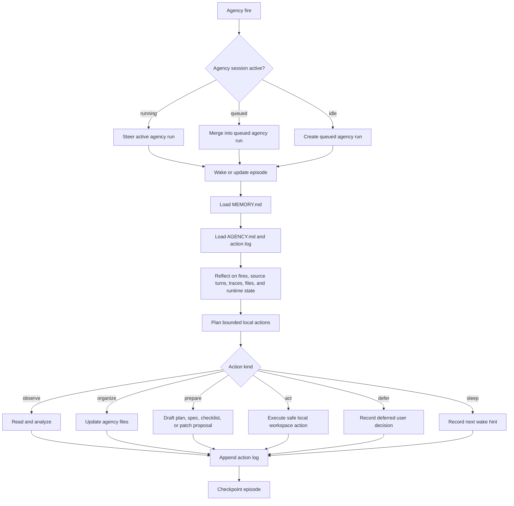
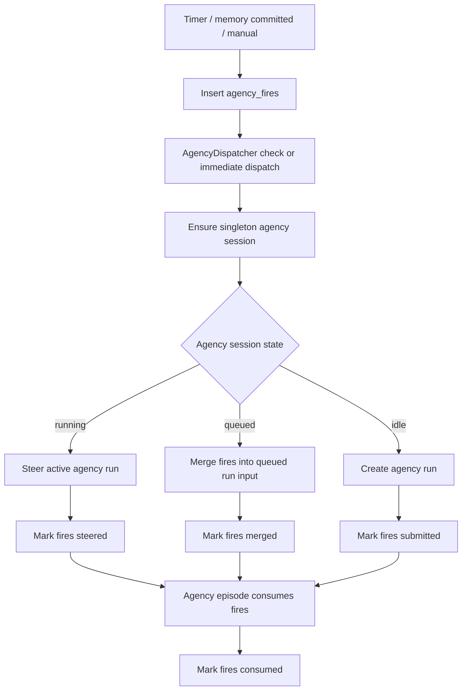
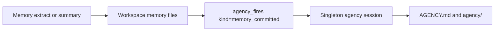

# 11 - Singleton Agency

YA Claw supports Agency as a Heartbeat-style runtime capability. One Claw instance owns one singleton internal `session_type="agency"` session. Timer fires, memory committed fires, and manual fires wake that session, steer active work, or create a new bounded agency episode.

Agency is the product capability. Reflection is one phase inside the agency episode: the agent inspects memory, referenced source sessions, run traces, workspace state, and pending fires, then chooses useful local work.

## Design Goals

- Make proactive agency a first-class runtime feature built on sessions, runs, steering, restore state, and workspace files.
- Keep the runtime shape close to Heartbeat: settings-driven config/status endpoints, durable fire history, dispatcher loop, and normal runs.
- Maintain exactly one internal `session_type="agency"` session per Claw instance.
- Treat source conversations as fire context, with ownership held by the singleton agency session.
- Convert timer, memory committed, and manual triggers into durable `agency_fires` records.
- Route new fires to the active agency run through steer, merge fires into a queued agency run, and create a new run when idle.
- Keep semantic memory under `memory/` and agency state under workspace-level `AGENCY.md` and `agency/` files.
- Make every agency episode auditable through run metadata, fire records, traces, workspace action logs, and episode files.
- Use unattended deny mode for external actions and approval-gated operations.

## Conceptual Model

Agency models a lightweight runtime loop:

1. Wake from a fire or receive a fire while active.
2. Recall stable memory and open intentions.
3. Reflect on recent source conversations, run traces, workspace state, schedules, and runtime fires.
4. Update the working set of intentions and candidate directions.
5. Plan a bounded local action batch.
6. Execute safe local work, prepare artifacts, record deferred decisions, or sleep.
7. Record outcomes, checkpoints, consumed fire IDs, and next wake hints.
8. Sleep when the current episode is done.



## Naming Model

| Layer                 | Name                   | Responsibility                                                     |
| --------------------- | ---------------------- | ------------------------------------------------------------------ |
| Product capability    | Agency                 | proactive assistance, intention maintenance, background work       |
| Internal session type | `agency`               | singleton session that serializes agency state and active episodes |
| Trigger type          | `agency`               | run category for agency episodes                                   |
| Input unit            | agency fire            | durable event that wakes, merges into, or steers agency work       |
| Cognitive phase       | reflection             | inspect context, assess fires, and choose useful local work        |
| Workspace index       | `AGENCY.md`            | compact active intentions and watchlist                            |
| Workspace log         | `agency/ACTION_LOG.md` | append-only recent agency action ledger                            |

Use `agency` in API, database, settings, modules, prompts, and UI. Use `fire` for durable wake/steer records, mirroring Heartbeat.

## Workspace Agency Layout

Agency files live at the workspace root, alongside the `memory/` directory used by session memory.

```text
/workspace/
├── AGENCY.md
├── agency/
│   ├── ACTION_LOG.md
│   ├── episodes/
│   │   └── 20260516-agency-episode.md
│   ├── intentions/
│   │   └── agency-20260516-001.md
│   └── archive/
│       └── 202605-agency-archive.md
└── memory/
    ├── MEMORY.md
    ├── CHANGELOG.md
    └── 20260501-event.md
```

Rules:

- `AGENCY.md` is the compact active agency index loaded for agency runs.
- `AGENCY.md` target size is 16 KB and hard cap is 32 KB.
- Detailed intention material lives in `agency/intentions/*.md`.
- Episode records live in `agency/episodes/*.md`.
- `agency/ACTION_LOG.md` records recent decisions, actions, deferrals, outcomes, and consumed fire IDs.
- Agency files use YAML frontmatter with at least `name`, `description`, `kind`, `status`, and `updated_at` when discovery matters.
- Stable conclusions can later enter `memory/MEMORY.md` through the memory extraction lifecycle.

## Singleton Agency Session

The singleton Agency session is stored in the existing `sessions` table.

```json
{
  "session_type": "agency",
  "source_session_id": "19aafc63e85a06fb38321a895de724d0",
  "metadata": {
    "agency": {
      "kind": "claw_agency_session",
      "scope": "global",
      "scope_key": "agency:global",
      "version": 1,
      "enabled": true,
      "profile_name": "default"
    }
  }
}
```

Constants:

```python
AGENCY_SINGLETON_SCOPE_KEY = "agency:global"
AGENCY_SINGLETON_SOURCE_SESSION_ID = sha256(AGENCY_SINGLETON_SCOPE_KEY.encode()).hexdigest()[:32]
```

The existing unique index on `(session_type, source_session_id)` enforces one singleton Agency session per Claw database.

## Agency Fires Table

`agency_fires` is the durable trigger history and pending queue. It replaces the old per-source agency state and signal tables.

Fields:

| Column              | Type              | Description                                                                  |
| ------------------- | ----------------- | ---------------------------------------------------------------------------- |
| `id`                | string32 PK       | fire id                                                                      |
| `kind`              | string32          | `manual`, `timer`, `memory_committed`, or `compact`                          |
| `status`            | string32          | `pending`, `submitted`, `steered`, `merged`, `consumed`, `skipped`, `failed` |
| `scheduled_at`      | datetime          | due time; manual and memory use current time                                 |
| `fired_at`          | datetime nullable | actual fire creation time                                                    |
| `dedupe_key`        | string255 unique  | global dedupe key                                                            |
| `source_session_id` | string32 nullable | referenced conversation session                                              |
| `source_run_id`     | string32 nullable | memory run or source run that caused the fire                                |
| `agency_session_id` | string32 nullable | singleton agency session id                                                  |
| `run_id`            | string32 nullable | agency run that received the fire                                            |
| `active_run_id`     | string32 nullable | steer target when status is `steered`                                        |
| `priority`          | integer           | manual before memory committed before timer                                  |
| `payload`           | JSON              | fire-specific structured payload                                             |
| `error_message`     | text nullable     | failure detail                                                               |
| `created_at`        | datetime          | creation time                                                                |
| `updated_at`        | datetime          | update time                                                                  |
| `consumed_at`       | datetime nullable | successful episode consumption time                                          |

Indexes:

```python
UniqueConstraint("dedupe_key", name="uq_agency_fires_dedupe")
Index("ix_agency_fires_status_scheduled", "status", "scheduled_at")
Index("ix_agency_fires_kind_created", "kind", "created_at")
Index("ix_agency_fires_run", "run_id")
Index("ix_agency_fires_source", "source_session_id")
```

Example fire payloads:

```json
{
  "kind": "manual",
  "source_session_id": "session-...",
  "client_token": "manual-...",
  "prompt": "Review recent memory changes and decide next useful work."
}
```

```json
{
  "kind": "memory_committed",
  "source_session_id": "session-...",
  "source_run_id": "memory-run-...",
  "memory_kind": "extract",
  "memory_committed": {
    "changed_files": ["memory/MEMORY.md", "memory/20260517-event.md"]
  }
}
```

```json
{
  "kind": "timer",
  "reason": "scheduled_timer",
  "timer_interval_seconds": 3600
}
```

## Dispatch Rules



Behavior:

- `ensure_agency_session()` creates or returns the singleton session.
- Manual and memory fires can dispatch immediately after insert.
- Timer dispatch runs from `AgencyDispatcher` and uses `agency_timer_interval_seconds` as the single timer interval.
- Running agency run receives new fire input through the runtime steering queue and AGUI steer event.
- Queued agency run receives appended `input_parts`; merged fires keep audit rows.
- Idle agency session creates a new queued run with `restore_from_run_id=head_success_run_id`.
- Successful agency run commit marks run fire IDs as `consumed`.
- Terminal failed/cancelled agency run marks submitted, merged, and steered fires as `failed`.

## Agency Run Metadata

```json
{
  "agency": {
    "kind": "episode",
    "agency_session_id": "session-...",
    "fire_ids": ["fire-..."],
    "trigger_kinds": ["manual", "memory_committed"],
    "sources": [
      {
        "fire_id": "fire-...",
        "source_session_id": "session-...",
        "source_run_id": "run-...",
        "kind": "memory_committed"
      }
    ],
    "source_session_ids": ["session-..."],
    "primary_source_session_id": "session-...",
    "source_run_ids": ["run-..."],
    "episode_id": "episode-...",
    "risk_policy": {
      "max_auto_action_risk": "extra_high"
    }
  },
  "restore_state": true
}
```

Agency run input part:

```json
{
  "type": "command",
  "name": "agency_fire",
  "params": {
    "fire_id": "fire-...",
    "kind": "memory_committed",
    "source_session_id": "session-...",
    "source_run_id": "memory-run-...",
    "payload": {
      "memory_kind": "extract",
      "changed_files": ["memory/MEMORY.md"]
    }
  }
}
```

## Safety Model

Agency runs are unattended. The safety mode matches cron-style behavior:

- external sends are denied;
- destructive operations are denied;
- deployments are denied;
- secret access is denied;
- payment and billing changes are denied;
- security changes and irreversible external actions are denied;
- shell review uses unattended mode and converts approval-needed outcomes to deny.

Allowed autonomous work focuses on local observation, organization, drafting, safe file edits, local checks, and deferred decision records.

## Runtime Context Assembly

Agency runs use:

- fixed `AGENCY_SYSTEM_PROMPT`;
- regular workspace guidance from `AGENTS.md`;
- stable memory from `memory/MEMORY.md`;
- agency index from `AGENCY.md`;
- action history from `agency/ACTION_LOG.md`;
- recent memory and agency file indexes;
- source session tools for referenced conversations and traces;
- fire payloads with source references and risk policy.

Injected context blocks:

```xml
<agency-context source="agency">
Episode ID: episode-...
Agency session ID: session-...
Agency scope: agency:global
Source session IDs: session-a,session-b
Fire IDs: fire-...
Trigger kinds: manual,memory_committed
Sources: [...]
</agency-context>
```

`agency-context`, `agency-index-context`, `agency-action-log-context`, and `agency-file-index` are registered in `injected_context_tags` so SDK trim-mode handoff strips historical agency context from user prompt history.

## Source Session Tools

Agency runs execute inside the singleton agency session and receive referenced source conversation sessions through fire metadata.

Tools:

- `list_source_session_turns` lists completed turns from an explicit referenced source session or from the primary source session by default.
- `get_source_run_trace` reads a run trace referenced by agency fire metadata.
- `list_agency_runs` lists recent episodes from the current singleton agency session.

The internal client resource keeps bearer tokens hidden from the model. Tool responses include source IDs for auditability.

## API Surface

Top-level endpoints:

| Method | Path                            | Purpose                                                                                    |
| ------ | ------------------------------- | ------------------------------------------------------------------------------------------ |
| `GET`  | `/api/v1/agency/config`         | read enabled state, profile, interval, singleton session id, and risk policy               |
| `GET`  | `/api/v1/agency/status`         | read active/idle/queued state, active run, latest run, pending fire count, next timer fire |
| `GET`  | `/api/v1/agency/fires?limit=50` | list fire history                                                                          |
| `POST` | `/api/v1/agency:trigger`        | create a manual fire and dispatch it                                                       |
| `POST` | `/api/v1/agency:clear`          | archive the current singleton agency session, clear fires and workspace agency files       |
| `POST` | `/api/v1/agency:bootstrap`      | ensure the singleton agency session exists                                                 |

`GET /agency/status` example:

```json
{
  "enabled": true,
  "agency_session_id": "session-...",
  "state": "running",
  "active_run_id": "run-...",
  "latest_run_id": "run-...",
  "next_fire_at": "2026-05-17T13:30:00Z",
  "pending_fire_count": 2,
  "last_fire": {
    "id": "fire-...",
    "kind": "memory_committed",
    "status": "steered",
    "run_id": "run-..."
  }
}
```

`POST /agency:trigger` example:

```json
{
  "kind": "manual",
  "source_session_id": "session-...",
  "client_token": "manual-...",
  "prompt": "Review current workspace memory and propose the next useful action."
}
```

`POST /agency:clear` behavior:

- Archives the current singleton session by moving its `source_session_id` away from `AGENCY_SINGLETON_SOURCE_SESSION_ID`.
- Clears durable `agency_fires` rows and cancels queued/running agency runs from the archived session.
- Resets workspace agency files by recreating `AGENCY.md`, `agency/ACTION_LOG.md`, `agency/episodes/`, `agency/intentions/`, and `agency/archive/`.
- Ensures the next agency start uses a newly initialized singleton session with a fresh `agency_session_id`.

## Web UI

The Agency page has three product areas:

1. Top status strip:
   - Agency active/disabled;
   - state: idle, queued, or running;
   - profile;
   - singleton agency session id;
   - active run id;
   - pending fire count;
   - next timer fire.
2. Fire history sidebar:
   - manual, timer, memory committed, and compact fires;
   - status: submitted, steered, merged, consumed, failed;
   - source session and source run references;
   - run id or active run id target.
3. Chat-like agency session flow:
   - query `agency_session_id` from status/config;
   - use existing session history API for the singleton agency session;
   - render agency runs as episodes;
   - render AGUI messages and tool calls as a chat-like flow;
   - show fire IDs, trigger kinds, source session IDs, files changed, and next wake hints when present.

```mermaid
flowchart LR
    C[GET /agency/config] --> P[Agency Page]
    S[GET /agency/status] --> P
    S --> SID[agency_session_id]
    SID --> H[GET /sessions/{agency_session_id}]
    H --> FLOW[Chat-like episode flow]
    F[GET /agency/fires] --> HISTORY[Fire history]
    T[POST /agency:trigger] --> REFRESH[Refresh status, fires, and session]
    CLR[POST /agency:clear] --> FRESH[Fresh singleton session]
    FRESH --> REFRESH
```

## Interaction With Memory Lifecycle

Memory extraction writes stable and episodic memory. Agency consumes memory committed fires.



Rules:

- Memory extract or summary completion creates a `memory_committed` fire.
- The fire references the source conversation and memory run id.
- Agency output can later be fed back into memory extraction through the existing memory lifecycle.

## Configuration

Settings:

```python
agency_enabled: bool = False
agency_profile: str | None = None
agency_timer_interval_seconds: int = 3600
agency_fire_batch_limit: int = 20
agency_memory_capture_enabled: bool = True
agency_context_max_chars: int = 8000
agency_index_target_chars: int = 16_000
agency_index_max_chars: int = 32_000
agency_action_log_recent_chars: int = 32_000
agency_unattended_shell_review_risk_threshold: Literal["low", "medium", "high", "extra_high"] | None = "extra_high"
```

`agency_fire_batch_limit` is a backpressure safety limit for abnormal pending fire buildup. Normal operation usually has only a few pending fires per agency episode.

## Implementation Plan

1. Keep `20260517_000007_session_agency.py` as the existing Agency migration and use `20260517_000008_singleton_agency_fires.py` to drop the old Agency tables and create `agency_fires`.
2. Replace ORM records with `AgencyFireRecord`.
3. Rewrite `AgencyLifecycle` around singleton session ensure, fire creation, dispatch, steer, merge, run creation, and terminal updates.
4. Replace source-session agency endpoints with Heartbeat-like top-level config/status/fires/trigger/bootstrap endpoints.
5. Update memory lifecycle to emit `memory_committed` fires.
6. Update runtime context and prompt from signals/approval language to fires/deny language.
7. Update Web UI to show active/enabled state and render the singleton agency session as chat-like episode flow.
8. Add tests for singleton session, fire dedupe, submit/merge/steer/consume, timer fires, memory committed fires, API responses, and Web UI type safety.
9. Run lint, check, tests, and code review.

## Initial Milestone

The first shippable milestone is:

- singleton internal `session_type="agency"` session;
- `agency_fires` table;
- manual `agency:trigger` endpoint;
- timer fire dispatch;
- memory committed fire dispatch;
- active-run steering for new agency fires;
- queued-run merge for new agency fires;
- queued agency run creation when idle;
- fixed agency prompt with deny-mode safety;
- `AGENCY.md` and `agency/ACTION_LOG.md` context;
- Agency Web UI with active/enabled status, fire history, and chat-like singleton agency session rendering.
