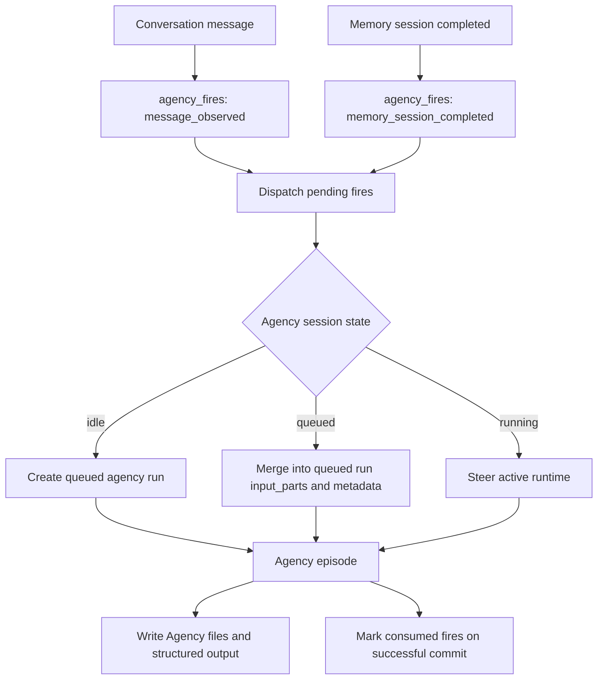

# 11 - Singleton Agency

YA Claw supports Agency as one global internal session. One Claw database owns one `session_type="agency"` session keyed by `agency:global`. Agency receives copied conversation messages and completed memory-session output as durable fires. The fires are submitted through the same session input path used by normal sessions, so Agency follows standard run, queued-merge, and runtime-steer behavior.

## Design Goals

- Maintain exactly one internal `session_type="agency"` session per Claw instance.
- Copy every user/API/bridge conversation message into Agency with source session and run provenance.
- Copy every completed memory session into Agency with memory run `output_text` and `output_summary`.
- Use one unified session submit path for normal sessions and Agency.
- Let Agency use session-backed async subagents from its own singleton session.
- Keep Agency state auditable through `agency_fires`, run metadata, traces, workspace action logs, and episode files.
- Preserve the current Web UI API shape for config, status, fires, bootstrap, and clear while backend semantics settle.

## Non-Goals

- Agency does not receive idle timer fires.
- Agency does not receive product manual trigger fires.
- Agency does not receive broad automatic fires for run commits, async task completion, compact events, or separate bridge-event categories.
- Agency does not receive automatic source memory injection in its system prompt.

## Conceptual Model

Agency receives two durable fire kinds:

1. `message_observed`: a copy of a source session message.
2. `memory_session_completed`: a copy of a completed memory run output.

Dispatch uses unified session submit semantics:

1. The source event inserts an `agency_fires` row with a dedupe key.
2. Pending fires are loaded in priority order.
3. Agency input is submitted to the singleton agency session.
4. If the agency session is idle, submit creates a queued agency run.
5. If the agency session already has a queued run, submit appends fire input parts to that queued run and merges metadata.
6. If the agency session has a running run, submit steers the running run.
7. Terminal post-processing marks fires consumed or failed.



## Singleton Agency Session

The singleton Agency session is stored in `sessions`:

```json
{
  "session_type": "agency",
  "source_session_id": "19aafc63e85a06fb38321a895de724d0",
  "profile_name": "default",
  "metadata": {
    "agency": {
      "kind": "claw_agency_session",
      "scope": "global",
      "scope_key": "agency:global",
      "version": 1,
      "profile_name": "default",
      "risk_policy": {"max_auto_action_risk": "extra_high"}
    }
  }
}
```

Constants:

```python
AGENCY_SINGLETON_SCOPE_KEY = "agency:global"
AGENCY_SINGLETON_SOURCE_SESSION_ID = sha256(AGENCY_SINGLETON_SCOPE_KEY.encode("utf-8")).hexdigest()[:32]
```

The unique index on `(session_type, source_session_id)` enforces one singleton agency session per Claw database.

## Fire Kinds

| Kind                       | Source                                | Required payload                                                                         |
| -------------------------- | ------------------------------------- | ---------------------------------------------------------------------------------------- |
| `message_observed`         | Session submit/create, API, bridge    | `source_kind`, `source_session_id`, `source_run_id`, copied `input_parts`, metadata      |
| `memory_session_completed` | Completed `session_type="memory"` run | `memory_session_id`, `memory_run_id`, `memory_job_kind`, `output_text`, `output_summary` |

`message_observed` priority is higher than `memory_session_completed` so fresh user-visible input reaches Agency quickly. `agency_fires` is a durable delivery record for audit, dedupe, ordering, and status inspection. The message payload reaches Agency through `SessionController.submit_input()` and is delivered with the same semantics as source sessions: create a run when idle, append to a queued run, and steer a running runtime.

Fire status transitions:

- `pending`: inserted and waiting for dispatch.
- `submitted`: included in a newly created agency run.
- `merged`: appended to an existing queued agency run.
- `steered`: delivered to a running agency run.
- `consumed`: agency run committed and consumed the fire ID.
- `failed`: agency run reached a terminal failure before consuming the fire.

## Unified Session Submit

The high-level session input API is:

```http
POST /api/v1/sessions/{session_id}/submit
GET /api/v1/sessions/{session_id}/events
GET /api/v1/runs/{run_id}/events
```

`SessionController.submit_input()` serializes each session through an in-memory per-session lock:

```python
async with runtime_state.session_lock(session_id):
    active = load_active_run(session_id)
    if active.status == "queued":
        append input parts and merge metadata
    elif active.status == "running":
        record runtime steering
    else:
        create queued run
```

The response reports delivery:

- `submitted`: a new async run was created.
- `queued`: a new queue-mode run was created.
- `merged`: input was durably appended to a queued run.
- `steered`: input was sent to a running runtime.

Existing session run and steer routes may remain as compatibility aliases. Product-facing clients should prefer `/submit` for user input and use the GET event streams to follow the active session or run.

## Message Copy Path

Session message copy happens after the source input is accepted by the session submit/create path. The Agency fire payload stores a JSON-compatible copy of the original `input_parts`, the source trigger kind, and source metadata. For bridge messages, metadata includes adapter, tenant, chat, sender, message IDs, and previous-message snapshot when available.

Bridge handling uses the same unified submit logic:

- HITL-pending bridge input is deferred by the HITL controller.
- Active non-HITL bridge input steers through unified submit.
- Idle bridge input creates a run through unified submit.
- Every accepted bridge message is copied to Agency as `message_observed`.

## Memory Completion Path

When a memory run completes, `MemoryLifecycle.on_memory_run_committed()` updates memory orchestration state, enqueues the next memory job if needed, and emits one `memory_session_completed` Agency fire. The fire includes:

```json
{
  "source_session_id": "conversation-session-id",
  "memory_session_id": "memory-session-id",
  "memory_run_id": "memory-run-id",
  "memory_job_kind": "extract",
  "source_run_ids": ["source-run-id"],
  "source_sequence_start": 1,
  "source_sequence_end": 3,
  "output_text": "full memory agent output",
  "output_summary": "compact memory result summary"
}
```

Agency uses the copied output directly. It can inspect source turns and run traces through explicit session tools when it needs additional context.

## Runtime Context

Agency runs use `AGENCY_SYSTEM_PROMPT` from `ya_claw/agency/prompt.py`. The configured agency profile supplies model, model settings, model config, builtin toolsets, MCP configuration, approval policy, subagents, and workspace backend hint.

Agency self-client scope is the Agency session. Async subagents spawned by Agency attach to the Agency session and wake Agency on completion through the existing async-subagent parent wake behavior.

Agency system prompt includes:

- workspace mounts and guidance;
- agency context from run metadata;
- `AGENCY.md` and `agency/ACTION_LOG.md` context.

Agency system prompt does not include automatic memory injection. Source facts arrive through memory completion fires and explicit tools.

## Workspace Agency Layout

```text
/workspace/
├── AGENCY.md
└── agency/
    ├── ACTION_LOG.md
    ├── episodes/
    │   └── 20260518-agency-episode.md
    ├── intentions/
    │   └── agency-20260518-001.md
    └── archive/
        └── 202605-agency-archive.md
```

Rules:

- `AGENCY.md` is the compact active Agency index.
- `agency/ACTION_LOG.md` records recent decisions, actions, deferrals, outcomes, async task references, and consumed fire IDs.
- Episode records live in `agency/episodes/*.md`.
- Intention records live in `agency/intentions/*.md`.

## API

| Method | Path                           | Purpose                                      |
| ------ | ------------------------------ | -------------------------------------------- |
| `GET`  | `/api/v1/agency/config`        | read singleton Agency config                 |
| `GET`  | `/api/v1/agency/status`        | read session state and pending fire count    |
| `GET`  | `/api/v1/agency/fires`         | inspect recent fire audit rows               |
| `POST` | `/api/v1/agency:bootstrap`     | ensure singleton Agency session exists       |
| `POST` | `/api/v1/agency:clear`         | cancel active Agency work and reset files    |
| `POST` | `/api/v1/sessions/{id}/submit` | submit, merge, or steer source session input |
| `GET`  | `/api/v1/sessions/{id}/events` | stream active session events                 |
| `GET`  | `/api/v1/runs/{run_id}/events` | stream active run events                     |

Manual Agency injection belongs to development tooling when needed. It is not a product API surface.

## Test Coverage

Backend tests should cover:

- singleton session creation and reuse;
- `message_observed` fire creation and delivery;
- `memory_session_completed` fire creation with output text and summary;
- idle create, queued merge, and running steer via `SessionController.submit_input()`;
- bridge message delivery through unified submit and Agency copy;
- Agency disabled behavior produces no Agency delivery side effects;
- API config/status/fires/clear surfaces;
- legacy run/steer route compatibility where retained.

Agency is a singleton session that observes messages and memory completions through durable fires, then uses the same session submit machinery as every other Claw session.
