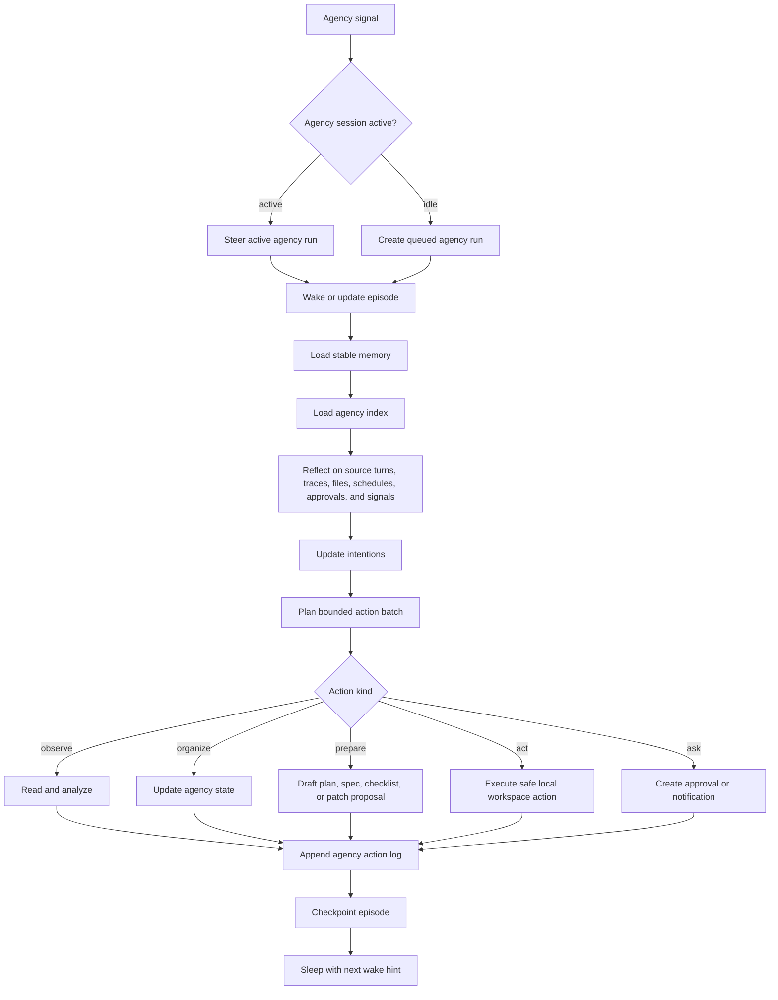
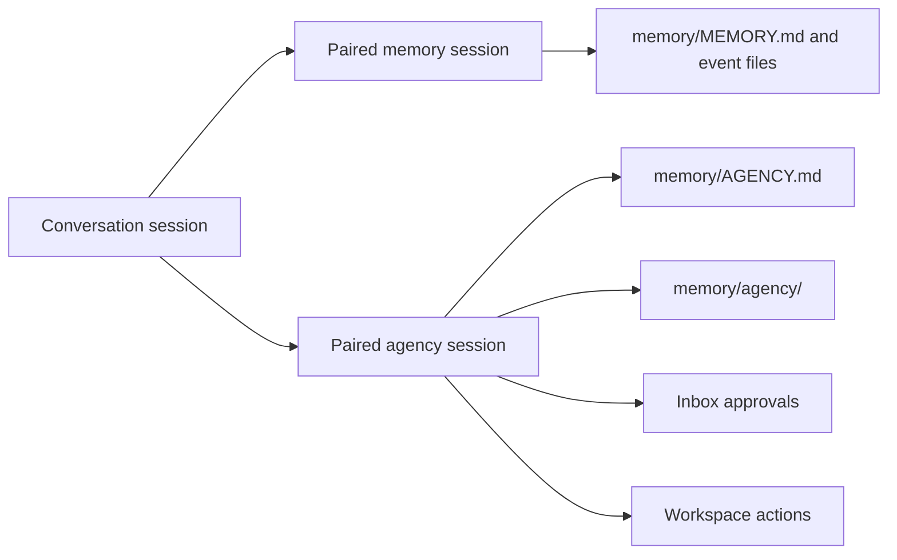
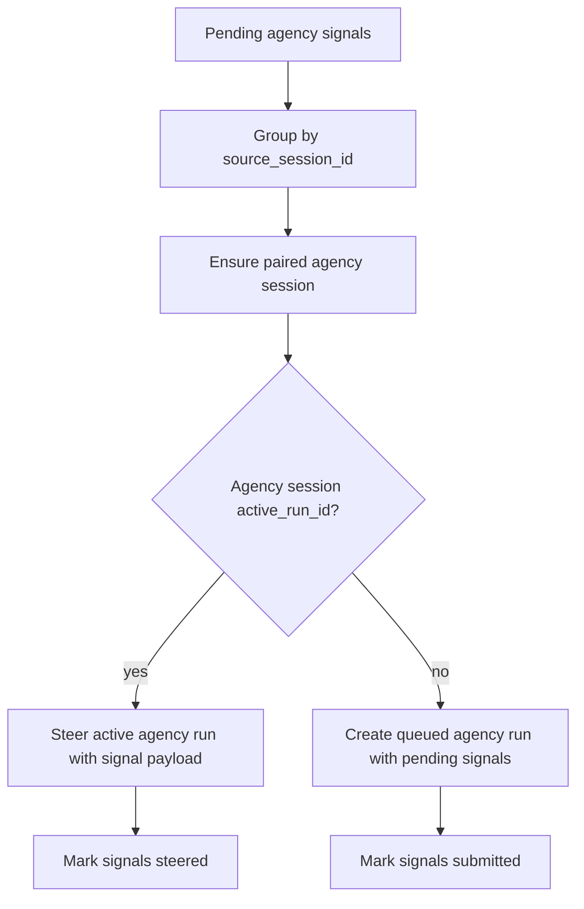
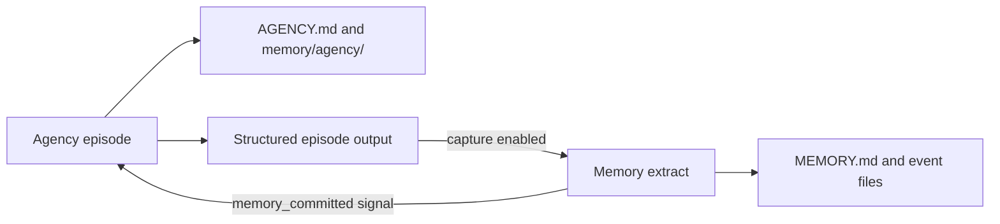

# 11 - Session Agency

YA Claw supports session agency as a workspace-native long-running agency loop. Each conversation session can own a paired internal agency session that receives signals, recalls memory, maintains open intentions, and performs useful bounded work over time.

Agency is the product and runtime capability. Reflection is one phase inside the agency loop: the agent inspects context, evaluates signals, and chooses the next useful step.

## Design Goals

- Make proactive agency a first-class runtime feature built on sessions, runs, steering, and workspace state.
- Reuse the queued-run execution model, active-run steering model, workspace binding, profile resolution, and tool surface already used by bridges, schedules, heartbeat, and memory jobs.
- Keep semantic memory, episodic memory, and agency state as workspace files under `memory/`.
- Give each conversation session a paired long-lived `session_type="agency"` session that serializes agency state and active work.
- Let automatic triggers, scheduled triggers, memory events, failures, and manual triggers become agency signals.
- Route new signals to the active agency run through steer, and create a new agency run when the agency session is idle.
- Make every agency episode auditable through run metadata, structured output, workspace action logs, and episode files.
- Bound agency work with explicit action budgets, risk levels, leases, and approval routing.
- Keep `memory/AGENCY.md` compact as an active agency index; put detailed history under `memory/agency/`.
- Leave room for workspace-level agency across sessions after session agency is stable.

## Conceptual Model

Agency models a lightweight human-like loop:

1. Wake from a signal or receive a signal while active.
2. Recall stable memory and open intentions.
3. Reflect on recent conversation, run traces, workspace state, schedules, approvals, and runtime signals.
4. Update the working set of intentions and candidate directions.
5. Plan a bounded action batch.
6. Execute safe local work, prepare artifacts, defer work, or request approval.
7. Record outcomes, checkpoints, and next wake hints.
8. Sleep when the current episode is done.



Agency and memory extraction share the same workspace-native foundation. Memory extraction decides what should be remembered. Agency decides what could be advanced next and performs bounded work that helps the human.

## Naming Model

| Layer                 | Name                          | Responsibility                                                             |
| --------------------- | ----------------------------- | -------------------------------------------------------------------------- |
| Product capability    | Agency                        | proactive assistance, intention maintenance, background work, approvals    |
| Internal session type | `agency`                      | long-lived paired session that serializes agency state and active episodes |
| Trigger type          | `agency`                      | run category for agency episodes                                           |
| Input unit            | agency signal                 | event that wakes or steers agency work                                     |
| Cognitive phase       | reflection                    | inspect context, assess signals, and choose useful work                    |
| Workspace index       | `memory/AGENCY.md`            | compact active intentions and watchlist                                    |
| Workspace log         | `memory/agency/ACTION_LOG.md` | append-only recent agency action ledger                                    |

Use `agency` in API, database, settings, modules, prompts, and UI. Use `reflection` inside the agency prompt and episode files as the inspect-and-decide phase.

## Memory and Agency Model

Workspace memory has four complementary layers.

| Layer             | Files                                                     | Responsibility                                                                     |
| ----------------- | --------------------------------------------------------- | ---------------------------------------------------------------------------------- |
| Semantic memory   | `memory/MEMORY.md`                                        | stable facts, preferences, durable decisions, constraints, active long-lived goals |
| Episodic memory   | `memory/YYYYMMDD-event.md`                                | source-grounded event notes with YAML frontmatter discovery metadata               |
| Agency memory     | `memory/AGENCY.md`, `memory/agency/**`                    | open intentions, watchlist, action logs, episode records, next wake hints          |
| Procedural memory | `AGENTS.md`, `.agents/skills/`, optional memory playbooks | project conventions, reusable workflows, task procedures                           |

Agency reads all layers. Agency writes primarily to `memory/AGENCY.md` and `memory/agency/`. Stable conclusions can later enter `memory/MEMORY.md` through the memory extraction lifecycle.

## Workspace Agency Layout

Agency files live under the same `memory/` directory used by session memory.

```text
/workspace/
└── memory/
    ├── MEMORY.md
    ├── CHANGELOG.md
    ├── AGENCY.md
    ├── 20260501-event.md
    └── agency/
        ├── ACTION_LOG.md
        ├── episodes/
        │   └── 20260516-agency-episode.md
        ├── intentions/
        │   └── agency-20260516-001.md
        └── archive/
            └── 202605-agency-archive.md
```

Rules:

- `memory/AGENCY.md` is the compact active agency index loaded for agency runs.
- `memory/AGENCY.md` target size is 16 KB and hard cap is 32 KB.
- `memory/AGENCY.md` should contain at most 20 active intentions, 20 watchlist items, and 30 deferred ideas.
- Detailed intention material lives in `memory/agency/intentions/*.md`.
- Episode records live in `memory/agency/episodes/YYYYMMDD-agency-episode.md` or topic-specific episode files.
- `memory/agency/ACTION_LOG.md` records recent agency decisions, actions, approvals, deferrals, outcomes, and consumed signal IDs.
- `memory/agency/archive/*.md` stores closed intentions, old action history, and compacted agency state.
- Agency files use YAML frontmatter with at least `name`, `description`, `kind`, `status`, and `updated_at` when they need discovery.
- `memory/MEMORY.md` remains the compact durable brief loaded for primary conversation runs.
- `memory/CHANGELOG.md` records material memory and agency file changes.

Example `memory/AGENCY.md`:

```markdown
# Agency

## Active Intentions

- id: agency-20260516-001
  title: Session agency architecture
  status: active
  priority: high
  scope: session
  detail: memory/agency/intentions/agency-20260516-001.md
  evidence:
    - User wants a long-running agency session that receives memory and schedule signals through steer.
  next_action:
    kind: prepare
    description: Update the session agency spec with paired agency sessions and signal steering.
  risk: low
  updated_at: 2026-05-16T02:20:00Z

## Watchlist

- id: watch-20260516-001
  title: Agency index growth
  signal: AGENCY.md approaches the hard cap.
  response: Run agency compaction into memory/agency/archive/.

## Deferred Ideas

- Workspace-level agency across sessions
- Cross-session intention clustering
```

Example agency episode file:

```markdown
---
name: Session Agency Episode
description: Agency episode for session architecture discussion and spec update
kind: agency_episode
status: completed
source_session_id: session-...
signals:
  - signal-...
updated_at: 2026-05-16T02:20:00Z
---

## Reflection

- Memory already provides a paired internal session model.
- Bridge dispatch already chooses between creating a new run and steering an active run.

## Plan

- Apply agency naming to the former reflection surface.
- Use paired long-lived agency sessions.
- Route signals to active agency runs through steer.

## Actions

- Updated `packages/ya-claw/spec/11-session-agency.md`.

## Outcomes

- The spec now treats reflection as an internal phase of agency.

## Next Wake

- Wake after user review or implementation planning.
```

## Agency Compaction

Agency compaction keeps `memory/AGENCY.md` useful and small.

Triggers:

- `memory/AGENCY.md` exceeds target size.
- active intentions exceed the configured count.
- action log exceeds recent-window target.
- an agency episode ends with many closed or stale items.
- manual `agency:compact` signal or future API.

Compaction behavior:

- keep active high-priority intentions in `memory/AGENCY.md`;
- move detailed evidence into `memory/agency/intentions/*.md`;
- move closed items into `memory/agency/archive/YYYYMM-agency-archive.md`;
- keep `memory/agency/ACTION_LOG.md` as a recent ledger;
- move older action log sections into archive files;
- append material changes to `memory/CHANGELOG.md`.

## Paired Agency Session Model

Each conversation session may have a paired internal agency session.

Initial model:

- each conversation session may have one paired internal `session_type="agency"` session;
- agency runs execute on the paired agency session with `trigger_type="agency"`;
- agency state is serialized by the agency session active-run lock;
- new agency signals steer the active agency run when one exists;
- new agency signals create a queued agency run when the agency session is idle;
- source conversation responsiveness stays independent from agency work;
- source session list/detail responses expose `agency_state` as a compact projection.

Future workspace-level model:

- a workspace may own a `session_type="agency"` workspace agency session;
- workspace agency can coordinate multiple conversation sessions in the same workspace;
- session agency and workspace agency can share the same signal and episode primitives.



## Trigger Type, Session Type, and Run Metadata

`SessionType` includes `agency`.

`TriggerType` includes `agency`.

Agency run metadata:

```json
{
  "agency": {
    "kind": "session_agency_episode",
    "source_session_id": "...",
    "agency_session_id": "...",
    "signal_ids": ["signal-..."],
    "reasons": ["manual", "memory_committed", "schedule"],
    "source_run_ids": ["run-..."],
    "last_observed_sequence_no": 12,
    "current_sequence_no": 16,
    "episode_id": "episode-...",
    "budget": {
      "max_actions": 5,
      "max_tool_calls": 80,
      "max_runtime_seconds": 900,
      "max_workspace_writes": 10,
      "external_actions": "approval_required"
    },
    "risk_policy": {
      "max_auto_action_risk": "low",
      "approval_required_for": ["external_send", "delete", "deploy", "secret_access", "payment"]
    }
  }
}
```

Manual agency signal metadata:

```json
{
  "agency": {
    "kind": "session_agency_signal",
    "reason": "manual",
    "source_session_id": "...",
    "source_run_ids": [],
    "client_token": "manual-...",
    "budget_override": {
      "max_actions": 5,
      "max_tool_calls": 80,
      "max_runtime_seconds": 900,
      "max_workspace_writes": 10,
      "external_actions": "approval_required"
    }
  }
}
```

## Agency State

`session_agency_states` stores orchestration state per source conversation session.

Fields:

- `source_session_id` primary key
- `agency_session_id`
- `enabled`
- `last_observed_sequence_no`
- `episode_count`
- `pending_signal_count`
- `last_agency_run_id`
- `last_agency_reason`
- `last_action_at`
- `cooldown_until`
- `metadata`
- `created_at`
- `updated_at`

Optional future fields:

- `workspace_scope_id`
- `workspace_agency_session_id`
- `last_workspace_agency_at`

This table stores orchestration state. Agency content lives in workspace files, agency signal records, and run records.

## Agency Signals

Agency signals are durable wake or steer requests.

`agency_signals` fields:

- `id`
- `source_session_id`
- `agency_session_id`
- `reason`
- `status`: `pending`, `steered`, `submitted`, `consumed`, `skipped`, `failed`
- `priority`
- `dedupe_key`
- `source_run_ids`
- `signal_metadata`
- `created_at`
- `consumed_at`
- `run_id`

Signal reasons:

| Reason                | Source                                                                              | Delivery behavior                            |
| --------------------- | ----------------------------------------------------------------------------------- | -------------------------------------------- |
| `manual`              | API request                                                                         | steer active agency run or create agency run |
| `inactivity`          | conversation session has new completed turns and has been idle for configured delay | steer active agency run or create agency run |
| `memory_committed`    | memory extract or summary run completes for the source session                      | steer active agency run or create agency run |
| `open_intention_due`  | active agency item has a due signal in `AGENCY.md` or state metadata                | steer active agency run or create agency run |
| `failed_run_followup` | latest run failed or was interrupted and follow-up is enabled                       | steer active agency run or create agency run |
| `schedule`            | agency schedule or user-created schedule fires                                      | steer active agency run or create agency run |

Dedupe key examples:

```text
session:{source_session_id}:inactivity:{last_observed_sequence_no}:{current_sequence_no}
session:{source_session_id}:memory:{memory_run_id}
session:{source_session_id}:failed:{failed_run_id}
session:{source_session_id}:intention:{intention_id}:{due_bucket}
session:{source_session_id}:schedule:{schedule_fire_id}
session:{source_session_id}:manual:{client_token}
```

Priority order:

1. `manual`
2. `failed_run_followup`
3. `open_intention_due`
4. `schedule`
5. `memory_committed`
6. `inactivity`

Dispatcher behavior:



Agency runs mark signal IDs as consumed through terminal output metadata or lifecycle hooks.

## Active Run Steering

Agency uses the same consistency pattern as bridge-triggered sessions:

- when the paired agency session has an active run, new signals are sent to that run through steer;
- when the paired agency session is idle, pending signals become the initial input for a new queued agency run;
- an active agency run can incorporate a signal immediately, record it in the watchlist, or defer it to the next episode;
- all steering payloads are preserved as input parts or run metadata for replay and audit.

Agency signal input part:

```json
{
  "type": "command",
  "name": "agency_signal",
  "params": {
    "signal_id": "signal-...",
    "reason": "memory_committed",
    "source_session_id": "session-...",
    "source_run_ids": ["run-..."],
    "payload": {
      "memory_run_id": "run-...",
      "changed_files": ["memory/MEMORY.md", "memory/20260516-event.md"]
    }
  }
}
```

## Agency Episode Scope

An agency session is long-lived. An agency run is one episode. An episode may perform a bounded action batch.

Episode rules:

- each episode has an explicit budget;
- each action in the batch has an action kind, risk level, scope, status, and log entry;
- long episodes checkpoint progress in run state and workspace files;
- an episode ends by sleeping, waiting for approval, or yielding to the next wake condition;
- new signals received during an active episode enter the current episode through steer.

Action kinds:

| Kind       | Examples                                                                | Default permission        |
| ---------- | ----------------------------------------------------------------------- | ------------------------- |
| `observe`  | read memory files, list turns, inspect traces                           | allowed                   |
| `organize` | update `AGENCY.md`, append `agency/ACTION_LOG.md`, create episode notes | allowed with write budget |
| `prepare`  | draft a spec, create a checklist, prepare a patch proposal              | allowed with write budget |
| `act`      | run safe local checks, update docs, create local files                  | allowed up to low risk    |
| `ask`      | create approval item, notify user, request decision                     | allowed                   |
| `sleep`    | record no currently valuable action and next wake hint                  | allowed                   |

Structured episode output:

```json
{
  "episode_id": "episode-...",
  "mode": "multi_step",
  "consumed_signal_ids": ["signal-..."],
  "human_value": "Reduced future user effort by preparing the next architecture decision.",
  "actions": [
    {
      "id": "action-1",
      "kind": "observe",
      "status": "completed",
      "risk_level": "low",
      "scope": {"kind": "session", "source_session_id": "session-..."},
      "summary": "Reviewed source session turns and memory files."
    },
    {
      "id": "action-2",
      "kind": "prepare",
      "status": "completed",
      "risk_level": "low",
      "scope": {"kind": "workspace_file", "paths": ["packages/ya-claw/spec/11-session-agency.md"]},
      "summary": "Updated the agency spec."
    }
  ],
  "files_changed": ["memory/AGENCY.md", "memory/agency/ACTION_LOG.md"],
  "approval_requested": null,
  "next_wake_hint": {
    "condition": "after_user_review_or_memory_commit",
    "not_before": "2026-05-16T03:00:00Z"
  }
}
```

## Action Budget and Safety Model

Agency is unattended by default. Every episode has a budget and risk policy.

Approval is required for these action categories:

- sending external messages on behalf of the user
- deleting files or records
- deploying services
- accessing secrets
- spending money or changing billing
- changing security settings
- performing irreversible external actions

Tool risk review uses the same unattended shell review threshold as schedule and heartbeat runs, with an agency-specific override available through settings.

Action leases provide conflict control for future workspace-level agency:

- observe work can run concurrently;
- session agency work is serialized by the paired agency session active-run lock;
- agency state writes use an `agency:{source_session_id}` lease;
- workspace writes can use `workspace:{workspace_id}:write` or path-level leases;
- external actions route to approval and Inbox.

The initial milestone can rely on paired agency session serialization. Workspace and path-level leases can land with workspace-level agency.

## Runtime Context Assembly

`ClawRuntimeBuilder` detects agency runs through `source_kind == "agency"` or agency run metadata.

Agency runs use:

- profile from `YA_CLAW_AGENCY_PROFILE`, source session profile, or default profile;
- fixed XML-style agency system prompt;
- the same workspace binding and sandbox metadata as the source session;
- the same profile tool surface as the primary agent, filtered by unattended risk policy;
- regular workspace guidance from `AGENTS.md`;
- stable memory from `memory/MEMORY.md`;
- agency index from `memory/AGENCY.md`;
- action history from `memory/agency/ACTION_LOG.md`;
- recent event and agency file frontmatter indexes;
- source session tools for recent turns and run traces;
- signal payloads with reasons, source references, budget, and risk policy.

Injected context blocks:

```xml
<agency-context source="agency">
  <episode-id>...</episode-id>
  <source-session-id>...</source-session-id>
  <signal-ids>signal-...</signal-ids>
  <reasons>manual,memory_committed</reasons>
  <last-observed-sequence-no>12</last-observed-sequence-no>
  <current-sequence-no>16</current-sequence-no>
  <budget max-actions="5" max-tool-calls="80" max-runtime-seconds="900" max-workspace-writes="10" external-actions="approval_required" />
</agency-context>

<agency-index-context path="/workspace/memory/AGENCY.md">
  {"path":"/workspace/memory/AGENCY.md","untrusted":true,"content":"..."}
</agency-index-context>

<agency-action-log-context path="/workspace/memory/agency/ACTION_LOG.md">
  {"path":"/workspace/memory/agency/ACTION_LOG.md","untrusted":true,"content":"..."}
</agency-action-log-context>
```

`agency-context`, `agency-index-context`, `agency-action-log-context`, and `agency-file-index` are registered in `injected_context_tags` so SDK trim-mode handoff can strip historical agency context from user prompt history.

## Agency Agent Prompt

Agency agents use a fixed XML-style prompt module:

- `ya_claw/agency/prompt.py` exports `AGENCY_SYSTEM_PROMPT`

Prompt shape:

```xml
<agency-agent>
  <role>You are the YA Claw workspace agency agent.</role>
  <objective>Maintain useful long-running agency for the source conversation session, receive signals, reflect on context, and advance bounded work that helps the human.</objective>

  <memory-files>
    <stable path="memory/MEMORY.md" />
    <agency-index path="memory/AGENCY.md" />
    <action-log path="memory/agency/ACTION_LOG.md" />
    <episode-files pattern="memory/agency/episodes/*.md" />
    <intention-files pattern="memory/agency/intentions/*.md" />
  </memory-files>

  <decision-standard>
    Choose work that reduces future human effort, preserves human control, and leaves an auditable workspace artifact.
  </decision-standard>

  <loop>
    <step>Receive initial signals and any steered signals.</step>
    <step>Read stable memory and agency index.</step>
    <step>Inspect recent source session turns and traces when needed.</step>
    <step>Reflect on open intentions, stale threads, and possible next actions.</step>
    <step>Plan a bounded action batch with explicit risk and scope.</step>
    <step>Execute safe work or create an approval item.</step>
    <step>Update agency index, action log, and episode notes.</step>
    <step>Return structured episode output with consumed signals and next wake hint.</step>
  </loop>

  <action-kinds>
    <kind name="observe">Read memory, turns, traces, files, schedules, and runtime signals.</kind>
    <kind name="organize">Update agency index, intention files, episode notes, and action logs.</kind>
    <kind name="prepare">Draft a plan, spec, checklist, or patch proposal.</kind>
    <kind name="act">Perform a safe local workspace action within the configured budget.</kind>
    <kind name="ask">Create an approval request, notification, or user decision item.</kind>
    <kind name="sleep">Record that no useful action is currently due.</kind>
  </action-kinds>

  <output>
    <field name="episode_id">Stable episode identifier.</field>
    <field name="consumed_signal_ids">Signals handled by this episode.</field>
    <field name="human_value">How this work helps the human.</field>
    <field name="actions">Bounded actions with kind, status, risk level, scope, and summary.</field>
    <field name="files_changed">Workspace files changed.</field>
    <field name="approval_requested">Approval or notification created.</field>
    <field name="next_wake_hint">Suggested next agency condition.</field>
  </output>
</agency-agent>
```

## Source Session Tools

The built-in session toolset currently scopes tools to the current session. Agency runs execute inside the paired agency session and need controlled access to the source conversation session.

Recommended tool additions:

- `list_source_session_turns`
- `get_source_run_trace`
- `list_agency_runs`

The internal client resource keeps `source_session_id` and bearer token hidden from the model. Source tools reject cross-session access outside the configured source session.

## API Surface

Agency endpoints live under sessions.

| Method  | Path                                           | Purpose                                 |
| ------- | ---------------------------------------------- | --------------------------------------- |
| `GET`   | `/api/v1/sessions/{session_id}/agency`         | read agency state and public metadata   |
| `PATCH` | `/api/v1/sessions/{session_id}/agency`         | update enablement and optional metadata |
| `POST`  | `/api/v1/sessions/{session_id}/agency:signal`  | enqueue or steer a manual agency signal |
| `POST`  | `/api/v1/sessions/{session_id}/agency:compact` | request agency compaction               |

Manual signal request:

```json
{
  "reason": "manual",
  "client_token": "manual-...",
  "prompt_override": null,
  "budget": {
    "max_actions": 5,
    "max_tool_calls": 80,
    "max_runtime_seconds": 900,
    "max_workspace_writes": 10,
    "external_actions": "approval_required"
  }
}
```

Session list and detail responses expose `agency_state`.

```json
{
  "agency_state": {
    "enabled": true,
    "agency_session_id": "...",
    "last_observed_sequence_no": 42,
    "episode_count": 8,
    "pending_signal_count": 0,
    "last_agency_run_id": "...",
    "last_agency_reason": "manual",
    "last_action_at": "2026-05-16T02:20:00Z",
    "cooldown_until": "2026-05-16T02:50:00Z",
    "metadata": {
      "active_intention_count": 3,
      "pending_approval_count": 1
    }
  }
}
```

## Configuration

Settings:

```python
agency_enabled: bool = False
agency_idle_after_seconds: int = 600
agency_cooldown_seconds: int = 1800
agency_profile: str | None = None
agency_tick_seconds: int = 30
agency_max_signals_per_tick: int = 20
agency_max_sessions_per_tick: int = 10
agency_memory_capture_enabled: bool = True
agency_context_max_chars: int = 8000
agency_recent_files_limit: int = 5
agency_index_target_chars: int = 16_000
agency_index_max_chars: int = 32_000
agency_action_log_recent_chars: int = 32_000
agency_unattended_shell_review_risk_threshold: Literal["low", "medium", "high", "extra_high"] | None = None
```

Session metadata can override agency enablement:

```json
{
  "agency": {
    "enabled": true,
    "cooldown_seconds": 1800,
    "max_auto_action_risk": "low"
  }
}
```

## Observability

Agency episodes are visible as normal runs:

- agency runs carry `trigger_type="agency"`;
- run metadata carries source session, agency session, signal IDs, reasons, budgets, and risk policy;
- run trace API works for agency runs;
- source session list/detail API exposes agency orchestration counters;
- workspace memory files contain agency state, action logs, and episode records;
- notifications can show agency signals, episode updates, actions, and approval requests.

Recommended notification topics:

- `agency.signal.updated`
- `agency.episode.updated`
- `agency.action.logged`
- `agency.approval.requested`

## Interaction With Memory Lifecycle

Agency writes prospective and operational memory. Memory extraction writes stable and episodic memory.

Flow:



Rules:

- Agency updates `AGENCY.md`, `memory/agency/ACTION_LOG.md`, intention files, and episode files directly.
- Stable facts discovered by agency can enter `MEMORY.md` through the memory extraction lifecycle.
- `agency_memory_capture_enabled` controls whether successful agency runs trigger memory extraction.
- Memory extraction treats agency output and changed agency files as source material with provenance.
- Memory run completion can create an `agency_signals` record with reason `memory_committed`.

## Implementation Plan

01. Rename the spec and public surface to session agency.
02. Add `TriggerType.AGENCY = "agency"` and `SessionType.AGENCY = "agency"`.
03. Add agency settings to `ClawSettings` and `packages/ya-claw/.env.example`.
04. Add `session_agency_states` and `agency_signals` tables and migrations.
05. Add agency Pydantic API models in `controller/models.py`.
06. Add `ya_claw/agency/prompt.py` with `AGENCY_SYSTEM_PROMPT`.
07. Extend `WorkspaceMemoryStore` with agency file helpers and injected context builders.
08. Add source-session tools: `list_source_session_turns`, `get_source_run_trace`, and `list_agency_runs`.
09. Add `AgencyLifecycle` for state ensure, signal creation, active-run steering, queued-run creation, and run completion updates.
10. Add `AgencyDispatcher` and `AgencyController` for due signal dispatch and manual API calls.
11. Register dispatcher startup and shutdown in `ya_claw/app.py`.
12. Extend runtime assembly for `source_kind == "agency"`.
13. Register agency injected context tags in lifecycle extension handling.
14. Add session agency API endpoints and session response projection.
15. Add notification topics for agency signals, episodes, actions, and approvals.
16. Add tests for signal dedupe, steer-vs-create dispatch, runtime prompt assembly, state projection, compaction behavior, and memory capture interaction.
17. Update README and operations docs after implementation lands.

## Initial Milestone

The first shippable milestone is:

- manual `agency:signal` endpoint;
- paired internal `session_type="agency"` session;
- active-run steering for new agency signals;
- queued agency run creation when the agency session is idle;
- fixed agency prompt;
- `memory/AGENCY.md` and `memory/agency/ACTION_LOG.md` creation;
- runtime context with `MEMORY.md`, agency files, and source session tools;
- agency state projection in session detail.

After the milestone, automatic due scanning can add inactivity, memory-commit, failed-run follow-up, schedule, and open-intention triggers.
