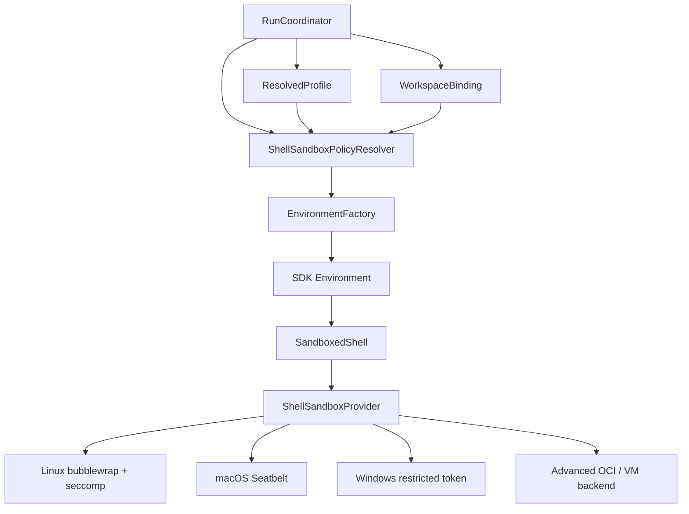
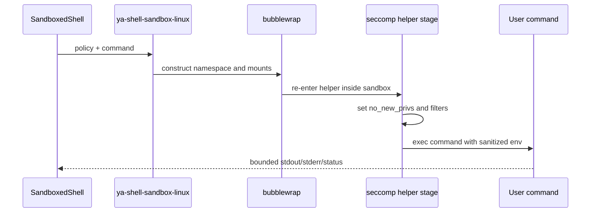
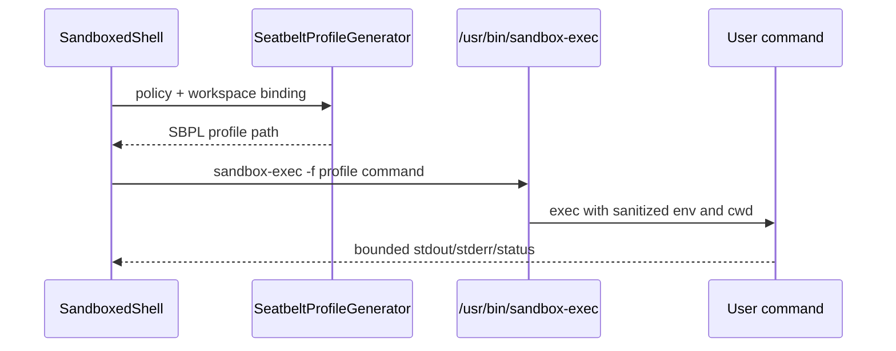
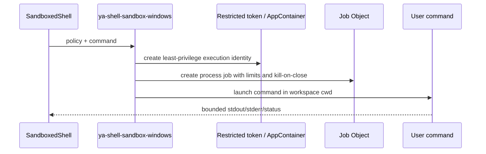
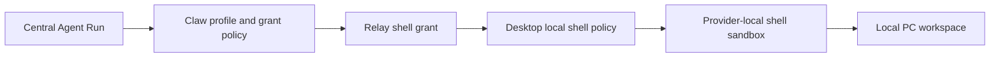

# 12 - Default Shell Sandbox

## Goal

YA Claw shell execution should use an OS-level sandbox by default. The runtime grants a shell the minimum filesystem, process, environment, and network surface required by the active workspace binding.

This design covers the local single-node runtime first, then extends to Desktop relay and advanced container backends.

## Research Basis

The default design is informed by current agent runtime sandbox practice and primary platform primitives:

- OpenAI Codex: macOS Seatbelt, Linux bubblewrap plus seccomp, Windows restricted-token direction, platform sandbox selection, permission profiles, and sandbox retry orchestration.
- Linux bubblewrap: unprivileged user and mount namespace sandboxing with explicit bind mounts, tmpfs, namespace, and seccomp support.
- Linux Landlock: unprivileged filesystem and newer TCP port restrictions, stackable with process descendants, useful as an additional or fallback layer.
- Linux seccomp: syscall filtering inherited across fork, clone, and exec when `no_new_privs` is active.
- Docker and rootless OCI: stronger reusable workspace containers with higher setup cost and image lifecycle concerns.
- macOS Seatbelt through `/usr/bin/sandbox-exec`: practical per-command path and network policy for arbitrary command execution.
- Apple Containerization: future high-isolation Linux-container-on-VM backend for Apple silicon and new macOS releases.
- Windows AppContainer: least-privilege isolation for credentials, files, registry, network, processes, and windows.
- Windows restricted tokens and Job Objects: reduced access tokens, process trees, resource limits, accounting, and termination controls.

## Security Objective

A shell command receives:

- declared workspace mounts.
- declared cwd.
- an allowlisted environment.
- bounded runtime, output, and process lifecycle.
- network access according to the resolved shell policy.
- write access only to workspace mounts and runtime scratch roots selected by policy.
- audit metadata linked to run trace and workspace binding.

Raw host shell access is a privileged escape hatch gated by profile policy, HITL approval, and audit logging.

## Threat Model

The sandbox protects the local host and adjacent workspaces from common shell overreach:

- reading credential stores, SSH keys, cloud tokens, browser profiles, and private home directory files.
- writing outside selected workspace roots.
- altering runtime metadata such as `.git`, `.yaacli`, `.ya-claw`, profile seeds, auth stores, or memory files when policy protects them.
- spawning orphaned processes that outlive the run.
- opening broad network connections during offline or restricted runs.
- using syscalls for process inspection, kernel attack surface, or host IPC traversal.
- exhausting CPU time, wall time, output buffers, or temporary storage.

The shell sandbox complements command review. Command review classifies intent before execution; OS sandboxing enforces process boundaries during execution.

## Runtime Placement



`WorkspaceProvider` keeps returning declarative bindings. The reusable shell sandbox policy data models and backend builders live in `ya-agent-sdk` under `ya_agent_sdk.environment.shell_sandbox`, split into `policy`, `backend`, and alias `shell` modules. The single SDK local shell implementation is policy-driven `LocalShell`; with a resolved `ShellSandboxRuntimePolicy` it uses the selected sandbox backend, and with no policy it preserves raw subprocess behavior for SDK and YAACLI compatibility. Shared subprocess lifecycle helpers live in `ya_agent_sdk.environment.process`. Claw keeps workspace-specific conversion in `ya_claw.workspace.shell_sandbox`, resolving profile/settings/workspace bindings into `ShellSandboxRuntimePolicy`; `EnvironmentFactory` passes that policy into `LocalShell` for local workspaces.

## Policy Model

### ShellSandboxProfile

```ts
type ShellSandboxProfile =
  | "read_only"
  | "workspace_write"
  | "relay_workspace_write"
  | "network_proxy"
  | "danger_full_access";
```

| Profile                 | Filesystem                            | Network         | Typical use                                     |
| ----------------------- | ------------------------------------- | --------------- | ----------------------------------------------- |
| `read_only`             | workspace read, runtime scratch write | blocked         | inspection, grep, tests that write only scratch |
| `workspace_write`       | selected workspace writes             | full by default | local coding and build loops                    |
| `relay_workspace_write` | relay-granted roots only              | provider policy | central Claw using Desktop local PC roots       |
| `network_proxy`         | selected workspace writes             | proxy-mediated  | package install, docs fetch, API calls          |
| `danger_full_access`    | host shell policy                     | full            | human-approved maintenance and diagnostics      |

### ShellSandboxPolicy

```ts
type ShellSandboxPolicy = {
  profile: ShellSandboxProfile;
  backend_preference: "auto" | "linux_bwrap_seccomp" | "macos_seatbelt" | "windows_restricted_token" | "docker" | "podman" | "nsjail" | "raw_host";
  cwd: string;
  mounts: ShellSandboxMount[];
  readable_paths: string[];
  writable_paths: string[];
  protected_paths: string[];
  scratch_paths: string[];
  env_allowlist: string[];
  env_overrides: Record<string, string>;
  network: "blocked" | "restricted" | "proxy" | "full";
  proxy?: ShellNetworkProxyPolicy;
  timeout_seconds: number;
  output_limit_bytes: number;
  max_processes?: number;
  max_memory_bytes?: number;
  raw_shell_approval: "forbidden" | "requires_human" | "allowed_for_profile";
  audit_enabled: boolean;
};

type ShellSandboxMount = {
  id: string;
  host_path: string;
  virtual_path: string;
  mode: "ro" | "rw";
};

type ShellNetworkProxyPolicy = {
  allowed_hosts?: string[];
  allowed_ports?: number[];
  allowed_protocols?: string[];
  loopback_ports?: number[];
};
```

## Default Policy

The default local shell profile is `workspace_write`:

```yaml
shell_sandbox:
  profile: workspace_write
  backend_preference: auto
  filesystem:
    root: minimal_system_view
    workspace_mounts: declared_workspace_binding
    scratch:
      - run_temp_dir
      - cache_dir_for_profile
    masked_path_aliases: []
    masked_paths: []
  network: full
  env_allowlist:
    - "*"
  timeout_seconds: 120
  output_limit_bytes: 1048576
  raw_shell_approval: requires_human
  audit_enabled: true
```

Profiles can tighten or widen this policy through stored execution profile metadata. Request-level inputs can choose a stricter policy. A wider policy requires profile permission and HITL when the run source is interactive, scheduled, bridge-driven, agency-driven, or relay-driven.

## Filesystem Rules

### Workspace Mounts

`WorkspaceBinding.mounts` becomes the primary filesystem grant:

- `mode = ro` maps to read-only bind or read-only path allowlist.
- `mode = rw` maps to write access under the declared virtual path.
- `cwd` must resolve inside one declared mount or approved scratch root.
- file operations and shell execution use the same binding snapshot.

### Path Masks

Path masks are opt-in. Profiles can set `masked_path_aliases` for recommended host path groups or `masked_paths` for concrete deployment paths. The recommended `common_credentials` alias expands to `~/.ssh`, `~/.gnupg`, `~/.aws`, `~/.config/gcloud`, `~/.docker`, and `~/.kube`. Narrow aliases are available for `ssh`, `gnupg`, `aws`, `gcloud`, `docker`, and `kube`.

Linux bubblewrap applies masks as `tmpfs` mounts after the base filesystem view and before explicit workspace mounts. Other native backends should implement equivalent path-hiding semantics where the platform supports it.

### Scratch Roots

Each run receives a scratch root:

```text
<data_dir>/shell-sandbox/runs/{run_id}/
```

Recommended virtual paths:

- `/tmp`
- `/home/agent`
- `/var/tmp/ya-claw-run`
- tool cache paths such as `UV_CACHE_DIR` and `npm_config_cache`

Scratch cleanup follows run retention policy. Audit stores the scratch path hash and retention state.

## Network Rules

| Mode         | Behavior                                    | Example                            |
| ------------ | ------------------------------------------- | ---------------------------------- |
| `blocked`    | no external network sockets                 | offline code inspection            |
| `restricted` | local IPC and approved loopback only        | unit tests and local dev servers   |
| `proxy`      | egress through Claw or Desktop proxy policy | package install and web docs fetch |
| `full`       | direct host networking                      | privileged profile with audit      |

The default for local Desktop coding is `full` so package installation, development servers, and external API tools work without policy churn. Use `restricted`, `proxy`, or `blocked` for deployments that need tighter egress control.

## Linux Backend: `linux_bwrap_seccomp`

### Default Stack

Linux default backend should combine:

1. `bubblewrap` for user namespace, mount namespace, optional network namespace, tmpfs home, bind mounts, `/proc`, and `/dev` shaping.
2. `seccomp` for syscall filtering after namespace setup.
3. optional Landlock for host filesystem fallback and extra path restrictions when supported.
4. Claw-managed timeout, process group cleanup, output limits, and audit.



### Bubblewrap Shape

Recommended arguments by policy:

- `--unshare-user`
- `--unshare-pid`
- `--unshare-ipc`
- `--unshare-uts`
- `--unshare-net` for `blocked` and restricted modes that use proxy handoff.
- `--new-session` for terminal isolation.
- `--die-with-parent` for orphan cleanup.
- `--proc /proc` when commands require process metadata.
- minimal `/dev` with `--dev /dev` or explicit device nodes.
- `--tmpfs /tmp` and `--tmpfs /home/agent`.
- `--ro-bind` for read-only mounts.
- `--bind` for writable workspace mounts.
- `--chdir` to resolved cwd.

Example `workspace_write` shape:

```bash
bwrap \
  --unshare-user \
  --unshare-pid \
  --unshare-ipc \
  --unshare-uts \
  --new-session \
  --die-with-parent \
  --proc /proc \
  --dev /dev \
  --tmpfs /tmp \
  --tmpfs /home/agent \
  --ro-bind /usr /usr \
  --ro-bind /bin /bin \
  --ro-bind /lib /lib \
  --ro-bind /lib64 /lib64 \
  --bind "$HOST_WORKSPACE" /workspace/main \
  --chdir /workspace/main \
  ya-shell-sandbox-linux --apply-seccomp-then-exec -- /bin/bash -lc "$COMMAND"
```

The actual helper should build argv directly and avoid shell interpolation for user-provided command data. `/bin/bash -lc` stays a shell tool implementation detail after policy approval.

### Seccomp Policy

Minimum seccomp policy:

- set `no_new_privs` before installing filters.
- block process inspection and memory access syscalls such as `ptrace`, `process_vm_readv`, and `process_vm_writev`.
- block `io_uring_*` syscalls for the initial policy.
- block mount, namespace, and privileged kernel-control syscalls after bubblewrap setup.
- block or restrict socket syscalls according to network mode.
- return `EPERM` for policy denials so tool output stays understandable.

Network syscall policy:

| Network mode | seccomp/network namespace behavior                                    |
| ------------ | --------------------------------------------------------------------- |
| `blocked`    | unshared network namespace plus socket restrictions                   |
| `restricted` | AF_UNIX plus approved loopback path or loopback proxy ports           |
| `proxy`      | allow AF_INET/AF_INET6 to proxy endpoints selected by policy          |
| `full`       | apply process-safety filters while leaving network syscalls available |

### Landlock Use

Landlock is valuable for these cases:

- Linux hosts with no working bubblewrap path and sufficient Landlock ABI support.
- additional path protection around host-visible directories.
- future TCP bind/connect restrictions on kernels with newer Landlock ABI.

The implementation should probe Landlock ABI at startup and expose status through capability diagnostics. Landlock layers apply once to process descendants and remain active for the command lifetime.

### Dependency Strategy

Linux provider resolution order:

1. system `bubblewrap` with required options.
2. bundled verified `bubblewrap` binary for supported distributions.
3. Landlock plus seccomp fallback for limited read-only or workspace-write policies.
4. Docker or rootless Podman provider when configured.
5. raw host shell path after policy approval.

Diagnostics should distinguish missing binary, disabled user namespaces, WSL limitations, and kernel feature gaps.

## macOS Backend: `macos_seatbelt`

### Default Stack

macOS default backend should use `/usr/bin/sandbox-exec` with a generated Seatbelt profile per command or per binding fingerprint.



Use exact path `/usr/bin/sandbox-exec` to avoid PATH substitution. Generate profiles in a Claw-controlled temp directory with restrictive permissions.

### Seatbelt Profile Shape

Recommended profile strategy:

- start with `(deny default)`.
- allow process exec and fork required by shell commands.
- allow same-sandbox process signaling and process info.
- allow PTY, `/dev/null`, `/dev/zero`, `/dev/random`, `/dev/urandom`, and terminal basics.
- allow system read paths required for dynamic loader, shells, frameworks, developer tools, and package managers.
- allow workspace mounts according to `ro` or `rw` mode.
- allow scratch roots for `/tmp`, cache, and tool output.
- allow network operations according to `blocked`, `restricted`, `proxy`, or `full` policy.
- block protected path classes with explicit path denies when the base profile includes broad reads.

Example generated fragment:

```scheme
(version 1)
(deny default)
(allow process-exec)
(allow process-fork)
(allow signal (target same-sandbox))
(allow file-read* (subpath "/System"))
(allow file-read* (subpath "/usr"))
(allow file-read* (subpath "/bin"))
(allow file-read* (subpath "/Library/Developer"))
(allow file-read* (subpath "/private/tmp/ya-claw-runs/RUN_ID"))
(allow file-write* (subpath "/private/tmp/ya-claw-runs/RUN_ID"))
(allow file-read* (subpath "/Users/alice/code/project"))
(allow file-write* (subpath "/Users/alice/code/project"))
```

The profile generator should include a tested platform default read set for common shells, Git, Python, Node.js, package managers, and Xcode command line tools.

### macOS Caveats

`sandbox-exec` is the available CLI mechanism for arbitrary per-process Seatbelt policy. Desktop should run a startup self-test that executes representative read, write, and network probes under the generated profile. Diagnostics should surface failures with setup instructions and backend alternatives.

Apple Containerization is a future high-isolation provider for Apple silicon and supported macOS versions. It belongs behind an explicit `container_vm` backend preference because it executes Linux containers in lightweight VMs and changes toolchain assumptions.

## Windows Backend: `windows_restricted_token`

Windows support has lower priority than Linux and macOS for the first YA Desktop shell sandbox release. The target backend should combine Windows native isolation primitives:

1. `CreateRestrictedToken` to create a reduced primary token with disabled SIDs, deleted privileges, and restricting SIDs.
2. AppContainer profile execution for file, registry, credential, process, window, and network isolation when command compatibility allows it.
3. Job Objects for process-tree management, CPU and memory limits, accounting, and kill-on-close cleanup.
4. a private desktop for UI-message isolation when launching interactive-compatible processes.
5. explicit workspace ACL grants for selected roots and scratch directories.



Recommended policy shape:

- run command processes with a restricted token by default.
- use AppContainer for high-isolation profiles and compatible shells.
- assign every launched process to a Job Object with kill-on-close, process limits, CPU limits, memory limits, and accounting.
- grant read/write ACLs only to selected workspace roots and scratch roots.
- use Windows Filtering Platform or brokered network egress for `blocked`, `restricted`, and `proxy` modes.
- use private desktop isolation for commands that can create windows or send UI messages.
- expose diagnostics for token creation, AppContainer availability, Job Object support, ACL grant setup, and network-control support.

Provider resolution order for Windows:

1. AppContainer plus Job Object when the command profile supports it.
2. restricted token plus Job Object for broad command compatibility.
3. Docker Desktop / WSL-backed OCI provider when configured.
4. raw host shell path after policy approval.

## Advanced Providers

### Docker / Rootless Podman

OCI containers provide stronger and more portable isolation for self-hosted deployments:

- image-defined toolchain.
- separate process and filesystem view.
- cgroups for CPU and memory controls.
- network policy through container runtime settings.
- clear cache and lifecycle semantics.

Use OCI backends for remote servers, CI-like workspaces, high-risk workloads, and deployments that already operate container runtimes. Rootless mode reduces daemon privilege exposure and requires subordinate UID/GID setup.

### nsjail

`nsjail` is a strong Linux provider option for teams that can install and manage a purpose-built jail binary. It offers namespaces, cgroups, rlimits, and seccomp-bpf policy in one tool. It can become a supported optional backend after the bubblewrap provider is stable.

### Firejail

Firejail is useful for desktop application sandboxing. Its SUID-oriented trust surface and broad profile model make it a lower-priority embedded backend for YA Claw shell execution.

## Profile and Configuration Integration

Execution profiles should accept shell sandbox metadata:

```yaml
profiles:
  - name: default
    model: oauth@codex:gpt-5.5
    builtin_toolsets:
      - session
    need_user_approve_tools:
      - shell
    shell_sandbox:
      profile: workspace_write
      backend_preference: auto
      network: full
      env_allowlist:
        - "*"
      raw_shell_approval: requires_human
      timeout_seconds: 120
      output_limit_bytes: 1048576
```

Recommended environment variables:

| Variable                                   | Purpose                                                                                                                  |
| ------------------------------------------ | ------------------------------------------------------------------------------------------------------------------------ |
| `YA_CLAW_SHELL_SANDBOX_ENABLED`            | enable sandboxed shell provider resolution, default true for local and Desktop profiles                                  |
| `YA_CLAW_SHELL_SANDBOX_BACKEND`            | `auto`, `linux_bwrap_seccomp`, `macos_seatbelt`, `windows_restricted_token`, `docker`, `podman`, `nsjail`, or `raw_host` |
| `YA_CLAW_SHELL_SANDBOX_NETWORK`            | default network mode for profiles that omit it                                                                           |
| `YA_CLAW_SHELL_SANDBOX_TIMEOUT_SECONDS`    | default wall-clock timeout                                                                                               |
| `YA_CLAW_SHELL_SANDBOX_OUTPUT_LIMIT_BYTES` | default combined output limit                                                                                            |
| `YA_CLAW_SHELL_SANDBOX_ALLOW_RAW_HOST`     | permits raw host shell as an approved fallback                                                                           |
| `YA_CLAW_SHELL_SANDBOX_DIAGNOSTICS`        | enables startup backend diagnostics and self-tests                                                                       |

## API and Capability Reporting

Runtime capability endpoints should expose shell sandbox status:

```json
{
  "shell_sandbox": {
    "enabled": true,
    "default_profile": "workspace_write",
    "active_backend": "linux_bwrap_seccomp",
    "available_backends": ["linux_bwrap_seccomp", "docker"],
    "network_modes": ["blocked", "restricted", "proxy", "full"],
    "raw_host_allowed": false,
    "diagnostics": {
      "bubblewrap": "ok",
      "user_namespaces": "ok",
      "seccomp": "ok",
      "landlock": "abi_5"
    }
  }
}
```

Run records should store the resolved sandbox snapshot:

```ts
type ShellSandboxSnapshot = {
  profile: ShellSandboxProfile;
  backend: string;
  policy_hash: string;
  network: "blocked" | "restricted" | "proxy" | "full";
  cwd: string;
  mount_ids: string[];
  writable_paths: string[];
  protected_path_classes: string[];
  timeout_seconds: number;
  output_limit_bytes: number;
  raw_host: boolean;
};
```

## Relay Implications

For relay-backed workspaces, Desktop or the relay provider is the final local enforcement point:



Claw sends the resolved shell request, workspace roots, cwd, env allowlist, network mode, and run context through relay. Desktop applies its local shell sandbox policy and records local audit. Claw records the relay result and audit projection in the run trace.

## Raw Host Shell Escalation

Raw host shell execution requires all of the following:

1. profile permits `danger_full_access` or `raw_shell_approval` allows escalation.
2. request source is eligible for interactive approval or a pre-approved maintenance window.
3. human approval captures command preview, cwd, workspace, source run, and reason.
4. audit records `raw_host = true`, policy hash, approver identity, and output truncation status.
5. Desktop or Claw shows visible active state and cancellation.

Scheduled, bridge-triggered, agency, and relay runs should use sandboxed profiles by default and require an explicit stored policy for wider execution.

## Audit Requirements

Each shell call should produce a compact audit entry linked to run trace:

```ts
type ShellSandboxAuditEntry = {
  id: string;
  session_id: string;
  run_id: string;
  tool_call_id?: string;
  profile_name: string;
  sandbox_profile: ShellSandboxProfile;
  backend: string;
  policy_hash: string;
  command_preview: string;
  cwd: string;
  mount_ids: string[];
  network: "blocked" | "restricted" | "proxy" | "full";
  decision: "allowed" | "approved" | "blocked";
  raw_host: boolean;
  started_at: string;
  completed_at?: string;
  exit_code?: number;
  status: "succeeded" | "failed" | "cancelled" | "timed_out";
  output_truncated: boolean;
};
```

## Implementation Phases

### Phase 1: Policy and diagnostics

- Add typed shell sandbox policy models to YA Claw configuration and profile resolution.
- Add runtime capability diagnostics for Linux and macOS backends.
- Store shell sandbox snapshots in run metadata.
- Keep existing shell review as the approval layer.

### Phase 2: Linux provider

- Implement `ShellSandboxProvider` and `linux_bwrap_seccomp` helper.
- Resolve workspace mounts into bubblewrap argv.
- Apply seccomp filters in a helper stage.
- Add Landlock probing and optional fallback.
- Add integration tests for read, write, protected path, network, timeout, and output limits.

### Phase 3: macOS provider

- Implement Seatbelt profile generator and `/usr/bin/sandbox-exec` launcher.
- Add platform default read sets and protected path deny rules.
- Add startup self-test and diagnostics.
- Add Desktop setup messaging for failed probes.

### Phase 4: Relay and proxy networking

- Carry shell sandbox policy through `ya-environment-relay.v1` shell requests.
- Add Desktop local enforcement and audit projection.
- Add proxy-network mode for approved package installs and web fetches.

### Phase 5: Advanced providers

- Add rootless Docker/Podman backend selection for local high-isolation mode.
- Evaluate nsjail as an optional Linux backend.
- Evaluate Apple Containerization for future macOS high-isolation mode.

## Validation Matrix

| Scenario                                    | Expected result                            |
| ------------------------------------------- | ------------------------------------------ |
| read workspace file                         | succeeds                                   |
| write writable workspace file               | succeeds                                   |
| write read-only mounted folder              | blocked by sandbox                         |
| read home credential path                   | blocked by sandbox                         |
| write `.git/config` under protected policy  | blocked by sandbox                         |
| create temp file in scratch root            | succeeds                                   |
| spawn long-running child past timeout       | process group is cancelled                 |
| network call under `blocked`                | blocked by backend policy                  |
| network call under `proxy` to approved host | succeeds through proxy                     |
| command requests raw host shell             | approval required and audit marks raw host |

## Design Decision

YA Claw should treat shell sandboxing as a first-class runtime boundary. Linux defaults to bubblewrap plus seccomp, macOS defaults to generated Seatbelt profiles, Windows targets restricted tokens plus Job Objects, Desktop relay enforces the same policy locally, and raw host shell execution stays a privileged audited path.
