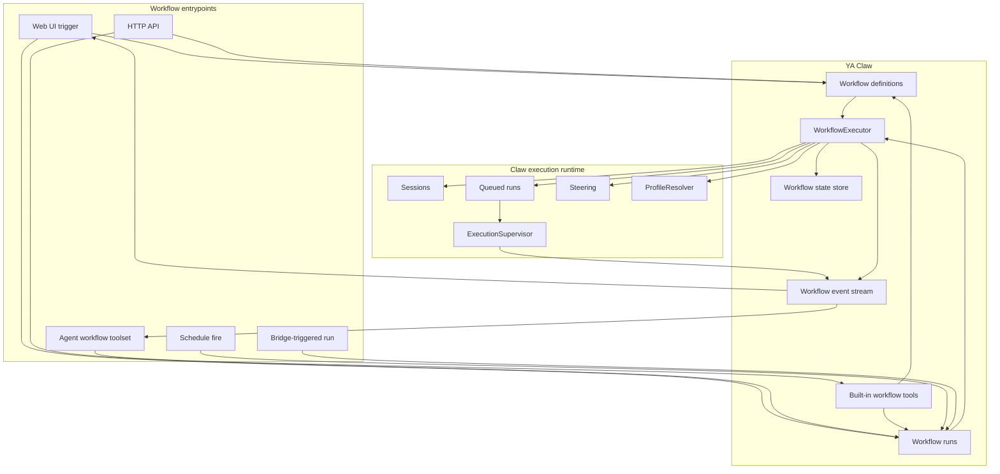

# 13 - Workflows

YA Claw owns workflow execution as a durable orchestration layer. Agents supervise and control workflows through Claw APIs and built-in Claw tools.

A workflow is a first-class Claw resource. It can be created by users, APIs, or agents; triggered from the Web UI, schedules, bridges, or agent tools; and tracked through Claw's relational store, runtime state, event streams, and run/session history.

## Design Goals

- Make workflows a Claw-managed orchestration resource with durable definitions, runs, node state, and event history.
- Let agents discover, start, inspect, steer, cancel, and repair workflows through a built-in workflow toolset.
- Let the Web UI expose workflow definition management, manual triggering, live execution status, and run history.
- Use execution profiles as the workflow node runtime preset. The default preset is `Self`, which resolves to the supervising session profile.
- Reuse Claw's session/run execution model for node work, including queued runs, steering, profile resolution, workspace binding, sandbox policy, and event delivery.
- Feed workflow progress and node run events back into the supervising conversation when a workflow is started by an agent.
- Keep `ya-agent-sdk` focused on agent execution primitives while Claw owns workflow orchestration, state, APIs, and product behavior.

## Non-Goals

- SDK-level workflow scheduling or DAG state tracking.
- A separate workflow worker system outside the single-node Claw execution supervisor.
- A new agent extension protocol for workflow discovery.
- A separate transcript format independent of Claw sessions, runs, traces, and committed messages.

## Conceptual Model



The workflow executor is a Claw service component. It plans node readiness, starts node runs through the existing session/run controllers, observes terminal state, records outputs, and advances the graph.

## Resource Model

### Workflow Definition

A workflow definition describes the reusable plan.

Suggested table: `workflow_definitions`

Suggested fields:

- `id`
- `name`
- `description`
- `status`: `draft | active | archived`
- `definition_version`
- `schema_version`
- `owner_kind`: `user | agent | api | system`
- `owner_session_id`
- `owner_run_id`
- `scope`: `global | session`
- `tags`
- `when_to_use`
- `argument_hint`
- `input_schema`
- `definition`
- `metadata`
- `created_at`
- `updated_at`
- `archived_at`

The `definition` column stores a JSON-compatible workflow document. YAML import/export is a Web UI and API convenience. The relational row is the authoritative definition record.

### Workflow Run

A workflow run is one execution attempt for a definition.

Suggested table: `workflow_runs`

Suggested fields:

- `id`
- `workflow_id`
- `workflow_version`
- `status`: `queued | running | waiting | completed | failed | cancelled`
- `trigger_kind`: `web | api | agent | schedule | bridge | system`
- `supervisor_session_id`
- `supervisor_run_id`
- `profile_name`
- `workspace`
- `inputs`
- `result`
- `error_message`
- `current_node_ids`
- `created_at`
- `started_at`
- `finished_at`
- `updated_at`
- `metadata`

`supervisor_session_id` and `supervisor_run_id` connect an agent-started workflow to the conversation that supervises it. Web/API-started workflows can leave these fields empty or bind them to an explicit monitoring session.

### Workflow Node Run

A workflow node run maps a node execution to Claw sessions and runs.

Suggested table: `workflow_node_runs`

Suggested fields:

- `id`
- `workflow_run_id`
- `node_id`
- `attempt_no`
- `status`: `pending | ready | queued | running | waiting | completed | failed | cancelled | skipped`
- `profile_name`
- `session_id`
- `run_id`
- `input_parts`
- `output_text`
- `output_json`
- `error_message`
- `needs`
- `started_at`
- `finished_at`
- `updated_at`
- `metadata`

Each node can use an existing workflow-private session, a fresh isolated session, or a continuation of a prior node session depending on node execution mode. The v1 default is an isolated node session created by the workflow executor.

### Workflow Event

Suggested table: `workflow_events`

Suggested fields:

- `id`
- `workflow_run_id`
- `node_run_id`
- `source_kind`: `workflow | node | run | steer | system`
- `event_type`
- `payload`
- `created_at`

Events provide replayable workflow status for Web UI, API clients, and supervising agents. Node run events are projected into workflow events with compact payloads and links to original run traces.

## Access and Filtering Model

Workflow management follows the same simple single-node model as schedules. HTTP/Web UI clients use the configured bearer token. Agents use a profile-enabled built-in workflow toolset whose internal client carries the current `session_id`, `run_id`, current profile, and bearer token outside the model context.

API clients and agents with the workflow toolset can create, update, archive, trigger, cancel, steer, and inspect workflows. Ownership fields are provenance and filtering metadata. They keep lists useful for agents and Web UI views while preserving broad operability in the single-node runtime.

### Actor Classes

| Actor                  | Identity source                                                                | Typical surface                                   |
| ---------------------- | ------------------------------------------------------------------------------ | ------------------------------------------------- |
| Operator user          | Bearer-authenticated Web UI or API client                                      | workflow CRUD, trigger, cancel, steer, archive    |
| Agent                  | Current `session_id`, `run_id`, resolved profile, and enabled workflow toolset | workflow tools with filtered list views           |
| Schedule               | Stored schedule owner and fire context                                         | trigger a configured workflow                     |
| Bridge-triggered agent | Bridge-owned session plus agent tool calls                                     | start and supervise workflows from a conversation |
| System                 | Runtime maintenance code                                                       | migration, repair, and internal cleanup           |

### Definition Scope

| Scope     | Meaning                                                               |
| --------- | --------------------------------------------------------------------- |
| `session` | Created from a conversation and highlighted for that session's agents |
| `global`  | Created from operator/API surfaces or promoted for broad reuse        |

Agent-created definitions default to `scope="session"`, `owner_kind="agent"`, `owner_session_id=current session id`, and `owner_run_id=current run id`. Operator/API-created definitions default to `scope="global"`. System definitions use `owner_kind="system"`.

### List Filtering

Workflow list APIs and tools support filters for practical narrowing:

- `owner_kind`
- `owner_session_id`
- `supervisor_session_id`
- `trigger_kind`
- `scope`
- `status`
- `tags`
- `query`
- `created_by_current_session`
- `supervised_by_current_session`
- `touched_by_current_session`
- `only_current_session`
- `include_archived`

Agent workflow tools should default to a practical view:

- global active workflows
- workflows created by the current session
- workflow runs supervised by the current session
- recent workflow runs touched by the current session

Agents can request broader filters when they need to inspect or reuse other workflows. Web UI can default to global and recent workflows, with filters for owner/session/status/tags.

Agent-facing boolean filters:

| Flag                                 | Applies to           | Meaning                                                                                  |
| ------------------------------------ | -------------------- | ---------------------------------------------------------------------------------------- |
| `only_current_session`               | definitions and runs | Return workflows created by, supervised by, or recently touched by the current session   |
| `only_created_by_current_session`    | definitions          | Return definitions whose `owner_session_id` is the current session                       |
| `only_supervised_by_current_session` | runs                 | Return runs whose `supervisor_session_id` is the current session                         |
| `only_touched_by_current_session`    | definitions and runs | Return workflows with current-session ownership, supervision, or recent linked node runs |
| `include_archived`                   | definitions          | Include archived workflow definitions in list results                                    |
| `include_completed`                  | runs                 | Include terminal completed workflow runs when the default view focuses on active work    |

### Ownership Rules

Agent workflow tools follow the same internal-client pattern as the schedule toolset:

- bearer tokens stay inside the client resource
- tool calls route through internal controller APIs
- ownership fields are assigned by the runtime
- agent-supplied owner fields are ignored
- agent-created workflow definitions default to session scope
- agent-created workflow runs record `trigger_kind="agent"`, `supervisor_session_id=current session id`, and `supervisor_run_id=current run id`

Node execution still uses the resolved profile's normal runtime boundaries: enabled built-in toolsets, MCP tools, approval policy, sandbox policy, and workspace binding rules. `Self` resolves to the supervising run profile for agent-triggered workflows, so the node inherits the same runtime surface as the supervising conversation unless the workflow selects another profile.

## Definition Format

A definition can be edited as YAML and stored as JSON.

```yaml
schema: ya-claw.workflow.v1
name: Research Report
version: 1
description: Produce a multi-source research report.
when_to_use: Use for research, comparison, landscape analysis, and sourced report writing.
argument_hint: "{ topic: string, audience?: string }"
tags: [research, report]

inputs:
  type: object
  properties:
    topic:
      type: string
    audience:
      type: string
  required: [topic]

policy:
  max_concurrency: 3
  on_node_failure: fail_workflow

nodes:
  landscape:
    profile: Self
    prompt: |
      Research the landscape for {{ inputs.topic }}.
      Return concise findings with sources.

  technical:
    profile: Self
    prompt: |
      Analyze technical architecture and implementation details for {{ inputs.topic }}.

  synthesize:
    profile: Self
    needs: [landscape, technical]
    mode: continue
    prompt: |
      Synthesize results for {{ inputs.audience | default("engineering leadership") }}.
      Landscape: {{ nodes.landscape.output_text }}
      Technical: {{ nodes.technical.output_text }}

result:
  from_node: synthesize
```

### Top-Level Fields

| Field           | Purpose                                           |
| --------------- | ------------------------------------------------- |
| `schema`        | Workflow document schema, `ya-claw.workflow.v1`   |
| `name`          | Human-readable workflow name                      |
| `version`       | Definition version stored with each run           |
| `description`   | Catalog and run summary text                      |
| `when_to_use`   | Agent-facing discovery hint                       |
| `argument_hint` | Input shape hint for agents and UI forms          |
| `tags`          | Search, grouping, and policy metadata             |
| `inputs`        | JSON Schema for run inputs                        |
| `policy`        | Concurrency, retry, timeout, and failure behavior |
| `nodes`         | DAG node map                                      |
| `result`        | Result projection rules                           |

### Node Fields

| Field             | Default                 | Purpose                                              |
| ----------------- | ----------------------- | ---------------------------------------------------- |
| `profile`         | `Self`                  | Execution profile used for this node                 |
| `needs`           | `[]`                    | Parent nodes that must complete first                |
| `mode`            | `isolate`               | Session/run mode for node execution                  |
| `prompt`          | required                | Template rendered from inputs and dependency outputs |
| `input_parts`     | generated from `prompt` | Structured input override                            |
| `retry_count`     | workflow policy         | Retry attempts for this node                         |
| `timeout_seconds` | workflow policy         | Node timeout                                         |
| `output_schema`   | empty                   | Optional JSON output schema                          |
| `metadata`        | empty                   | Node labels and UI hints                             |

## Agent Preset Resolution

Workflow nodes use Claw execution profiles as agent presets.

Reserved profile value:

- `Self`: resolve to the profile of the supervising session/run when the workflow is agent-triggered; resolve to the workflow run `profile_name` when the workflow is Web/API-triggered.

Named profile values resolve through `ProfileResolver` in the same way as ordinary runs. Profile listing is exposed to agents through the workflow toolset so an agent can choose a suitable preset for a node or definition.

Suggested profile tools:

- `list_agent_presets(query: str | None = None)`
- `get_agent_preset(name: str)`

## Execution Semantics

Workflow run lifecycle:

01. Create a `workflow_runs` row with `status="queued"`.
02. Snapshot the workflow definition version, inputs, profile, workspace binding, and supervisor provenance.
03. Claim the workflow run in the in-process workflow executor.
04. Validate inputs against `input_schema`.
05. Build the DAG and mark root nodes `ready`.
06. Start ready nodes up to `policy.max_concurrency`.
07. For each node, resolve `profile`, render prompt/input parts, and create or steer a Claw session/run.
08. Observe node run events until terminal state.
09. Store node output and emit workflow events.
10. Mark dependent nodes `ready` when their dependencies complete.
11. Project the workflow result when terminal criteria are met.
12. Mark the workflow run `completed`, `failed`, or `cancelled`.
13. Send completion events to Web UI, API streams, and supervising conversations.

### Node Execution Modes

| Mode       | Behavior                                                                      |
| ---------- | ----------------------------------------------------------------------------- |
| `isolate`  | Create a fresh workflow-private session and first run for the node            |
| `continue` | Continue the workflow run's shared session for sequential synthesis or review |
| `steer`    | Steer an active node/session when the target is running                       |
| `fork`     | Create a child session from a source session's latest successful run          |

The v1 default is `isolate`, which gives each node a clean durable history and straightforward failure boundaries.

### Supervision Semantics

Agent-triggered workflows are supervised by the session/run that called the workflow tool. The workflow executor emits compact events back to that conversation:

- workflow accepted
- workflow started
- node queued
- node running
- node output available
- node failed
- workflow waiting
- workflow completed
- workflow failed
- workflow cancelled

Delivery uses the same session event stream and steering path used by schedules and Agency. When the supervising run is active, workflow events steer compact progress messages into the run. When it is idle, events remain queryable through the workflow API and can be surfaced by the Web UI or by later agent tool calls.

## Built-in Workflow Toolset

Claw injects a built-in workflow toolset into agent profiles that enable workflow management. This toolset gives a conversation visibility into workflow definitions and active workflow runs, similar to the way the schedule toolset exposes timer resources.

The supervising agent can use the workflow tools to create definitions, inspect workflows through filters, start a workflow, watch state, steer active nodes, cancel runs, and repair failed work. Profile tools are included so the agent can choose `Self` or another execution preset for workflow nodes.

Suggested tools:

```python
async def list_workflows(
    query: str | None = None,
    tags: list[str] | None = None,
    status: str | None = None,
    scope: str | None = None,
    owner_kind: str | None = None,
    only_current_session: bool = False,
    only_created_by_current_session: bool = False,
    only_touched_by_current_session: bool = False,
    include_archived: bool = False,
) -> list[WorkflowCard]: ...
async def get_workflow(workflow_id: str) -> WorkflowDefinitionDetail: ...
async def create_workflow(definition: dict) -> WorkflowDefinitionDetail: ...
async def update_workflow(workflow_id: str, definition: dict) -> WorkflowDefinitionDetail: ...
async def archive_workflow(workflow_id: str) -> WorkflowDefinitionDetail: ...
async def start_workflow(workflow_id: str, inputs: dict | None = None, profile_name: str | None = None) -> WorkflowRunDetail: ...
async def list_workflow_runs(
    workflow_id: str | None = None,
    status: str | None = None,
    trigger_kind: str | None = None,
    only_current_session: bool = False,
    only_supervised_by_current_session: bool = False,
    only_touched_by_current_session: bool = False,
    include_completed: bool = True,
) -> list[WorkflowRunSummary]: ...
async def get_workflow_run(workflow_run_id: str) -> WorkflowRunDetail: ...
async def steer_workflow_node(workflow_run_id: str, node_id: str, input_parts: list[dict]) -> WorkflowRunDetail: ...
async def cancel_workflow_run(workflow_run_id: str) -> WorkflowRunDetail: ...
async def list_agent_presets(query: str | None = None) -> list[AgentPresetCard]: ...
```

Tool responses return compact cards by default and include IDs for API/Web UI deep links. Detailed views include definition metadata, scope, active run status, node status, linked session IDs, linked run IDs, trace links, event cursors, and output previews.

Tool guidance should encourage `only_current_session=True` when the agent is looking for workflows related to the current conversation, and broader filters when the agent is searching reusable global workflows.

## HTTP API Surface

Workflow APIs live under `/api/v1/workflows`. Bearer-authenticated clients can manage workflow definitions and runs. Agent calls use the built-in workflow toolset, which routes through the same controller APIs with session/profile context for default filtering and provenance. HTTP list endpoints should accept the same filter names as the tool facade.

| Method  | Path                                                            | Purpose                                        |
| ------- | --------------------------------------------------------------- | ---------------------------------------------- |
| `GET`   | `/api/v1/workflows`                                             | list workflow definitions                      |
| `POST`  | `/api/v1/workflows`                                             | create workflow definition                     |
| `GET`   | `/api/v1/workflows/{workflow_id}`                               | inspect workflow definition                    |
| `PATCH` | `/api/v1/workflows/{workflow_id}`                               | update workflow definition metadata or body    |
| `POST`  | `/api/v1/workflows/{workflow_id}:archive`                       | archive workflow definition                    |
| `POST`  | `/api/v1/workflows/{workflow_id}:trigger`                       | create a workflow run                          |
| `GET`   | `/api/v1/workflow-runs`                                         | list workflow runs                             |
| `GET`   | `/api/v1/workflow-runs/{workflow_run_id}`                       | inspect workflow run, nodes, and result        |
| `GET`   | `/api/v1/workflow-runs/{workflow_run_id}/events`                | replay and tail workflow events                |
| `POST`  | `/api/v1/workflow-runs/{workflow_run_id}/cancel`                | cancel workflow run                            |
| `POST`  | `/api/v1/workflow-runs/{workflow_run_id}/nodes/{node_id}/steer` | steer an active node run                       |
| `GET`   | `/api/v1/profiles`                                              | list agent presets for workflow node selection |

Trigger request:

```json
{
  "inputs": {"topic": "agent workflow design"},
  "profile_name": "default",
  "workspace": null,
  "supervisor_session_id": "optional-session-id",
  "metadata": {"source": "web"}
}
```

Trigger response returns the queued `workflow_run` record immediately. Clients follow `/events` for live progress.

## Web UI Behavior

The Web UI adds a Workflows section with:

- workflow definition list, search, tags, scope, owner/session filters, status, and last run state
- workflow editor with YAML and structured form modes
- input schema preview and manual trigger form
- definition version and archive controls
- run history with status, trigger kind, supervisor session, and result preview
- live workflow run view with DAG visualization, node statuses, linked sessions/runs, event stream, and output previews
- node action controls for steer, retry, cancel, and open linked run trace
- agent preset picker backed by `/api/v1/profiles`

Workflow runs can also appear in session detail when they are supervised by that session.

## Scheduling and Bridge Integration

Schedules can target workflows by adding an execution mode:

```text
execution_mode = "workflow"
workflow_id = "..."
workflow_inputs_template = {...}
```

A schedule fire creates a workflow run with `trigger_kind="schedule"`. Bridge-triggered agents can start workflows through the built-in toolset, preserving bridge metadata in workflow run metadata and supervisor provenance.

## Event Projection

Workflow events are compact orchestration events. Node-level run traces stay in the original Claw run store.

Suggested event types:

- `workflow_queued`
- `workflow_started`
- `workflow_waiting`
- `node_ready`
- `node_queued`
- `node_running`
- `node_output_available`
- `node_completed`
- `node_failed`
- `node_steered`
- `workflow_completed`
- `workflow_failed`
- `workflow_cancelled`

Each event includes:

- `workflow_run_id`
- `workflow_id`
- `node_id` when applicable
- `node_run_id` when applicable
- linked `session_id` and `run_id` when applicable
- compact `message`
- JSON-compatible `payload`
- `created_at`

## Implementation Plan

1. Add workflow ORM records and migrations: definitions, runs, node runs, events.
2. Add `WorkflowController` for CRUD, trigger, cancel, list, inspect, and event replay.
3. Add `WorkflowExecutor` as an in-process service component wired through app lifespan.
4. Add workflow event projection from Claw run events and terminal run commits.
5. Add built-in workflow toolset and inject it through profile-configured built-in toolsets.
6. Add Web UI Workflows section and session-linked workflow panels.
7. Add schedule workflow execution mode.
8. Add tests for definition validation, DAG scheduling, profile resolution, agent tool calls, API routes, event replay, and cancellation.

## Open Decisions

| Topic                            | Preferred v1 direction                                      |
| -------------------------------- | ----------------------------------------------------------- |
| Default node mode                | `isolate`                                                   |
| Default node profile             | `Self`                                                      |
| Workflow definition storage      | relational JSON body plus YAML import/export                |
| Supervising conversation updates | compact workflow events with links to node runs             |
| Result storage                   | `workflow_runs.result` with node output references          |
| Retry behavior                   | node-level retry before workflow failure                    |
| Recursive workflow control       | allowed through agent tool policy and profile configuration |
