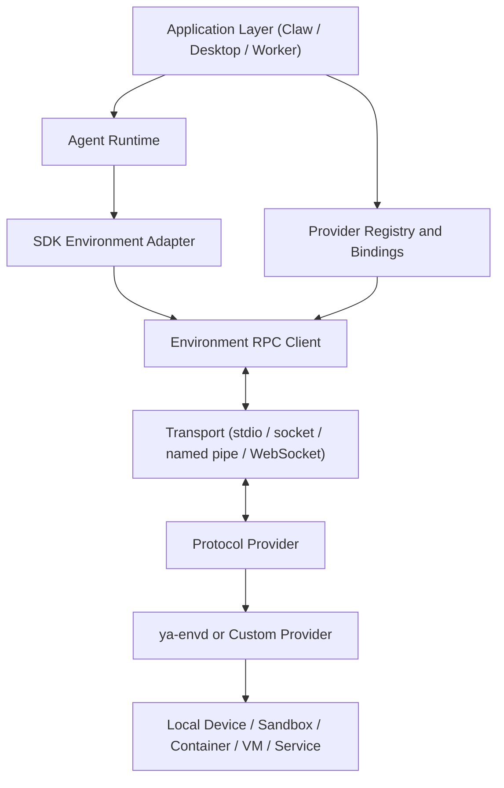
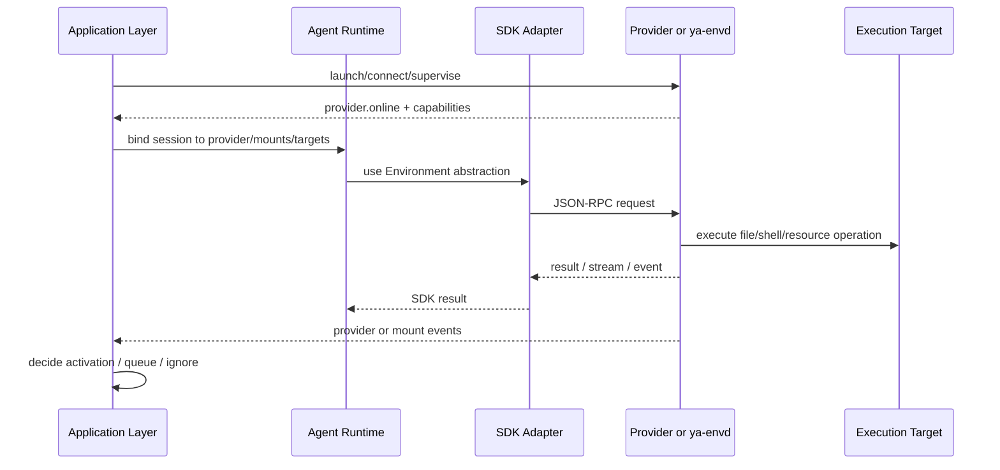

# 01. YA Environment Protocol Overview

## Goal

YA Environment Protocol connects an agent runtime to capabilities that execute in another process, device, sandbox, or host. It turns those capabilities into `ya-agent-sdk` Environment components while keeping the protocol independent from programming language and transport.

The protocol is YA-owned infrastructure. Product integrations such as YA Desktop, YA Claw, cloud workers, local workspace daemons, and custom providers implement or supervise protocol providers according to their deployment model.

The protocol string is:

```text
ya-environment-protocol.v1
```

## Design Targets

1. Pluggable environments.
   A session can use an agent-owned environment, a user-mounted environment, or both. User-mounted environments can be online, offline, paused, or revoked. Agent-owned detached environments can keep running when the user is offline.

2. Language independence.
   Providers can be written in Rust, Python, TypeScript, Go, or any other language that can read and write the JSON payloads.

3. Transport independence.
   The same JSON-RPC messages can run over stdio, local sockets, Windows named pipes, WebSocket, or future transports.

4. Explicit shell state.
   Stateless command execution, background process state, and stateful shell sessions are separate protocol objects.

5. Shared file and shell view.
   File operations and shell targets are bound to the same virtual mounts so an agent sees one coherent workspace.

6. Application-owned activation.
   The protocol reports provider readiness and changes. Claw, Desktop, or another application decides whether those events should wake or activate an agent.

## Parties



Definitions:

- Agent Runtime: process that runs the model loop and tool calls.
- SDK Environment Adapter: Python adapter that implements `Environment`, `FileOperator`, `Shell`, resources, and toolsets through protocol calls.
- Provider: protocol endpoint that advertises capabilities and executes requests.
- `ya-envd`: official Rust daemon provider implementation.
- Application Layer: product code that launches providers, stores grants, binds sessions, handles approvals, records trace, and decides activation behavior.
- Mount: virtual filesystem root exposed by a provider.
- Execution Target: shell-capable target bound to a set of mounts and policy.
- Resource: long-lived provider object such as shell session, browser, computer session, database connection, or local app automation handle.

## Provider Model

A provider is identified separately from the connection that currently carries messages.

```ts
type ProviderDescriptor = {
  protocol: "ya-environment-protocol.v1";
  provider_id: string;
  provider_kind: "ya_envd" | "desktop" | "workspace" | "cloud_worker" | "custom";
  provider_version: string;
  instance_id: string;
  environment_id?: string;
  display_name?: string;
  capabilities: CapabilityAdvertisement;
};
```

`provider_id` is stable across reconnects when the same provider identity returns. `instance_id` changes when the daemon process or custom provider instance restarts. A runtime must not assume process or shell session handles survive an `instance_id` change unless the provider explicitly reports durable state.

## State Model

Providers and capabilities share a common readiness vocabulary:

```text
starting
online
offline
paused
degraded
permission_required
revoked
error
```

Readiness is observable but not prescriptive. For example:

- `provider.online` can let Claw enqueue an activation decision.
- `mount.changed` can let Desktop show a sync prompt.
- `shell_session.available` can let a UI offer reattach.
- `provider.offline` can make user-mounted tools unavailable while an agent-owned detached provider continues.

## Capability Families

Initial v1 capability families:

```text
fileops
shell
process
shell_session
tools
resources
artifacts
computer
```

`shell` is for stateless command execution. `process` is for long-running background processes. `shell_session` is for stateful interactive shell sessions. This split avoids hiding durable state behind ordinary command calls.

## Mounts and Execution Targets

File and shell capabilities are connected through mounts:

```ts
type MountDescriptor = {
  mount_id: string;
  label?: string;
  virtual_path: string;
  mode: "ro" | "rw";
  state: "online" | "offline" | "paused" | "revoked" | "error";
  generation: number;
  case_sensitive?: boolean;
  follow_symlinks: boolean;
  watch_supported: boolean;
};

type ExecutionTargetDescriptor = {
  target_id: string;
  label?: string;
  platform: "linux" | "darwin" | "windows" | "container" | "custom";
  shell_kind: "sh" | "bash" | "zsh" | "powershell" | "cmd" | "custom";
  default_cwd: string;
  allowed_mount_ids: string[];
  supports_exec: boolean;
  supports_processes: boolean;
  supports_pty: boolean;
  supports_signals: boolean;
  process_persistence: "none" | "connection" | "provider" | "durable";
  session_persistence: "none" | "connection" | "provider" | "durable";
};
```

Paths are POSIX-style virtual paths on every host. Providers map virtual paths to host paths, container paths, or remote storage internally.

## Detached and User-Mounted Execution

An agent can bind to multiple environments:

```text
session
  agent-owned provider: online, detached capable
  user-mounted provider: offline until Desktop reconnects
```

The runtime should not pretend an offline user device is available. A request against an unavailable provider returns a capability/provider error. Product policy decides whether to:

- fail the tool call,
- queue work until the provider resumes,
- route to an agent-owned provider,
- ask the user,
- or start a reconciliation run after reconnect.

## Relationship to ya-agent-sdk

`ya-agent-sdk` already has:

- `Environment`
- `FileOperator`
- `Shell`
- `ResourceRegistry`
- `Toolset`
- resumable resources

The Python adapter should map protocol capabilities to these abstractions:

```python
DaemonEnvironment(Environment)
DaemonFileOperator(FileOperator)
DaemonShell(Shell)
DaemonResourceRegistry(ResourceRegistry)
DaemonToolset(Toolset)
```

The existing SDK `Shell` maps naturally to stateless shell execution and background process methods. Stateful shell sessions should be represented as resources or a dedicated tool surface rather than hidden behind `Shell.execute`.

## Relationship to Claw

Claw can use protocol providers as one `WorkspaceProvider` backend:

```text
WorkspaceProvider kind = daemon
Environment = DaemonEnvironment
```

Claw remains responsible for:

- sessions and runs
- profile selection
- model execution
- runtime HITL approvals
- durable trace
- artifact storage
- provider registry
- environment binding policy
- deciding whether provider events activate an agent

## Relationship to Desktop

YA Desktop can supervise a user-owned `ya-envd` and expose selected local capabilities:

- selected folders as mounts
- sandboxed local shell targets
- interactive shell sessions
- native OS computer use
- Desktop-managed tools
- local artifact upload

Desktop owns local identity, user consent, local grants, shell safety, native permissions, and local audit. Claw owns runtime authorization and run trace.

## High-Level Flow



## Non-Goals

- The protocol does not define model-facing prompting.
- The protocol does not define when to wake an agent.
- The protocol does not require WebSocket.
- The protocol does not promise shell session durability unless a provider explicitly advertises it.
