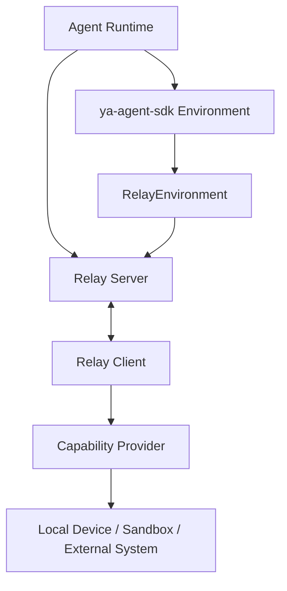
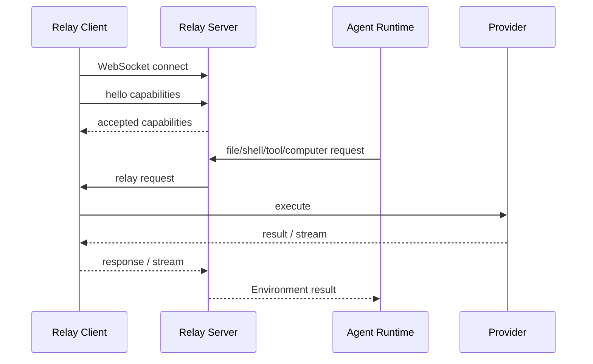

# 01. YA Environment Relay Overview

## Goal

YA Environment Relay connects an agent runtime to capabilities that execute in another process, device, sandbox, or host. It turns those external capabilities into `ya-agent-sdk` Environment components so the agent can use them through normal file, shell, resource, and tool abstractions.

YA Environment Relay is protocol-level infrastructure. Product integrations such as YA Desktop, YA Claw, cloud workers, or sandbox services implement the protocol for their own deployment models.

## Parties



Definitions:

- Agent Runtime: process that runs the model loop and tool calls.
- Relay Server: endpoint that accepts relay client connections and routes requests.
- Relay Client: process that connects to the relay server and advertises capabilities.
- Capability Provider: implementation behind the relay client, such as local filesystem, shell, OS automation, browser, VM, or custom tool host.
- Relay Environment: SDK Environment implementation backed by relay requests.

## Capability Families

YA Environment Relay uses capability families to group provider methods:

```text
fileops
shell
tools
resources
artifacts
computer
browser
```

Initial protocol should define the first six families. Browser can be added as a specialized provider or implemented as custom tools.

## Relationship to ya-agent-sdk

`ya-agent-sdk` already has core runtime abstractions:

- Environment
- FileOperator
- Shell
- ResourceRegistry
- Toolset
- resumable resources

YA Environment Relay should provide remote implementations of these abstractions:

```python
RelayEnvironment(Environment)
RelayFileOperator(FileOperator)
RelayShell(Shell)
RelayResourceRegistry(ResourceRegistry)
RelayToolset(Toolset)
```

This keeps agent code and profiles stable while moving execution to a connected provider.

## Relationship to Claw

Claw can use YA Environment Relay as one `WorkspaceProvider` backend:

```text
WorkspaceProvider kind = relay
Environment = RelayEnvironment
```

Claw remains responsible for:

- sessions and runs.
- profile selection.
- model execution.
- HITL approvals.
- durable trace.
- artifact storage.
- provider registry and connection routing.

A relay client supplies execution capabilities. Claw exposes them to the agent through SDK abstractions.

## Relationship to Desktop

YA Desktop can act as a relay client. It can advertise local capabilities:

- selected folders as workspace roots.
- sandboxed local shell.
- native OS computer use.
- Desktop-managed custom tools.
- local artifact upload.

Desktop owns user consent, local grants, and native permission UX. Claw owns runtime authorization and trace.

## Relationship to MCP

MCP and YA Environment Relay address overlapping but different surfaces:

| Surface                        | MCP                         | YA Environment Relay |
| ------------------------------ | --------------------------- | -------------------- |
| Tool discovery                 | yes                         | yes                  |
| JSON Schema tool input         | yes                         | yes                  |
| FileOperator abstraction       | product-specific            | built in             |
| Shell streaming                | server-specific             | built in             |
| Environment/resource lifecycle | limited by server           | built in             |
| Runtime artifact ownership     | external or custom          | built in             |
| User device relay              | possible with custom server | primary use case     |

A relay client can wrap MCP servers and register selected tools into YA Environment Relay. A Claw profile can use MCP servers and relay capabilities together.

## High-Level Flow



## Design Principles

- The protocol is provider-neutral.
- The runtime controls model-facing tool exposure.
- The provider controls local execution and local policy.
- Capabilities are explicitly advertised and accepted.
- Streaming and cancellation are first-class.
- Artifacts are owned by the runtime store when the call belongs to a run.
- Security is scoped by device, connection, space/workspace, capability, and root grants.
