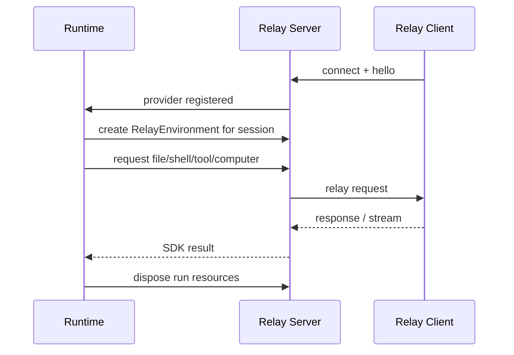

# 03. Relay Environment

## Goal

Relay Environment maps `ya-environment-relay.v1` capabilities into `ya-agent-sdk` runtime abstractions. Agents and toolsets should interact with normal SDK interfaces while execution happens through a connected relay provider.

## Environment Shape

```python
class RelayEnvironment(Environment):
    file_operator: RelayFileOperator
    shell: RelayShell
    resources: RelayResourceRegistry
    toolsets: list[RelayToolset]
```

The environment should be created from a binding:

```python
class RelayEnvironmentBinding(BaseModel):
    connection_id: str
    client_id: str
    roots: list[RelayRoot]
    capabilities: list[str]
    metadata: dict[str, Any] = Field(default_factory=dict)
```

## FileOperator Mapping

`RelayFileOperator` maps SDK file operations to `file.*` methods:

| SDK behavior     | Relay method  |
| ---------------- | ------------- |
| read text/bytes  | `file.read`   |
| write text/bytes | `file.write`  |
| list directory   | `file.list`   |
| stat path        | `file.stat`   |
| create directory | `file.mkdir`  |
| delete path      | `file.delete` |
| search content   | `file.search` |

Paths should be virtualized. The model and runtime see `/workspace/main/README.md`; the relay client maps it to an approved local root.

Request example:

```json
{
  "method": "file.read",
  "params": {
    "root_id": "main",
    "path": "README.md",
    "encoding": "utf-8"
  }
}
```

## Shell Mapping

`RelayShell` maps SDK shell execution to `shell.*` methods:

| SDK behavior    | Relay method   |
| --------------- | -------------- |
| start command   | `shell.start`  |
| send stdin      | `shell.input`  |
| resize terminal | `shell.resize` |
| send signal     | `shell.signal` |
| cancel command  | `shell.cancel` |
| inspect command | `shell.status` |

Shell output uses stream frames:

```json
{
  "type": "stream",
  "id": "req_shell_1",
  "event": "stdout",
  "data": "pytest started\n"
}
```

The terminal response carries exit status:

```json
{
  "type": "response",
  "id": "req_shell_1",
  "result": {
    "exit_code": 0,
    "duration_ms": 18233
  }
}
```

## Resource Mapping

Relay resources represent long-lived provider-side objects:

- browser sessions.
- computer sessions.
- database connections.
- local app automation handles.
- external service sessions.

Method mapping:

```text
resource.list
resource.get
resource.create
resource.dispose
resource.export_state
resource.restore_state
```

Resource state should integrate with SDK resumable resources when possible.

## Tool Mapping

Relay custom tools are described by JSON Schema and exposed as SDK tools.

Tool descriptor:

```json
{
  "name": "local_open_in_editor",
  "title": "Open File in Local Editor",
  "description": "Open a workspace file in the user's configured editor.",
  "input_schema": {
    "type": "object",
    "properties": {
      "path": { "type": "string" },
      "line": { "type": "integer" }
    },
    "required": ["path"]
  },
  "capability": "tools",
  "risk": "low",
  "approval_policy": "ask_once_per_run"
}
```

Runtime mapping:

1. Relay client registers tool descriptors.
2. Runtime constructs a `RelayToolset` from accepted descriptors.
3. Model calls generated SDK tool.
4. Runtime sends `tool.call` over relay.
5. Relay client executes the local tool.
6. Runtime records trace and returns model-facing result.

## Computer Mapping

Computer use can be represented as either:

- a specialized `RelayComputerProvider` used by a `ComputerUseToolset`.
- custom tools registered under the `tools` capability.

The specialized provider is preferred for product-grade computer use because it needs standard snapshot, action, artifact, pause, takeover, and policy semantics.

Method mapping:

```text
computer.status
computer.see
computer.act
computer.pause
computer.resume
computer.takeover
computer.release
```

## Binding to Agent Runs

Each relay request should include runtime context when available:

```json
{
  "context": {
    "session_id": "session_123",
    "run_id": "run_456",
    "tool_call_id": "call_789",
    "workspace_id": "workspace_abc"
  }
}
```

This lets providers upload artifacts, render user-facing prompts, and attach local audit logs to runtime objects.

## Lifecycle



## Reconnect

Relay clients can reconnect with the same `client_id`. Server behavior:

- mark capabilities unavailable when disconnected.
- fail pending requests with `relay_disconnected`.
- accept a fresh `hello` after reconnect.
- recreate environments against the new connection when session policy permits it.

Future protocol versions can add resumable request IDs and provider-side durable sessions.
