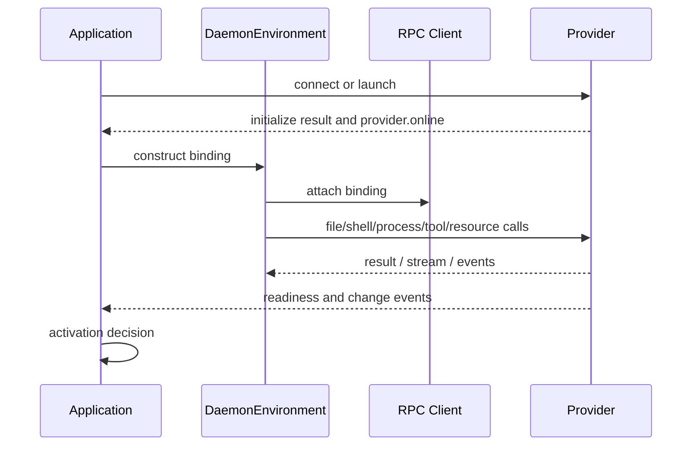

# 03. Environment Mapping

## Goal

The Python adapter maps `ya-environment-protocol.v1` providers into `ya-agent-sdk` runtime abstractions. Agents and SDK toolsets should interact with normal Environment interfaces while execution happens through a daemon or custom provider.

## Adapter Shape

```python
class DaemonEnvironment(Environment):
    file_operator: DaemonFileOperator
    shell: DaemonShell
    resources: DaemonResourceRegistry
    toolsets: list[DaemonToolset]
```

The environment is created from a binding, not directly from a transport connection:

```python
class EnvironmentProviderBinding(BaseModel):
    provider_id: str
    instance_id: str | None = None
    environment_id: str | None = None
    mount_ids: list[str]
    target_ids: list[str]
    capabilities: list[str]
    connection_ref: str | None = None
    metadata: dict[str, Any] = Field(default_factory=dict)
```

The binding survives reconnects when the same `provider_id` returns. `instance_id` is used to decide whether process/session handles are still valid.

## Multi-Provider Environment

A session may bind more than one provider:

```text
DaemonEnvironment
  primary file mount: user Desktop provider, /workspace/main
  detached shell target: agent-owned provider, /workspace/main
  optional tools: Desktop provider
```

The adapter must surface provider availability. If a mounted user provider is offline, file or shell requests against that provider fail with `provider_offline` or `capability_unavailable`; the application may choose a fallback provider before constructing the environment.

## FileOperator Mapping

`DaemonFileOperator` maps SDK file operations to `file.*` methods.

| SDK behavior      | Protocol method             |
| ----------------- | --------------------------- |
| read text/bytes   | `file.read`                 |
| write text/bytes  | `file.write`                |
| append text/bytes | `file.append`               |
| list directory    | `file.list`                 |
| stat path         | `file.stat`                 |
| create directory  | `file.mkdir`                |
| delete path       | `file.delete`               |
| move path         | `file.move`                 |
| copy path         | `file.copy`                 |
| walk/search       | `file.list` / `file.search` |
| watch             | `file.watch`                |

Paths are virtualized. The model and runtime see `/workspace/main/README.md`; the provider maps that to an approved host path, container path, or remote storage path.

The adapter should normalize SDK paths into:

```json
{
  "mount_id": "main",
  "path": "README.md"
}
```

when the path is under a known mount virtual path.

## Mount Consistency

Mount descriptors are the authority for file and shell path mapping:

```json
{
  "mount_id": "main",
  "virtual_path": "/workspace/main",
  "mode": "rw",
  "generation": 7,
  "state": "online"
}
```

Rules:

- Every `DaemonFileOperator` operation must resolve to one mount.
- Cross-mount copy/move must either stream through the adapter or use a provider method that explicitly supports both mounts.
- Read-only mounts reject writes, appends, deletes, mkdir, move destination, and copy destination.
- The provider enforces root boundaries after host path normalization.
- The adapter should include mount state in environment instructions when useful.

## Shell Mapping

The existing SDK `Shell` abstraction maps to stateless execution and background process methods:

| SDK behavior   | Protocol method       |
| -------------- | --------------------- |
| `execute`      | `shell.exec`          |
| `start`        | `process.start`       |
| `write_stdin`  | `process.input`       |
| `close_stdin`  | `process.close_stdin` |
| `send_signal`  | `process.signal`      |
| `wait_process` | `process.wait`        |
| `kill_process` | `process.kill`        |
| process status | `process.status/list` |

`DaemonShell.execute` must remain stateless. Each call supplies `target_id`, `cwd`, `env`, and timeout. It must not preserve command-to-command shell state.

Background process IDs are provider-owned. The adapter should translate provider output buffers into SDK `BackgroundProcess` and `CompletedProcess` behavior. If the provider reports `process_lost`, the adapter should surface a completed failed result or a clear tool error rather than silently dropping the process.

## Execution Target Mapping

An execution target describes where commands run:

```json
{
  "target_id": "local-default",
  "platform": "darwin",
  "shell_kind": "zsh",
  "default_cwd": "/workspace/main",
  "allowed_mount_ids": ["main"],
  "supports_exec": true,
  "supports_processes": true,
  "supports_pty": true,
  "process_persistence": "provider",
  "session_persistence": "provider"
}
```

The adapter must validate that a requested cwd is inside one of the target's allowed mounts before sending the request. The provider must also enforce this because remote clients are not trusted.

## Stateful Shell Sessions

Stateful shell sessions are not the same as SDK `Shell.execute`. They are explicit resources:

```text
shell_session.open
shell_session.exec
shell_session.input
shell_session.resize
shell_session.snapshot
shell_session.close
```

Use cases:

- interactive terminal UI
- REPLs
- long-lived activated environment
- task-specific shell state that the agent intentionally manages

The SDK can expose shell sessions through:

- `ResourceRegistry`
- a dedicated shell-session toolset
- a future richer Shell API

The adapter must not hide stateful shell sessions behind normal `execute`, because that would make detached and reconnect semantics ambiguous.

## Resource Mapping

Protocol resources represent long-lived provider-side objects:

- shell sessions
- file watches
- browser sessions
- computer sessions
- database connections
- local app automation handles
- external service sessions

Method mapping:

```text
resource.list
resource.get
resource.create
resource.dispose
resource.export_state
resource.restore_state
```

Resource state can integrate with SDK resumable resources when the provider reports a serializable state. Providers must mark opaque or provider-local state as opaque and must not leak secrets in exported state.

## Tool Mapping

Custom tools are described by JSON Schema and exposed as SDK tools.

Descriptor:

```json
{
  "name": "local_open_in_editor",
  "title": "Open File in Local Editor",
  "description": "Open a workspace file in the user's configured editor.",
  "input_schema": {
    "type": "object",
    "properties": {
      "path": { "type": "string" },
      "line": { "type": "integer" }
    },
    "required": ["path"]
  },
  "risk": "low",
  "approval_policy": "ask_once_per_run"
}
```

Runtime mapping:

1. Provider reports descriptors through `tool.list` or `tool.registered`.
2. Application policy accepts or filters tools.
3. Runtime constructs a `DaemonToolset`.
4. Model calls generated SDK tool.
5. Adapter sends `tool.call`.
6. Provider executes under local policy.
7. Runtime records trace and returns model-facing result.

## Computer Mapping

Computer use should be a specialized capability rather than a generic tool bag when product-grade semantics are required:

```text
computer.status
computer.see
computer.act
computer.pause
computer.resume
computer.takeover
computer.release
```

Computer methods need standard snapshot, action, artifact, pause, takeover, and policy semantics. Generic custom tools can still cover simple local app actions.

## Environment Instructions

The adapter should generate concise environment instructions that include:

- online/offline provider state
- visible mounts and modes
- default shell target and cwd
- shell statelessness
- background process behavior
- available stateful shell session tools if enabled

Instructions should not mention host paths unless product policy allows it.

## Lifecycle



## Reconnect and Handle Validity

When a provider reconnects with the same `provider_id`:

- bindings can remain valid if grants and accepted capabilities still match.
- mounts should be compared by `mount_id` and `generation`.
- process handles survive only if `process_persistence` and provider state prove they survived.
- shell session handles survive only if `session_persistence` and provider state prove they survived.
- opaque resource handles survive only if `resource.get` confirms them.

The adapter must treat uncertain handle state as lost.
