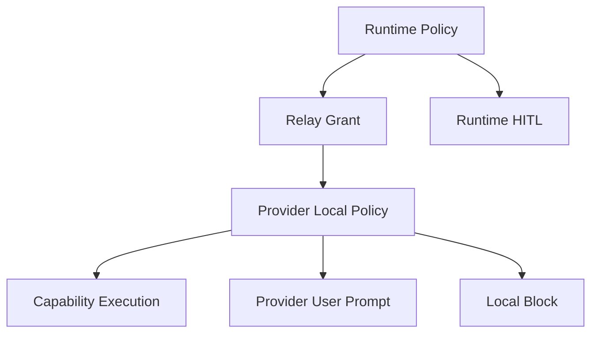

# 04. Security and Policy

## Goal

YA Environment Relay gives an agent runtime access to external execution environments. The protocol must make every capability explicit, scoped, revocable, and traceable.

## Trust Layers



Runtime policy controls model-facing access. Provider policy controls local execution. Both can require approvals or block actions.

## Authentication

Relay connections should authenticate with a scoped token:

```http
Authorization: Bearer <relay-token>
```

Token scope should include:

- client identity.
- allowed runtime or connection.
- workspace or Space identity.
- capability grants.
- expiration.
- revocation ID.

## Authorization Grant

Grant shape:

```ts
type RelayGrant = {
  grant_id: string;
  client_id: string;
  runtime_id: string;
  scope_id?: string;
  capabilities: RelayCapabilityGrant[];
  expires_at?: string;
  created_at: string;
};

type RelayCapabilityGrant = {
  capability: "fileops" | "shell" | "tools" | "resources" | "artifacts" | "computer";
  enabled: boolean;
  policy_id?: string;
  roots?: RelayRootGrant[];
};
```

File roots should be individually granted:

```ts
type RelayRootGrant = {
  root_id: string;
  virtual_path: string;
  mode: "ro" | "rw";
};
```

## Capability Acceptance

The relay server should accept only capabilities allowed by the active grant. The `hello` frame advertises provider capabilities. The server returns accepted capabilities in `relay.accepted`.

A provider may advertise `computer`; the server can accept only `fileops` and `tools` based on policy.

## Path Safety

Relay file operations use virtual paths and root IDs. Providers must enforce root boundaries after path normalization.

Rules:

- normalize paths before access.
- resolve symlinks according to root policy.
- reject traversal outside roots.
- preserve read-only grants.
- include root ID and virtual path in audit logs.

## Shell Safety

Shell grants should include:

- allowed roots and cwd.
- environment variable allowlist.
- network policy metadata.
- command approval policy.
- max runtime.
- streaming output limits.

Shell execution should use provider-local sandboxing when available.

## Tool Safety

Custom tools should declare risk and approval policy:

```ts
type RelayToolPolicy = {
  risk: "low" | "medium" | "high" | "critical";
  approval_policy: "allow" | "ask_once" | "ask_once_per_run" | "always_ask" | "block";
};
```

Runtime profiles can override provider suggestions with stricter rules.

## Computer Safety

Computer use should use additional local controls:

- explicit user enablement.
- visible active state.
- pause, takeover, release, stop.
- app allow/deny lists.
- screenshot retention policy.
- artifact upload policy.
- sensitive surface detection.

The provider should check local control state before each computer action.

## Artifact Safety

Artifact uploads should be tied to a run or approved workspace scope.

Artifact policy dimensions:

- allowed MIME types.
- max size.
- retention days.
- redaction required.
- upload approval for sensitive classes.
- remote runtime upload consent.

## Audit

Every relay request should be auditable:

```ts
type RelayAuditEntry = {
  id: string;
  connection_id: string;
  client_id: string;
  method: string;
  session_id?: string;
  run_id?: string;
  tool_call_id?: string;
  capability: string;
  policy_decision: "allowed" | "approved" | "blocked";
  started_at: string;
  completed_at?: string;
  status: "succeeded" | "failed" | "cancelled";
};
```

Runtime and provider can both keep audit logs. Runtime audit links to run trace. Provider audit supports local diagnostics and user trust review.

## Revocation

Revocation should close active sockets and fail pending requests. Provider-side revocation should stop new execution immediately. Runtime-side revocation should remove the relay provider from capability discovery.

Common revocation triggers:

- user disables relay for a Space.
- token expires.
- provider loses required permissions.
- remote runtime identity changes.
- policy version changes.
- user emergency stop.
