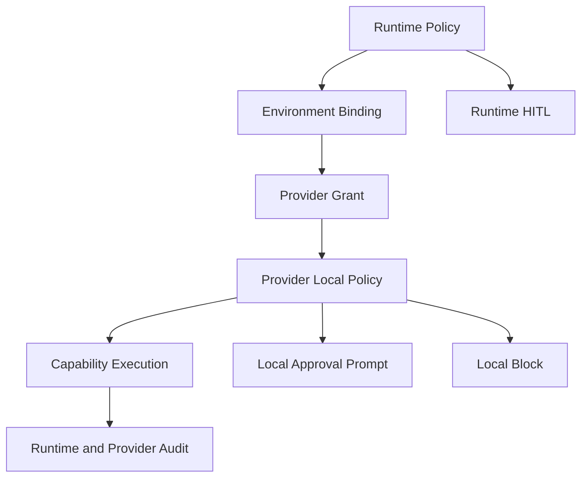

# 04. Security and Policy

## Goal

YA Environment Protocol gives an agent runtime access to external execution environments. Every capability must be explicit, scoped, revocable, auditable, and enforceable by both application policy and provider-local policy.

The protocol reports facts and policy decisions. Product layers own user experience, approvals, activation decisions, and durable trace.

## Trust Layers



Runtime policy controls model-facing access. Provider policy controls local execution. The stricter decision wins.

## Authentication

Authentication is transport-profile specific.

Recommended carriers:

- stdio child process: inherited launch authority plus optional one-time init token in environment or argv.
- Unix socket or Windows named pipe: OS access control plus token in `initialize`.
- WebSocket: bearer token in `Authorization`.
- TCP/TLS: mutual TLS or bearer token.

Provider tokens should be scoped to:

- provider identity
- runtime identity or tenant
- workspace/space/environment identity
- capability grants
- mount IDs
- execution target IDs
- expiration
- revocation ID or policy generation

## Authorization Grant

Grant shape:

```ts
type EnvironmentGrant = {
  grant_id: string;
  provider_id: string;
  runtime_id: string;
  environment_id?: string;
  status: "draft" | "active" | "paused" | "revoked" | "expired";
  capabilities: CapabilityGrant[];
  policy_generation: number;
  expires_at?: string;
  created_at: string;
};

type CapabilityGrant = {
  capability:
    | "fileops"
    | "shell"
    | "process"
    | "shell_session"
    | "tools"
    | "resources"
    | "artifacts"
    | "computer";
  enabled: boolean;
  policy_id?: string;
  mount_ids?: string[];
  target_ids?: string[];
};
```

The application layer filters advertised capabilities against grants before exposing them to agents.

## Capability Acceptance

Providers advertise capabilities during `initialize`. The runtime accepts only capabilities allowed by the active grant and runtime policy.

Example: a Desktop provider may advertise fileops, shell sessions, computer use, and tools. Claw may accept only fileops and stateless shell for a given session.

Acceptance is not permanent. Capability state can change through:

- provider reconnect
- grant revocation
- local permission loss
- user pause
- policy generation change
- provider health degradation

## Path Safety

File methods use virtual paths and mount IDs. Providers must enforce root boundaries after path normalization.

Rules:

- Normalize virtual paths with POSIX semantics.
- Map virtual paths to provider-local paths only after mount lookup.
- Resolve host paths before access.
- Reject traversal outside the mount.
- Reject symlink escape unless the mount explicitly allows following symlinks and the resolved target remains inside allowed boundaries.
- Enforce `ro` and `rw` mode for every mutating operation.
- Include `mount_id`, virtual path, and generation in audit logs.
- Do not expose host paths to the model unless product policy allows it.

## File Watch Safety

`file.watch` can leak local activity. Providers must check grant and local policy before enabling watches.

Watch events should include:

```ts
type FileChangeEvent = {
  mount_id: string;
  generation: number;
  path: string;
  kind: "created" | "modified" | "deleted" | "renamed" | "unknown";
  old_path?: string;
  ts: string;
};
```

Applications decide whether file changes should wake an agent, update a UI, or only be recorded.

## Shell Safety

Shell grants are separate from file grants. A file mount being writable does not automatically imply shell access.

Shell policy dimensions:

```ts
type ShellPolicy = {
  mode: "disabled" | "review_then_run" | "allow";
  allowed_target_ids: string[];
  allowed_mount_ids: string[];
  cwd_policy: "mount_only" | "target_default_only";
  env_allowlist: string[];
  env_overrides: Record<string, string>;
  command_review_threshold: "low" | "medium" | "high" | "extra_high";
  unattended_risk_threshold: "low" | "medium" | "high" | "extra_high";
  network_policy: "blocked" | "restricted" | "proxy" | "full";
  sandbox_profile: "read_only" | "workspace_write" | "relay_workspace_write" | "network_proxy" | "danger_full_access";
  sandbox_backend: "auto" | "linux_bwrap_seccomp" | "macos_seatbelt" | "windows_restricted_token" | "docker" | "podman" | "nsjail" | "raw_host";
  max_runtime_seconds: number;
  output_limit_bytes: number;
  audit_enabled: boolean;
};
```

Policy application order:

1. Runtime checks profile-level capability exposure and HITL rules.
2. Application checks environment binding and grant.
3. Provider checks local permission, target, cwd, mount, env, sandbox, and emergency stop.
4. Provider asks for local approval when required.
5. Provider executes through the selected sandbox backend.
6. Provider and runtime record audit projections.

## Stateless Shell vs Stateful Session

`shell.exec` is stateless. Providers must not rely on previous commands to supply cwd, exported env, aliases, shell functions, virtualenv activation, or history.

Stateful shell behavior belongs to `shell_session.*`. Providers must advertise session persistence truthfully:

```text
connection  session disappears when the logical connection closes
provider    session can be reattached while the same provider instance is alive
durable     session can survive provider restart through a durable backend
```

`durable` requires a real durable backend such as tmux, screen, a container session manager, or another provider-owned state recovery mechanism. A plain in-memory PTY is not durable.

## Process Safety

Background processes can outlive a single tool call. Providers must:

- associate every process with context when available.
- enforce max runtime and output limits.
- support kill when possible.
- emit `process.exited` or `process.lost`.
- clean up processes on grant revocation unless policy explicitly allows survival.
- make process list/status visible to the runtime for active bindings.

## Tool Safety

Custom tools declare risk and approval policy:

```ts
type ToolPolicy = {
  risk: "low" | "medium" | "high" | "critical";
  approval_policy: "allow" | "ask_once" | "ask_once_per_run" | "always_ask" | "block";
};
```

Runtime profiles can override provider suggestions with stricter policy.

## Computer Safety

Computer use requires extra local controls:

- explicit user enablement.
- visible active state.
- pause, takeover, release, and emergency stop.
- app allow and deny lists.
- screenshot retention policy.
- sensitive surface detection.
- artifact upload policy.
- clear local audit.

The provider must check local control state before every computer action.

## Artifact Safety

Artifacts uploaded to runtime storage must be tied to a run or approved workspace scope.

Artifact policy dimensions:

- allowed MIME types
- max size
- retention period
- redaction requirements
- upload approval for sensitive classes
- destination runtime identity

Providers should prefer out-of-band upload URLs for large artifacts.

## Audit

Every request should be auditable by runtime and provider:

```ts
type EnvironmentAuditEntry = {
  id: string;
  provider_id: string;
  instance_id: string;
  connection_id?: string;
  method: string;
  session_id?: string;
  run_id?: string;
  tool_call_id?: string;
  capability: string;
  mount_ids?: string[];
  target_id?: string;
  resource_id?: string;
  policy_decision: "allowed" | "approved" | "blocked";
  local_decision_id?: string;
  started_at: string;
  completed_at?: string;
  status: "succeeded" | "failed" | "cancelled" | "lost";
  error_name?: string;
  output_truncated?: boolean;
};
```

Runtime audit links to run trace. Provider audit supports local diagnostics and user trust review.

## Revocation

Revocation must stop new execution immediately.

Common revocation triggers:

- user disables provider for a Space.
- token expires.
- provider loses required OS permission.
- remote runtime identity changes.
- policy generation changes.
- user emergency stop.
- workspace trust changes.

On revocation:

- provider emits `provider.revoked`.
- runtime removes accepted capabilities.
- pending requests fail with `provider_paused`, `provider_offline`, or `permission_denied`.
- background processes and shell sessions are killed or preserved according to explicit local policy.
- handles are invalidated unless a new grant explicitly restores them.

## Activation Boundary

Provider events are not agent commands. The protocol never says "wake the agent now".

Applications may use events as activation inputs:

- `provider.online`
- `provider.resumed`
- `mount.changed`
- `process.exited`
- `shell_session.available`
- `resource.updated`

The application must check session policy, user settings, run queue state, and source context before creating a new run.
