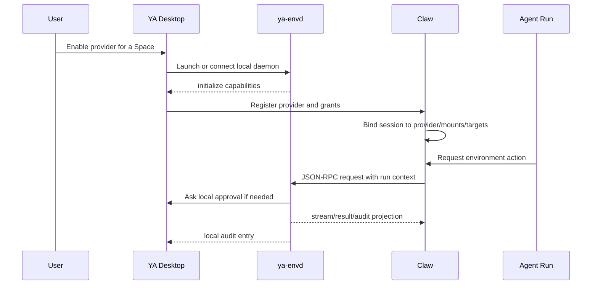

# 06. Desktop Local PC Provider

## Goal

YA Desktop can supervise a user-owned `ya-envd` and expose selected local PC capabilities to Claw through `ya-environment-protocol.v1`. The user can mount local folders, local shell targets, computer use, and Desktop-managed tools into selected sessions while Desktop keeps final authority over local safety.

Desktop provider support is an application-layer integration. The protocol reports provider state and executes authorized requests; Desktop and Claw decide binding, approval UX, audit display, and activation behavior.

## Product Shape



## Space Mapping

A Desktop Space maps to a provider environment:

```ts
type DesktopEnvironmentBinding = {
  environment_id: string;
  space_id: string;
  provider_id: string;
  display_name: string;
  execution_location: "this_device";
  mounts: DesktopMount[];
  shell_targets: DesktopShellTarget[];
  grants: EnvironmentGrant[];
};

type DesktopMount = {
  mount_id: string;
  name: string;
  host_path: string;
  virtual_path: string;
  mode: "ro" | "rw";
  trust_level: "trusted" | "ask_before_write" | "read_only";
  follow_symlinks: boolean;
};
```

Desktop advertises only user-selected folders. Claw persists accepted `mount_id` and `target_id` values in session workspace metadata, not host paths.

## Shell Target Mapping

Shell access is a separate grant layered on top of mounts:

```ts
type DesktopShellTarget = {
  target_id: string;
  label: string;
  default_cwd: string;
  allowed_mount_ids: string[];
  shell_kind: "sh" | "bash" | "zsh" | "powershell" | "cmd";
  supports_exec: boolean;
  supports_processes: boolean;
  supports_pty: boolean;
  supports_signals: boolean;
  process_persistence: "provider";
  session_persistence: "provider";
  policy: DesktopShellPolicy;
};

type DesktopShellPolicy = {
  mode: "review_then_run" | "read_only_shell" | "disabled";
  env_allowlist: string[];
  env_overrides: Record<string, string>;
  approval_policy: "defer" | "deny";
  review_risk_threshold: "low" | "medium" | "high" | "extra_high";
  unattended_risk_threshold: "low" | "medium" | "high" | "extra_high";
  network_policy: "blocked" | "restricted" | "proxy" | "full";
  sandbox_profile: "read_only" | "workspace_write" | "relay_workspace_write" | "network_proxy" | "danger_full_access";
  sandbox_backend: "auto" | "linux_bwrap_seccomp" | "macos_seatbelt" | "windows_restricted_token" | "docker" | "podman" | "nsjail" | "raw_host";
  max_runtime_seconds: number;
  output_limit_bytes: number;
  audit_enabled: boolean;
};
```

Desktop can advertise stateful shell sessions when local policy allows PTY access. These sessions are provider-scoped by default: they can be reattached while the same local daemon instance is alive, but they are lost if the daemon exits unless Desktop configures a durable backend.

## Online and Offline Lifecycle

Desktop provider states:

| State                 | Meaning                                                               |
| --------------------- | --------------------------------------------------------------------- |
| `draft`               | Space has local config but is not exposed to Claw.                    |
| `online`              | `ya-envd` is running and Claw accepted capabilities.                  |
| `offline`             | Desktop or daemon is unreachable; new provider requests fail.         |
| `paused`              | User keeps identity and grants but rejects new execution.             |
| `permission_required` | OS permission or user approval is required before capability can run. |
| `revoked`             | Desktop invalidated grants and closed provider access.                |

User offline does not stop agent-owned detached environments. A Claw session can keep running on an agent-owned provider while Desktop provider capabilities are unavailable.

## Activation Boundary

When Desktop comes back online, `ya-envd` or Desktop emits:

```text
provider.online
provider.resumed
mount.changed
shell_session.available
```

These events are activation inputs only. Claw or Desktop may create a run after checking:

- session binding policy
- user preferences
- pending work
- source context
- last run state
- safety rules

The protocol does not directly activate the agent.

## Request Context

Every Claw-to-Desktop request should include:

```ts
type DesktopExecutionContext = {
  session_id: string;
  run_id?: string;
  tool_call_id?: string;
  profile_name?: string;
  source_kind?: "api" | "agency" | "schedule" | "bridge" | "subagent" | "user";
  source_metadata?: Record<string, unknown>;
  environment_id: string;
  mount_ids: string[];
  target_id?: string;
  user_visible_reason?: string;
};
```

Desktop displays this context in approvals and audit logs so the user can see which agent requested local PC access.

## Policy Application Order

1. Claw checks runtime grants, profile-level tool exposure, HITL, and session binding.
2. Claw routes the request to the accepted provider and target.
3. `ya-envd` checks grant, mount, target, cwd, env, sandbox, timeout, and output limits.
4. Desktop asks the user when local policy requires approval.
5. `ya-envd` executes through the configured local backend.
6. Desktop stores local audit; Claw stores run-linked audit projection.

## Local Audit Fields

Desktop audit entries extend the base protocol audit:

```ts
type DesktopAuditEntry = EnvironmentAuditEntry & {
  device_id: string;
  space_id: string;
  environment_id: string;
  host_path_redacted?: boolean;
  cwd?: string;
  command_preview?: string;
  local_policy_decision: "allowed" | "approved" | "blocked";
  local_user_decision_id?: string;
  output_truncated?: boolean;
};
```

Desktop keeps local audit logs for user trust review. Claw keeps run-linked projections for traceability.

## Desktop MVP Phases

### Phase 1: Local daemon foundation

- Desktop can install, locate, launch, and monitor `ya-envd`.
- Desktop maps a Space to mounts and shell targets.
- Desktop shows provider state and local audit.

### Phase 2: Provider registration

- Desktop registers provider identity and grants with Claw.
- Claw stores accepted `mount_id` and `target_id` bindings.
- Desktop can pause and revoke provider access.

### Phase 3: Environment backend

- Claw uses `DaemonEnvironment` for Desktop-mounted sessions.
- File operations and shell process methods route through `ya-envd`.
- Offline provider errors are explicit and user-visible.

### Phase 4: Stateful sessions and native capabilities

- Desktop exposes shell sessions where policy allows.
- Desktop exposes computer use, clipboard, notifications, and local tools as optional capabilities.
- Each native capability has explicit local controls and audit entries.
