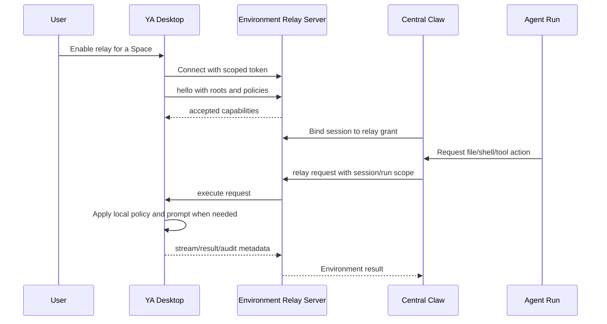

# 06. Desktop Local PC Relay

## Goal

YA Desktop is the first local PC relay client for `ya-environment-relay.v1`. It gives a central Claw agent a controlled way to mount selected local workspace capabilities after the user grants access from Desktop.

## Product Shape

Desktop owns local identity, workspace selection, consent UI, local shell policy, native permissions, and audit visibility. Claw owns runtime authorization, model-facing tool exposure, run trace, and durable session state.



## Desktop Space Mapping

A Desktop Space maps to a relay scope:

```ts
type DesktopRelayScope = {
  scope_id: string;
  space_id: string;
  device_id: string;
  display_name: string;
  execution_location: "this_device";
  roots: DesktopRelayRoot[];
  shell_policy: DesktopShellPolicy;
  grants: RelayCapabilityGrant[];
};

type DesktopRelayRoot = {
  root_id: string;
  name: string;
  host_path: string;
  virtual_path: string;
  mode: "ro" | "rw";
  trust_level: "trusted" | "ask_before_write" | "read_only";
};
```

Desktop advertises only user-selected roots. Every root has a stable `root_id`, a virtual path, and a read/write mode. Claw persists the selected relay scope in session workspace metadata.

## Shell Safety Envelope

Shell access is a separate grant layered on top of file roots.

```ts
type DesktopShellPolicy = {
  mode: "review_then_run" | "read_only_shell" | "disabled";
  cwd_root_id: string;
  allowed_root_ids: string[];
  env_allowlist: string[];
  env_overrides: Record<string, string>;
  approval_policy: "defer" | "deny";
  review_risk_threshold: "low" | "medium" | "high" | "extra_high";
  unattended_risk_threshold: "low" | "medium" | "high" | "extra_high";
  network_policy: "inherit" | "restricted" | "blocked" | "proxy";
  sandbox_profile: "read_only" | "workspace_write" | "relay_workspace_write" | "network_proxy" | "danger_full_access";
  sandbox_backend: "auto" | "linux_bwrap_seccomp" | "macos_seatbelt" | "windows_restricted_token" | "docker" | "podman" | "nsjail" | "raw_host";
  max_runtime_seconds: number;
  output_limit_bytes: number;
  audit_enabled: boolean;
};
```

Policy application order:

1. Claw checks runtime grants, profile-level shell review, and shell sandbox policy.
2. Relay checks grant capability, session/run binding, and root scope.
3. Desktop checks local shell mode, sandbox profile, backend diagnostics, cwd root, env allowlist, command class, runtime limit, and local emergency stop.
4. Desktop asks the user for local approval when local policy requires approval.
5. Desktop executes through the provider-local shell sandbox and streams bounded stdout/stderr.
6. Desktop records a local audit entry and returns a run-linked audit projection to Claw.

## Grant Lifecycle

A Desktop relay grant has four states:

| State     | Meaning                                                               |
| --------- | --------------------------------------------------------------------- |
| `draft`   | Desktop has prepared a Space and local policy.                        |
| `active`  | Desktop has connected and Claw accepted the advertised capabilities.  |
| `paused`  | Desktop keeps identity but rejects new execution.                     |
| `revoked` | Desktop closes sockets, cancels active calls, and invalidates tokens. |

Grant tokens are scoped to one device, one runtime or tenant, selected Spaces, capabilities, expiration, and a revocation ID.

## Request Context

Every relay request from Claw to Desktop includes:

```ts
type RelayExecutionContext = {
  session_id: string;
  run_id: string;
  tool_call_id?: string;
  profile_name?: string;
  source_kind?: "api" | "agency" | "schedule" | "bridge" | "subagent";
  source_metadata?: Record<string, unknown>;
  scope_id: string;
  root_ids: string[];
  user_visible_reason?: string;
};
```

Desktop displays this context in approvals and audit logs so the user can see which central agent requested local PC access.

## MVP Phases

### Phase 1: Desktop-local foundation

- Desktop Space registry stores execution location, trust level, shell safety policy, and relay readiness.
- Desktop launches Local Claw with shell review and shell sandbox policy enabled through a Desktop-managed profile seed.
- Desktop sends Space metadata into Claw workspace bindings.
- Desktop UI shows shell safety and relay state on Home, Spaces, Settings, and Details.

### Phase 2: Relay server and client handshake

- Claw exposes relay provider registration and scoped token issuance.
- Desktop connects over WebSocket with `hello`, capability advertisement, and accepted capability response.
- Relay grants can be enabled per Space.

### Phase 3: Remote Environment backend

- Claw adds `WorkspaceProvider kind = relay`.
- SDK adds `RelayEnvironment`, `RelayFileOperator`, and `RelayShell`.
- File operations and shell streams route through relay requests and cancellation frames.

### Phase 4: Native Desktop capabilities

- Desktop advertises optional computer use, screenshots, clipboard, notifications, and custom local tools.
- Each native capability has explicit local controls and audit entries.

## Required Audit Fields

Desktop audit entries extend the base relay audit shape with local PC details:

```ts
type DesktopRelayAuditEntry = RelayAuditEntry & {
  device_id: string;
  space_id: string;
  root_ids: string[];
  cwd?: string;
  command_preview?: string;
  local_policy_decision: "allowed" | "approved" | "blocked";
  local_user_decision_id?: string;
  output_truncated?: boolean;
};
```

Desktop keeps local audit logs for user trust review. Claw keeps run-linked audit projections for traceability.
