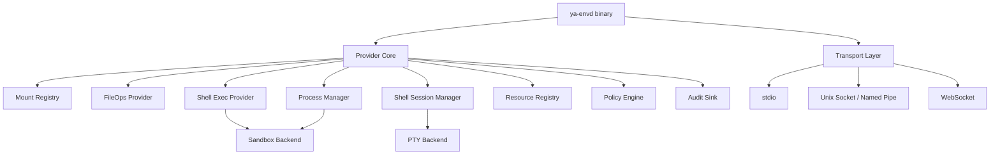

# 07. ya-envd Daemon

## Goal

`ya-envd` is the official Rust implementation of `ya-environment-protocol.v1`. It provides a portable daemon binary for local, workspace, and cloud execution environments while keeping the protocol open to other implementations.

The daemon should be usable in three modes:

- child process over stdio for simple SDK/Claw-launched providers.
- long-lived local daemon over Unix socket or Windows named pipe for Desktop and local workspace use.
- remote provider behind WebSocket or another transport profile for cross-machine environments.

## Responsibilities

`ya-envd` owns provider-local execution:

- initialize and capability advertisement.
- mount registry and path enforcement.
- file operations.
- stateless shell execution.
- background process lifecycle and output buffers.
- stateful shell sessions.
- resource registry.
- provider-local policy checks.
- local audit.
- transport adapters.

The application layer owns:

- launching or supervising the daemon.
- user-facing grants and approvals.
- runtime session binding.
- remote authorization.
- run trace and artifact persistence.
- activation decisions.

## Architecture



## Rust Crates

Recommended crates:

```text
ya-env-protocol
  JSON-RPC envelope, methods, params, results, events, errors, JSON Schema export

ya-envd-core
  provider runtime, mounts, fileops, shell, processes, sessions, policy, audit

ya-envd
  binary, CLI, config, transports, logging

ya-envd-client
  optional Rust client for tests and Rust applications
```

## CLI Shape

Initial CLI:

```text
ya-envd stdio --config <path>
ya-envd socket --config <path> --listen <path>
ya-envd websocket --config <path> --connect <url>
ya-envd doctor --config <path>
```

`stdio` is best for SDK-managed child processes. `socket` is best for Desktop or local service supervision. `websocket` is best when the provider connects to a remote Claw endpoint.

## Configuration

Example config:

```json
{
  "provider_id": "desktop-macbook",
  "environment_id": "space_main",
  "display_name": "Local Space",
  "mounts": [
    {
      "mount_id": "main",
      "label": "ya-mono",
      "host_path": "/Users/me/code/yet-another-agents/ya-mono",
      "virtual_path": "/workspace/main",
      "mode": "rw",
      "follow_symlinks": false,
      "watch_supported": true
    }
  ],
  "shell_targets": [
    {
      "target_id": "local-default",
      "default_cwd": "/workspace/main",
      "allowed_mount_ids": ["main"],
      "shell_kind": "zsh",
      "sandbox_profile": "workspace_write",
      "sandbox_backend": "auto",
      "process_persistence": "provider",
      "session_persistence": "provider"
    }
  ]
}
```

Host paths remain daemon-local and should not be sent to model-facing context unless the application allows it.

## File Operations

`ya-envd` file operations must:

- normalize virtual paths with POSIX semantics.
- resolve mount-relative paths safely.
- reject traversal and symlink escape.
- enforce ro/rw modes.
- support text and bytes reads.
- support bounded reads and streaming reads.
- write atomically where practical.
- provide consistent stat/list output across platforms.
- emit watch events when enabled.

## Shell Exec

`shell.exec` uses `tokio::process::Command` or the selected sandbox backend. It is stateless and must not retain shell state between calls.

Execution flow:

1. Validate target.
2. Resolve cwd inside allowed mounts.
3. Filter env through policy.
4. Build sandbox command.
5. Execute with timeout and output limit.
6. Return exit code, stdout, stderr, duration, truncation metadata.
7. Write audit entry.

## Background Processes

`process.start` creates a daemon-tracked process handle.

The process manager should store:

```ts
type ProcessState = {
  process_id: string;
  target_id: string;
  command: string;
  cwd: string;
  started_at: string;
  status: "running" | "exited" | "killed" | "lost";
  exit_code?: number;
  output_truncated: boolean;
};
```

Output should be retained in bounded ring buffers. The daemon streams live output and supports polling through `process.wait` or `process.status`.

`process_persistence: "provider"` means the handle can survive client disconnect while the daemon instance remains alive. It does not mean the handle survives daemon restart.

## Stateful Shell Sessions

`shell_session.*` manages explicit interactive sessions. A session is a resource with PTY state.

Recommended backend:

- portable PTY crate for local processes.
- container exec PTY for containerized targets.
- optional durable backend such as tmux, screen, or provider-specific session manager.

Session state:

```ts
type ShellSessionState = {
  session_id: string;
  target_id: string;
  cwd: string;
  started_at: string;
  status: "open" | "closed" | "lost";
  persistence: "connection" | "provider" | "durable";
  cols: number;
  rows: number;
};
```

Stateful sessions are not used to implement `shell.exec`. They are separate resources because their lifecycle, reattach behavior, and safety policy are different.

## Persistence

Persistence levels:

```text
connection  state is valid only for the current logical connection
provider    state survives client disconnect while this daemon instance lives
durable     state survives daemon restart through an explicit durable backend
```

`ya-envd` MVP should support provider-scoped process/session state. Durable shell sessions are optional and must be advertised only when a backend actually provides them.

## Transports

### stdio

- LSP-style `Content-Length` framing.
- logs go to stderr only if they cannot corrupt framing; structured logs should preferably go to a file.
- process exits on parent shutdown unless separately supervised.

### Socket and Named Pipe

- one local daemon can serve multiple logical clients if policy allows.
- auth uses OS permissions plus token or policy generation.
- reconnect can validate provider and instance identity.

### WebSocket

- provider can connect to a remote runtime endpoint.
- heartbeat detects liveness.
- reconnection creates a new connection ID but can keep provider ID.

## Observability

The daemon should expose:

- `provider.status`
- `provider.capabilities`
- structured audit log
- optional metrics
- `doctor` diagnostics for shell backend, mount availability, OS permissions, and transport config

## Failure Semantics

Failure must be explicit:

- If a mount disappears, emit `mount.offline`.
- If a process cannot be reattached, emit `process.lost`.
- If a shell session cannot be reattached, emit `shell_session.lost`.
- If local policy changes, emit `capability.updated`.
- If daemon restarts, use a new `instance_id`.

Clients must treat missing proof of handle survival as handle loss.
