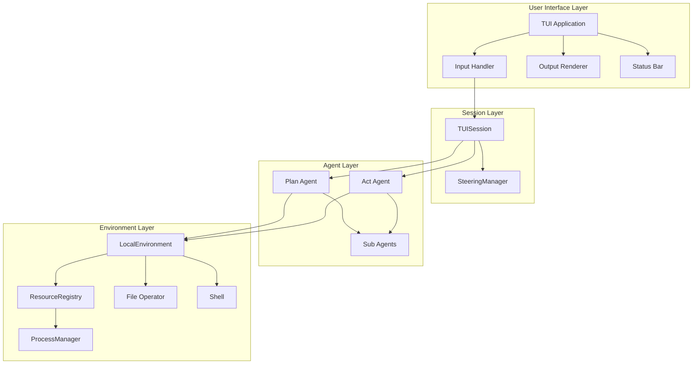

# YAACLI CLI TUI Architecture Overview

## Document Index

| Document                                     | Description                                       |
| -------------------------------------------- | ------------------------------------------------- |
| [01-event-system.md](./01-event-system.md)   | Event system and multi-agent display architecture |
| [02-configuration.md](./02-configuration.md) | Configuration via environment variables           |
| [03-tui-environment.md](./03-tui-environment.md) | TUI Environment with process management       |
| [04-steering.md](./04-steering.md)           | Steering mechanism and TUISession design          |
| [06-ui-layout.md](./06-ui-layout.md)         | TUI layout and user experience design             |
| [07-logging.md](./07-logging.md)             | Logging configuration                             |
| [08-hitl.md](./08-hitl.md)                   | Human-in-the-loop approval workflow               |

## High-Level Architecture

## Design Principles

### 1. Event-Driven via SDK Lifecycle Events

All agent activity flows through `stream_agent`'s event stream:

- SDK emits model request and tool call lifecycle events.
- Hook events surface context updates, handoffs, compacting, and task changes.
- The TUI renders SDK events directly through the display layer.

### 2. Simplified Configuration

Configuration primarily uses `~/.yaacli/config.toml`, project `.yaacli/` files, and `YAACLI_*` environment overrides. User config directories store:

- Custom subagents
- MCP server configuration
- Skills
- Session and message history

### 3. Tool Surface Composition

The runtime composes toolsets from:

- Core SDK tools
- Skill tools
- MCP servers through `ToolProxyToolset`
- Subagent delegation tools
- Environment-provided toolsets

### 4. Interactive Runtime

The TUI keeps a single active runtime per session and supports:

- Streaming output
- Human-in-the-loop approvals
- Steering messages during execution
- Background task monitoring
- Session persistence and restore
