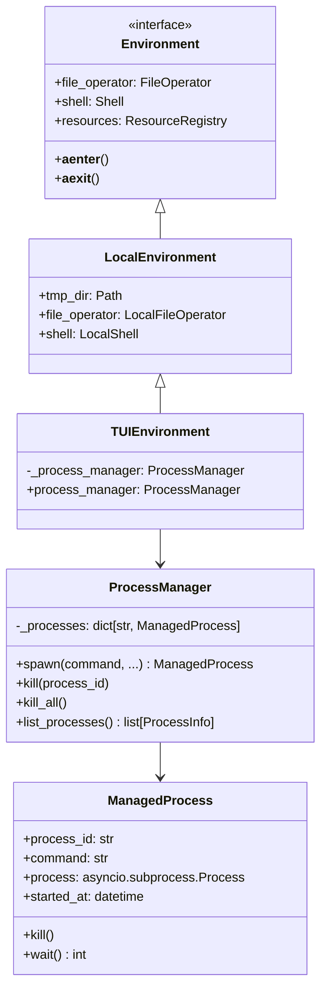
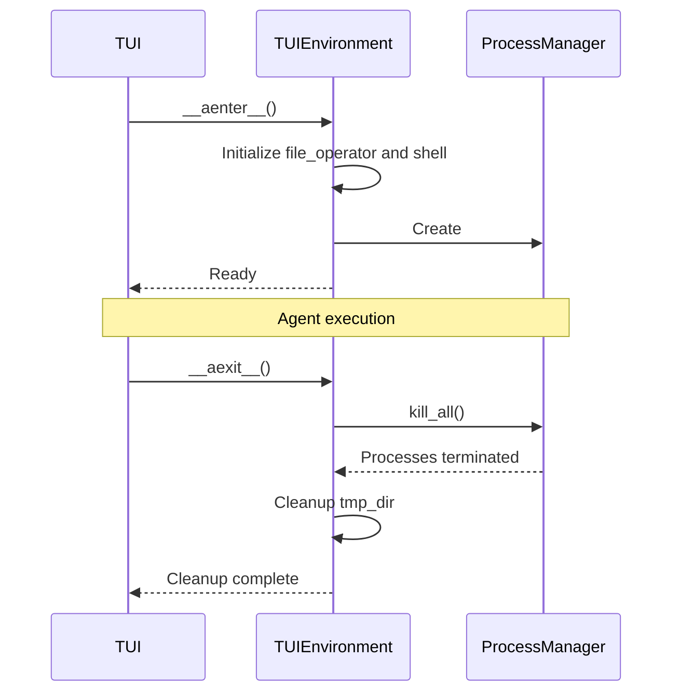

# TUI Environment with Subprocess Management

## Overview

`TUIEnvironment` extends `ya-agent-sdk`'s local environment with lifecycle support needed by the terminal UI:

1. **Subprocess management**: Track and control long-running processes.
2. **Resource cleanup**: Ensure managed processes are terminated during shutdown.
3. **TUI integration**: Surface process state for status and diagnostics.

> Event emission from `ProcessManager` is planned. The current implementation focuses on lifecycle management and background shell monitoring.

## Architecture



## Design Goals

- Maintain a registry of spawned processes.
- Provide bounded cleanup on application exit.
- Keep process metadata available for TUI display and diagnostics.
- Preserve `LocalEnvironment` file and shell semantics.

## Process Manager Sketch

```python
import asyncio
import uuid
from dataclasses import dataclass, field
from datetime import datetime

@dataclass
class ProcessInfo:
    process_id: str
    command: str
    args: list[str]
    pid: int
    started_at: datetime
    is_running: bool
    exit_code: int | None = None

@dataclass
class ManagedProcess:
    process_id: str
    command: str
    args: list[str]
    process: asyncio.subprocess.Process
    started_at: datetime = field(default_factory=datetime.now)

    @property
    def is_running(self) -> bool:
        return self.process.returncode is None

    @property
    def exit_code(self) -> int | None:
        return self.process.returncode

    async def kill(self, timeout: float = 5.0) -> int:
        if not self.is_running:
            return self.exit_code or 0

        self.process.terminate()
        try:
            await asyncio.wait_for(self.process.wait(), timeout=timeout)
        except asyncio.TimeoutError:
            self.process.kill()
            await self.process.wait()
        return self.exit_code or -1

class ProcessManager:
    def __init__(self) -> None:
        self._processes: dict[str, ManagedProcess] = {}
        self._lock = asyncio.Lock()

    async def spawn(
        self,
        command: str,
        args: list[str] | None = None,
        cwd: str | None = None,
        env: dict[str, str] | None = None,
        process_id: str | None = None,
    ) -> ManagedProcess:
        proc_id = process_id or f"proc-{uuid.uuid4().hex[:8]}"
        args = args or []
        process = await asyncio.create_subprocess_exec(command, *args, cwd=cwd, env=env)
        managed = ManagedProcess(proc_id, command, args, process)
        async with self._lock:
            self._processes[proc_id] = managed
        return managed

    async def kill(self, process_id: str, timeout: float = 5.0) -> bool:
        async with self._lock:
            managed = self._processes.get(process_id)
        if managed is None:
            return False
        await managed.kill(timeout)
        return True

    async def kill_all(self, timeout: float = 10.0) -> None:
        async with self._lock:
            processes = list(self._processes.values())
        await asyncio.gather(*(p.kill(timeout) for p in processes), return_exceptions=True)
```

## TUI Environment Sketch

```python
from pathlib import Path
from ya_agent_sdk.environment.local import LocalEnvironment

class TUIEnvironment(LocalEnvironment):
    def __init__(
        self,
        working_dir: Path | None = None,
        tmp_dir: Path | None = None,
    ) -> None:
        super().__init__(
            working_dir=working_dir,
            tmp_dir=tmp_dir,
        )
        self._process_manager: ProcessManager | None = None

    @property
    def process_manager(self) -> ProcessManager:
        if self._process_manager is None:
            self._process_manager = ProcessManager()
        return self._process_manager

    async def __aenter__(self) -> "TUIEnvironment":
        await super().__aenter__()
        self._process_manager = ProcessManager()
        return self

    async def __aexit__(self, exc_type, exc_val, exc_tb) -> None:
        if self._process_manager:
            await self._process_manager.kill_all()
        await super().__aexit__(exc_type, exc_val, exc_tb)
```

## Process Display

```text
Active Processes
- proc-a1b2  npm run dev        PID: 12345  running  2m34s
- proc-c3d4  python -m pytest   PID: 12346  running  0m12s
```

## Process Control Commands

```text
!ps                    # List all processes
!kill proc-a1b2        # Kill a specific process
!kill-all              # Kill all processes
!logs proc-a1b2        # Show process output
```

## Resource Lifecycle


