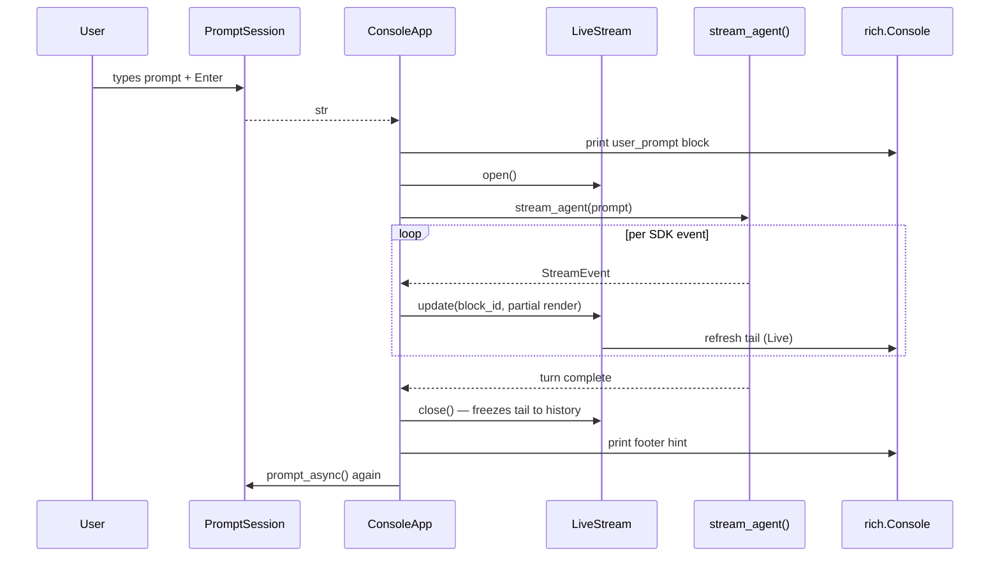
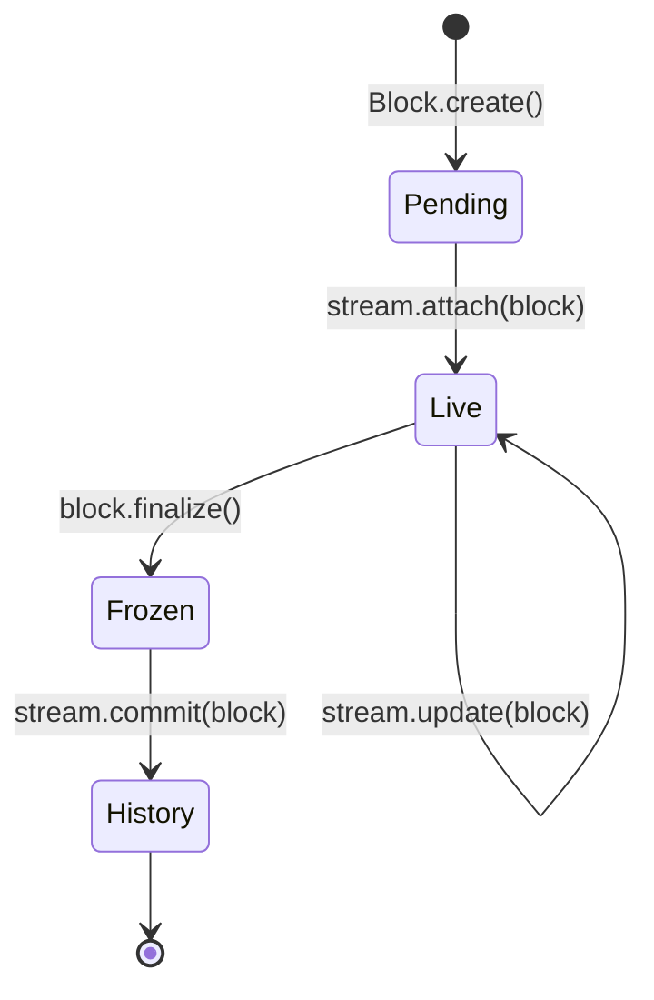

# TUI v2 — Streaming Console Redesign

## Status

**v2.1 (current)** — Implemented behind `YAACLI_TUI=v2` using **Textual**.
Fixed layout with header docked top, scrollable RichLog in the middle,
optional steering pane, persistent input docked bottom, and footer hint.
Fixes the "no alternate-screen / no persistent input / Ctrl+C exits" issues
of the original v2 modal-prompt prototype. See "v2.1 Textual layout"
section below.

**v2 (initial prototype)** — Modal `prompt_toolkit.PromptSession` between
turns, blocks printed straight to scrollback via `rich.live.Live`. Kept
behind `YAACLI_TUI=console` (or `stream`/`streaming`) as a fallback for
environments where Textual misbehaves. Documented in detail in the original
sections below.

**v1** — Full-screen `prompt_toolkit` Application; remains the **default**
until v2.1 reaches parity for `/session`, `/load`, `/dump`, `/loop`, etc.

## Why v2

The v1 TUI is a full-screen `prompt_toolkit` Application with a fixed layout
(output pane / steering pane / composer / status bar). Three usability
problems are direct consequences of that choice:

1. **Native text selection is broken.** `mouse_support=True` makes
   `prompt_toolkit` swallow all mouse events via `CSI ?1000h`, so left-click
   no longer selects. Users must Shift+click (a terminal-emulator escape
   hatch) or press `Esc` to toggle a mouse-off mode they never discover.
2. **The slash menu looks dated.** It uses `prompt_toolkit`'s default
   `CompletionsMenu`, a flat two-color list with no grouping, no parameter
   hints, no keyboard shortcuts.
3. **Tool-call output looks like a JSON wall.** `to_inline_text` packs name +
   duration + raw args + raw output into one wrapped line per call, with
   `(+58 chars)` dead-end ellipses and no visual hierarchy between
   consecutive calls.

The deeper reason is the framework boundary: a full-screen Application
optimizes for a stable pixel grid (layout, focus, key routing). A coding
agent CLI optimizes for an append-only execution log readers can scroll,
search, copy, and pipe like any other terminal output. v1 is the wrong shape
for what yaacli actually is.

v2 reframes the TUI as a **streaming console**: an append-only stream of
immutable rendered blocks plus a single live "tail" region that mutates
in place until the current turn finishes.

## Design Principles

### 1. The Terminal Owns the Surface

No alternate screen buffer. No mouse capture by default. No fixed layout.
The terminal's scrollback, native selection, `cmd+f` search, and `cmd+k`
clear all work because yaacli does not fight them.

### 2. Append-Only History, One Live Tail

Output is a stream of **rendered blocks** (model text, tool call, file
edit, todo update, error). Once a block scrolls past the live tail, it
becomes part of history and never mutates. The live tail is the only
mutable region: spinners, in-flight tool status, streaming text deltas
all happen there. When a turn ends, the tail freezes into history and a
new tail is created for the next turn.

This is the same model `claude` (Anthropic's CLI) and `codex` use, and it
is the only model that gives users native terminal selection without
giving up real-time feedback.

### 3. Rich Renders, Console Prints

Every block is a `rich.console.Group` rendered through `rich.live.Live`
during streaming and committed via `console.print` once finalized. No
`prompt_toolkit` `FormattedTextControl` ANSI passthrough.

### 4. Input Is a Modal Prompt, Not a Pane

User input uses `prompt_toolkit.PromptSession.prompt_async` — a single-line
or multiline prompt that lives **between** turns, not as a permanent
composer pane. While the agent runs, there is no visible input area. When
the agent finishes, the prompt re-appears underneath the last committed
block.

This is what makes the layout disappear: there is no fixed-position
composer to anchor the screen.

### 5. System Output Uses the Same Block Vocabulary as Agent Output

`/cost`, `/perf`, `/help`, `/session` etc. render as the same `⏺` /
table / panel blocks the agent uses. There is no second visual
language for "system messages."

## Visual Language

### Block Anchor

Every primary block starts with `⏺` (U+23FA). Continuations indent two
spaces and use `⎿` (U+23BF) for terminal results.

```
⏺ Bash · which psql && psql --version
  ⎿ exit 1 · 0.0s
⏺ Read · packages/metahub-service/auth.py
  ⎿ 142 lines · 0.0s
```

### State Glyphs

| Glyph | Meaning              |
|-------|----------------------|
| `⏺`   | Block anchor (any state) |
| `⎿`   | Single result line   |
| `⠼`   | In-flight (animated braille spinner) |
| `✓`   | Success badge (errors only get one) |
| `✗`   | Failure badge        |
| `⚠`   | Needs approval / warning |
| `▌`   | User-prompt anchor   |
| `│`   | Thinking / quoted-text gutter |

Color is **secondary** to the glyph. A user with no color terminal must
still be able to tell `running` from `done` from `failed`.

### Density

Compact by default: zero blank lines between consecutive tool calls.
Long output collapses into a one-line summary (`32 tables`,
`142 lines`, `8 matches in 3 files`). Errors are exempt from collapsing.

### Header / Footer

A **header line** is printed once per session start and once after every
`clear`. It does not redraw every frame:

```
~/code/github/ya-mono  ⎇ main ✓                          opus-4.7
                                                    18% · $0.42
```

A **footer hint** is printed once per turn boundary, immediately above the
prompt, and contains only the keys relevant to the prompt state:

```
 ↵ send · ⌥↵ newline · / commands · esc cancel             ACT · ready
```

Neither line is sticky. Both scroll with the rest of the terminal.

## Block Catalog

### User Prompt

```
▌ 数据库里 admin 用户怎么登录的？
```

The leading `▌` (U+258C) plus a single space is the user-utterance anchor.
Wraps at `min(terminal_width, 100)`.

### Model Text

Plain markdown rendered through `rich.markdown.Markdown`. No anchor glyph.
First paragraph follows the most recent `⏺` block at column 0; subsequent
paragraphs continue at column 0.

### Thinking

```
⏺ thinking
  │ 用户问的是登录路径，我应该先确认数据库里的 user 表结构，
  │ 然后看 auth 服务的实现，最后判断密码哈希算法。
```

Each line gets a `│` gutter in dim magenta. Thinking blocks are
**always** opt-in dim — they are reasoning, not conclusions.

### Tool Call (terminal)

```
⏺ Bash · which psql
  ⎿ exit 1 · 0.0s
```

Format: `⏺ <ToolName> · <arg-summary>` then `  ⎿ <result-summary> · <duration>`.

`<arg-summary>` is tool-specific:
- `Bash`: the command, truncated mid-word at 80 chars with `…`
- `Read`/`Write`/`Edit`: the path, relative to cwd
- `Grep`: the pattern (no flags)
- `Task`: the agent name + first 60 chars of prompt
- generic: first ≤80 chars of `repr(args)` with sensitive keys redacted

`<result-summary>` is also tool-specific:
- `Bash`: `exit <code>` plus first non-empty line of stdout/stderr (truncated)
- `Read`: `<N> lines`
- `Write`: `wrote <N> lines`
- `Edit` / `MultiEdit`: opens an Edit block (see below) instead of `⎿`
- `Grep`: `<N> matches in <M> files`
- generic: first non-empty line of output, truncated at 80 chars

### Tool Call (in-flight)

```
⏺ Bash · grep -rn bcrypt packages/
  ⎿ ⠼ running 1.4s
```

The `⠼` cycles through braille frames at 10 Hz via `rich.live.Live`. When
the result arrives, the `⠼ running …` line is **replaced in place** by the
final `⎿ <result-summary> · <duration>`, then the block freezes into
history.

Streaming text from the model can interleave with in-flight tool calls
without disturbing them — each tool call owns one tail line that updates
independently.

### Edit Block

```
⏺ Edit · packages/metahub-service/auth.py
  ╭ +12  −3 ───────────────────────────────────────────────────╮
  │  87   def authenticate(email: str, password: str):         │
  │  88 - │   user = db.get_user(email)                        │
  │  88 + │   user = db.get_user_by_email(email)               │
  │  89     if not user:                                       │
  │  90 - │       raise AuthError("not found")                 │
  │  90 + │       raise AuthError("invalid credentials")       │
  │  91     return user                                        │
  ╰────────────────────────────────────────────────────────────╯
```

Diff is unified, max 20 context lines. Header shows `+added −removed` and
the file path lives on the parent `⏺` line, not inside the box.

### Todo Block

```
⏺ Todos · 1/5
  ✓  调查 admin 登录机制
  ✓  确认密码哈希算法
  ▶  起草 admin 设置密码的 SQL
  ◯  在 staging 验证
  ◯  写文档
```

`▶` is the in-progress marker; only one row may carry it.

### Sub-agent / Task Block

```
⏺ Task · 审计所有 schema 中的 NULL 列
  ⏵ search_agent · 在 *.sql 中搜索 ALTER TABLE
    ⎿ 14 matches · 6 files · 1.3s
  ⏵ reasoning · 分析迁移顺序
    ⎿ done · 2.1s
  ⏵ writing summary ⠼
```

`⏵` (U+23F5) introduces each child step. Children indent four spaces.

### Error Block

```
⏺ Bash · pytest packages/ya-claw/tests/
  ✗ failed · exit 1 · 12.3s
  ┌ FAILED tests/test_workspace.py::test_docker_mount ──────────┐
  │  AssertionError: expected /workspace, got /tmp/workspace    │
  │  packages/ya-claw/tests/test_workspace.py:42                │
  └─────────────────────────────────────────────────────────────┘
```

Errors **never** collapse. The full failing chunk renders inside a panel.
The next agent message (presumably the recovery plan) follows
immediately, no blank line.

### HITL Approval

```
⏺ Bash · rm -rf .venv && uv sync
  ⚠ needs approval                                           dangerous

   y  approve once
   a  approve all bash commands this session
   n  reject (model will see denial)
   e  edit command before running

  ❯ _
```

Rendered inline (not as a modal float). Read with `prompt_toolkit`
`PromptSession` configured for single-keystroke choice. After resolution,
the entire approval region is **rewritten** to the standard tool-call block
(success / failure / rejected) so the scrollback stays continuous.

### Steering Marker

When the user injects steering mid-turn, an inline marker appears in the
live tail without breaking the surrounding stream:

```
⏺ Bash · grep -rn bcrypt packages/
  ⎿ ⠼ running 1.4s
  ◆ steering: please skip the test directory
```

The agent sees the steering on its next model request as documented in
[04-steering.md](./04-steering.md); the `◆ steering:` line is a UI-only
breadcrumb.

### Mode-Switch Marker

Modeswitch is a one-line breadcrumb, not a block:

```
→ switched to PLAN mode (no writes, no shell mutations)
```

### System / Slash Output

Slash commands render as standard blocks. `/cost` example:

```
⏺ /cost
  ┌ Session cost ─────────────────────── total $0.84 ─┐
  │  model           input    output     cached    $   │
  │  ──────────────────────────────────────────────── │
  │  opus-4.7       12.4k     3.2k      28.1k    0.71  │
  │  haiku-4.5       8.9k     1.1k       0       0.13  │
  │                                                    │
  │  context: 18% of 200k                              │
  └────────────────────────────────────────────────────┘
```

## Slash Command Palette

Triggered when the user types `/` as the first non-whitespace character of
the prompt. Renders as a `prompt_toolkit` `Float` (the *only* place v2 uses
a float) above the prompt line.

```
▌ /

  ┌ Commands ──────────────────────────────────────────────── 16 ─┐
  │                                                                │
  │  MODE                                                          │
  │ ▸ /act       Switch to ACT mode                         ⌘1    │
  │   /plan      Switch to PLAN mode                        ⌘2    │
  │                                                                │
  │  SESSION                                                       │
  │   /clear     Clear conversation history                 ⌘L    │
  │   /session   List or restore saved sessions                    │
  │   /load      Load conversation from a folder  <folder>         │
  │   /dump      Dump current session history     [path]           │
  │                                                                │
  │  WORKSPACE                                                     │
  │   /init      Initialize AGENTS.md                              │
  │   /commit    Review and commit changes                         │
  │   /review    Comprehensive code review                         │
  │                                                                │
  │  INSPECT                                                       │
  │   /cost      Show token usage and estimated cost               │
  │   /perf      Show performance metrics                          │
  │   /model     List or switch model profiles    [name]           │
  │                                                                │
  │  ↑↓ navigate · ↵ select · esc cancel · type to filter          │
  └────────────────────────────────────────────────────────────────┘
```

Improvements over v1:

- **Grouped by category** (`MODE` / `SESSION` / `WORKSPACE` / `INSPECT`).
  Group order is fixed; grouping is metadata on each command registration.
- **Parameter placeholders** rendered to the right of the description:
  `<required>` in cyan, `[optional]` in dim cyan.
- **Keyboard shortcuts** (`⌘1`, `⌘L`, etc.) rendered right-aligned for
  commands that have global bindings.
- **Header counter** showing total visible / total registered.
- **Footer hint line** explicit about navigation, selection, cancellation,
  and filtering.
- **Substring match highlighting** for the typed prefix (bold against the
  base style).

The float renders through a custom `FormattedTextControl` with manual
border drawing so we can use `╭─╮ │ ╰─╯` line-drawing characters and group
headers without fighting `CompletionsMenu`'s flat layout.

## Architecture

### Module Layout

```
packages/yaacli/yaacli/
├── console/                       # NEW — v2 streaming console
│   ├── __init__.py
│   ├── app.py                     # ConsoleApp orchestrator
│   ├── prompt.py                  # PromptSession wrapper, multiline, /-trigger
│   ├── palette.py                 # Slash command palette (Float + custom render)
│   ├── stream.py                  # LiveStream — manages rich.live.Live tail
│   ├── blocks/                    # Block renderers (one file per block kind)
│   │   ├── __init__.py
│   │   ├── base.py                # Block protocol, BlockKind enum
│   │   ├── user_prompt.py
│   │   ├── model_text.py
│   │   ├── thinking.py
│   │   ├── tool_call.py
│   │   ├── edit.py
│   │   ├── todo.py
│   │   ├── task.py
│   │   ├── error.py
│   │   ├── hitl.py
│   │   └── system.py              # /cost, /perf, /help, etc.
│   ├── header.py                  # Project header + footer hint
│   ├── theme.py                   # Color/style tokens (rich.theme.Theme)
│   └── glyphs.py                  # ⏺ ⎿ ⠼ ✓ ✗ ⚠ ▌ │ — single source of truth
└── app/
    └── tui.py                     # v1 — kept until v2 reaches parity
```

### Streaming Pipeline



Key invariant: **only `LiveStream` writes to the terminal during a turn**.
All other components produce `Block` objects and hand them to `LiveStream`.
This keeps the cursor and ANSI state in one place.

### Block Lifecycle



A block is `Pending` while being constructed by an event handler, `Live`
while being shown in the tail (mutable, spinner can animate), `Frozen`
once the agent reports completion (immutable but still occupies the tail
until commit), and `History` once `console.print`-ed (scrolled out of
`Live`'s control).

Multiple blocks can be `Live` simultaneously (e.g., model text streaming
while a tool call spins). `LiveStream` composes them into a single
`rich.console.Group` that gets refreshed.

### Event → Block Mapping

The renderer is a thin adapter between SDK stream events and block
mutations. A sketch:

```python
class ConsoleApp:
    def __init__(self, console: Console, theme: Theme) -> None:
        self.stream = LiveStream(console, theme)
        self._current: dict[str, Block] = {}  # tool_call_id -> Block

    async def handle_event(self, event: StreamEvent) -> None:
        match event.event:
            case PartStartEvent(part=TextPart()):
                block = ModelTextBlock()
                self._current["text"] = block
                self.stream.attach(block)

            case PartDeltaEvent(delta=TextPartDelta(content_delta=delta)):
                block = self._current.get("text")
                if block:
                    block.append(delta)
                    self.stream.update(block)

            case FunctionToolCallEvent(tool_call_id=tcid, tool_name=name, args=args):
                block = ToolCallBlock(name=name, args=args, anchor=GLYPH_DOT)
                self._current[tcid] = block
                self.stream.attach(block)

            case FunctionToolResultEvent(tool_call_id=tcid, content=result, ...):
                block = self._current.pop(tcid, None)
                if block:
                    block.finalize(result)
                    self.stream.update(block)
                    self.stream.commit(block)

            case ThinkingPartDeltaEvent(content_delta=delta):
                block = self._current.setdefault("thinking", ThinkingBlock())
                block.append(delta)
                self.stream.update(block)
```

`Block` is a protocol:

```python
class Block(Protocol):
    block_id: str
    kind: BlockKind
    def render(self, theme: Theme, width: int) -> RenderableType: ...
    def is_terminal(self) -> bool: ...
```

### Mouse and Selection

`mouse_support` is **off by default** in v2. The terminal's native
selection works because we never call `enable_mouse_support()`.

For users who want scroll-via-wheel, a single boolean config
(`YAACLI_CAPTURE_MOUSE=1`) and the existing `Esc` toggle remain
available, but the reverse default — selection on, scroll off — matches
how `claude`, `codex`, and Aider ship.

### Steering Pane

Removed. Steering keeps its existing implementation (see
[04-steering.md](./04-steering.md)) but is surfaced inline as the `◆
steering: …` breadcrumb described above. The "permanent placeholder line"
that took screen height in v1 is gone.

### Status Bar

Removed in its v1 form. State that was previously on the status bar moves
to two cheaper surfaces:

| v1 status-bar field | v2 surface |
|---------------------|------------|
| Mode (`ACT`/`PLAN`) | Footer hint + breadcrumb on switch |
| Model name          | Header line (printed once per session) |
| Token usage / cost  | Header line (refreshed at turn boundaries) |
| State `IDLE`/`RUNNING` | Footer hint (`ready` / `working ⠼`) |
| Mouse mode          | Removed — surfaced only when toggled |
| Steering queue      | Inline `◆ steering` breadcrumbs |

### Slash Command Palette

Implemented as the only `Float` in v2. Owned by `prompt.py`, decoupled
from block rendering. Activated by typing `/` as the first non-whitespace
character; deactivated by `Esc`, by typing a space, or by selection.

Command registration grows a `group: str` field:

```python
@dataclass(frozen=True)
class SlashCommand:
    name: str
    description: str
    group: Literal["MODE", "SESSION", "WORKSPACE", "INSPECT", "OTHER"]
    params: tuple[Param, ...] = ()       # for placeholder rendering
    shortcut: str | None = None          # e.g. "⌘1"
    handler: Callable[[str], Awaitable[None]]
```

Existing v1 commands acquire `group` and `params` metadata as part of the
migration; unspecified commands fall back to `OTHER`.

## Migration

### Phase 0 — Land This Spec

Merge this document. No code changes.

### Phase 1 — Console Skeleton (no agent integration)

Build `console/` with the block renderers, theme, glyphs, palette, and
prompt session. Drive it from a synthetic event generator that replays a
canned session. Verify visual output by hand against this spec.

### Phase 2 — Behind a Flag

Add `YAACLI_TUI=v2` env var. When set, the CLI entrypoint launches
`ConsoleApp` instead of the v1 `TUIApp`. v1 stays the default. Wire
`stream_agent` events into `ConsoleApp.handle_event`.

### Phase 3 — Parity Pass

For every v1 feature, confirm v2 equivalent works: HITL, steering,
clipboard image paste (becomes a `▌ [image attached: 1.2 MB png]`
breadcrumb), `/dump`, `/load`, `/session`, model switching, mode
switching, MCP tool surfacing, sub-agent rendering, error recovery.

### Phase 4 — Default Switch + v1 Removal

Flip the default to v2. After one release with no regression reports,
delete `app/tui.py` and the v1 layout in [06-ui-layout.md](./06-ui-layout.md).

## Open Questions

1. **`rich.live.Live` flicker on slow terminals.** SSH over high-latency
   links sometimes redraws visibly. Acceptable trade-off, or do we need a
   "low-bandwidth" mode that skips the spinner and only commits at turn
   boundaries?
2. **Image attachments in scrollback.** Do we render iTerm2 / Kitty
   inline-image protocols when available, or stay text-only with a
   `[image: 1.2 MB png]` breadcrumb everywhere?
3. **Width thresholds.** The diff/error/`/cost` panels assume a minimum
   ≥80 columns. Below that, do we collapse the panel border, or refuse to
   render the box and fall back to a flat list?

## Non-Goals

- Side-by-side diff viewer. Inline unified diff only.
- File-tree sidebar. v2 explicitly drops persistent panels.
- Mouse-driven UI affordances (clickable buttons, hover menus). Keyboard
  is the primary input; mouse is reserved for native terminal selection.
- Vim-style modal navigation of scrollback. The terminal's own `cmd+f`
  and PageUp suffice.

---

## v2.1 Textual layout

### Why we shifted off the modal-prompt model

The original v2 (modal `PromptSession` + `rich.live.Live` printing to
scrollback) shipped behind `YAACLI_TUI=v2` and immediately exposed three
blockers in real use:

1. **No alternate-screen** — the launching shell prompt and earlier
   scrollback stayed visible above the app; the "header" line scrolled
   off-screen on the first response, so it was pointless.
2. **No persistent input area** — the prompt only re-spawned *between*
   turns. While the agent was running there was no input area, so steering
   was impossible. The visible double echo (`> /model` from the prompt,
   then `▌ /model` from the user-prompt block) was jarring.
3. **Ctrl+C exited immediately** — no "first cancels, second exits"
   semantics like v1.

These were architectural consequences of "let the terminal own the
surface", not bugs. v2.1 keeps v2's visual language (the `⏺ ⎿ ⠼` Rich
blocks) but inside a proper full-screen layout that owns the terminal.

### Framework: Textual

Chosen over staying on `prompt_toolkit` because:

- Textual's widget system trivially expresses the docked layout we need
  (`HeaderBar` dock=top, `RichLog` flex middle, `SteeringList` dock=bottom
  of body, `PromptInput` + `FooterHint` dock=bottom of screen).
- `RichLog.write(renderable)` accepts any Rich renderable directly, so all
  block renderers in `yaacli/console/blocks/` are reused unchanged.
- `App.run_test()` provides a real pilot for keyboard-driven smoke tests.
- HITL approval becomes a single `push_screen_wait(ModalScreen)` call.
- Native alternate-screen + resize handling is built-in.

The trade-off — adding `textual` (~2 MB) to the dep tree — is negligible
in a workspace that already pulls in 30+ packages.

### Layout

```
┌──────────────────────────────────────────────────────────── Header ──┐
│ ~/code/github/ya-mono  ⎇ main ✗   opus-4.7   18% · $0.42             │
├──────────────────────────────────────────────────────────────────────┤
│ ▌ user prompt                                                        │
│ ⏺ Bash · which psql           ← RichLog (scrollable, themed Rich)    │
│   ⎿ exit 1 · 0.0s                                                    │
│ ⏺ Read · auth.py                                                     │
│   ⎿ 142 lines · 0.0s                                                 │
├── Steering (only visible when items pending) ───────────────────────┤
│ ◆ please skip the test directory                                     │
├──────────────────────────────────────────────────────────────────────┤
│ > _                           ← always focused                       │
├──────────────────────────────────────────────────────────────────────┤
│ ↵ send · / commands · ctrl-c cancel               ACT · working ⠼    │
└──────────────────────────────────────────────────────────────────────┘
```

### Architecture

- `yaacli/console/textual_app.py` — `YaacliTextualApp(textual.app.App)`
  + `TextualSink` (BlockSink impl) + `HitlModal` + `run_textual_tui`.
- `yaacli/console/widgets.py` — `HeaderBar`, `FooterHint`, `SteeringList`,
  `PromptInput`.
- `yaacli/console/adapter.py` — `BlockSink` Protocol + `ConsoleSession`
  event translator. Both v2 (Textual) and v2.0 (modal prompt) use it.
- `yaacli/console/blocks/*` — unchanged. Block renderers return
  `RenderableType`; the sink is the only thing that knows the front-end.
- Themed style names like `console.dot` are resolved by rendering through
  a private themed `rich.console.Console` and writing the resulting
  `Segments` to the `RichLog` / `Static` widgets — Textual otherwise tries
  to parse style names as colors and rejects them.

### Behavior

| Concern | Implementation |
|---|---|
| Alternate screen | Textual default — launching shell prompt is restored on exit |
| Sticky header / input / footer | Dock-based CSS in widget definitions |
| Mid-run steering | `on_input_submitted` checks `_agent_task` state; non-empty input during a run goes to `runtime.ctx.send_message(BusMessage(template=STEERING_TEMPLATE, ...))` and a `◆ <preview>` line appears in `SteeringList` |
| Ctrl+C single-press during run | `_agent_task.cancel()` + breadcrumb `→ cancelling…` |
| Ctrl+C double-press idle | Within 2s → `app.exit()` |
| Ctrl+D | Always exits |
| HITL approval | `push_screen_wait(HitlModal(...))` returns `(decision, reason)`; modal accepts y/a/n keystrokes or button clicks |
| Slash commands | `/exit /help /clear /act /plan /cost /model` wired; rest still TODO |
| Streaming text | Buffered in `_current_text`; flushed to log on `end_text` |
| Tool call lifecycle | "running" line written on start, "done" line appended on complete; in-place edits not used (matches v1 behavior) |
| Footer state | Reactive `mode` and `state` props; `working ⠼` while a turn runs |
| Header refresh | On mount, `/clear`, mode/model switch — never per-frame |

### Module map

| File | Purpose |
|---|---|
| `packages/yaacli/yaacli/console/textual_app.py` | Top-level Textual app + sink + HITL modal + launcher |
| `packages/yaacli/yaacli/console/widgets.py` | HeaderBar, FooterHint, SteeringList, PromptInput |
| `packages/yaacli/yaacli/console/adapter.py` | `BlockSink` Protocol + `ConsoleSession` event translator |
| `packages/yaacli/yaacli/console/blocks/*` | unchanged — Rich renderables |
| `packages/yaacli/yaacli/console/glyphs.py`, `theme.py`, `palette.py`, `header.py` | unchanged |
| `packages/yaacli/yaacli/console_app.py` | v2.0 modal-prompt fallback (kept; uses adapter too) |
| `packages/yaacli/yaacli/cli.py` `_run_tui` | routes `YAACLI_TUI=v2` → Textual; `console`/`stream` → modal fallback; default → v1 |
| `packages/yaacli/tests/test_textual_app.py` | pilot-driven smoke tests |

### Tests

`tests/test_textual_app.py` (9 tests) covers:
- TextualSink writes deltas + tool-call lifecycle into RichLog
- App layout composes all widgets
- `/help` writes into log; `/clear` empties it; `/act`/`/plan` toggle footer
- Mid-run input is routed to `ctx.send_message` and shows in SteeringList
- First Ctrl+C while idle warns; second exits within 2s
- Ctrl+C while a fake task runs cancels the task, app stays running

Existing `test_console.py` (22) and `test_console_app.py` (5) still pass —
both exercise framework-agnostic block renderers and the adapter.

### Future work (not in v2.1)

Same as the original Non-Goals plus: `/session`, `/load`, `/dump`,
`/loop`, `/tasks`, `/init`, `/commit`, `/review`, `/perf`,
`/paste-image`. Each is a small slash-command handler in
`textual_app.py:_handle_command` once the corresponding v1 pieces are
ported.
