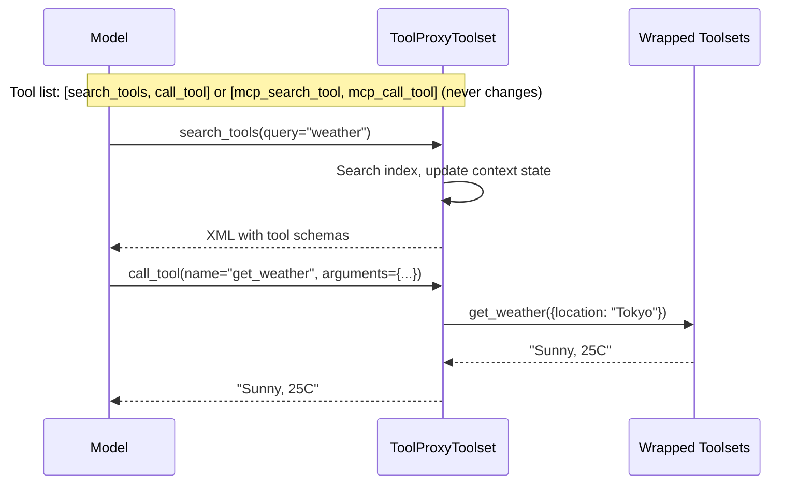

# Tool Proxy

The `ToolProxyToolset` is a wrapper over multiple toolsets that exposes exactly **two fixed tools**:

- **`search_tools`** -- discover available tools via keyword search (returns XML with full parameter schemas)
- **`call_tool`** -- invoke any discovered tool by name with arguments

When `prefix` is configured, the visible proxy tools become **`{prefix}_search_tool`** and **`{prefix}_call_tool`**. For example, `prefix="mcp"` exposes `mcp_search_tool` and `mcp_call_tool`.

Unlike [`ToolSearchToolSet`](tool-search.md) which dynamically adds discovered tools to the model's tool list, `ToolProxyToolset` keeps the tool list constant. This maximizes **prompt cache hit rates** for providers that cache based on tool definitions (e.g., Anthropic, OpenAI).

## When to Use

| Scenario                           | Recommendation                                              |
| ---------------------------------- | ----------------------------------------------------------- |
| Many MCP servers with many tools   | `ToolProxyToolset` -- constant tool list, best cache hits   |
| Few tools that change rarely       | `ToolSearchToolSet` -- native tool calls, simpler for model |
| Cost-sensitive workloads           | `ToolProxyToolset` -- fewer cache misses = lower cost       |
| Model struggles with proxy pattern | `ToolSearchToolSet` -- model calls tools directly           |

## Quick Start

```python
from ya_agent_sdk.toolsets import Toolset
from ya_agent_sdk.toolsets.tool_proxy import ToolProxyToolset

arxiv = Toolset(tools=[...], toolset_id="arxiv")
github = Toolset(tools=[...], toolset_id="github")
misc = Toolset(tools=[MiscTool1, MiscTool2])

proxy = ToolProxyToolset(
    toolsets=[arxiv, github, misc],
    namespace_descriptions={
        "arxiv": "Search academic papers on arXiv",
        "github": "GitHub repository operations",
    },
    max_results=5,
)

mcp_proxy = ToolProxyToolset(
    toolsets=[mcp_server_1, mcp_server_2],
    prefix="mcp",  # exposes mcp_search_tool and mcp_call_tool
)
```

## How It Works



### search_tools Response Format

Results are returned as XML with full JSON parameter schemas:

```xml
<search-results query="weather" count="2">
<tool name="get_weather" namespace="weather">
<description>Get the current weather in a given location</description>
<parameters>{"type": "object", "properties": {"location": {"type": "string", "description": "The city and state"}, "unit": {"type": "string", "description": "Temperature unit", "default": "celsius"}}, "required": ["location"]}</parameters>
</tool>
<tool name="get_forecast" namespace="weather">
<description>Get the weather forecast for multiple days ahead</description>
<parameters>{"type": "object", "properties": {"location": {"type": "string", "description": "The city name"}, "days": {"type": "integer", "description": "Number of days", "default": 5}}, "required": ["location"]}</parameters>
</tool>
</search-results>
```

### call_tool Error Format

When a tool call fails, an XML error with the parameter schema is returned so the model can self-correct:

```xml
<tool-call-error tool="get_weather">
<message>Missing required argument: location</message>
<parameters>{"type": "object", "properties": {...}, "required": ["location"]}</parameters>
</tool-call-error>
```

## Prefixes

Use `prefix` when an agent has multiple proxy blocks and each block needs distinct visible tools:

```python
mcp_proxy = ToolProxyToolset(toolsets=mcp_servers, prefix="mcp")
custom_proxy = ToolProxyToolset(toolsets=custom_toolsets, prefix="custom")
```

This exposes:

- `mcp_search_tool` / `mcp_call_tool`
- `custom_search_tool` / `custom_call_tool`

Discovered tool state is scoped by prefix in `AgentContext`, so multiple proxy blocks do not share loaded namespaces or loose-tool state accidentally. YAACLI and YA Claw use `prefix="mcp"` for MCP proxy toolsets by default.

## Namespaces and Loose Tools

Same as [`ToolSearchToolSet`](tool-search.md):

- **Namespaces** (toolsets with `id`): All tools load atomically when any tool or the namespace matches a search query.
- **Loose tools** (toolsets without `id`): Individual tools load independently.

State is stored in `AgentContext.tool_search_loaded_tools` and `AgentContext.tool_search_loaded_namespaces` for automatic session restore.

## No Search Required

The model can use the configured call proxy tool directly if it already knows the underlying tool name and schema. The configured search proxy tool is not a prerequisite. This is useful when:

- The tool name is mentioned in conversation context
- The model has seen the schema in a previous search proxy result
- The session is restored and discovered tools are listed in instructions

For example, an unprefixed proxy uses `call_tool`; an MCP proxy in YAACLI or YA Claw uses `mcp_call_tool`.

## HITL (Human-in-the-Loop)

`ToolProxyToolset` re-raises `ApprovalRequired` from underlying toolsets. When the user approves the configured call proxy invocation, the proxy retries the underlying tool call with the approved state. Tools listed in `AgentContext.need_user_approve_tools` are checked by the underlying toolset.

## Search Strategies

`ToolProxyToolset` accepts the same `SearchStrategy` interface as `ToolSearchToolSet`:

```python
from ya_agent_sdk.toolsets.tool_search import create_best_strategy

proxy = ToolProxyToolset(
    toolsets=[...],
    search_strategy=create_best_strategy(),  # BM25 when available, keyword fallback
)
```

See [Tool Search -- Search Strategies](tool-search.md) for details on `KeywordSearchStrategy` and `BM25SearchStrategy`.

## Optional Namespaces

Namespaces can be marked as optional for graceful degradation:

```python
proxy = ToolProxyToolset(
    toolsets=[required_toolset, flaky_mcp_server],
    optional_namespaces={"flaky-server"},
)
```

If an optional namespace fails during initialization or at runtime, it is skipped with a warning. Check `proxy.init_report` for namespace status.

## Dynamic Instructions

`ToolProxyToolset` provides dynamic instructions that include:

1. Base usage guide for the configured search/call proxy tool names
2. Search strategy hints (keyword vs. BM25)
3. Available namespace list with descriptions and tool counts
4. Previously discovered tools summary (for session continuity)

Instructions from underlying toolsets are forwarded only for toolsets whose tools have been discovered.

## Comparison with ToolSearchToolSet

| Feature           | ToolSearchToolSet                | ToolProxyToolset                |
| ----------------- | -------------------------------- | ------------------------------- |
| Tool list         | Changes as tools are discovered  | Always 2 tools (fixed)          |
| Prompt cache      | Invalidated on discovery         | Stable (high hit rate)          |
| Model interaction | Calls tools natively             | Calls via configured call proxy |
| Schema visibility | Model sees tool schemas directly | Schemas in search results XML   |
| Error feedback    | Native pydantic-ai validation    | XML error with schema           |
| State storage     | Same (`AgentContext`)            | Same (`AgentContext`)           |
| Search strategies | Same interface                   | Same interface                  |
| HITL              | Same behavior                    | Same behavior                   |
