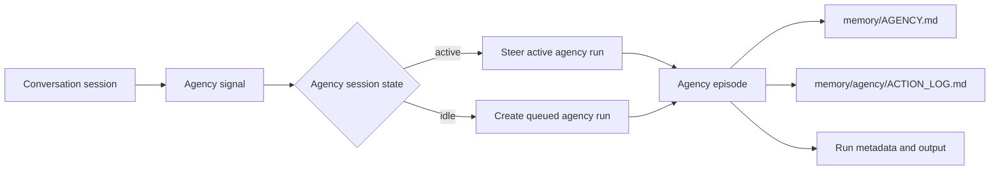

# Session Agency Deployment

Session agency is YA Claw's proactive background work loop for conversation sessions. Each source conversation can own one paired internal `session_type="agency"` session. Agency receives durable signals, restores workspace and memory context, and runs bounded episodes that maintain intentions, prepare artifacts, run safe local checks, or request approval.



## Runtime Behavior

Agency runs use the regular YA Claw execution model:

- the paired agency session serializes agency work for the source conversation;
- new signals steer an active agency run when one is running;
- pending signals create a queued agency run when the agency session is idle;
- agency runs use `trigger_type="agency"` and carry source session, signal IDs, reasons, budget, and risk policy in run metadata;
- source session responsiveness remains independent from agency runs;
- session list and detail responses expose `agency_state` for deployer and UI visibility.

Agency signal reasons currently include:

| Reason             | Source                                              | Common outcome                                      |
| ------------------ | --------------------------------------------------- | --------------------------------------------------- |
| `manual`           | `POST /api/v1/sessions/{session_id}/agency:signal`  | immediate agency episode or active-run steering     |
| `inactivity`       | source conversation has completed turns and is idle | follow-up, planning, or workspace organization      |
| `memory_committed` | memory extract or summary job finishes              | agency reflects on newly committed memory           |
| `compact`          | `POST /api/v1/sessions/{session_id}/agency:compact` | compact agency index and action log workspace files |

## Workspace Files

Agency stores its durable working memory in the same workspace as the source session.

| Path                            | Purpose                                                       |
| ------------------------------- | ------------------------------------------------------------- |
| `memory/AGENCY.md`              | compact active intentions, watchlist, and next useful actions |
| `memory/agency/ACTION_LOG.md`   | recent agency decisions, actions, deferrals, and outcomes     |
| `memory/agency/episodes/*.md`   | detailed episode notes created by agency runs                 |
| `memory/agency/intentions/*.md` | detailed active-intention records                             |
| `memory/agency/archive/*.md`    | compacted closed intentions and older action history          |

Include the workspace directory in backup and restore procedures. Agency can recreate missing files during future episodes, while backups preserve active intentions and action history.

## Configuration

Agency is controlled by `YA_CLAW_AGENCY_*` settings.

| Variable                                                | Default      | Purpose                                                                   |
| ------------------------------------------------------- | ------------ | ------------------------------------------------------------------------- |
| `YA_CLAW_AGENCY_ENABLED`                                | `true`       | default enablement for new source conversation agency state               |
| `YA_CLAW_AGENCY_IDLE_AFTER_SECONDS`                     | `600`        | idle age before inactivity signals are created                            |
| `YA_CLAW_AGENCY_COOLDOWN_SECONDS`                       | `1800`       | minimum time between automatic agency actions per source session          |
| `YA_CLAW_AGENCY_PROFILE`                                | unset        | agency profile override; empty value falls back to source/default profile |
| `YA_CLAW_AGENCY_TICK_SECONDS`                           | `30`         | agency dispatcher scan interval                                           |
| `YA_CLAW_AGENCY_MAX_SIGNALS_PER_TICK`                   | `20`         | maximum signals batched into one agency dispatch                          |
| `YA_CLAW_AGENCY_MAX_SESSIONS_PER_TICK`                  | `10`         | maximum source sessions scanned per agency tick                           |
| `YA_CLAW_AGENCY_MEMORY_CAPTURE_ENABLED`                 | `true`       | successful agency output can feed session memory extraction               |
| `YA_CLAW_AGENCY_CONTEXT_MAX_CHARS`                      | `8000`       | maximum agency context block size                                         |
| `YA_CLAW_AGENCY_RECENT_FILES_LIMIT`                     | `5`          | recent agency file index limit                                            |
| `YA_CLAW_AGENCY_INDEX_TARGET_CHARS`                     | `16000`      | target size for `memory/AGENCY.md`                                        |
| `YA_CLAW_AGENCY_INDEX_MAX_CHARS`                        | `32000`      | hard size cap used by compaction guidance                                 |
| `YA_CLAW_AGENCY_ACTION_LOG_RECENT_CHARS`                | `32000`      | recent action log window loaded into agency context                       |
| `YA_CLAW_AGENCY_UNATTENDED_SHELL_REVIEW_RISK_THRESHOLD` | `extra_high` | agency-specific unattended shell review threshold                         |

Recommended production baseline:

```env
YA_CLAW_AGENCY_ENABLED=true
YA_CLAW_AGENCY_IDLE_AFTER_SECONDS=600
YA_CLAW_AGENCY_COOLDOWN_SECONDS=1800
YA_CLAW_AGENCY_PROFILE=default
YA_CLAW_AGENCY_TICK_SECONDS=30
YA_CLAW_AGENCY_MAX_SIGNALS_PER_TICK=20
YA_CLAW_AGENCY_MAX_SESSIONS_PER_TICK=10
YA_CLAW_AGENCY_MEMORY_CAPTURE_ENABLED=true
YA_CLAW_AGENCY_UNATTENDED_SHELL_REVIEW_RISK_THRESHOLD=extra_high
```

## Profile and Safety

Agency episodes run unattended. Use a profile with the same safe tool surface you would allow for schedules and heartbeat:

- include workspace read/write tools needed for `memory/AGENCY.md` and `memory/agency/**`;
- include session tools so agency can inspect recent turns and run traces;
- set shell review policy through the profile and `YA_CLAW_AGENCY_UNATTENDED_SHELL_REVIEW_RISK_THRESHOLD`;
- route external sends, destructive operations, deployments, secret access, billing changes, and irreversible actions through approval workflows.

For low-risk production rollout, set `YA_CLAW_AGENCY_PROFILE` to a profile with limited shell and external integration access, then expand the profile after operators verify agency outputs.

## API Checks

Read agency state:

```bash
curl -sS \
  -H "Authorization: Bearer ${YA_CLAW_API_TOKEN}" \
  http://127.0.0.1:9042/api/v1/sessions/${SESSION_ID}/agency
```

Enable or pause agency for one source session:

```bash
curl -sS -X PATCH \
  -H "Authorization: Bearer ${YA_CLAW_API_TOKEN}" \
  -H "Content-Type: application/json" \
  -d '{"enabled":true}' \
  http://127.0.0.1:9042/api/v1/sessions/${SESSION_ID}/agency
```

Create a manual signal:

```bash
curl -sS -X POST \
  -H "Authorization: Bearer ${YA_CLAW_API_TOKEN}" \
  -H "Content-Type: application/json" \
  -d '{
    "reason": "manual",
    "client_token": "manual-deployment-check-1",
    "prompt_override": "Review recent session context and prepare one useful next action."
  }' \
  http://127.0.0.1:9042/api/v1/sessions/${SESSION_ID}/agency:signal
```

Request compaction:

```bash
curl -sS -X POST \
  -H "Authorization: Bearer ${YA_CLAW_API_TOKEN}" \
  http://127.0.0.1:9042/api/v1/sessions/${SESSION_ID}/agency:compact
```

## Operational Checks

Use these checks after enabling agency:

- service logs should show agency dispatcher startup;
- `GET /api/v1/sessions/{session_id}/agency` should return `enabled`, `pending_signal_count`, and optional `agency_session`;
- manual `agency:signal` should return delivery `submitted`, `steered`, or `duplicate`;
- session runs should show `trigger_type="agency"` for agency episodes;
- `memory/AGENCY.md` and `memory/agency/ACTION_LOG.md` should appear after an agency episode performs workspace organization;
- `agency_signals` records should move from `pending` to `submitted`, `steered`, or `consumed`.

## Backup and Retention

Agency state spans database rows and workspace files.

Database rows:

- `sessions` where `session_type="agency"`
- `runs` where `trigger_type="agency"`
- `session_agency_states`
- `agency_signals`

Workspace files:

- `memory/AGENCY.md`
- `memory/agency/**`
- `memory/CHANGELOG.md` when memory/agency files are recorded there

Run-store pruning can remove replay artifacts for old agency runs while keeping database metadata in safe disk-only mode. Workspace backups preserve active agency state and should be retained with the database backup.

## Troubleshooting

### Agency Signals Stay Pending

Check the agency dispatcher logs, `YA_CLAW_AGENCY_ENABLED`, profile availability, and execution supervisor startup. Confirm the source session has completed runs and the agency session has no stale active queued/running run.

### No Inactivity Signal Appears

Confirm `YA_CLAW_AGENCY_IDLE_AFTER_SECONDS`, `YA_CLAW_AGENCY_COOLDOWN_SECONDS`, and source session `updated_at` age. Inactivity signals require at least one source run sequence number and agency enablement for the source session.

### Manual Signal Returns Duplicate

The request reused a `client_token` for the same source session and reason. Send a new `client_token` for a distinct manual wake request.

### Agency Run Uses the Wrong Profile

Set `YA_CLAW_AGENCY_PROFILE` to the intended profile and verify the profile exists through profile seed or API. Empty agency profile values fall back to the source session profile, then to `YA_CLAW_DEFAULT_PROFILE`.

### Workspace Files Have Permission Errors

Align the service and workspace container UID/GID settings, then repair ownership for the workspace directory. Docker shell deployments should use `YA_CLAW_WORKSPACE_PROVIDER_DOCKER_EXEC_USER=auto` with matching workspace UID/GID values.
