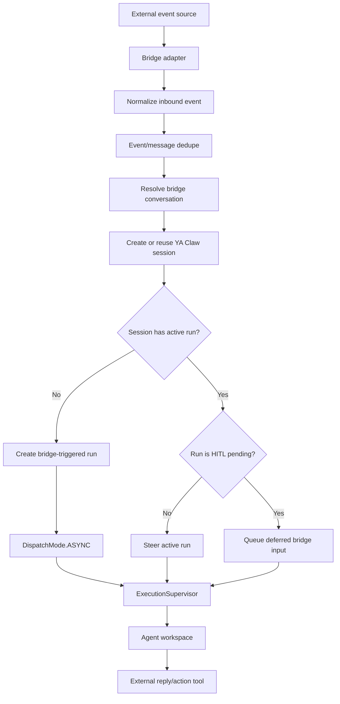

# Bridge Overview

YA Claw bridges connect external event streams to sessions and runs. The bridge layer lives beside run execution: bridge dispatch controls adapter lifecycles, while run dispatch controls how created runs enter the execution coordinator.

## Recommended Shape

Run bridges in embedded mode for current deployments:

```env
YA_CLAW_BRIDGE_DISPATCH_MODE=embedded
YA_CLAW_BRIDGE_ENABLED_ADAPTERS=lark
```

Embedded mode starts `BridgeSupervisor` in the same HTTP server lifespan as `ExecutionSupervisor`. Enabled adapters run as background tasks inside the YA Claw service process and submit bridge-triggered runs through the normal session/run controllers.

## Dispatch Modes

| Mode       | Behavior                                                                                                     | Deployment use                                                                 |
| ---------- | ------------------------------------------------------------------------------------------------------------ | ------------------------------------------------------------------------------ |
| `embedded` | Starts `BridgeSupervisor` with the HTTP server and runs enabled adapters inside the YA Claw service lifespan | Standard production path for the current built-in bridge adapter               |
| `manual`   | Starts the HTTP server and leaves bridge adapter lifecycle to a separate operator-managed path               | Separation model for external bridge workers and future operator-managed flows |

The current bridge CLI surface is placeholder-oriented:

```bash
uv run --package ya-claw ya-claw bridge ls
uv run --package ya-claw ya-claw bridge run lark
uv run --package ya-claw ya-claw bridge serve lark
```

Use `embedded` for deployed Lark ingress until the manual worker commands own adapter startup and supervision.

## Adapter Enablement

Bridge adapter types are enumerated by `BridgeAdapterType`. The current built-in adapter is `lark`.

```env
YA_CLAW_BRIDGE_ENABLED_ADAPTERS=lark
```

`YA_CLAW_BRIDGE_LARK_ENABLED=true` is a compatibility switch that also enables the Lark adapter. Prefer `YA_CLAW_BRIDGE_ENABLED_ADAPTERS=lark` for new deployments.

## Event Pipeline



Bridge event handling stores an inbound event record before run creation or active-run routing. Dedupe checks `(adapter, tenant_key, event_id)` first, then `(adapter, tenant_key, external_message_id)`. Conversation resolution maps `(adapter, tenant_key, external_chat_id)` to one YA Claw session.

Bridge-created sessions and runs use `TriggerType.BRIDGE`. Runs created from bridge events use `DispatchMode.ASYNC`, so the bridge adapter can acknowledge and continue receiving events while execution proceeds through the normal runtime coordinator. Messages that arrive while a session already has an active run are routed to that run. During normal execution they become steering input; during HITL they are persisted as deferred input and consumed after approval resolves.

## Profiles

Bridge conversations resolve a profile when the first session is created. For Lark, `YA_CLAW_BRIDGE_LARK_DEFAULT_PROFILE` overrides the service default profile. When it is empty, YA Claw uses `YA_CLAW_DEFAULT_PROFILE`, which defaults to `default`.

Seed or pre-create the selected AgentProfile before enabling bridge traffic. See [`../profiles.md`](../profiles.md).

## HITL and Deferred Bridge Input

Interactive runs can enter HITL when shell review, tool approval, or MCP approval returns deferred tool requests. YA Claw persists the approval batch and interactions in the database, publishes `hitl_pending` status in run/session notifications, and waits for a response through the run interaction API or bridge action path.

Bridge messages that arrive while the run is HITL pending are stored as deferred input rows. After the approval batch resolves, YA Claw consumes queued input in sequence order and injects it into the same running agent through the message bus. This keeps user follow-up messages durable while a bridge approval card is active.

Relevant durable records:

- `hitl_batches`: one pending approval batch per run
- `hitl_interactions`: ordered shell/tool/MCP approval items in the batch
- `hitl_deferred_inputs`: bridge messages received while HITL is pending
- `bridge_hitl_messages`: external approval card message IDs used for in-place updates

## Unattended Runs

Schedule and heartbeat runs are unattended automation. YA Claw runs them with unattended approval behavior: shell review `on_needs_approval=defer` is converted to `deny`, and profile `need_user_approve_tools` / `need_user_approve_mcps` are cleared for that run. Configure the profile-level `unattended_risk_threshold` for background runs; use the service-level `YA_CLAW_UNATTENDED_SHELL_REVIEW_RISK_THRESHOLD` only as a fallback default.

## Workspace Reply Path

Bridge adapters ingest events and create runs. Agents perform replies and follow-up actions from the workspace using adapter-specific CLIs or tools. For Lark, the agent prompt includes the source message ID and a recommended `lark-cli im +messages-reply` command shape.

Workspace environments receive built-in `LARK_APP_ID` and `LARK_APP_SECRET` aliases from explicit process environment values when set. YA Claw falls back to Lark bridge app settings for workspace credential injection. Additional workspace environment values are forwarded by listing process env names in `YA_CLAW_WORKSPACE_ENV_VARS`.

## Manual Inbound API

Manual bridge mode starts the HTTP server with bridge controllers available and leaves adapter lifecycle to an operator-managed process. Normalized external events can be posted to:

```bash
POST /api/v1/bridges/inbound/messages
POST /api/v1/bridges/inbound/actions
```

Both endpoints use the same database-backed controller path as embedded bridge mode, including dedupe, conversation mapping, HITL response handling, and deferred bridge input.

## References

- Lark bridge: [`lark.md`](lark.md)
- Bridge operations: [`operations.md`](operations.md)
- Environment settings: [`../environment.md`](../environment.md)
