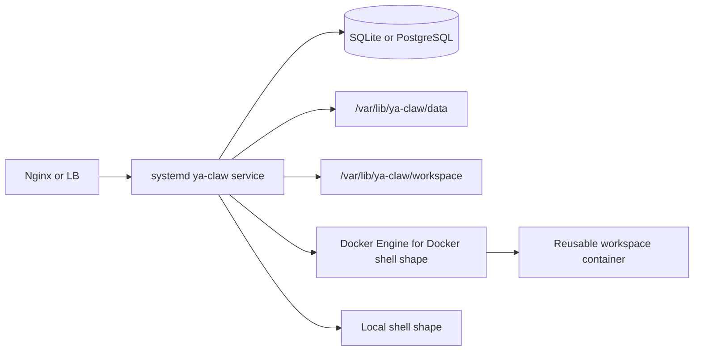

# Host Service Deployment

Use this path when the YA Claw service runs directly on a host and is supervised by systemd. Pair it with either service local + Docker shell or service local + local shell from the workspace provider matrix.

## Runtime Shape



## Host Layout

```text
/opt/ya-claw/bin               uv-installed command shims
/opt/ya-claw/tools             uv tool environments
/etc/ya-claw/ya-claw.env       service environment
/etc/ya-claw/profiles.yaml     profile seed
/var/lib/ya-claw/data          runtime data
/var/lib/ya-claw/workspace     agent workspace
```

## Install Service User and Directories

```bash
sudo useradd --system --create-home --home-dir /var/lib/ya-claw --shell /usr/sbin/nologin ya-claw
sudo install -d -o root -g root /opt/ya-claw /opt/ya-claw/bin /opt/ya-claw/tools
sudo install -d -o root -g root /etc/ya-claw
sudo install -d -o ya-claw -g ya-claw /var/lib/ya-claw/data /var/lib/ya-claw/workspace
```

For service local + Docker shell, grant Docker access:

```bash
sudo usermod -aG docker ya-claw
```

## Install YA Claw with uv

Install `uv` on the host:

```bash
curl -LsSf https://astral.sh/uv/install.sh | sudo env UV_INSTALL_DIR=/usr/local/bin sh
```

Install the published YA Claw package as a uv-managed tool:

```bash
YA_CLAW_VERSION=replace-with-release-version
sudo env \
  UV_TOOL_DIR=/opt/ya-claw/tools \
  UV_TOOL_BIN_DIR=/opt/ya-claw/bin \
  uv tool install "ya-claw==${YA_CLAW_VERSION}" --python 3.13
```

For tracking the latest published package, use:

```bash
sudo env \
  UV_TOOL_DIR=/opt/ya-claw/tools \
  UV_TOOL_BIN_DIR=/opt/ya-claw/bin \
  uv tool install ya-claw --python 3.13
```

Copy the packaged profile seed from the matching source tag:

```bash
YA_CLAW_RELEASE_TAG=replace-with-release-tag
sudo curl -fsSL \
  "https://raw.githubusercontent.com/wh1isper/ya-mono/${YA_CLAW_RELEASE_TAG}/packages/ya-claw/profiles.yaml" \
  -o /etc/ya-claw/profiles.yaml
```

## Environment File

Create `/etc/ya-claw/ya-claw.env`:

```env
YA_CLAW_ENVIRONMENT=production
YA_CLAW_HOST=127.0.0.1
YA_CLAW_PORT=9042
YA_CLAW_PUBLIC_BASE_URL=https://claw.example.com
YA_CLAW_API_TOKEN=replace-with-a-long-random-token
YA_CLAW_AUTO_MIGRATE=true
YA_CLAW_DATA_DIR=/var/lib/ya-claw/data
YA_CLAW_WORKSPACE_DIR=/var/lib/ya-claw/workspace
YA_CLAW_PROFILE_SEED_FILE=/etc/ya-claw/profiles.yaml
YA_CLAW_AUTO_SEED_PROFILES=true
YA_CLAW_WORKSPACE_PROVIDER_BACKEND=docker
YA_CLAW_WORKSPACE_PROVIDER_DOCKER_IMAGE=ghcr.io/wh1isper/ya-claw-workspace:latest
```

For service local + local shell, switch the backend:

```env
YA_CLAW_WORKSPACE_PROVIDER_BACKEND=local
```

Set `YA_CLAW_WEB_DIST_DIR` only when a frontend bundle is deployed on the host:

```env
YA_CLAW_WEB_DIST_DIR=/opt/ya-claw/web-dist
```

Lock down service-owned files:

```bash
sudo chown ya-claw:ya-claw /etc/ya-claw/profiles.yaml /etc/ya-claw/ya-claw.env
sudo chmod 0600 /etc/ya-claw/ya-claw.env
```

## Service Unit

Create `/etc/systemd/system/ya-claw.service`:

```ini
[Unit]
Description=YA Claw runtime service
After=network-online.target docker.service
Wants=network-online.target docker.service

[Service]
Type=simple
User=ya-claw
Group=ya-claw
SupplementaryGroups=docker
WorkingDirectory=/var/lib/ya-claw
Environment="PATH=/opt/ya-claw/bin:/usr/local/sbin:/usr/local/bin:/usr/sbin:/usr/bin"
EnvironmentFile=/etc/ya-claw/ya-claw.env
ExecStart=/opt/ya-claw/bin/ya-claw start
Restart=always
RestartSec=5

[Install]
WantedBy=multi-user.target
```

Start:

```bash
sudo systemctl daemon-reload
sudo systemctl enable --now ya-claw
```

## Verify

```bash
systemctl status ya-claw
journalctl -u ya-claw -f
curl http://127.0.0.1:9042/healthz
docker ps --filter 'name=ya-claw-workspace'
```

## Upgrade

Upgrade the uv-managed tool and restart the service:

```bash
sudo env \
  UV_TOOL_DIR=/opt/ya-claw/tools \
  UV_TOOL_BIN_DIR=/opt/ya-claw/bin \
  uv tool upgrade ya-claw
sudo systemctl restart ya-claw
curl http://127.0.0.1:9042/healthz
```

Pin a specific version during upgrade:

```bash
YA_CLAW_VERSION=replace-with-release-version
sudo env \
  UV_TOOL_DIR=/opt/ya-claw/tools \
  UV_TOOL_BIN_DIR=/opt/ya-claw/bin \
  uv tool install "ya-claw==${YA_CLAW_VERSION}" --python 3.13 --force
sudo systemctl restart ya-claw
```

The `ya-claw start` command applies migrations when `YA_CLAW_AUTO_MIGRATE=true`.

## Source Checkout Path

Use a source checkout for unreleased commits or local patches:

```bash
sudo mkdir -p /opt/ya-mono
sudo chown -R "$USER:$USER" /opt/ya-mono
git clone https://github.com/wh1isper/ya-mono.git /opt/ya-mono
cd /opt/ya-mono
uv sync --all-packages
corepack pnpm install
corepack pnpm --dir apps/ya-claw-web build
```

For this path, set `YA_CLAW_WEB_DIST_DIR=/opt/ya-mono/apps/ya-claw-web/dist`, set `WorkingDirectory=/opt/ya-mono`, and use `ExecStart=/usr/bin/uv run --package ya-claw ya-claw start`.

## Reverse Proxy

Forward HTTPS traffic to `127.0.0.1:9042` and keep buffering disabled for streaming routes:

```nginx
server {
    listen 80;
    server_name claw.example.com;

    client_max_body_size 50m;

    location / {
        proxy_pass http://127.0.0.1:9042;
        proxy_http_version 1.1;
        proxy_set_header Host $host;
        proxy_set_header X-Real-IP $remote_addr;
        proxy_set_header X-Forwarded-For $proxy_add_x_forwarded_for;
        proxy_set_header X-Forwarded-Proto $scheme;
        proxy_set_header Upgrade $http_upgrade;
        proxy_set_header Connection "upgrade";
        proxy_buffering off;
        proxy_read_timeout 3600s;
        proxy_send_timeout 3600s;
    }
}
```
