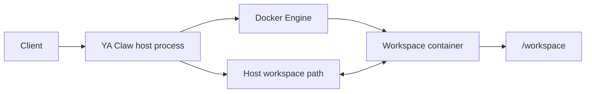

# Service Local + Docker Shell

Use this shape when YA Claw runs as a host process and agent shell execution should run inside the official Docker workspace container.

## Runtime Shape



## Configuration

```env
YA_CLAW_WORKSPACE_PROVIDER_BACKEND=docker
YA_CLAW_WORKSPACE_DIR=/var/lib/ya-claw/workspace
YA_CLAW_WORKSPACE_PROVIDER_DOCKER_IMAGE=ghcr.io/wh1isper/ya-claw-workspace:latest
YA_CLAW_WORKSPACE_PROVIDER_DOCKER_CONTAINER_CACHE_DIR=/var/lib/ya-claw/data/docker-workspace-containers
YA_CLAW_WORKSPACE_PROVIDER_DOCKER_RETENTION_POLICY=stop_on_idle
YA_CLAW_WORKSPACE_PROVIDER_DOCKER_IDLE_TTL_SECONDS=3600
```

`YA_CLAW_WORKSPACE_PROVIDER_DOCKER_HOST_WORKSPACE_DIR` can stay unset because the service process and Docker daemon see the same host path.

Use extra mounts for independent persistent directories such as `/home/claw`:

```env
YA_CLAW_WORKSPACE_PROVIDER_DOCKER_EXTRA_MOUNTS=/var/lib/ya-claw/home:/home/claw:rw
```

## Path Semantics

| Binding field                            | Value                        |
| ---------------------------------------- | ---------------------------- |
| service-visible `host_path`              | `/var/lib/ya-claw/workspace` |
| Docker daemon-visible `docker_host_path` | `/var/lib/ya-claw/workspace` |
| agent-visible `virtual_path`             | `/workspace`                 |
| agent cwd                                | `/workspace`                 |

File operations use `VirtualLocalFileOperator` to map the service-visible path to the virtual workspace namespace. Shell operations use `DockerShell` inside session-scoped or run-scoped workspace containers.

## Permissions

Grant the service user Docker access:

```bash
sudo usermod -aG docker ya-claw
sudo systemctl restart ya-claw
```

Align workspace container UID/GID with the service user when both the service and container write the workspace:

```env
YA_CLAW_WORKSPACE_PROVIDER_DOCKER_UID=1000
YA_CLAW_WORKSPACE_PROVIDER_DOCKER_GID=1000
YA_CLAW_WORKSPACE_PROVIDER_DOCKER_EXEC_USER=auto
YA_CLAW_WORKSPACE_PROVIDER_DOCKER_HOME=/home/claw
```

## Verification

```bash
sudo -u ya-claw docker ps
docker ps --filter 'name=ya-claw-session'
docker inspect ya-claw-session-<session-short>-g<generation> --format '{{ json .Mounts }}'
docker exec -it ya-claw-session-<session-short>-g<generation> pwd
docker exec -it ya-claw-session-<session-short>-g<generation> ls -la /workspace
```
