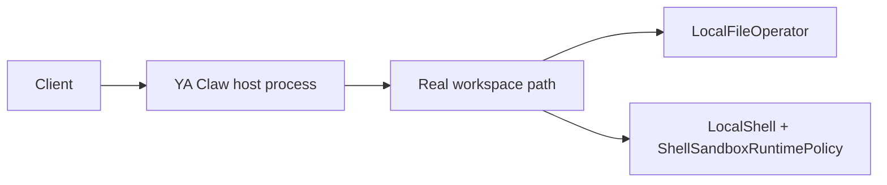

# Service Local + Local Shell

Use this shape when YA Claw runs as a trusted host process and agent file/shell operations should use the real host workspace path.

## Runtime Shape



## Configuration

```env
YA_CLAW_WORKSPACE_PROVIDER_BACKEND=local
YA_CLAW_WORKSPACE_DIR=/var/lib/ya-claw/workspace
```

## Path Semantics

| Binding field                | Value                        |
| ---------------------------- | ---------------------------- |
| service-visible `host_path`  | `/var/lib/ya-claw/workspace` |
| agent-visible `virtual_path` | `/var/lib/ya-claw/workspace` |
| agent cwd                    | `/var/lib/ya-claw/workspace` |

`LocalWorkspaceProvider` uses the real workspace path as `virtual_path` and `cwd`. `LocalEnvironmentFactory` creates a `LocalFileOperator` and policy-driven `LocalShell` restricted to the workspace path and temporary directory. By default, Claw passes a resolved `ShellSandboxRuntimePolicy` into `LocalShell`. Set `YA_CLAW_SHELL_SANDBOX_ENABLED=false` to use raw host subprocess mode for a trusted development machine.

## Shell Sandbox Requirements

Default local shell sandbox settings:

```env
YA_CLAW_SHELL_SANDBOX_ENABLED=true
YA_CLAW_SHELL_SANDBOX_BACKEND=auto
YA_CLAW_SHELL_SANDBOX_NETWORK=full
YA_CLAW_SHELL_SANDBOX_ALLOW_RAW_HOST=false
```

Backend dependencies:

- Linux `auto` resolves to `linux_bwrap_seccomp`; install `bubblewrap` so `bwrap` is available to the service user.
- macOS `auto` resolves to `macos_seatbelt` and uses `/usr/bin/sandbox-exec`.
- Windows `auto` resolves to `windows_restricted_token`; this backend is a guarded planned path.
- `raw_host` requires explicit allowance and should be used only for audited maintenance.

Profile-level `security.shell_sandbox` can set profile, backend preference, network policy, environment allowlist, and raw host approval. The default network policy is `full`, and the default environment allowlist is `"*"` to pass the effective environment through. The fields that directly affect subprocess creation today are backend, network, mount modes, environment allowlist, and raw host allowance. The profile label is also injected into shell context and metadata.

## Host Requirements

The host must provide the tools agents need through the service user environment, such as Python, Node.js, Git, `bubblewrap` on Linux, and any CLIs referenced by profiles or MCP servers.

Workspace permissions should allow the service user to read and write:

```bash
sudo mkdir -p /var/lib/ya-claw/workspace
sudo chown -R ya-claw:ya-claw /var/lib/ya-claw/workspace
sudo -u ya-claw test -w /var/lib/ya-claw/workspace
```

## Verification

```bash
sudo -u ya-claw sh -lc 'cd /var/lib/ya-claw/workspace && pwd && touch .write-test && rm .write-test'
curl http://127.0.0.1:9042/healthz
```

A test run that asks the agent to print `pwd` should report the real workspace path.
